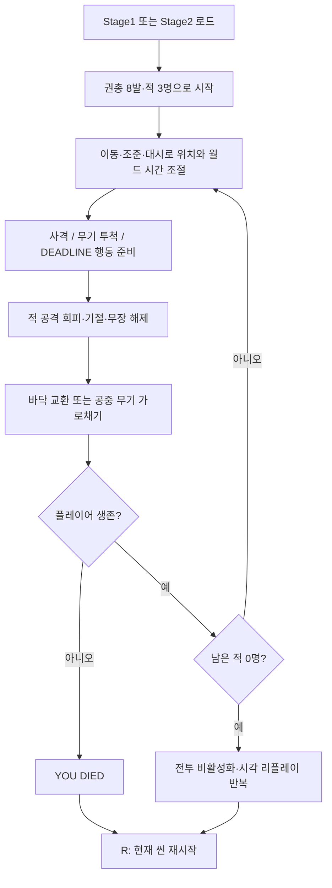
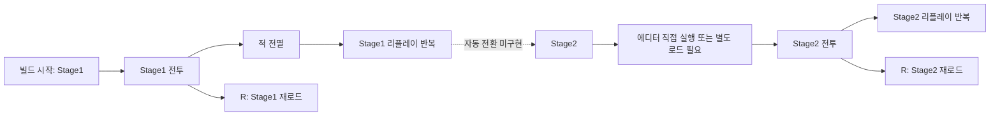
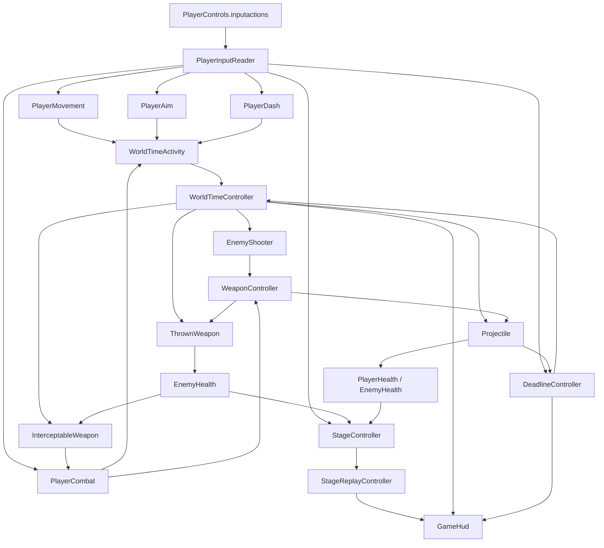

# 프로젝트 기획서

## 1. 문서 정보

| 항목 | 내용 |
|---|---|
| 프로젝트명 | Deltatime |
| 문서 작성일 | 2026-07-30 (KST) |
| 마지막 분석일 | 2026-07-30 (KST) |
| 문서 버전 | 1.0.0 |
| 현재 구현 상태 | 핵심 전투 루프가 부분 구현된 3D 프로토타입. 미커밋 상태의 `DEADLINE`, 공중 무기 가로채기, 2개 스테이지 분리 변경까지 현재 파일 기준으로 포함 |

### 1.1 분석 기준과 범위

- 이 문서의 경로는 저장소 루트 `C:\Users\HuiYong\UnityProjects\ProjectDeltatime`를 기준으로 적는다.
- 실제 Unity 프로젝트 루트는 저장소 안의 `ProjectDeltatime/`이다. 따라서 Unity의 `Assets`, `Packages`, `ProjectSettings`는 각각 `ProjectDeltatime/Assets`, `ProjectDeltatime/Packages`, `ProjectDeltatime/ProjectSettings`에 있다.
- 확정된 내용은 현재 파일, 직렬화된 씬/프리팹/데이터, 프로젝트 설정, Git 상태에서 직접 확인한 사실만 사용했다.
- 의도나 장르처럼 파일만으로 확정할 수 없는 내용에는 **추정**을 표시했다.
- 현재 브랜치는 `feature/WeaponPickup`이다. 문서 작성 후 최종 재확인 기준으로 기존 Unity 작업에는 수정 17개, 삭제 2개, 미추적 10개 항목이 남아 있다. 이번 작업은 해당 코드와 에셋을 수정하지 않고 `AGENTS.md`와 `Docs`의 문서 2개만 추가했다.
- 기존 `README`, 기획 문서, `AGENTS.md`는 분석 시작 시 없었다. `Assets/_Project/Tests` 폴더는 비어 있고 `.asmdef` 및 Unity Test Framework 테스트 어셈블리는 없다.
- 비생성 스크립트에서 `TODO`, `FIXME`, `HACK` 표식과 설명 주석은 확인되지 않았다.

### 1.2 테스트 근거의 한계

- `ProjectDeltatime/Logs/CodexSmoke.log`에는 2026-07-30 18:07에 `Prototype play-mode smoke test passed.`가 기록되어 있다.
- 커스텀 스모크 테스트는 `Stage2`를 열고 초기 플레이어/적/카메라/월드 시간, 투척 무기 6 거리, 적 기절·무장 해제·무기 드롭, 적 전멸 후 리플레이와 시야 조명 프록시를 검사한다.
- 현재 테스트 코드에는 `DEADLINE` 발동/행동 준비와 플레이어의 공중 무기 가로채기를 직접 검증하는 어설션이 없다.
- 현재 핵심 구현 파일과 씬은 같은 날 22:13까지 변경되었으므로, 위 통과 로그는 현재 작업 트리 전체에 대한 최신 검증 결과가 아니다.
- 현재 `ProjectDeltatime/Library/ScriptAssemblies/Assembly-CSharp.dll`에는 `DeadlineController`와 `InterceptableWeapon`이 포함되어 있으나, 이는 현재 기능의 플레이 동작이 테스트되었다는 의미는 아니다.
- Unity Editor가 분석 시점에 프로젝트를 사용 중이어서 별도 배치 모드 스모크 테스트는 실행하지 않았다. 따라서 최신 변경분의 플레이 모드 결과는 **확인 불가**다.

## 2. 프로젝트 개요

### 2.1 게임 장르

- **추정:** 3D 탑다운/쿼터뷰 액션 슈터 프로토타입.
- 근거: 원근 카메라가 플레이어를 위쪽에서 추적하고, `WASD` 이동·마우스 조준·발사·대시·무기 투척으로 3명의 고정형 사격 적을 상대한다.
- 근거 파일: `ProjectDeltatime/Assets/_Project/Scripts/Player/TopDownCameraController.cs`, `ProjectDeltatime/Assets/_Project/Input/PlayerControls.inputactions`, `ProjectDeltatime/Assets/_Project/Scripts/Enemies/EnemyShooter.cs`

### 2.2 핵심 콘셉트

현재 코드에서 확인되는 핵심 콘셉트는 다음과 같다.

- 플레이어가 이동하거나 조준 방향을 돌리거나 사격·투척·대시할 때 월드 시간이 빨라진다.
- 플레이어는 실제 시간 기준으로 조작되며, 적·투사체·투척 무기 등 월드 객체는 별도의 `WorldDeltaTime`으로 진행된다.
- 플레이어의 시야 부채꼴과 장애물 판정에 따라 적의 렌더러가 보이거나 숨겨지고, 어두운 스테이지에서는 시야 조명이 가시성을 보조한다.
- 적의 총알이 임박한 순간 이동을 멈추면 `DEADLINE` 하드 프리즈가 발동할 수 있고, 정지 중 최대 2개의 사격/투척 행동을 준비한 뒤 이동으로 동시에 해제한다.
- 무기는 발사하여 탄약을 소모하고, 던져 적을 기절·무장 해제하거나, 바닥 무기와 교환하거나, 적에게서 날아온 무기를 공중에서 가로챌 수 있다.
- 모든 적을 제거하면 실시간 시뮬레이션을 멈추고 기록된 시각 상태를 1.00배 월드 시간으로 반복 재생한다.

근거 파일: `ProjectDeltatime/Assets/_Project/Scripts/Time/WorldTimeController.cs`, `ProjectDeltatime/Assets/_Project/Scripts/Player/DeadlineController.cs`, `ProjectDeltatime/Assets/_Project/Scripts/Combat/InterceptableWeapon.cs`, `ProjectDeltatime/Assets/_Project/Scripts/Replay/StageReplayController.cs`

### 2.3 플레이어가 경험해야 하는 핵심 재미

- **추정:** 움직임과 조준 자체가 적과 투사체의 시간 진행량을 결정하는 데서 생기는 판단 재미.
- **추정:** 총알이 닿기 직전 멈춰 시간을 고정하고 여러 원인을 배치한 다음 한 번에 해제하는 전술적 연출.
- **추정:** 제한 탄약, 무기 투척, 적 무장 해제, 바닥 교환, 공중 가로채기를 연결하는 즉흥적 무기 순환.
- **추정:** 제한된 시야와 엄폐물 속에서 적 위치와 사격 경고선을 읽는 긴장감.
- **추정:** 스테이지 종료 후 플레이 결과를 밝은 리플레이로 다시 보는 연출적 보상.

### 2.4 예상 플레이 흐름

현재 구현 기준의 실제 흐름은 다음과 같다.

1. 빌드 인덱스 0의 `Stage1` 또는 에디터에서 연 씬을 시작한다.
2. 플레이어는 권총 8발을 장비한 상태로 시작한다.
3. 이동·조준으로 월드 시간 속도를 조절하며 세 명의 적과 교전한다.
4. 사격, 대시, `DEADLINE`, 무기 투척·회수·교환·가로채기를 사용한다.
5. 적 세 명이 모두 사망하면 스테이지 상태가 `Replaying`으로 바뀌고 리플레이가 반복된다.
6. 어느 시점이든 `R`을 누르면 현재 씬을 다시 불러온다.
7. `Stage1`에서 `Stage2`로 자동 전환하거나 리플레이에서 빠져나가는 흐름은 **미구현**이다.

### 2.5 현재 확인된 프로젝트 방향

- 3D 물리 기반 전투 프로토타입으로 전환된 상태다. 씬 검증 코드도 `Rigidbody2D`가 없어야 하고 원근 카메라여야 한다고 검사한다.
- Git 이력에는 `3D 프로토타입 제작`, `KillCam 구현`, `암흑시야와 Light 구현`이 기록되어 있다.
- 현재 미커밋 변경에는 기존 `PrototypeRoom`을 `Stage1`/`Stage2`로 교체하고, 공중 무기 가로채기와 `DEADLINE`을 추가한 내용이 포함된다.
- `Stage1`과 `Stage2`의 게임 오브젝트 구성은 동일하고 조명 프로필만 다르다. 두 씬을 별도 콘텐츠 단계로 사용할지, 밝기 비교용 변형으로 사용할지는 **확인 불가**다.

## 3. 현재 구현 현황

| 기능 | 상태 | 설명 | 근거 파일 | 비고 |
|---|---|---|---|---|
| 3D 플레이어 이동 | 구현 완료 | `WASD` 입력을 동적 Rigidbody의 평면 속도로 변환하며 충돌과 하드 프리즈를 반영 | `ProjectDeltatime/Assets/_Project/Scripts/Player/PlayerMovement.cs` | 이동 속도 6, 벽 접촉 시 위치 강제 이동 없음 |
| 마우스 조준 | 구현 완료 | 화면 포인터를 지면 평면에 투영하여 플레이어 회전과 조준선을 갱신 | `ProjectDeltatime/Assets/_Project/Scripts/Player/PlayerAim.cs` | 마우스 전용 |
| 대시 | 구현 완료 | 이동 방향으로 최대 3.5 거리, 0.03 스킨의 축소 캡슐 캐스트, 대시 중 무적, 0.8초 쿨다운 | `ProjectDeltatime/Assets/_Project/Scripts/Player/PlayerDash.cs` | 벽 0.01 겹침 시작 회귀 검사 포함 스모크 통과 |
| 행동량 기반 월드 시간 | 구현 완료 | 이동·조준 회전·행동 펄스를 합산해 월드 배율을 0.02~1.0으로 보간 | `ProjectDeltatime/Assets/_Project/Scripts/Time/WorldTimeController.cs` | 전역 `Time.timeScale`은 변경하지 않음 |
| `DEADLINE` | 부분 구현 | 임박한 적 투사체와 이동 정지를 감지해 하드 프리즈, 최대 2개 행동 준비, 이동 시 해제 | `ProjectDeltatime/Assets/_Project/Scripts/Player/DeadlineController.cs` | 씬 연결은 확인, 최신 플레이 테스트와 전용 테스트 없음 |
| 권총 사격 | 구현 완료 | 탄약·발사 간격을 검사하고 팩션 기반 투사체 생성 | `ProjectDeltatime/Assets/_Project/Scripts/Combat/WeaponController.cs`, `ProjectDeltatime/Assets/_Project/Pistol.asset` | 권총 1종만 존재 |
| 투사체 충돌·피해 | 구현 완료 | SphereCast로 충돌을 찾고 적대 팩션 `IDamageable`에 피해 전달 | `ProjectDeltatime/Assets/_Project/Scripts/Combat/Projectile.cs` | 체력 시스템은 1회 피격 사망 |
| 무기 투척 | 구현 완료 | 장비 무기를 던지고 적 명중 시 기절, 최대 6 거리 후 바닥 픽업으로 변환 | `ProjectDeltatime/Assets/_Project/Scripts/Combat/ThrownWeapon.cs` | 기존 스모크 테스트 범위에 포함 |
| 적 기절·무장 해제 | 구현 완료 | 기절 시 무기를 한 번 드롭하고 사격을 중단, 2 월드초 후 비무장 상태 유지 | `ProjectDeltatime/Assets/_Project/Scripts/Enemies/EnemyHealth.cs`, `ProjectDeltatime/Assets/_Project/Scripts/Enemies/EnemyShooter.cs` | 재무장 로직 없음 |
| 바닥 무기 획득·교환 | 구현 완료 | `E`로 근처 픽업을 장비하고 기존 장비가 있으면 그 픽업과 교환 | `ProjectDeltatime/Assets/_Project/Scripts/Combat/WeaponPickup.cs`, `ProjectDeltatime/Assets/_Project/Scripts/Player/PlayerCombat.cs` | 인벤토리 슬롯은 없음 |
| 적 무기 공중 드롭 | 부분 구현 | 적의 이동 방향 또는 전방으로 포물선 무기를 생성하고 착지 예측선을 표시 | `ProjectDeltatime/Assets/_Project/Scripts/Enemies/EnemyWeaponDrop.cs`, `ProjectDeltatime/Assets/_Project/Scripts/Combat/InterceptableWeapon.cs` | 최신 플레이 테스트 없음 |
| 공중 무기 가로채기 | 부분 구현 | `E` 입력과 0.18초 버퍼로 반경 1.15 내 공중 무기를 장비하고 0.2초 하드 프리즈 | `ProjectDeltatime/Assets/_Project/Scripts/Player/PlayerCombat.cs` | 최신 플레이 테스트 없음 |
| 적 사격 AI | 구현 완료 | 시야선·거리 검사, 조준 경고, 발사, 쿨다운, 기절/비무장/사망 상태 머신 | `ProjectDeltatime/Assets/_Project/Scripts/Enemies/EnemyShooter.cs` | 이동·추적 AI는 미구현 |
| 플레이어/적 체력 | 부분 구현 | 생존 여부와 사망 이벤트는 있으나 누적 HP 없이 유효 피격 1회에 사망 | `ProjectDeltatime/Assets/_Project/Scripts/Player/PlayerHealth.cs`, `ProjectDeltatime/Assets/_Project/Scripts/Enemies/EnemyHealth.cs` | `DamageHit.Damage`를 누적 계산하지 않음 |
| 시야 부채꼴·암흑 시야 | 구현 완료 | 장애물 Raycast로 메시를 갱신하고 시야 포함 여부로 적 렌더러를 토글 | `ProjectDeltatime/Assets/_Project/Scripts/Vision/VisionCone.cs` | 적 AI의 감지 여부와 플레이어 가시성은 별도 |
| 탑다운 카메라 | 구현 완료 | 원근 카메라가 플레이어와 조준 선행 지점을 부드럽게 추적 | `ProjectDeltatime/Assets/_Project/Scripts/Player/TopDownCameraController.cs` | 카메라 1대 |
| 스테이지 적 등록·클리어 | 구현 완료 | 생존 적을 등록하고 0명이 되면 전투를 막고 리플레이 요청 | `ProjectDeltatime/Assets/_Project/Scripts/Level/StageController.cs` | 적 3명 고정 콘텐츠 |
| 사망·재시작 | 구현 완료 | 플레이어 사망 시 전투를 막고 `R`로 현재 씬 재로드 | `ProjectDeltatime/Assets/_Project/Scripts/Level/StageController.cs` | 체크포인트 없음 |
| 스테이지 리플레이 | 부분 구현 | 카메라·렌더러·라인·등록 조명을 20Hz로 기록해 프록시로 반복 재생 | `ProjectDeltatime/Assets/_Project/Scripts/Replay/StageReplayController.cs` | 시각 리플레이만 제공, 종료/스킵/다음 씬 없음 |
| HUD | 부분 구현 | IMGUI로 적 수, 실시간, 월드 배율, 대시, `DEADLINE`, 무기, 조작법 표시 | `ProjectDeltatime/Assets/_Project/Scripts/UI/GameHud.cs` | 디버그 HUD, 로컬라이징/해상도 대응 없음 |
| Stage1/Stage2 콘텐츠 | 부분 구현 | 두 씬 모두 43개 GameObject, 플레이어 1, 적 3, 픽업 1, 동일 배치 | `ProjectDeltatime/Assets/_Project/Scenes/Stage1.unity`, `ProjectDeltatime/Assets/_Project/Scenes/Stage2.unity` | 조명만 밝음/어두움으로 다름 |
| 씬 전환 | 미구현 | 현재 씬 재시작 외에 다른 씬을 로드하는 코드가 없음 | `ProjectDeltatime/Assets/_Project/Scripts/Level/StageController.cs` | `Stage1 → Stage2` 흐름 필요 여부 확인 |
| 메인 메뉴·일시정지·설정 | 미구현 | 관련 씬, UI, 입력, 코드가 없음 | `ProjectDeltatime/Assets/_Project` | 계획 필요 |
| 일반 아이템·인벤토리 | 미구현 | 무기 1개 즉시 장비/교환 외 슬롯·목록·소모품 시스템 없음 | `ProjectDeltatime/Assets/_Project/Scripts/Combat/WeaponPickup.cs` | 계획 필요 |
| 퀘스트 | 미구현 | 관련 데이터와 코드가 없음 | `ProjectDeltatime/Assets/_Project` | 계획 필요 |
| 세이브/로드 | 미구현 | 런타임 저장 API와 저장 데이터가 없음 | `ProjectDeltatime/Assets/_Project/Scripts` | 계획 필요 |
| 사운드 | 미구현 | `AudioSource`, `AudioClip`, 오디오 에셋이 없고 `Audio` 폴더가 비어 있음 | `ProjectDeltatime/Assets/_Project/Audio` | 계획 필요 |
| 게임패드·리바인딩 | 미구현 | `Keyboard&Mouse` 제어 스킴만 정의 | `ProjectDeltatime/Assets/_Project/Input/PlayerControls.inputactions` | 목표 플랫폼 확인 필요 |
| 자동 테스트 | 부분 구현 | 커스텀 에디터 스모크 테스트는 있으나 정식 테스트 어셈블리와 최신 통과 결과 없음 | `ProjectDeltatime/Assets/_Project/Scripts/Editor/PrototypePlayModeSmokeTest.cs` | 현재 변경분 결과는 확인 불가 |

## 4. 핵심 게임 루프

### 4.1 게임 시작

- `EditorBuildSettings.asset`의 활성 씬 순서는 `Stage1`, `Stage2`다.
- 별도 부트스트랩이나 메인 메뉴는 없다.
- 각 씬은 플레이어 1명, 권총 픽업 1개, 사격 적 3명, 엄폐물이 있는 방으로 시작한다.
- 플레이어와 적은 모두 권총을 장비하고 시작한다.

### 4.2 플레이어의 주요 행동

- `WASD`: 이동
- 마우스 이동: 조준 및 플레이어 회전
- 마우스 왼쪽: 발사
- 마우스 오른쪽: 현재 무기 투척
- `Space`: 이동 방향 대시
- `E`: 공중 무기 가로채기, 바닥 무기 획득 또는 교환
- `R`: 현재 씬 재시작
- 임박한 적탄이 있을 때 이동 입력을 놓음: `DEADLINE` 진입 조건
- `DEADLINE` 중 발사/투척: 최대 2개 행동 준비
- `DEADLINE` 중 이동: 하드 프리즈 해제 및 준비 행동 진행

### 4.3 적 또는 장애물과의 상호작용

- 적은 18 거리 안에서 플레이어까지 가리는 충돌체가 없으면 조준을 시작한다.
- 적은 0.9 월드초 조준 후 발사하고 1.1 월드초 쿨다운을 가진다.
- 벽·엄폐물은 사선, 투사체, 대시, 시야 부채꼴, 공중 드롭의 경로를 막는다.
- 플레이어 투사체는 적을, 적 투사체는 플레이어를 공격한다. 같은 팩션과 발사 원본은 무시한다.
- 던진 무기는 적을 죽이지 않고 2 월드초 기절시키며 무장을 해제한다.

### 4.4 보상과 성장

- 확인된 즉시 보상은 적이 떨어뜨린 탄약 4발의 권총을 회수하거나 가로채는 것이다.
- 바닥에 있는 권총 8발 픽업도 사용할 수 있다.
- 점수, 경험치, 레벨업, 영구 성장, 통화, 해금은 **미구현**이다.
- 따라서 현재 보상 구조는 전투 중 자원 순환에 한정된다.

### 4.5 실패와 재시작

- 플레이어는 대시 무적 중이 아닌 상태에서 유효 피격을 한 번 받으면 사망한다.
- 사망하면 `StageController`가 `PlayerDead`로 바뀌고 플레이어 전투가 비활성화된다.
- HUD에 `YOU DIED`와 재시작 안내가 표시된다.
- `R`은 현재 활성 씬을 다시 로드한다.

### 4.6 게임 종료 조건

- 적 세 명을 모두 제거하면 현재 스테이지는 클리어되고 곧바로 리플레이 상태로 진입한다.
- 리플레이는 마지막 프레임을 0.65초 유지한 뒤 처음부터 반복한다.
- 명시적인 게임 완료 화면, 다음 스테이지, 타이틀 복귀, 리플레이 종료 조건은 **미구현**이다.

## 5. 주요 시스템

### 5.1 플레이어 시스템

- **시스템 목적:** 플레이어 생존, 입력, 이동, 조준, 대시, 전투 기능을 한 GameObject에 구성한다.
- **현재 동작 방식:** `Player` 오브젝트에 입력·체력·이동·조준·대시·전투·`DEADLINE`·무기 컨트롤러가 함께 붙고 직렬화 참조로 연결된다.
- **주요 클래스:** `PlayerInputReader`, `PlayerHealth`, `PlayerMovement`, `PlayerAim`, `PlayerDash`, `PlayerCombat`, `DeadlineController`, `WeaponController`
- **데이터 흐름:** 입력 리더 → 각 플레이어 행동 컴포넌트 → `WorldTimeActivity`, `WeaponController`, `WorldTimeController`
- **다른 시스템과의 의존성:** 카메라, 월드 시간, 무기 프리팹, 스테이지, HUD
- **근거 파일:** `ProjectDeltatime/Assets/_Project/Scenes/Stage1.unity`, `ProjectDeltatime/Assets/_Project/Scripts/Player`
- **개선이 필요한 부분:** 책임이 단일 Player GameObject의 직접 참조에 집중되어 있고, 플레이어 상태 전환을 통합 관리하는 상태 머신은 없다.

### 5.2 이동 및 조작

- **시스템 목적:** 키보드·마우스로 3D 평면 이동과 조준을 제공한다.
- **현재 동작 방식:** Input System의 `Gameplay` 액션 맵을 매 프레임 폴링한다. 일반 이동은 동적 Rigidbody의 `linearVelocity`로 평면 속도를 지정하고, 사망·하드 프리즈·비활성화 시 평면 속도를 0으로 만든다. 대시는 축소한 월드 캡슐을 이동 방향으로 캐스트해 시작점이 벽에 맞닿거나 0.03 이내로 겹쳐도 안전 거리까지만 `MovePosition`한다. 조준은 카메라 Ray와 지면 Plane의 교차점으로 계산한다.
- **주요 클래스:** `PlayerControls`, `PlayerInputReader`, `PlayerMovement`, `PlayerAim`, `PlayerDash`
- **데이터 흐름:** `PlayerControls.inputactions` → 생성된 `PlayerControls.cs` → `PlayerInputReader` → 이동/조준/대시
- **다른 시스템과의 의존성:** 월드 활동량, 체력, 하드 프리즈, 카메라
- **근거 파일:** `ProjectDeltatime/Assets/_Project/Input/PlayerControls.inputactions`, `ProjectDeltatime/Assets/_Project/Scripts/Player`
- **개선이 필요한 부분:** 게임패드, 리바인딩, 입력 장치 변경, 일시정지 입력, UI 입력은 없다.

### 5.3 월드 시간 및 `DEADLINE`

- **시스템 목적:** 플레이어 행동량에 따라 월드 진행 속도를 조절하고, 임박한 피격 순간에 원인들을 준비할 수 있는 하드 프리즈를 제공한다.
- **현재 동작 방식:** 활동량을 0~1로 합산해 0.02~1.0 배율을 보간한다. `DEADLINE`은 반경 1.5 안의 적탄이 0.15 월드초 내 플레이어에게 충돌할 때, 이동하다 정지한 프레임에 투사체를 선점하고 토큰 기반 하드 프리즈를 획득한다.
- **주요 클래스:** `WorldTimeActivity`, `WorldTimeController`, `DeadlineController`
- **데이터 흐름:** 이동/조준/행동 펄스 → 목표 월드 배율 → `WorldDeltaTime` → 적·투사체·투척/드롭 무기. 위협 투사체 레지스트리 → `DeadlineController` → 하드 프리즈 토큰 → 준비 행동 해제
- **다른 시스템과의 의존성:** 입력, 체력, 플레이어 전투, 투사체 정적 레지스트리, HUD
- **근거 파일:** `ProjectDeltatime/Assets/_Project/Scripts/Time`, `ProjectDeltatime/Assets/_Project/Scripts/Player/DeadlineController.cs`, `ProjectDeltatime/Assets/_Project/Scripts/Combat/Projectile.cs`
- **개선이 필요한 부분:** 전용 자동 테스트와 튜토리얼이 없고, 행동 두 개 제한·재사용 시간의 최종 기획 의도가 문서로 확정되지 않았다.

### 5.4 전투

- **시스템 목적:** 팩션 기반 사격, 투사체 충돌, 무기 투척과 준비 사격을 제공한다.
- **현재 동작 방식:** `WeaponController`가 탄약과 발사 쿨다운을 관리한다. 투사체는 월드 시간으로 이동하며 SphereCast로 가장 가까운 충돌을 판정한다. 투척 무기는 무기를 즉시 해제하고 충돌 또는 최대 거리에서 픽업으로 변환된다.
- **주요 클래스:** `WeaponController`, `Projectile`, `ThrownWeapon`, `CombatQuery`, `DamageHit`, `StunHit`
- **데이터 흐름:** 입력/AI → 무기 컨트롤러 → 투사체 또는 투척 무기 → `IDamageable`/`IStunnable` → 체력/AI/스테이지
- **다른 시스템과의 의존성:** `WeaponDefinition`, 월드 시간, 프리팹, 팩션, 히트 플래시
- **근거 파일:** `ProjectDeltatime/Assets/_Project/Scripts/Combat`, `ProjectDeltatime/Assets/_Project/Scripts/Core`
- **개선이 필요한 부분:** 무기 종류가 1개이고, 재장전·반동·명중 수치·효과음·피격 경직이 없다.

### 5.5 적 AI

- **시스템 목적:** 고정 위치에서 플레이어를 탐지하고 조준 사격하는 적을 제공한다.
- **현재 동작 방식:** `Detecting → Aiming → Firing → Cooldown` 상태를 반복하며, 기절 시 `Stunned`, 무장 해제 후 `Disarmed`, 사망 시 `Dead`로 전환한다.
- **주요 클래스:** `EnemyShooter`, `EnemyHealth`, `EnemyWeaponDrop`
- **데이터 흐름:** 플레이어 위치/생존 → 시야선 검사 → 회전/경고선 → 적 무기 발사. 피격/기절 → 드롭·상태 전환 → 스테이지 통지
- **다른 시스템과의 의존성:** 플레이어, 월드 시간, 무기, 시야 부채꼴, 스테이지
- **근거 파일:** `ProjectDeltatime/Assets/_Project/Scripts/Enemies`
- **개선이 필요한 부분:** 이동, 엄폐, 협동, 재무장, 스폰, 난이도 변화가 없다. 플레이어 시야 밖에서도 AI 탐지와 사격은 계속될 수 있으므로 의도 확인이 필요하다.

### 5.6 체력 및 피해

- **시스템 목적:** 생존 여부, 사망 이벤트, 대시 무적, 적 기절을 제공한다.
- **현재 동작 방식:** `IDamageable`은 피해량을 전달하지만 플레이어와 적 모두 남은 HP를 저장하지 않고 첫 유효 피격에 사망한다. 플레이어는 대시 중 피해를 무시한다.
- **주요 클래스:** `PlayerHealth`, `EnemyHealth`, `IDamageable`, `IStunnable`
- **데이터 흐름:** 충돌 → `DamageHit`/`StunHit` → 체력 → 사망/기절 이벤트와 시각 변화
- **다른 시스템과의 의존성:** 스테이지, 적 AI, 무기 드롭, HUD, 대시
- **근거 파일:** `ProjectDeltatime/Assets/_Project/Scripts/Core/CombatContracts.cs`, `ProjectDeltatime/Assets/_Project/Scripts/Player/PlayerHealth.cs`, `ProjectDeltatime/Assets/_Project/Scripts/Enemies/EnemyHealth.cs`
- **개선이 필요한 부분:** 피해량 1 수치는 존재하지만 누적 체력 계산에 사용되지 않는다. HP 도입 여부를 먼저 결정해야 한다.

### 5.7 아이템·무기·인벤토리

- **시스템 목적:** 무기 자원 순환과 즉시 장비 교환을 제공한다.
- **현재 동작 방식:** 바닥 픽업은 무기 정의와 탄약을 보유한다. 획득 시 플레이어의 이전 무기가 있으면 동일 픽업 오브젝트에 이전 무기를 넣어 교환한다. 공중 드롭을 잡을 때는 이전 무기를 플레이어 위치의 새 바닥 픽업으로 생성한다.
- **주요 클래스:** `WeaponDefinition`, `WeaponPickup`, `InterceptableWeapon`, `EnemyWeaponDrop`, `WeaponController`
- **데이터 흐름:** ScriptableObject 정의 + 탄약 → 픽업/공중 드롭 → 무기 컨트롤러 장비 → 발사/투척
- **다른 시스템과의 의존성:** 적 기절/사망, 플레이어 상호작용, 월드 시간, 프리팹
- **근거 파일:** `ProjectDeltatime/Assets/_Project/Pistol.asset`, `ProjectDeltatime/Assets/_Project/Prefabs`, `ProjectDeltatime/Assets/_Project/Scripts/Combat`
- **개선이 필요한 부분:** 인벤토리 슬롯, 소모품, 드롭 테이블, 무기 다종화는 없다.

### 5.8 스테이지 및 게임 진행 관리

- **시스템 목적:** 생존 적 수, 플레이 시간, 클리어/사망 상태, 재시작을 관리한다.
- **현재 동작 방식:** `EnemyHealth`가 활성화 시 자신을 등록하고 사망 시 제거한다. 생존 적 0명이 되면 전투를 비활성화하고 리플레이를 요청한다.
- **주요 클래스:** `StageController`
- **데이터 흐름:** 적 등록/사망 → 생존 집합 → 스테이지 상태 → 플레이어 전투 및 리플레이 → HUD
- **다른 시스템과의 의존성:** 적 체력, 플레이어 체력/전투, 입력, 리플레이, SceneManager
- **근거 파일:** `ProjectDeltatime/Assets/_Project/Scripts/Level/StageController.cs`
- **개선이 필요한 부분:** 다음 씬 전환, 결과 화면, 스테이지 데이터, 체크포인트, 스폰 웨이브가 없다.

### 5.9 리플레이

- **시스템 목적:** 스테이지 클리어까지의 시각적 전투를 1.00배 월드 시간으로 재생한다.
- **현재 동작 방식:** 20Hz 실시간 샘플링으로 카메라와 활성 렌더러/라인/등록 조명을 기록한다. 클리어 시 대부분의 `MonoBehaviour`를 끄고 원본 렌더러를 숨긴 뒤 복제 프록시를 보간한다.
- **주요 클래스:** `StageReplayController`
- **데이터 흐름:** 라이브 렌더러·카메라·조명 → 샘플 트랙 → 클리어 요청 → 라이브 시뮬레이션 비활성화 → 프록시 재생
- **다른 시스템과의 의존성:** 스테이지, 카메라, `VisionCone` 런타임 조명, HUD
- **근거 파일:** `ProjectDeltatime/Assets/_Project/Scripts/Replay/StageReplayController.cs`
- **개선이 필요한 부분:** 기록량 상한이 없고 매 캡처마다 씬의 렌더러를 검색한다. 장시간 스테이지의 메모리·CPU 성능, 리플레이 종료/스킵, 오디오 재생은 미구현이다.

### 5.10 카메라 및 시야

- **시스템 목적:** 조준 방향을 선행하는 원근 탑다운 화면과 제한 시야를 제공한다.
- **현재 동작 방식:** 카메라는 플레이어 + 조준 방향 2.25 지점을 지수 보간으로 추적한다. `VisionCone`은 96개 구간의 동적 메시와 장애물 Raycast를 사용하고, 런타임 스폿/근거리 조명을 생성한다.
- **주요 클래스:** `TopDownCameraController`, `VisionCone`, `WorldTimeVisualFeedback`
- **데이터 흐름:** 플레이어 위치/조준 → 카메라 초점. 플레이어 Transform/장애물 Layer → 시야 메시·조명·적 렌더러 가시성
- **다른 시스템과의 의존성:** 입력, 적 AI 렌더러, 리플레이, `VisionObstacle` Layer
- **근거 파일:** `ProjectDeltatime/Assets/_Project/Scripts/Player/TopDownCameraController.cs`, `ProjectDeltatime/Assets/_Project/Scripts/Vision/VisionCone.cs`
- **개선이 필요한 부분:** 카메라 충돌/줌/흔들림이 없고, 시야 밖 적의 공격 가능 여부를 기획적으로 확정해야 한다.

### 5.11 UI 및 피드백

- **시스템 목적:** 프로토타입 상태와 조작법, 전투 경고를 화면에 표시한다.
- **현재 동작 방식:** 런타임 IMGUI로 텍스트 패널과 진행 막대를 직접 그린다. 월드가 느릴수록 화면에 어두운 오버레이를 적용한다.
- **주요 클래스:** `GameHud`, `WorldTimeVisualFeedback`, `HitFlash`
- **데이터 흐름:** 스테이지/시간/대시/`DEADLINE`/무기/리플레이 상태 → HUD. 충돌 이벤트 → `HitFlash`
- **다른 시스템과의 의존성:** 거의 모든 런타임 상태 시스템
- **근거 파일:** `ProjectDeltatime/Assets/_Project/Scripts/UI/GameHud.cs`, `ProjectDeltatime/Assets/_Project/Scripts/Time/WorldTimeVisualFeedback.cs`
- **개선이 필요한 부분:** Canvas/UI Toolkit 기반 제품 UI, 해상도 대응, 색약/접근성, 로컬라이징, 입력 아이콘 전환이 없다. HUD 문자열의 `STAGE CLEAR ?? REPLAY`는 표시 문자 검토가 필요하다.

### 5.12 이벤트

- **시스템 목적:** 핵심 상태 변경을 직접 호출과 C# 이벤트로 전달한다.
- **현재 동작 방식:** 플레이어 사망은 `PlayerHealth.Died`, `DEADLINE` 해제는 `DeadlineController.Released` 이벤트를 사용한다. 적 사망과 스테이지 등록은 직접 메서드 호출이다.
- **주요 클래스:** `PlayerHealth`, `DeadlineController`, `StageController`, `PlayerCombat`
- **데이터 흐름:** 체력/`DEADLINE` → 이벤트 구독자. 적 체력 → 스테이지 직접 통지
- **다른 시스템과의 의존성:** 전투, 무기 쿨다운, 스테이지
- **근거 파일:** `ProjectDeltatime/Assets/_Project/Scripts/Player/PlayerHealth.cs`, `ProjectDeltatime/Assets/_Project/Scripts/Player/DeadlineController.cs`
- **개선이 필요한 부분:** 공통 이벤트 버스는 없으며, 직접 참조와 호출 방식이 혼재한다. 현재 규모에서는 동작하지만 시스템 확장 시 결합도 관리가 필요하다.

### 5.13 데이터 관리

- **시스템 목적:** 무기 수치와 씬/프리팹 구성을 에셋으로 직렬화한다.
- **현재 동작 방식:** 권총 수치는 `WeaponDefinition` ScriptableObject 1개에 저장된다. 나머지 밸런스 값은 각 씬과 프리팹의 컴포넌트 필드에 분산된다.
- **주요 클래스:** `WeaponDefinition`, `PrototypeSceneBuilder`
- **데이터 흐름:** `Pistol.asset` → 무기 컨트롤러/픽업/드롭. 에디터 빌더 상수 → 씬·프리팹·머티리얼 직렬화
- **다른 시스템과의 의존성:** 전투 전반, 콘텐츠 생성 도구
- **근거 파일:** `ProjectDeltatime/Assets/_Project/Pistol.asset`, `ProjectDeltatime/Assets/_Project/Scripts/Editor/PrototypeSceneBuilder.cs`
- **개선이 필요한 부분:** 적/스테이지/시간/플레이어 수치용 데이터 에셋은 없고, 빌더 재실행 시 수동 씬 수정이 덮어써질 수 있다.

### 5.14 세이브/로드

- **시스템 목적:** **계획 필요**
- **현재 동작 방식:** **미구현**
- **주요 클래스:** 없음
- **데이터 흐름:** 없음
- **다른 시스템과의 의존성:** 스테이지 진행, 설정, 성장 시스템이 추가될 경우 필요
- **근거 파일:** `ProjectDeltatime/Assets/_Project/Scripts`에서 `PlayerPrefs`, 파일 저장, JSON 저장 로직 없음
- **개선이 필요한 부분:** 저장 대상, 슬롯, 버전 호환, 실패 복구 정책부터 결정해야 한다.

### 5.15 퀘스트

- **시스템 목적:** **계획 필요**
- **현재 동작 방식:** **미구현**
- **주요 클래스:** 없음
- **데이터 흐름:** 없음
- **다른 시스템과의 의존성:** 목표/진행/보상 시스템이 정해질 경우 스테이지와 UI에 의존
- **근거 파일:** `ProjectDeltatime/Assets/_Project`에 퀘스트 관련 코드·데이터 없음
- **개선이 필요한 부분:** 이 프로젝트에 퀘스트가 필요한 장르인지 먼저 확인해야 한다.

### 5.16 사운드

- **시스템 목적:** **계획 필요**
- **현재 동작 방식:** **미구현**
- **주요 클래스:** 없음
- **데이터 흐름:** 없음
- **다른 시스템과의 의존성:** 사격, 투척, 피격, 대시, `DEADLINE`, 클리어, 리플레이
- **근거 파일:** `ProjectDeltatime/Assets/_Project/Audio`가 비어 있고 코드/씬에 `AudioSource`가 없음
- **개선이 필요한 부분:** 오디오 이벤트, 믹서, 월드 시간에 따른 피치 정책, 리플레이 오디오 정책을 결정해야 한다.

## 6. 씬 및 콘텐츠 구조

### 6.1 씬 목록

| 빌드 순서 | 씬 | 역할 | 확인된 차이 | 상태 |
|---:|---|---|---|---|
| 0 | `Stage1` | 밝은 조명 프로필의 전투 방 | Ambient 1.0, Directional 0.9, Map Fill 1.5, 안개 35~70 | 부분 구현 |
| 1 | `Stage2` | 어두운 조명/암흑 시야 프로필의 동일 전투 방 | Ambient 0.35, Directional 0.06, Map Fill 0, 안개 19~42 | 부분 구현 |

근거 파일: `ProjectDeltatime/ProjectSettings/EditorBuildSettings.asset`, `ProjectDeltatime/Assets/_Project/Scenes/Stage1.unity`, `ProjectDeltatime/Assets/_Project/Scenes/Stage2.unity`

### 6.2 씬 전환 흐름

### 6.3 각 씬의 주요 오브젝트

두 씬은 각각 43개 GameObject와 동일한 구성 요소 수를 가진다.

- `Systems`: `WorldTimeActivity`, `WorldTimeController`, `StageReplayController`, `StageController`
- `Player`: 3D Rigidbody, 입력, 체력, 이동, 조준, 대시, 전투, `DEADLINE`, 무기
- `Vision Cone`: 동적 메시, 시야 머티리얼, 런타임 조명 생성
- `Main Camera`: 원근 카메라, 탑다운 추적, 월드 시간 시각 피드백
- `Enemy West`, `Enemy Center`, `Enemy East`: 고정형 사격 적 3명
- `Pistol Pickup`: 탄약 8발 권총 픽업 1개
- `Industrial Room`: 바닥, 외벽 4개, 중앙 엄폐물 3개, 상자 더미 2개, 바닥 가이드
- `Directional Key Light`, `Blue Bay Light`, `Red Alert Light`
- `Debug HUD`

### 6.4 프리팹 구조

| 프리팹 | 주요 구성 | 역할 |
|---|---|---|
| `Projectile.prefab` | `LineRenderer`, `Projectile` | 팩션별 탄환 이동·충돌·트레일 |
| `WeaponPickup.prefab` | Cube, Trigger Collider, `WeaponPickup` | 바닥 무기 보관·교환 |
| `ThrownWeapon.prefab` | Cube, `LineRenderer`, `ThrownWeapon` | 플레이어 무기 투척·기절·착지 |
| `InterceptableWeapon.prefab` | Body, Trigger Sphere, Trail, Prediction, Landing Marker, `InterceptableWeapon` | 적 드롭 무기의 포물선 비행·예측·가로채기 |

근거 파일: `ProjectDeltatime/Assets/_Project/Prefabs`

### 6.5 ScriptableObject

| 에셋 | 타입 | 확인된 데이터 |
|---|---|---|
| `Pistol.asset` | `WeaponDefinition` | 이름 Pistol, 탄창 8, 발사 간격 0.24초, 탄속 17, 피해 1, 투사체 반경 0.08 |

### 6.6 현재 확인된 콘텐츠

- 전투 방 레이아웃 1종
- 조명 프로필 2종
- 적 유형 1종: 고정형 권총 사수
- 무기 유형 1종: 권총
- 픽업/투척/공중 드롭 표현
- 프로토타입 머티리얼 13개, 커스텀 시야 셰이더 3개
- `VisionAlwaysVisible`, `VisionHiddenArea`, `VisionStencilWriter` 머티리얼과 셰이더는 현재 씬/프리팹에서 직접 참조되지 않는다.
- `Circle.png`, `Square.png`, `PrototypeRoom3DPreview.png`도 현재 씬/프리팹에서 직접 참조되지 않는다.

## 7. 플레이어 경험

### 7.1 조작 방법

| 입력 | 동작 | 구현 상태 |
|---|---|---|
| `W`, `A`, `S`, `D` | 이동 | 구현 완료 |
| 마우스 이동 | 지면 조준·플레이어 회전 | 구현 완료 |
| 마우스 왼쪽 | 발사 / `DEADLINE` 중 사격 준비 | 구현 완료 |
| 마우스 오른쪽 | 무기 투척 / `DEADLINE` 중 투척 준비 | 구현 완료 |
| `Space` | 이동 방향 대시 | 구현 완료 |
| `E` | 공중 가로채기 또는 바닥 획득/교환 | 부분 구현: 바닥 교환은 기존 테스트 확인, 공중 가로채기는 최신 테스트 미검증 |
| `R` | 현재 씬 재시작 | 구현 완료 |

### 7.2 목표

- 현재 시스템이 판정하는 목표는 생존한 적 3명을 모두 제거하는 것이다.
- 내러티브 목표, 임무 텍스트, 제한 시간, 점수 목표는 없다.

### 7.3 게임 진행 방식

- 플레이어는 항상 실제 시간 기준 이동 속도를 유지한다.
- 플레이어 행동량에 따라 적과 투사체의 월드 진행 속도가 변한다.
- 탄약은 발사로 줄며 자동 재장전은 없다.
- 무기를 던지면 즉시 비무장 상태가 되고, 바닥 또는 공중 무기를 다시 확보해야 한다.
- 적이 모두 사망하면 조작 가능한 전투 대신 리플레이가 반복된다.

### 7.4 피드백

- 조준 방향 라인
- 적 조준 경고 라인
- 플레이어/적 탄환의 팩션별 색상 트레일
- 저속 시간에서 길어지는 투사체·투척 트레일
- 피격/기절/가로채기 위치의 `HitFlash`
- 대시 중 무적
- `DEADLINE` 위협 탄환 강조, HUD 경고, 하드 프리즈, 행동 수 초과 피드백
- 공중 무기 비행 궤적과 착지 마커
- 어두운 화면 오버레이와 시야 스폿/근거리 조명
- 클리어 후 시각 리플레이

### 7.5 UI 정보 구조

- 좌측 상단 상태 패널: 적 수, 실제 플레이 시간, 월드 배율 또는 리플레이 시간, 대시 상태, `DEADLINE` 상태, 무기/탄약
- 화면 중앙: 사망/클리어 메시지 또는 `DEADLINE` 행동 수·해제 안내
- 화면 상단 중앙: 임박한 `DEADLINE` 위협 시간
- 화면 하단: 전체 키보드·마우스 조작법
- 별도 메뉴, 설정, 일시정지, 인벤토리, 결과 화면은 없다.

### 7.6 예상되는 사용자 경험

- **추정:** 플레이어는 계속 움직이면 적탄이 정상 속도에 가까워지고, 멈추거나 조준을 덜 움직이면 거의 정지한 월드를 관찰하게 된다.
- **추정:** 탄약이 부족해질수록 무기를 던져 적을 무장 해제하고 그 무기를 가로채는 행동이 핵심 생존 수단이 된다.
- **추정:** `Stage1`의 밝은 환경은 규칙 학습, `Stage2`의 어두운 환경은 시야 제약 강화에 사용할 수 있다. 현재 자동 진행이 없으므로 이 역할은 확정되지 않았다.

### 7.7 확인되지 않은 부분

- 난이도 곡선과 플레이 시간 목표
- `Stage1`과 `Stage2`의 공식 순서 및 역할
- `DEADLINE`의 사용자 대상 명칭과 튜토리얼 문구
- 리플레이 스킵/종료 방식
- 적이 플레이어 시야 밖에서 공격하는 것이 의도인지 여부
- 최종 UI, 아트, 사운드, 내러티브 방향

## 8. 기술 구조

### 8.1 시스템 관계

### 8.2 주요 클래스와 책임

| 클래스 | 책임 |
|---|---|
| `PlayerInputReader` | Input System 액션 폴링과 1프레임 버튼 상태 제공 |
| `WorldTimeActivity` | 이동·조준·행동 펄스 활동량 보관 |
| `WorldTimeController` | 커스텀 월드 시간 계산과 하드 프리즈 토큰 관리 |
| `DeadlineController` | 임박한 투사체 탐색, 정지 트리거, 행동 준비/해제 |
| `WeaponController` | 현재 무기, 탄약, 발사 쿨다운, 발사/투척 생성 |
| `Projectile` | 활성 투사체 레지스트리, 이동, 충돌, `DEADLINE` 선점 |
| `ThrownWeapon` | 기절 투척물 이동과 바닥 픽업 변환 |
| `InterceptableWeapon` | 적 드롭 무기의 포물선, 장애물, 예측, 가로채기 |
| `EnemyShooter` | 적 탐지·조준·발사·기절·비무장 상태 머신 |
| `StageController` | 적 생존 집합과 스테이지 상태 |
| `StageReplayController` | 카메라/렌더러/라인/조명 샘플 기록과 프록시 재생 |
| `VisionCone` | 시야 메시, 가시성 판정, 런타임 시야 조명 |
| `PrototypeSceneBuilder` | 두 씬, 프리팹, 머티리얼, 권총 데이터 재생성 및 검증 |

### 8.3 싱글턴 사용 여부

- 전형적인 `Instance` 싱글턴은 없다.
- `Projectile`은 현재 활성 투사체를 정적 리스트로 유지하며 서브시스템 초기화 시 비운다.
- `CombatQuery`는 상태 없는 정적 유틸리티다.
- 대부분의 시스템은 씬에 존재하는 인스턴스를 직렬화 참조 또는 `Configure`로 연결한다.

### 8.4 이벤트 구조

- C# 이벤트:
  - `PlayerHealth.Died` → `StageController`
  - `DeadlineController.Released` → `PlayerCombat`
- 직접 호출:
  - `EnemyHealth` → `StageController.NotifyEnemyDied`
  - `StageController` → `PlayerCombat.SetCombatEnabled`, `StageReplayController.RequestReplay`
  - 전투 객체 → `IDamageable.ReceiveHit`, `IStunnable.ReceiveStun`
- `UnityEvent`와 공통 이벤트 버스는 사용하지 않는다.

### 8.5 데이터 저장 방식

- 정적 게임 데이터: `WeaponDefinition` ScriptableObject
- 콘텐츠/설정 데이터: Unity 씬, 프리팹, 머티리얼, `ProjectSettings`
- 입력 데이터: `.inputactions`와 자동 생성된 C# 래퍼
- 런타임 진행 데이터: 메모리 내 컴포넌트 필드
- 영구 저장: 없음

### 8.6 외부 패키지

| 패키지 | 버전 | 사용 확인 |
|---|---:|---|
| `com.unity.inputsystem` | 1.14.2 | 플레이어 입력에 직접 사용 |
| `com.unity.multiplayer.center` | 1.0.0 | 코드 사용은 확인되지 않음 |
| Unity 내장 모듈 | 1.0.0 | Physics, UI/IMGUI, AI 모듈 등이 manifest에 포함 |

Unity 버전: `6000.1.13f1`

### 8.7 Tags, Layers, Scenes 설정

- 사용자 정의 Tag: 없음
- 사용자 정의 Layer: 인덱스 8 `VisionObstacle`
- 씬의 Layer 사용: 각 씬에서 Default 30개, `VisionObstacle` 13개 GameObject
- Sorting Layer: `Default`만 존재
- 활성 Input Handler: 새 Input System
- 레거시 `InputManager.asset`에는 기본 축 18개가 남아 있으나 런타임 입력 코드는 새 Input System을 사용한다.
- 빌드 씬: `Stage1`, `Stage2`
- 에디터 직렬화: Force Text
- 제품명/회사명: `Deltatime` / `DefaultCompany`
- 기본 화면 크기: 1920×1080, 창 크기 조절 비활성, 백그라운드 실행 비활성
- 활성 Color Space: Gamma
- 번들 버전: 1.0

근거 파일: `ProjectDeltatime/ProjectSettings/TagManager.asset`, `ProjectDeltatime/ProjectSettings/ProjectSettings.asset`, `ProjectDeltatime/ProjectSettings/EditorSettings.asset`, `ProjectDeltatime/ProjectSettings/EditorBuildSettings.asset`

### 8.8 확장 시 주의점

- 월드 객체의 시간 진행에는 `UnityEngine.Time.deltaTime` 대신 `WorldTimeController.WorldDeltaTime`을 사용해야 현재 콘셉트가 유지된다.
- 플레이어 조작은 의도적으로 `unscaledDeltaTime`을 사용한다. 신규 플레이어 행동이 월드 시간에 종속되어야 하는지는 별도 결정이 필요하다.
- `PrototypeSceneBuilder`를 재실행하면 두 씬과 핵심 프리팹/머티리얼/권총 수치를 다시 생성 또는 갱신한다. 수동 씬 수정과 빌더 상수의 소유권을 분리해야 한다.
- 신규 가시성 장애물은 Layer 8 `VisionObstacle`에 배치해야 시야 메시와 공중 드롭 충돌 예측에 반영된다.
- 새 런타임 조명은 리플레이에 보여야 한다면 `StageReplayController.RegisterLight`로 등록해야 한다.
- 새 렌더러 타입은 현재 리플레이가 지원하는 `MeshRenderer`, `SkinnedMeshRenderer`, `LineRenderer`인지 확인해야 한다.
- 새 무기는 `WeaponDefinition`만 추가하는 것으로 끝나지 않고 투사체/투척 프리팹과 HUD 표현 호환성을 검토해야 한다.

### 8.9 기술 부채

- 현재 작업 트리가 큰 미커밋 변경 상태이며 새 씬·스크립트·프리팹이 미추적 상태다.
- 정식 테스트 어셈블리와 단위/플레이 모드 테스트가 없고, 커스텀 스모크 테스트의 최신 결과도 없다.
- `StageReplayController`는 20Hz마다 전체 활성 렌더러를 검색하고 기록 길이에 상한이 없어 긴 플레이에서 비용이 증가한다.
- 리플레이가 시작되면 대부분의 `MonoBehaviour`를 끄며, 현재 반복 리플레이 구조에서는 복구 경로가 없다.
- 플레이어/적/시간/스테이지 밸런스 수치가 씬 컴포넌트와 코드 기본값에 분산되어 있다.
- 런타임 코드는 단일 기본 어셈블리에 있고 `.asmdef` 경계가 없다.
- HUD가 IMGUI 디버그 구현이며 제품 UI 구조가 없다.
- 사용되지 않는 것으로 확인된 시야 스텐실 머티리얼/셰이더와 생성 이미지가 남아 있다.
- `Assets/_Project/Tests` 폴더는 비어 있다.
- `Stage1`과 `Stage2`가 조명 외에는 동일하여 콘텐츠 중복 관리 위험이 있다.
- `DamageHit.Damage`가 현재 생명력 계산에 사용되지 않는다.
- `TopDownCameraController`의 `input` 참조는 설정 검증에 사용되지만 추적 로직에서는 직접 사용하지 않는다.

## 9. 밸런스 및 수치

| 항목 | 값 | 정의 위치 | 설명 |
|---|---:|---|---|
| 플레이어 이동 속도 | 6 | `ProjectDeltatime/Assets/_Project/Scenes/Stage1.unity` | 실제 시간 기준 거리/초 |
| 대시 최대 거리 | 3.5 | 같은 씬의 `PlayerDash` | 벽 충돌 시 단축 |
| 대시 속도 | 22 | 같은 씬의 `PlayerDash` | 실제 시간 기준 |
| 대시 지속 시간 | 0.16초 | 같은 씬의 `PlayerDash` | 실제 시간 |
| 대시 쿨다운 | 0.8초 | 같은 씬의 `PlayerDash` | 실제 시간 |
| 대시 활동 펄스 | 1.0 / 0.22초 | 같은 씬의 `PlayerDash` | 월드 시간 활동량 |
| 최소 월드 배율 | 0.02배 | 같은 씬의 `WorldTimeController` | 완전 정지가 아닌 기본 저속 |
| 최대 월드 배율 | 1.0배 | 같은 씬의 `WorldTimeController` | 활동량 1 이상 |
| 시간 보간 속도 | 8 | 같은 씬의 `WorldTimeController` | 지수 보간 계수 |
| 이동/조준/펄스 가중치 | 각 1 | 같은 씬의 `WorldTimeController` | 합산 후 0~1 제한 |
| 조준 최대 활동 각속도 | 360도/초 | 같은 씬의 `PlayerAim` | 이 값에서 조준 활동량 1 |
| 권총 탄창 | 8발 | `ProjectDeltatime/Assets/_Project/Pistol.asset` | 시작/바닥 픽업 최대 탄약 |
| 권총 발사 간격 | 0.24초 | `ProjectDeltatime/Assets/_Project/Pistol.asset` | 플레이어는 실제 시간, 적은 월드 시간 시계를 전달 |
| 권총 탄속 | 17 | `ProjectDeltatime/Assets/_Project/Pistol.asset` | 월드 시간 기준 |
| 권총 피해 | 1 | `ProjectDeltatime/Assets/_Project/Pistol.asset` | 현재 대상은 1회 피격 사망 |
| 투사체 반경 | 0.08 | `ProjectDeltatime/Assets/_Project/Pistol.asset` | SphereCast 반경 |
| 투사체 최대 수명 | 4 월드초 | `ProjectDeltatime/Assets/_Project/Prefabs/Projectile.prefab` | 미충돌 시 제거 |
| 투척 무기 속도 | 7 | `ProjectDeltatime/Assets/_Project/Prefabs/ThrownWeapon.prefab` | 월드 시간 기준 |
| 투척 무기 최대 거리 | 6 | 같은 프리팹 | 도달 시 픽업 생성 |
| 투척 무기 기절 | 2 월드초 | 같은 프리팹 | 회복 후 비무장 유지 |
| 바닥 픽업 반경 | 1.25 | `ProjectDeltatime/Assets/_Project/Scenes/Stage1.unity` | 플레이어 중심 |
| 공중 가로채기 반경 | 1.15 | 같은 씬의 `PlayerCombat` | 플레이어 중심 |
| 가로채기 입력 버퍼 | 0.18초 | 같은 씬의 `PlayerCombat` | 실제 시간 |
| 가로채기 프리즈 | 0.2초 | 같은 씬의 `PlayerCombat` | 실제 시간 하드 프리즈 |
| 적 드롭 탄약 | 4발 | 같은 씬의 `EnemyWeaponDrop` | 기절 또는 사망 시 1회 |
| 공중 드롭 비행 시간 | 0.85 월드초 | `ProjectDeltatime/Assets/_Project/Prefabs/InterceptableWeapon.prefab` | 포물선 진행 |
| 공중 드롭 수평 거리 | 3 | 같은 프리팹 | 장애물에 막히면 단축 |
| 공중 드롭 호 높이 | 1.25 | 같은 프리팹 | 포물선 추가 높이 |
| 궤적 예측 점 | 16개 | 같은 프리팹 | 장애물까지 표시 |
| `DEADLINE` 위험 반경 | 1.5 | `ProjectDeltatime/Assets/_Project/Scenes/Stage1.unity` | 플레이어 중심 |
| `DEADLINE` 최대 충돌 예측 | 0.15 월드초 | 같은 씬의 `DeadlineController` | 이내 적탄만 위협 |
| 이동 입력 임계값 | 0.05 | 같은 씬의 `DeadlineController` | 이동→정지 판정 |
| `DEADLINE` 재준비 | 0.35 월드초 | 같은 씬의 `DeadlineController` | 해제 후 |
| 준비 행동 최대 수 | 2개 | 같은 씬의 `DeadlineController` | 사격/투척 합계 |
| 적 탐지 거리 | 18 | 같은 씬의 `EnemyShooter` | 시야선 필요 |
| 적 조준 시간 | 0.9 월드초 | 같은 씬의 `EnemyShooter` | 정면 오차 허용 후 감소 |
| 적 쿨다운 | 1.1 월드초 | 같은 씬의 `EnemyShooter` | 발사 후 |
| 적 회전 속도 | 220도/월드초 | 같은 씬의 `EnemyShooter` | 목표 회전 |
| 적 정면 허용 오차 | 5도 | 같은 씬의 `EnemyShooter` | 경고선/조준 진행 조건 |
| 시야각 | 60도 | 같은 씬의 `VisionCone` | 전체 각도 |
| 시야 거리 | 12.5 | 같은 씬의 `VisionCone` | 장애물 전 최대 |
| 시야 메시 세그먼트 | 96 | 같은 씬의 `VisionCone` | 매 LateUpdate 재구성 |
| 리플레이 캡처 | 20Hz | 같은 씬의 `StageReplayController` | 실제 시간 샘플링 |
| 리플레이 끝 유지 | 0.65초 | 같은 씬의 `StageReplayController` | 이후 반복 |
| 적 수 | 3명 | `ProjectDeltatime/Assets/_Project/Scenes/Stage1.unity` | 두 씬 동일 |
| 방 크기 | 20 × 18 | `ProjectDeltatime/Assets/_Project/Scripts/Editor/PrototypeSceneBuilder.cs` | 바닥 스케일 |
| 카메라 FOV | 49도 | 같은 빌더/씬 | 원근 카메라 |
| 카메라 조준 선행 | 2.25 | 같은 씬의 `TopDownCameraController` | 조준 방향 거리 |

두 씬에서 공통 시스템 수치는 동일하다. `Stage2`의 차이는 조명/안개 수치뿐이다.

## 10. 미구현 및 개선 과제

| 과제 | 현재 상태 | 필요한 작업 | 관련 파일 | 우선순위 | 완료 조건 |
|---|---|---|---|---|---|
| 최신 작업 트리 통합 검증 | 2026-07-30 23:56 벽 충돌 회귀 검사를 포함한 배치 스모크 통과 | 후속 기능 변경마다 배치 스모크 재실행 및 결과 기록 | `ProjectDeltatime/Assets/_Project/Scripts/Editor/PrototypePlayModeSmokeTest.cs`, `ProjectDeltatime/Logs/CodexWallCollisionSmoke.log` | P0 | 현재 커밋 후보 파일 기준 스모크 테스트가 종료 코드 0으로 통과하고 변경 이력에 결과 기록 |
| 미추적 핵심 에셋 정리 | 새 씬·스크립트·프리팹이 미추적이며 기존 씬은 삭제 상태 | 의도된 변경 범위를 검토하고 메타 포함 추적 여부 결정 | `ProjectDeltatime/Assets/_Project/Scenes`, `ProjectDeltatime/Assets/_Project/Scripts/Player/DeadlineController.cs`, `ProjectDeltatime/Assets/_Project/Prefabs/InterceptableWeapon.prefab` | P0 | `git status`에서 의도치 않은 삭제/미추적 핵심 파일이 없고 씬 참조 GUID가 정상 |
| `DEADLINE` 자동 테스트 | 씬 연결만 확인, 전용 테스트 없음 | 위협 감지, 정지 발동, 2개 제한, 해제, 쿨다운, 사망/대시 중 중단 테스트 | `DeadlineController.cs`, `PlayerCombat.cs`, `Projectile.cs` | P1 | 정상/경계/실패 경로가 자동화되고 최신 테스트 통과 |
| 공중 가로채기 자동 테스트 | 코드·프리팹·씬은 존재, 최신 플레이 결과 없음 | 입력 버퍼, 가장 가까운 무기, 교환 드롭, 장애물 착지, 프리즈 검증 | `InterceptableWeapon.cs`, `EnemyWeaponDrop.cs`, `PlayerCombat.cs` | P1 | 가로채기와 착지 흐름이 반복 가능한 테스트로 통과 |
| 스테이지 전환/종료 흐름 | 현재 리플레이 무한 반복과 현재 씬 재시작만 가능 | `Stage1 → Stage2`, 결과 화면, 리플레이 스킵/다음 단계 정책 결정 및 구현 | `StageController.cs`, `StageReplayController.cs`, `EditorBuildSettings.asset` | P1 | 클리어 후 사용자가 정의된 다음 상태로 이동 가능 |
| Stage1/Stage2 역할 차별화 | 조명 외 동일 콘텐츠 | 학습/도전 역할 확정, 적·배치·규칙·목표 차별화 또는 단일 씬+프로필화 | 두 씬, `PrototypeSceneBuilder.cs` | P1 | 두 씬의 존재 이유가 기획과 데이터에서 명확하거나 중복이 제거됨 |
| 핵심 규칙 온보딩 | 하단 조작 텍스트 외 튜토리얼 없음 | 시간 규칙, `DEADLINE`, 투척/가로채기를 단계적으로 설명 | `GameHud.cs`, 신규 튜토리얼 시스템 | P1 | 신규 플레이어가 외부 설명 없이 핵심 루프를 수행 가능 |
| 체력/피해 모델 확정 | 1회 피격 사망, 피해 수치 미사용 | 원힛 규칙 유지 여부 또는 HP/방어/피드백 설계 | `CombatContracts.cs`, `PlayerHealth.cs`, `EnemyHealth.cs`, `Pistol.asset` | P1 | 피해 수치와 사망 규칙이 일관되고 HUD/테스트에 반영 |
| 제품용 UI | IMGUI 디버그 HUD | Canvas/UI Toolkit 전환, 반응형 배치, 상태 우선순위, 접근성 | `GameHud.cs` | P2 | 목표 해상도에서 겹침 없이 모든 상태와 입력 장치가 표시 |
| 사운드 | 전면 미구현 | 사격·피격·대시·프리즈·클리어 이벤트와 믹서/피치 정책 구현 | `Assets/_Project/Audio`, 전투/시간/리플레이 코드 | P2 | 핵심 행동에 오디오 피드백이 있고 시간/리플레이 정책 검증 |
| 리플레이 성능·수명 관리 | 전체 렌더러 검색, 무제한 기록 | 프로파일링, 기록 상한/링 버퍼, 명시 등록, 복구/종료 경로 설계 | `StageReplayController.cs` | P2 | 목표 플레이 시간과 기기에서 메모리/프레임 예산 충족 |
| 테스트 구조화 | 커스텀 스모크 1개, Tests 폴더 비어 있음 | 런타임/에디터 asmdef와 Unity Test Framework 도입 검토 | `Assets/_Project/Tests`, `Scripts/Editor` | P2 | CI에서 단위·플레이 모드 테스트를 독립 실행 가능 |
| 게임패드·리바인딩 | 키보드/마우스만 지원 | 목표 플랫폼 확정 후 액션 바인딩, 포인터 대체, UI 아이콘 추가 | `PlayerControls.inputactions`, `GameHud.cs` | P2 | 지원 장치로 전체 루프와 메뉴 조작 가능 |
| 미사용 에셋 정리 | 스텐실 시야 에셋과 생성 이미지가 직접 참조되지 않음 | 보존 목적 확인 후 문서화/재사용/삭제 결정 | `Assets/_Project/Materials/Vision*`, `Assets/_Project/Shaders/Vision*`, `Assets/_Project/Art/Generated` | P2 | 각 에셋의 사용처가 있거나 승인된 정리 완료 |
| 데이터 중심 밸런스 | 수치가 씬과 코드에 분산 | 플레이어/적/스테이지/시간 설정 데이터화 | `PrototypeSceneBuilder.cs`, 각 런타임 컴포넌트 | P3 | 빌더 재생성 없이 데이터 에셋으로 밸런스 조정 가능 |
| 세이브/로드 | 미구현 | 게임 구조 확정 후 저장 대상과 포맷 설계 | 신규 저장 시스템 | P3 | 요구되는 진행/설정이 버전 호환 형태로 저장·복구 |
| 인벤토리/퀘스트/성장 | 관련 시스템 없음 | 제품 범위에 필요한지 결정 후 별도 기획 | 신규 시스템 | P3 | 포함 여부가 결정되고, 포함 시 데이터·UI·테스트 완료 |

## 11. 의사결정 기록

| 결정 | 확인된 내용 | 근거 |
|---|---|---|
| 3D 물리 사용 | 플레이어·적은 `Rigidbody`, 충돌은 3D Physics, 씬 검증은 `Rigidbody2D` 0개를 요구 | `PrototypeSceneBuilder.cs`, `PrototypePlayModeSmokeTest.cs` |
| 전역 시간 배율 미사용 | `Time.timeScale`은 1로 유지하고 별도 `WorldDeltaTime`을 계산 | `WorldTimeController.cs`, 스모크 테스트 |
| 플레이어와 월드 시간 분리 | 플레이어 이동은 동적 Rigidbody 속도, 대시는 `fixedUnscaledDeltaTime`, 적·투사체는 world time 사용. 전역 `Time.timeScale`은 1 유지 | 플레이어/적/전투 코드 |
| 직접 참조 기반 조립 | 싱글턴 없이 씬 직렬화 참조와 `Configure`로 시스템 연결 | 씬과 빌더 |
| 무기 데이터 ScriptableObject화 | 권총 수치는 `WeaponDefinition` 에셋에 저장 | `WeaponDefinition.cs`, `Pistol.asset` |
| 팩션·인터페이스 기반 피해 | `CombatFaction`, `IDamageable`, `IStunnable`로 전투 대상 분리 | `CombatContracts.cs` |
| 적 기절은 무장 해제 | 기절 시 한 번 공중 무기를 드롭하고 회복 후에도 `Disarmed` 유지 | `EnemyHealth.cs`, `EnemyShooter.cs` |
| `DEADLINE`은 토큰 하드 프리즈 | 임박한 적탄을 한 번 선점하고 최대 2개 행동을 준비한 뒤 이동으로 해제 | `DeadlineController.cs`, `Projectile.cs` |
| 클리어 보상은 리플레이 | 적 0명 시 전투를 끄고 시각 리플레이를 반복 | `StageController.cs`, `StageReplayController.cs` |
| 제한 시야와 조명 결합 | 동적 시야 메시, 적 렌더러 토글, 런타임 스폿/근거리 조명 사용 | `VisionCone.cs` |
| 에디터 빌더가 프로토타입 콘텐츠 생성 | 메뉴/배치 메서드로 씬·프리팹·머티리얼·데이터·빌드 설정을 생성 | `PrototypeSceneBuilder.cs` |
| 두 스테이지는 조명 프로필로 분리 | 동일 오브젝트/수치에 밝은 Stage1과 어두운 Stage2 프로필 적용 | 두 씬과 빌더 |

## 12. 확인이 필요한 질문

1. 공식 장르, 한 줄 소개, 세계관, 프로젝트의 최종 제품 범위는 무엇인가?
2. `Deltatime`의 핵심은 “움직일 때 시간이 흐름”, `DEADLINE`, 무기 순환 중 무엇이 최우선 기둥인가?
3. `Stage1`은 밝은 튜토리얼, `Stage2`는 암흑 시야 본편으로 의도된 것인가?
4. `Stage1` 클리어 후 `Stage2`로 자동 전환해야 하는가, 아니면 두 씬은 비교용인가?
5. 리플레이는 자동 종료, 반복, 스킵, 속도 조절 중 어떤 정책이 필요한가?
6. `DEADLINE`의 최대 준비 행동 2개와 재준비 0.35 월드초는 확정 수치인가?
7. `DEADLINE` 발동을 “이동 중 정지”로 제한한 것이 의도인가? 처음부터 정지한 플레이어는 발동하지 않는다.
8. 플레이어 시야 밖의 적이 탐지·조준·발사할 수 있는 현재 동작이 의도인가?
9. 플레이어와 적은 계속 원힛 사망이어야 하는가, 아니면 실제 HP/방어 시스템이 필요한가?
10. 적이 기절에서 회복한 뒤 영구 비무장으로 남는 것이 의도인가?
11. 공중 가로채기 시 기존 무기를 플레이어 위치에 즉시 떨어뜨리는 교환 규칙이 확정인가?
12. 무기 종류, 재장전, 탄약 공급, 드롭 확률은 어떻게 확장할 예정인가?
13. 점수, 등급, 성장, 보상, 저장, 퀘스트가 제품 범위에 포함되는가?
14. 목표 플랫폼과 지원 입력 장치는 무엇인가?
15. 사운드가 월드 시간에 맞춰 느려져야 하는지, 플레이어 행동음은 실제 시간으로 유지할지 정책이 필요한가?
16. `PrototypeSceneBuilder` 재생성을 콘텐츠 제작의 공식 워크플로로 유지할 것인가?
17. 현재 `feature/WeaponPickup`의 미커밋·미추적 변경이 모두 의도된 완료 후보인가?
18. CI와 자동 테스트의 필수 통과 기준은 무엇인가?

## 13. 변경 이력

| 날짜 | 문서 버전 | 변경 내용 | 관련 기능 |
|---|---:|---|---|
| 2026-07-30 | 1.0.0 | 프로젝트 전체 구조, 코드, 씬, 프리팹, ScriptableObject, 입력, 설정, 패키지, 테스트 로그, Git 상태를 기준선으로 문서화 | 전체 프로젝트, 월드 시간, `DEADLINE`, 전투, 무기 가로채기, 적 AI, 시야, 리플레이, 스테이지 |

이후 기능 변경은 `Docs/FEATURE_CHANGELOG.md`에 먼저 또는 동시에 기록하고, 이 문서의 구현 현황·시스템·수치·과제·의사결정·변경 이력을 함께 갱신한다.
