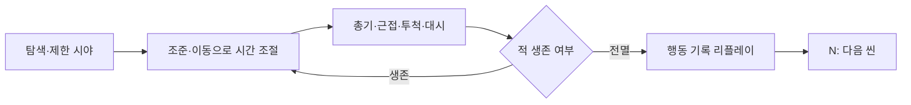
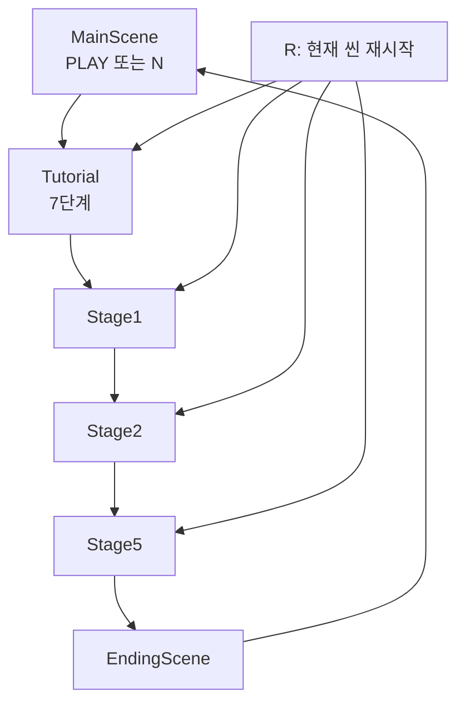
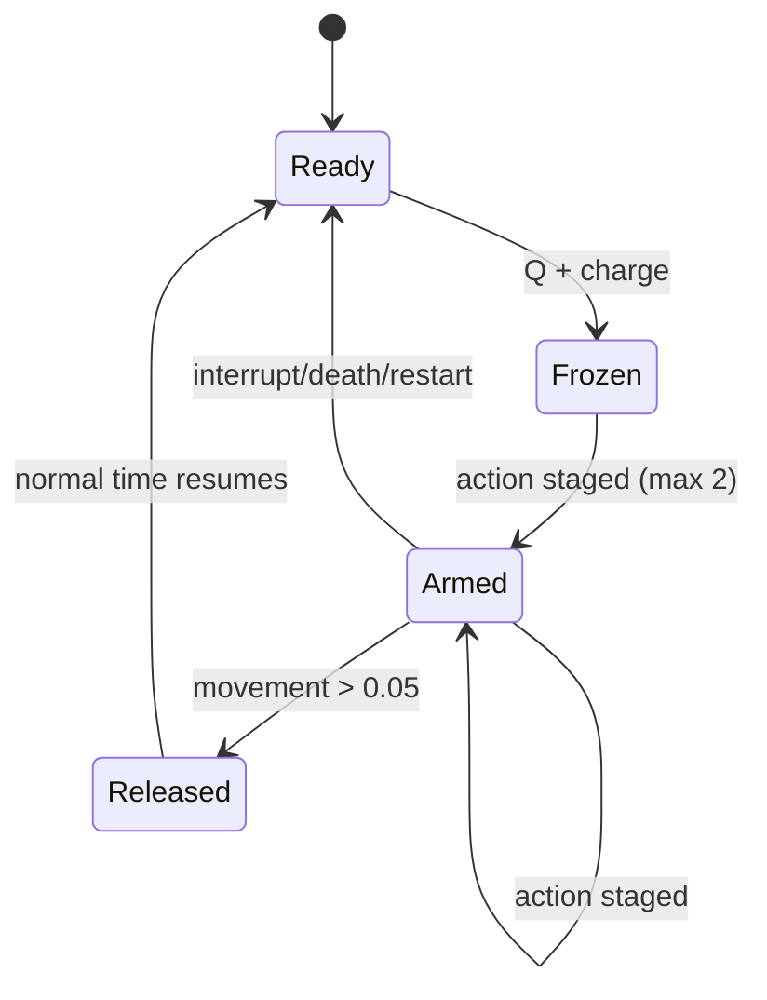
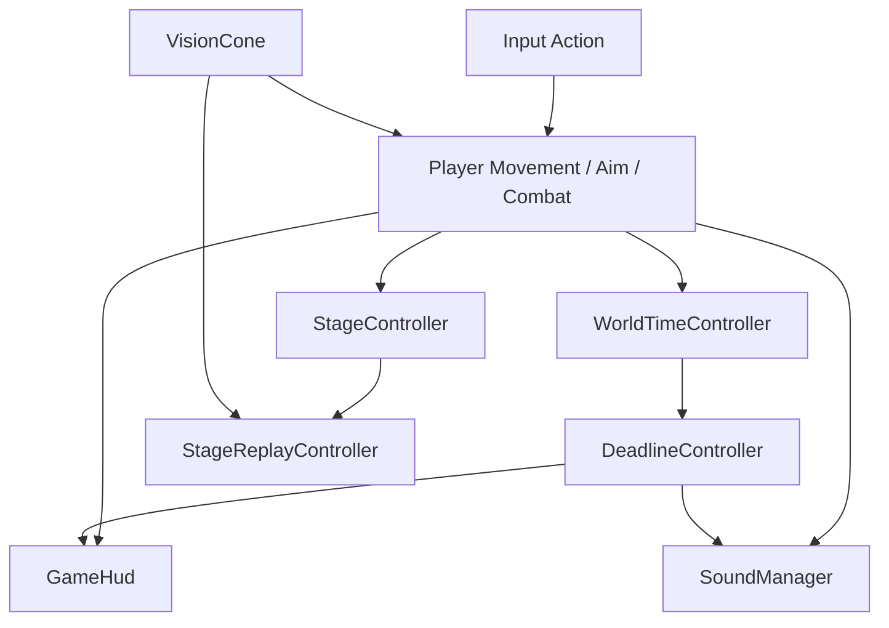
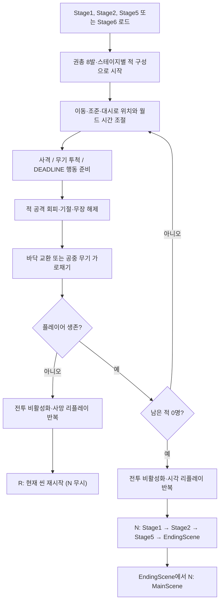
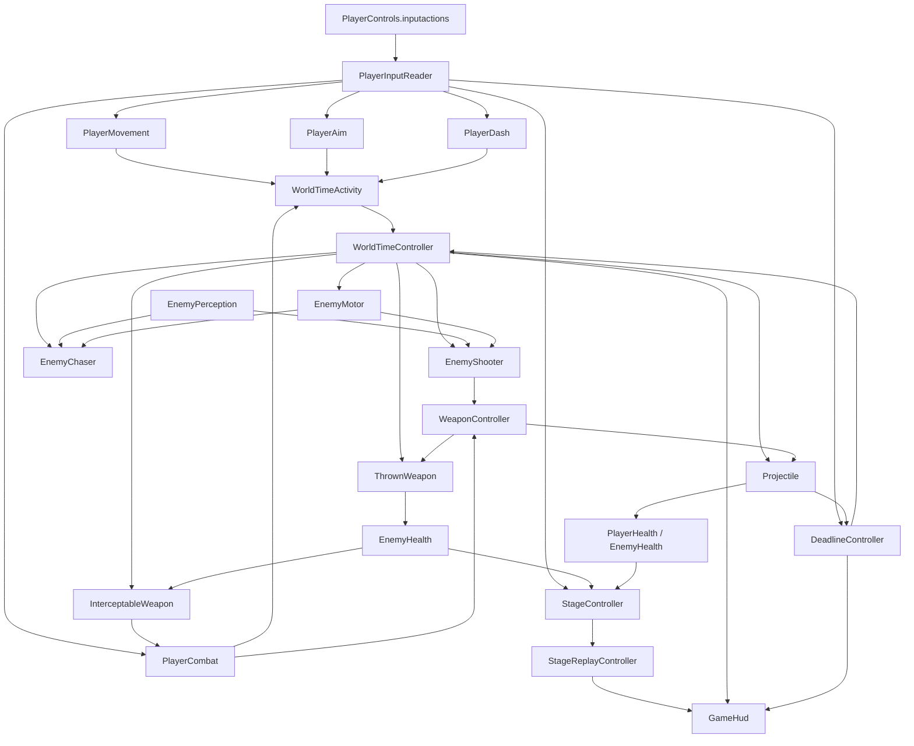

# 프로젝트 기획서

## 1. 문서 정보

| 항목 | 내용 |
|---|---|
| 프로젝트명 | Deltatime |
| 문서 작성일 | 2026-07-30 (KST) |
| 마지막 분석일 | 2026-08-17 (KST) |
| 문서 버전 | 1.8.4 |
| 현재 구현 상태 | 핵심 전투 루프와 단일 진행형 튜토리얼이 구현된 3D 프로토타입. 튜토리얼은 Synty 모듈형 실내 훈련장과 애니메이션 캐릭터 6명을 사용해 이동/월드 시간, 조준/대시, 근접 공격, 권총 사격, 투척 기절·무장 해제·드롭, 4인 포위 `DEADLINE` 탈출을 순서대로 가르치고 Stage1로 자동 전환한다. 본편의 현재 임시 진행은 Stage1·Stage2·Stage5 완료 후 EndingScene을 거쳐 MainScene으로 복귀하며, Stage6는 씬·에셋을 보존한 채 진행과 Build Settings에서 제외한다. Stage3·Stage4 에셋도 보존하지만 진행과 Build Settings에서는 제외한다. 전투는 플레이어 현재 높이 수평 평면 조준점과 총구 기준 수평 발사, 결정적 원형 콘 탄도 산포, 샷건 14m 최대 사거리, 권총·자동소총·샷건·근접 무기, 적 재무장, 공중 무기 가로채기를 포함한다. 현재 네 무기 정의는 전용 손·바닥·비행 모델과 씬에 직접 배치 가능한 전용 픽업 프리팹을 사용하며, 모든 바닥 픽업에는 깊이와 제한 시야를 따르는 고정 황금색 2px 아웃라인이 표시된다. 적 없는 전용 `WeaponCalibration` 씬에서 손·총구·월드 모델 보정값을 시험할 수 있다. Tutorial 및 Stage1~Stage6의 Synty 플레이어·적에는 비무장/권총/소총·샷건/근접 프로필의 방향 이동, 공용 구르기, 지원되는 공격 Animator가 연결되어 있다. 영속 `SoundManager`가 씬별 BGM, MainScene `게임 시작` 버튼 클릭 또는 `N` 키 시작음, 권총·자동소총·샷건 발사음, 주먹·야구방망이 적중음, 무기 투척, `DEADLINE` 진입·시간 왜곡·해제음과 BGM 덕킹을 자동 재생한다. |

### 1.1 분석 기준과 범위

- 2026-08-17 리플레이 중 `GameHud`는 라이브 디버그 HUD 대신 CCTV/기록 영상 스타일 전용 화면을 표시한다. 화면 모서리 브래킷, 좌상단 각진 `REPLAY`·스테이지 카드와 `CLEAR`/`DEAD` 결과, 하단의 현재/총 시간과 청록색 진행선·현재 위치, 중앙 정렬 `R RESTART` 및 클리어 결과의 `N NEXT STAGE` 키캡 안내를 사용한다. 중앙 상단 재생 단계와 우측 세로 기록 표기는 제거했다. `StageReplayController`는 `KILL`·`DEADLINE`·`CLEAR`·`DEAD`의 정규화 재생 시간을 별도 이벤트 목록으로 기록하며, HUD는 KILL 원형, DEADLINE 마름모, CLEAR 황금색 마름모, DEAD 빨간색 마름모 마커로 표시한다. 마지막 KILL과 CLEAR처럼 가까운 마커는 두 행으로 분리하고 위 행 라벨을 아이콘보다 충분히 위에 배치한다. 노이즈 효과와 탐색 입력은 추가하지 않았다. **구현 완료**. 이번 중앙/우측 표기 제거 뒤 Unity 배치 재검증은 이미 열려 있던 Unity 프로젝트 잠금으로 **확인 불가**이며, 직전 레이아웃 버전의 Unity 6000.1.13f1 `Tundra build success` 및 전용 Replay HUD PlayMode 스모크는 KILL→DEADLINE→CLEAR 순서·기록 범위·리플레이 진입을 통과했다. 배치 Editor의 화면 캡처 미지원으로 목표 해상도 육안 평가는 **미실행/확인 불가**다. 근거: `ProjectDeltatime/Assets/_Project/Scripts/UI/GameHud.cs`, `ProjectDeltatime/Assets/_Project/Scripts/Replay/StageReplayController.cs`, `ProjectDeltatime/Assets/_Project/Scripts/Level/StageController.cs`, `ProjectDeltatime/Assets/_Project/Scripts/Editor/ReplayPlayModeSmokeTest.cs`, `ProjectDeltatime/ReplayHudAlignmentSmoke.log`, `ProjectDeltatime/ReplayHudSimplifiedSmoke.log`.
- 2026-08-15 런타임에 생성되거나 무기 교환으로 월드 모델이 바뀐 `WeaponPickup`은 모델·아웃라인 렌더러를 구성한 직후 해당 계층을 `ReplayVisualRegistry`에 이벤트 기반으로 등록한다. 따라서 초기 캐시만 사용하는 `fallbackRendererDiscoveryInterval = 0` 스테이지에서도 원본 바닥 무기와 생성된 황금색 아웃라인이 리플레이 전환 시 함께 숨겨지고, 기록된 프록시만 표시된다. **구현 완료**. Unity 6000.1.13f1 배치 PlayMode `WeaponPickupOutlineTests` 3/3이 초기 탐색 뒤 생성된 픽업과 아웃라인의 리플레이 원본 숨김을 통과했다. 실제 Stage1·Tutorial 리플레이 화면의 육안 평가는 **미실행/확인 불가**다. 근거: `ProjectDeltatime/Assets/_Project/Scripts/Combat/WeaponPickup.cs`, `ProjectDeltatime/Assets/_Project/Scripts/Replay/StageReplayController.cs`, `ProjectDeltatime/Assets/_Project/Tests/PlayMode/WeaponPickupOutlineTests.cs`.
- 2026-08-15 모든 `WeaponPickup`은 Built-in Render Pipeline용 inverted-hull 렌더러를 런타임에 구성해 고정 황금색 `(1, 0.55, 0.035, 1)` 2px 아웃라인을 표시한다. 원본 메시·본을 공유하고 원본 머티리얼은 변경하지 않으며, 모든 서브메시를 그리되 그림자·라이트/리플렉션 프로브·모션 벡터는 사용하지 않는다. `ZTest LEqual`, `ZWrite Off`이므로 벽과 불투명 오브젝트에 가려지고, 렌더 큐 3050으로 시야 스텐실 오버레이보다 먼저 그려져 제한 시야도 따른다. 직접 배치·적 드롭 착지·투척 착지·교환·튜토리얼 지급으로 생성된 바닥 총기와 근접 무기에 적용하고, 비행 중인 `ThrownWeapon`·`InterceptableWeapon`은 제외한다. **구현 완료**. Unity 6000.1.13f1 배치 컴파일, 픽업 빌더, EditMode 17/17, PlayMode 전체 3/3(전용 아웃라인 2건 포함)이 통과했다. Stage1·Tutorial 1920×1080 Game View의 실제 두께·가림·색감 육안 평가는 **미실행/확인 불가**다. 근거: `ProjectDeltatime/Assets/_Project/Scripts/Visuals/WeaponPickupOutline.cs`, `ProjectDeltatime/Assets/_Project/Shaders/WeaponPickupOutline.shader`, `ProjectDeltatime/Assets/_Project/Scripts/Combat/WeaponPickup.cs`, `ProjectDeltatime/Assets/_Project/Tests/PlayMode/WeaponPickupOutlineTests.cs`.
- 2026-08-10 리플레이 결과·조작 안내와 활성 `DEADLINE` 행동 안내를 우상단에서 가운데 상단으로 옮겼다. 좌상단 상태 패널은 적·실시간/월드 또는 리플레이 시간·대시·`DEADLINE` 충전만 표시하도록 `330×178`로 줄였고, 체력과 무기/탄약은 조작 안내와 14px 간격을 두는 `330×76` 좌하단 패널로 분리했다. 입력·전투·리플레이 동작은 변경하지 않았다. **구현 완료**. 두 가운데 상단 패널의 공용 좌표 계산과 상태 문자열 분리·좌하단 패널 배치를 정적으로 대조했으며, 실제 Game View 가독성은 **미실행/확인 불가**다. 근거: `ProjectDeltatime/Assets/_Project/Scripts/UI/GameHud.cs`.
- 2026-08-10 사용자 청감 피드백에 따라 Stage1~Stage6 공용 `StageBgm` 기본 출력을 `0.50`에서 `0.35`로 한 번 더 낮췄다(직전 값 대비 30% 감소, 최초 `0.55` 대비 약 36% 감소). MainScene·Tutorial·엔딩 BGM 기본 출력 `0.55`는 유지하며, `DEADLINE` 덕킹 배율 `0.4`도 그대로여서 스테이지 BGM은 덕킹 중 `0.14`로 내려간다. **구현 완료**. Unity 6000.1.13f1 배치 `SoundManagerPlayModeSmokeTest`가 MainScene→Tutorial→Stage1→EndingScene 흐름에서 Stage1의 크로스페이드 완료 후 출력 `0.35`를 통과했다. 실제 청감 재확인은 **미실행/확인 불가**다. 근거: `ProjectDeltatime/Assets/_Project/Scripts/Audio/SoundManager.cs`, `ProjectDeltatime/Assets/_Project/Scripts/Editor/SoundManagerPlayModeSmokeTest.cs`, `ProjectDeltatime/SoundManagerStageBgmSmoke.log`.
- 2026-08-10 `SoundManager`는 Stage1~Stage6 공용 `StageBgm`의 기본 출력을 `0.55`에서 `0.50`으로 약 9% 낮췄다. MainScene·Tutorial·엔딩 BGM의 기본 출력 `0.55`는 유지하며, 크로스페이드 중에도 각 `AudioSource`의 실제 클립별 기본값을 적용한다. `DEADLINE` 덕킹 배율 `0.4`는 그대로여서 스테이지 BGM은 덕킹 중 `0.20`으로 내려간다. **구현 완료**. Unity 6000.1.13f1 배치 `SoundManagerPlayModeSmokeTest`가 MainScene→Tutorial→Stage1→EndingScene 흐름에서 Stage1의 BGM 선택과 크로스페이드 완료 후 출력 `0.50`을 통과했다. 실제 청감 확인은 **미실행/확인 불가**다. 근거: `ProjectDeltatime/Assets/_Project/Scripts/Audio/SoundManager.cs`, `ProjectDeltatime/Assets/_Project/Scripts/Editor/SoundManagerPlayModeSmokeTest.cs`, `ProjectDeltatime/SoundManagerStageBgmSmoke.log`.
- 2026-08-10 일반 스테이지에서 `DEADLINE`을 사용할 수 있을 때 표시하던 상단 중앙의 `Q를 눌러 DEADLINE 발동` 안내를 제거했다. 활성 중에는 기존처럼 우상단에 행동 수·이동 실행 안내를 표시하며, `Q` 입력 바인딩·충전·재사용 대기·발동 조건·전투 동작은 변경하지 않았다. **구현 완료**. `GameHud`가 비활성 `DEADLINE`에서 즉시 반환하고 활성 상태에서만 우상단 패널을 그리는지 정적으로 대조했으며, 실제 Game View 확인은 **미실행/확인 불가**다. 근거: `ProjectDeltatime/Assets/_Project/Scripts/UI/GameHud.cs`.
- 2026-08-10 Stage5 왼쪽 아래 단상의 `SM_Bld_Steps_01` 계단이 런타임용 비활성 상태로 그대로 NavMesh 재베이크 입력에서 제외되던 문제를 복구했다. `Tools/Prototype/Rebake Current Stage 5 Navigation`은 현재 열린 `Stage5.unity`에서 계단 콜라이더를 베이크 직전에 복원하고, 베이크 후에는 `NavMeshGroundMovement` 높이 투영을 유지하도록 다시 비활성화한다. 전용 NavMesh 에셋 참조·삼각형 생성·계단 주변 NavMesh·가구 상면 제외·높이 이동 구성 검증을 거친다. **구현 완료**. Unity 6000.1.13f1 배치 재베이크 검증과 임시 명령 제거 후 컴파일은 통과했으며, 실제 Play Mode 계단 조작은 **미실행/확인 불가**다. 근거: `ProjectDeltatime/Assets/_Project/Scripts/Editor/Stage5SceneBuilder.cs`, `ProjectDeltatime/Assets/_Project/Scenes/Stage5.unity`, `ProjectDeltatime/Assets/_Project/Scenes/Stage5Navigation.asset`, `ProjectDeltatime/Assets/_Project/Scripts/Level/NavMeshGroundMovement.cs`.

- 2026-08-10 Tutorial 하단 진행 패널의 청록색 단계 제목은 23pt/32px 영역에서 20pt/36px 영역으로 조정하고, 안내·진행 텍스트의 세로 위치와 높이도 다시 배분해 잘림을 없앴다. 우상단 리플레이와 활성 `DEADLINE` 안내는 중앙 메시지의 24pt 글꼴 대신 전용 20pt 글꼴을 사용해 패널 내부의 여러 줄이 잘리지 않게 했다. 일반 중앙 메시지의 24pt 표기는 유지한다. **구현 완료**. 세 UI의 글꼴 크기와 레이블 영역을 정적으로 대조했으며, 실제 Game View 가독성은 **미실행/확인 불가**다. 근거: `ProjectDeltatime/Assets/_Project/Scripts/Tutorial/TutorialHud.cs`, `ProjectDeltatime/Assets/_Project/Scripts/UI/GameHud.cs`.
- 2026-08-10 야구방망이의 유효한 공격 시작마다 공격자 위치에서 OpenGameArt CC0 Swishes Sound Pack의 `swish-5.wav`·`swish-6.wav` 기반 짧은 3D 휘두름음 중 하나를 재생한다. 대상이 없거나 사거리·시야 판정에 실패해도 소리는 나며, 실제 적중 시에는 기존 방망이 적중음이 별도로 겹친다. 애니메이션 공격과 애니메이터 없는 즉시 판정 경로 모두에 적용했고 주먹·총기·투척에는 적용하지 않았다. **구현 완료**. 새 WAV 원본과 프로젝트 사본의 SHA-256 일치, 유지된 Unity `.meta` GUID와 `DeltatimeSoundLibrary` 직렬화 참조, 코드 정적 연결은 확인했다. Unity 배치 사운드 스모크는 열린 다른 Unity 인스턴스 때문에 **미실행/확인 불가**이며, `dotnet build`는 기존 누락 파일 `Assets/TutorialInfo/Scripts/Readme.cs`로 실패했다. 근거: `ProjectDeltatime/Assets/_Project/Scripts/Combat/MeleeAttackExecution.cs`, `ProjectDeltatime/Assets/_Project/Scripts/Combat/WeaponController.cs`, `ProjectDeltatime/Assets/_Project/Scripts/Audio/SoundManager.cs`, `ProjectDeltatime/Assets/_Project/Resources/DeltatimeSoundLibrary.asset`, `ProjectDeltatime/Assets/_Project/Audio/SFX/Combat/Swing`.
- 2026-08-10 리플레이의 결과·조작 안내 패널과 활성 `DEADLINE`의 행동 수·실행 안내 패널을 중앙 화면에서 우상단으로 옮겼다. 두 패널은 좌우 18px 여백 안에서 최대 폭 330px을 사용하므로, 중앙의 리플레이와 실시간 전투 화면을 가리지 않는다. 일반 플레이와 리플레이가 아닌 사망·클리어 메시지의 기존 배치는 유지했으며 입력·전투·리플레이 동작은 변경하지 않았다. **구현 완료**. `GameHud`의 상태별 패널 분기와 우상단 좌표 계산을 정적으로 대조했으며, 실제 Game View의 해상도별 가독성은 **미실행/확인 불가**다. 근거: `ProjectDeltatime/Assets/_Project/Scripts/UI/GameHud.cs`.
- 2026-08-10 게임플레이 HUD와 Tutorial 단계 안내의 마우스 버튼 표기를 모두 `LMB - 좌 클릭`, `RMB - 우 클릭`으로 통일했다. 실제 좌·우 버튼 바인딩과 행동은 바꾸지 않았으며, 화면에 표시되는 조작 안내만 갱신했다. **구현 완료**. 두 런타임 UI 소스의 모든 LMB/RMB 표시 문자열이 새 표기를 사용하는지 정적 대조했으며, 실제 Game View의 줄바꿈·가독성은 **미실행/확인 불가**다. 근거: `ProjectDeltatime/Assets/_Project/Scripts/UI/GameHud.cs`, `ProjectDeltatime/Assets/_Project/Scripts/Tutorial/TutorialDirector.cs`.
- 2026-08-10 사용자 요청으로 본편 임시 진행 경로를 `Stage1 → Stage2 → Stage5 → EndingScene → MainScene`으로 변경했다. `StageSceneFlow`에서 Stage6를 플레이 가능 목록에서 잠시 제외하고, `GameBuildSceneCatalog`와 `ProjectSettings/EditorBuildSettings.asset`에서도 Stage6 씬을 제외했다. Stage6 씬·전용 에셋·스크립트는 삭제하지 않고 보존하므로 이후 재개 시 진행 목록과 빌드 등록을 복원하면 된다. **구현 완료**. `StageSceneFlow`·카탈로그·직렬화된 Build Settings의 정적 대조는 통과했으며, Unity 런타임 클리어 입력 검증은 **미실행/확인 불가**다. 근거: `ProjectDeltatime/Assets/_Project/Scripts/Level/StageSceneFlow.cs`, `ProjectDeltatime/Assets/_Project/Scripts/Editor/GameBuildSceneCatalog.cs`, `ProjectDeltatime/ProjectSettings/EditorBuildSettings.asset`.
- 2026-08-10 `SoundManager`는 `EndingScene`을 로드하면 `SoundLibrary.EndingBgm`을 선택해 비반복 재생하며, 현재 SoundLibrary의 `endingBgm` GUID는 `BGM_Ending.mp3` GUID와 일치한다. EndingScene의 Main Camera에는 활성 `AudioListener`가 있다. `SoundManagerPlayModeSmokeTest`는 MainScene→Tutorial→EndingScene 전환 뒤 `CurrentBgmClip == EndingBgm`을 검사한다. **구현 완료**. 분기·에셋 GUID·AudioListener의 정적 대조와 관련 파일 대상 `git diff --check`는 통과했지만, 프로젝트를 연 다른 Unity 인스턴스 때문에 새 PlayMode 스모크는 **미실행/확인 불가**다. 근거: `ProjectDeltatime/Assets/_Project/Scripts/Audio/SoundManager.cs`, `ProjectDeltatime/Assets/_Project/Scripts/Editor/SoundManagerPlayModeSmokeTest.cs`, `ProjectDeltatime/Assets/_Project/Resources/DeltatimeSoundLibrary.asset`, `ProjectDeltatime/Assets/_Project/Audio/BGM/BGM_Ending.mp3`, `ProjectDeltatime/Assets/_Project/Scenes/EndingScene.unity`.
- 2026-08-10 `MainScene`은 기존 `게임 시작` 버튼 클릭 외에도 `N` 키로 `Tutorial`을 연다. `MainMenuController`가 공용 `PlayerControls.Gameplay.NextStage` 입력을 활성화해 같은 `Play()` 경로로 보내므로, Build Settings 대상 확인과 UI 클릭음도 버튼과 동일하게 적용한다. 중복 입력 중에는 씬 전환을 한 번만 요청한다. Canvas의 `TutorialKeyHint`는 Noto Sans KR TMP 폰트로 `N 키를 눌러 튜토리얼 시작`을 표시하며, `MainSceneBuilder`는 텍스트·폰트·비입력·반응형 좌표를 멱등 구성·검증한다. **구현 완료**. 소스와 직렬화된 씬의 입력 경로·문구·TMP 참조·앵커·크기 정적 대조는 통과했다. Unity 6000.1.13f1 배치 `MainSceneBuilder.BuildAndValidateFromCommandLine`은 다른 Unity 인스턴스가 프로젝트를 열고 있어 `HandleProjectAlreadyOpenInAnotherInstance` 단계에서 실행되지 않아, 실제 Game View 키 입력·문구 가시성은 **미실행/확인 불가**다. 근거: `ProjectDeltatime/Assets/_Project/Scripts/UI/MainMenuController.cs`, `ProjectDeltatime/Assets/_Project/Scripts/Editor/MainSceneBuilder.cs`, `ProjectDeltatime/Assets/_Project/Scenes/MainScene.unity`, `ProjectDeltatime/Assets/_Project/Input/PlayerControls.inputactions`.
- 2026-08-10 리플레이의 `V` 전체 시야 전환을 제거하고, 모든 스테이지 리플레이를 기록된 암흑 시야로 고정했다. `StageReplayController`는 ViewCone 재계산과 두 동적 시야 조명 프록시만 적용하며, 전체 시야용 환경광·안개 변경·Fill Light·적 강제 표시 데이터는 존재하지 않는다. 입력 에셋과 생성 래퍼에서 `V` 바인딩을 제거했고 HUD는 리플레이 시야 상태·전환 안내를 표시하지 않는다. 일반 플레이의 제한 시야와 Tutorial의 무제한 시야는 변경하지 않았다. **구현 완료**. Unity 6000.1.13f1 배치 컴파일과 Stage6 PlayMode 스모크는 통과했다. Prototype 스모크는 새 암흑 시야 검증을 통과했지만 기존 투척 무기 2건과 본 포즈 진단 불일치로 실패했고, Stage5 스모크는 리플레이 검증 전에 기존 남쪽 컷어웨이 비활성 렌더러 오류로 실패했다. 사람 눈 기반 리플레이 시각 평가는 **미실행/확인 불가**다. 근거: `ProjectDeltatime/Assets/_Project/Scripts/Replay/StageReplayController.cs`, `ProjectDeltatime/Assets/_Project/Scripts/Vision/VisionCone.cs`, `ProjectDeltatime/Assets/_Project/Scripts/UI/GameHud.cs`, `ProjectDeltatime/Assets/_Project/Scripts/Editor/PrototypePlayModeSmokeTest.cs`, `ProjectDeltatime/Assets/_Project/Scripts/Editor/Stage6PlayModeSmokeTest.cs`.
- 2026-08-10 적 공격 경고선은 `LineRenderer`가 월드 좌표를 보관하는 구조라, 총기 적이 조준·점사 중 경고선을 켠 뒤 추격·후퇴 상태로 이동하면 마지막으로 기록된 시작점에 남아 있었다. `EnemyCombatant.LateUpdate`는 가시성 갱신 뒤 표시 중인 경고선을 다시 쓰며, 총기 적은 매 프레임 현재 `WeaponController.Muzzle`에서 현재 대상 위치까지, 근접 공격 준비선은 기존 몸체 높이에서 현재 대상 위치까지 표시한다. 기존 사망·기절·상태 전환·시야 밖 숨김 정책과 공격 판정·사격 방향은 변경하지 않는다. `PrototypePlayModeSmokeTest`는 적을 이동시킨 뒤 경고선의 시작·끝점이 각각 최신 총구·대상 좌표인지 검사하도록 보강했다. **구현 완료**. Unity 배치 컴파일과 스모크는 다른 Unity 인스턴스가 프로젝트를 열고 있어 실행하지 못했으며, 생성된 C# 프로젝트도 기존 누락 파일 `Assets/TutorialInfo/Scripts/Readme.cs` 참조로 빌드되지 않아 결과는 **확인 불가**다. 실제 Game View에서 레이저 표시 후 이동·회전하는 총기 적의 시각적 추적은 **미실행**이다. 근거: `ProjectDeltatime/Assets/_Project/Scripts/Enemies/EnemyCombatant.cs`, `ProjectDeltatime/Assets/_Project/Scripts/Editor/PrototypePlayModeSmokeTest.cs`.
- 2026-08-10 라이브 플레이의 `DEADLINE`에 Built-in 렌더 파이프라인용 풀스크린 시각 피드백을 추가했다. `WorldTimeVisualFeedback`가 런타임에 같은 게임플레이 카메라의 `DeadlineVisualFeedback`을 생성·연결하므로 기존 씬·프리팹은 재생성하지 않는다. 진입 0.14초에는 플레이어 화면 위치로 수축하는 청백색 링과 플래시, 유지 중에는 채도 55%·가장자리 중심 18% 청록 틴트·비네트·미세 노이즈, 정상 해제 0.24초에는 플레이어 위치에서 퍼지는 복원 링과 원색 복귀를 비스케일 시간으로 표시한다. 플레이어와 조준 중심부는 상대적으로 선명하게 유지하며, 플레이어 위 행동 노드 2개는 준비 행동 수만큼 청록색으로 채우고 세 번째 행동 거절 때 주황색으로 점멸한다. 효과가 보이는 동안 기존 월드 시간 암전 오버레이만 억제하고 IMGUI HUD는 후처리 뒤에 그려 가독성을 유지한다. 사망·비활성화 중단은 해제파 없이 즉시 초기화하며, 리플레이 진입 시 라이브 시뮬레이션 비활성화 흐름에 따라 효과를 끄고 리플레이의 과거 `DEADLINE` 구간에는 재현하지 않는다. Resources 셰이더 누락·미지원 시 원본 화면을 출력하고 오류를 한 번만 남긴다. 색수차·카메라 흔들림·FOV 변경·월드 오브젝트 외곽선·궤적 강조는 범위에서 제외했다. **구현 완료**. Unity 6000.1.13f1 배치 컴파일과 전용 PlayMode 스모크가 진입·유지·행동 1/2개·초과 거절·정상 해제·비정상 중단, `Time.timeScale == 1`, Tutorial·Stage2·Stage5·Stage6 런타임 연결, 셰이더 준비와 리플레이 비활성화를 통과했다. Stage1 밝은 환경과 Stage5·Stage6 어두운 네온 환경의 조준·적 식별·HUD 가독성은 사람 눈 기반 수동 평가를 실행하지 않아 **확인 불가**다. 근거: `ProjectDeltatime/Assets/_Project/Scripts/Time/DeadlineVisualFeedback.cs`, `ProjectDeltatime/Assets/_Project/Scripts/Time/WorldTimeVisualFeedback.cs`, `ProjectDeltatime/Assets/_Project/Resources/Shaders/DeadlineScreenEffect.shader`, `ProjectDeltatime/Assets/_Project/Scripts/Editor/DeadlineVisualFeedbackPlayModeSmokeTest.cs`.
- 2026-08-10 Tutorial 왼쪽의 `Gate 01`~`06 Status Display`는 Synty `LED_Panel_06` 화면 머티리얼의 스크롤이 전역 `_Time`을 직접 사용하던 탓에 프로젝트의 독립 월드 시간 감속과 무관하게 일정한 속도로 움직였다. 기존 Tutorial 카메라의 `WorldTimeVisualFeedback`는 여섯 상태 전광판에서 해당 이름의 머티리얼 슬롯만 런타임 복제해 `Deltatime/World Time Emissive Scroll` 셰이더로 바꾸고, `WorldTimeController.WorldElapsedTime`을 전달한다. 원래 `_Speed`와 아래 방향 스크롤은 유지하되, 플레이어가 멈추거나 `DEADLINE`으로 월드 시간이 정지하면 화면도 같은 비율로 감속·정지한다. 전역 `Time.timeScale` 및 원본 Synty 머티리얼은 변경하지 않는다. **구현 완료**. 자동·PlayMode 테스트는 사용자 요청으로 **미실행**이며, 실제 전광판의 방향·감속·정지 체감은 사용자 수동 확인이 필요하다. 근거: `ProjectDeltatime/Assets/_Project/Scripts/Time/WorldTimeVisualFeedback.cs`, `ProjectDeltatime/Assets/_Project/Shaders/WorldTimeEmissiveScroll.shader`, `ProjectDeltatime/Assets/_Project/Scenes/Tutorial.unity`.
- 2026-08-10 Tutorial 진행 게이트는 `TutorialSceneBuilder`에서 7개의 넓은 셔터 판넬과 판넬별 상태 스트립 대신, 폭 `0.24m`·높이 `2.45m`·깊이 `0.18m`의 세로 철창 17개를 `0.74m` 간격으로 생성하도록 바꿨다. 상·하단 레일, 기존 `BoxCollider(13×2.8×0.35)`, Layer 8 및 `TutorialGate`의 비스케일 상승·개방 동작은 유지한다. `Tools/Tutorial/Apply Bar Gate Visuals`는 NavMesh나 다른 환경을 재생성하지 않고 여섯 게이트 시각 하위 오브젝트만 갱신하며, 정적·PlayMode 검증도 철창·레일 수와 기존 셔터 잔재를 검사하도록 보강했다. **부분 구현**. 현재 `Tutorial.unity` 저장본은 다른 Unity 인스턴스 잠금으로 갱신하지 못해 기존 42개 `Shutter Slat`과 42개 `Status Strip`을 유지한다. 사용자가 열린 Unity에서 해당 메뉴를 실행해야 저장 씬에도 철창이 반영된다. 자동·PlayMode 테스트는 사용자 요청으로 **미실행**이다. 근거: `ProjectDeltatime/Assets/_Project/Scripts/Editor/TutorialSceneBuilder.cs`, `ProjectDeltatime/Assets/_Project/Scripts/Editor/TutorialPlayModeSmokeTest.cs`, `ProjectDeltatime/Assets/_Project/Scenes/Tutorial.unity`.
- 2026-08-10 샷건은 한 발에 펠릿 4개를 발사하도록 조정했다. 펠릿별 피해 1, 총 퍼짐 18도(반각 9도의 원형 콘), 펠릿별 반경 지터 최대 1도, 시드 307, 탄창 6, 발사 간격 0.75초, 탄속 16, 최대 사거리 14m와 플레이어 이동 반동 0m는 유지한다. `Shotgun.asset`의 직렬화 값과 `PrototypeSceneBuilder`의 생성·저장 데이터 검증 기대값을 같은 수로 맞췄으므로 재생성 후에도 4펠릿 설정을 유지한다. **구현 완료**. 에셋·생성값·검증 기대값 정적 대조와 공백 검사는 통과했다. 현재 사용자 변경이 있는 씬을 재생성하지 않기 위해 전체 씬 빌드/Play Mode 스모크는 **미실행**이며, Unity 배치 컴파일도 프로젝트가 이미 열려 있어 실행할 수 없어 **확인 불가**다. 근거: `ProjectDeltatime/Assets/_Project/Shotgun.asset`, `ProjectDeltatime/Assets/_Project/Scripts/Editor/PrototypeSceneBuilder.cs`.
- 2026-08-10 Tutorial의 한글 바닥 표지 7개는 Noto Sans KR Bold `TextMesh.font`와 같은 폰트의 `MeshRenderer.sharedMaterial`을 함께 사용한다. 이전 한글화 적용에서 TextMesh 폰트만 직렬화되고 Renderer가 기본 머티리얼을 유지해 표지가 렌더링되지 않던 상태를 복구했다. `KoreanUiLocalizationBuilder`와 `TutorialSceneBuilder`는 폰트·머티리얼·Renderer 활성 상태를 함께 멱등 적용하며, 정적 검증도 세 참조를 확인한다. 게임플레이 `GameHud`는 좌상단 상태 패널을 `330×248`, 상태 텍스트를 14pt/`300×188` 영역으로 조정하고, 중앙 결과 패널과 `DEADLINE` 피드백 패널은 24pt 텍스트와 내부 여백을 사용해 한글 3줄이 잘리지 않게 한다. **구현 완료**. 자동 테스트와 배치 검증은 사용자 요청으로 **미실행**이며, 실제 Game View에서 바닥 표지 가시성 및 HUD 줄바꿈·잘림은 사용자 수동 확인이 필요하다. 근거: `ProjectDeltatime/Assets/_Project/Scenes/Tutorial.unity`, `ProjectDeltatime/Assets/_Project/Scripts/Editor/TutorialSceneBuilder.cs`, `ProjectDeltatime/Assets/_Project/Scripts/Editor/KoreanUiLocalizationBuilder.cs`, `ProjectDeltatime/Assets/_Project/Scripts/UI/GameHud.cs`.
- 2026-08-10 공용 `KoreanUiFontSettings`가 Noto Sans KR Regular·Bold와 Bold 기반 동적 SDF TMP 폰트 에셋을 `Resources`에서 제공한다. MainScene의 `PlayLabel`은 `게임 시작`과 해당 TMP 폰트를 사용하며, 게임플레이 `GameHud`와 `TutorialHud`의 사용자 표시 문구는 한글 폰트로 렌더링한다. 무기 정의의 표시는 `권총`·`자동소총`·`샷건`·`근접 무기`로 통일했고, 튜토리얼 바닥 표지는 Bold 폰트로 `01 시간`, `02 대시`, `03 근접`, `04 권총`, `05 투척`, `06 DEADLINE`, `출구`를 사용한다. `DEADLINE`은 고유명으로 영문 표기를 유지한다. `KoreanUiLocalizationBuilder`는 위 참조·문구를 멱등적으로 적용하고 정적 참조 검증 진입점을 제공한다. **구현 완료**. 자동 테스트와 배치 검증은 사용자 요청에 따라 **미실행**이며, 실제 Game View에서 한글 글리프, 줄바꿈, 잘림은 사용자 수동 확인이 필요하다. 언어 전환·범용 로컬라이제이션 시스템은 **미구현/계획 필요**다. 근거: `ProjectDeltatime/Assets/_Project/Font/Noto_Sans_KR/NotoSansKR-Regular.otf`, `ProjectDeltatime/Assets/_Project/Font/Noto_Sans_KR/NotoSansKR-Bold.otf`, `ProjectDeltatime/Assets/_Project/Font/Noto_Sans_KR/NotoSansKR-Bold SDF.asset`, `ProjectDeltatime/Assets/_Project/Resources/KoreanUiFontSettings.asset`, `ProjectDeltatime/Assets/_Project/Scripts/UI/KoreanUiFontSettings.cs`, `ProjectDeltatime/Assets/_Project/Scripts/UI/GameHud.cs`, `ProjectDeltatime/Assets/_Project/Scripts/Tutorial/TutorialHud.cs`, `ProjectDeltatime/Assets/_Project/Scripts/Editor/KoreanUiLocalizationBuilder.cs`, `ProjectDeltatime/Assets/_Project/Scenes/MainScene.unity`, `ProjectDeltatime/Assets/_Project/Scenes/Tutorial.unity`.
- 2026-08-10 (Stage6 임시 제외 전 기준) 본편의 진행 경로는 `Stage1 → Stage2 → Stage5 → Stage6 → EndingScene → MainScene`으로 고정했다. `StageController`는 클리어와 사망 모두에서 전투를 비활성화한 뒤 리플레이를 요청한다. 클리어 리플레이에서는 `N`으로 다음 목적지로 즉시 이동하고, 사망 리플레이에서는 `N`을 무시하며 `R`로 같은 스테이지를 재시작한다. 두 결과의 리플레이는 암흑 시야로 고정되며 시야 전환 입력은 없다. `EndingScene`은 MainScene의 배경·로고를 재사용해 `STAGE CLEAR`와 `Press N to return to Main Menu`를 표시하고, `N`으로 MainScene을 연다. Build Settings와 씬 빌더는 `MainScene`, `Tutorial`, `Stage1`, `Stage2`, `Stage5`, `Stage6`, `EndingScene`만 등록하며 Stage3·Stage4 씬·에셋은 삭제하지 않고 현재 진행/빌드 대상에서만 제외한다. **구현 완료**. 이후 현재 적용 상태는 위의 Stage6 임시 제외 항목을 따른다. 당시 런타임 테스트는 **미실행**이며, 사망/클리어 리플레이와 키 입력은 사용자 수동 검증이 필요하다. 근거: `ProjectDeltatime/Assets/_Project/Scripts/Level/StageSceneFlow.cs`, `ProjectDeltatime/Assets/_Project/Scripts/Level/StageController.cs`, `ProjectDeltatime/Assets/_Project/Scripts/Replay/StageReplayController.cs`, `ProjectDeltatime/Assets/_Project/Scripts/UI/EndingSceneController.cs`, `ProjectDeltatime/Assets/_Project/Scripts/UI/GameHud.cs`, `ProjectDeltatime/Assets/_Project/Scenes/EndingScene.unity`, `ProjectDeltatime/Assets/_Project/Scripts/Editor/GameBuildSceneCatalog.cs`, `ProjectDeltatime/ProjectSettings/EditorBuildSettings.asset`.
- 2026-08-10 Deadline 리플레이의 해제 후 카메라 복귀는 전체 후속 구간의 단일 프레젠테이션 시작 시각을 기준으로 진행한다. 정규 시간축이 20Hz 인접 샘플별 세그먼트로 분리돼도 `CameraRecoveryStart`를 모든 후속 세그먼트가 공유하므로, 0.2초 복귀 진행도가 세그먼트 경계마다 0으로 되감기며 화면이 떨리지 않는다. `CurrentCameraRecoveryBlend` 진단값은 Deadline에서 0, 후속 복귀에서 단조 증가, 일반 구간에서 1을 유지한다. **구현 완료**. `ReplayPlayModeSmokeTest`가 강한 감속 Deadline 후 여러 세그먼트에 걸친 복귀 진행도의 비역행과 실제 증가를 통과했다. 실제 클리어 리플레이의 사람 눈 기반 시각 평가는 **확인 불가**다. 근거: `ProjectDeltatime/Assets/_Project/Scripts/Replay/StageReplayController.cs`, `ProjectDeltatime/Assets/_Project/Scripts/Editor/ReplayPlayModeSmokeTest.cs`, `ProjectDeltatime/ReplayCameraStabilitySmoke2.log`.
- 2026-08-10 리플레이는 소스 실시간, 월드 시뮬레이션 시간, 정규화된 표시 시간을 분리한다. `ReplayRecordingClock`은 `unscaledDeltaTime`으로 소스 순서를 기록하고 실제 `WorldDeltaTime`을 `ReplayElapsedTime`에 누적하며, `BuildPresentationTimeline`은 20Hz 인접 샘플을 source-time→presentation-time 구간으로 매핑한다. 캐릭터의 `SkinnedMeshRenderer`별 뼈 위치·회전·스케일, 독립 프록시 뼈 계층, 본 보간과 512 포즈 프레임 선할당은 모두 제거했다. 대신 `ReplayAnimationTrack`이 캐릭터 시각 루트를 한 번 복제해 원본 Avatar/Controller/23개 스킨 렌더러를 공유 골격 하나로 유지하고, 이동 Transform, 변경된 Float/Bool/Int, 명시적 Trigger, Controller·활성 이벤트와 레이어 상태/정규화 시간/가중치/전이 체크포인트만 기록한다. 재생 Animator는 자동 진행을 0으로 둔 뒤 프레젠테이션 시간의 비스케일 델타만 `Animator.Update`에 1배로 공급하므로 `WorldTimeController` 감속을 다시 적용하지 않는다. 프록시 시각 루트는 `MonoBehaviour`가 없는 경우에만 복제하고 Animator 외 `Behaviour`, Collider, Rigidbody를 차단하며 `MeleeAttackImpactBehaviour`는 등록된 프록시에서 전투 콜백을 즉시 중단한다. 기본 상한은 소스 실시간 300초/추정 payload 64MiB이고, 도달 시 마지막 데이터는 보존한 채 사유와 통계를 경고로 남기며 조용히 자르지 않는다. **구현 완료**. 최신 EditMode/PlayMode 스모크가 정상·강한 감속·hard freeze 길이, `AttackA`/`AttackB`/`Roll`, 실제 장비·Controller·손 모델 변경, 실제 프록시 상태 전이, 공격 부작용 차단 경계, 카메라 복귀, Hit VFX, 본 포즈 0건과 메모리 통계를 통과했다. 실제 클리어 플레이의 사람 눈 기반 전체 시각 평가는 **확인 불가**다. 근거: `ProjectDeltatime/Assets/_Project/Scripts/Replay/ReplayRecordingClock.cs`, `ProjectDeltatime/Assets/_Project/Scripts/Replay/ReplayAnimationTrack.cs`, `ProjectDeltatime/Assets/_Project/Scripts/Replay/ReplayAnimatorProxyRegistry.cs`, `ProjectDeltatime/Assets/_Project/Scripts/Replay/ReplayMemoryStatistics.cs`, `ProjectDeltatime/Assets/_Project/Scripts/Replay/StageReplayController.cs`, `ProjectDeltatime/Assets/_Project/Scripts/Visuals/CharacterAnimationController.cs`, `ProjectDeltatime/Assets/_Project/Scripts/Visuals/MeleeAttackImpactBehaviour.cs`, `ProjectDeltatime/Assets/_Project/Scripts/Visuals/WeaponVisualPresenter.cs`, `ProjectDeltatime/Assets/_Project/Scripts/Editor/ReplayTimeAxisEditModeTest.cs`, `ProjectDeltatime/Assets/_Project/Scripts/Editor/ReplayPlayModeSmokeTest.cs`, `ProjectDeltatime/ReplayAnimatorTimeAxis.log`, `ProjectDeltatime/ReplayAnimatorPlayModeFinal.log`.
- 최종 명시 등록 렌더러 보정, 원본 캐릭터 제거 뒤 프록시 수명 분리·활성 이벤트 복원, normalized/fixed-duration 전이 단위별 체크포인트 복원 보정 뒤 최신 재실행 로그는 `ProjectDeltatime/ReplayAnimatorFinalCompile5.log`, `ProjectDeltatime/ReplayAnimatorTimeAxisFinal5.log`, `ProjectDeltatime/ReplayAnimatorPlayModeFinal5.log`이며 모두 **구현 완료/통과**다.
- 2026-08-10 BGM 4개를 메인 메뉴·Tutorial·Stage1~Stage6·엔딩/크레딧 용도로 이름을 정리해 `Assets/_Project/Audio/BGM`에 배치하고 영속 `SoundManager`에 연결했다. `MainScene`은 메뉴 곡, `Tutorial`은 튜토리얼 곡, `Stage*`는 공용 액션 곡, `EndingScene`·`Ending`·`Credits`는 비반복 엔딩 곡을 자동 선택한다. 기본 출력은 메뉴·Tutorial·엔딩 `0.55`, Stage1~Stage6 공용 액션 곡 `0.35`이며, 곡 전환은 월드 시간과 무관한 0.25초 크로스페이드를 사용하고 각 소스가 재생 중인 클립의 출력을 유지한다. Stage 사이에서는 같은 곡을 다시 시작하지 않는다. `DEADLINE` 중에는 BGM을 약 -8 dB로 덕킹한다. **구현 완료**. 사용자 볼륨 설정과 별도 `AudioMixer` 에셋은 **계획 필요**다. 근거: `ProjectDeltatime/Assets/_Project/Scripts/Audio/SoundManager.cs`, `ProjectDeltatime/Assets/_Project/Scripts/Audio/SoundLibrary.cs`, `ProjectDeltatime/Assets/_Project/Scripts/Editor/SoundManagerPlayModeSmokeTest.cs`, `ProjectDeltatime/Assets/_Project/Resources/DeltatimeSoundLibrary.asset`, `ProjectDeltatime/Assets/_Project/Audio/BGM`.
- 2026-08-10 권총·자동소총·샷건의 CC0 발사음 7개를 무기 정의별 변형으로 `SoundLibrary`에 연결했다. `WeaponController`가 탄약을 소비하고 투사체 생성에 성공한 발사 1회마다 한 음만 재생하므로 샷건 펠릿 수만큼 중복되지 않으며, 플레이어와 적의 같은 발사 경로에 함께 적용된다. 16개 3D `AudioSource` 풀은 위치 감쇠와 작은 피치 변형을 사용한다. 주먹·야구방망이는 일반 공격과 `DEADLINE` 저장 공격 모두 공격 유형을 보존하고 `MeleeAttackResolver`가 실제 피해를 적용한 위치에서만 서로 다른 적중음을 낸다. 무기 투척에만 전용 음을 재생하며, 플레이어·적의 무기 획득·교체·교환에는 효과음을 재생하지 않는다. **구현 완료**. 근거: `ProjectDeltatime/Assets/_Project/Scripts/Combat/WeaponController.cs`, `ProjectDeltatime/Assets/_Project/Scripts/Combat/MeleeAttackResolver.cs`, `ProjectDeltatime/Assets/_Project/Scripts/Combat/MeleeAttackExecution.cs`, `ProjectDeltatime/Assets/_Project/Scripts/Combat/WeaponPickup.cs`, `ProjectDeltatime/Assets/_Project/Scripts/Player/PlayerCombat.cs`, `ProjectDeltatime/Assets/_Project/Scripts/Enemies/EnemyCombatant.cs`, `ProjectDeltatime/Assets/_Project/Audio/SFX/Combat`, `ProjectDeltatime/Assets/_Project/Audio/SFX/Weapons`.
- 2026-08-10 `DeadlineController`에 `Activated` 이벤트를 추가하고 기존 `Released`와 함께 `SoundManager`가 자동 구독하도록 연결했다. 진입 시 전역 2D 충격음과 한 번만 재생되는 시간 왜곡음을 동시에 시작하고 BGM을 약 -8 dB 낮추며, 이동·중단에 따른 해제 시 왜곡음을 정지하고 두 해제음 중 하나를 재생한 뒤 BGM을 복원한다. 이 전환은 `Time.unscaledDeltaTime`을 사용하므로 하드 프리즈 중에도 동작하며 전역 `Time.timeScale`은 바꾸지 않는다. **구현 완료**. 근거: `ProjectDeltatime/Assets/_Project/Scripts/Player/DeadlineController.cs`, `ProjectDeltatime/Assets/_Project/Scripts/Audio/SoundManager.cs`, `ProjectDeltatime/Assets/_Project/Audio/SFX/Deadline`, `ProjectDeltatime/Assets/_Project/Resources/DeltatimeSoundLibrary.asset`.
- 2026-08-10 MainScene의 PLAY 버튼은 `MainMenuController.Play`가 Build Settings 대상 씬을 확인한 뒤 `SoundManager.PlayUiClick`을 호출하도록 연결했다. 기존 투명 `Button`과 단일 persistent 씬 전환 리스너를 유지하면서, 클릭 직후 UI 전용 `Assets/_Project/Audio/SFX/Click/click.ogg`를 전역으로 한 번 재생한다. **구현 완료**. 근거: `ProjectDeltatime/Assets/_Project/Scripts/UI/MainMenuController.cs`, `ProjectDeltatime/Assets/_Project/Scripts/Audio/SoundManager.cs`, `ProjectDeltatime/Assets/_Project/Scripts/Audio/SoundLibrary.cs`, `ProjectDeltatime/Assets/_Project/Audio/SFX/Click/click.ogg`, `ProjectDeltatime/Assets/_Project/Resources/DeltatimeSoundLibrary.asset`.
- 2026-08-10 `MainScene`은 사용자가 만든 배경·로고 이미지를 유지한 단일 액션 타이틀 화면이다. `TitleImage`는 Canvas 좌측 상단 안전 여백에 비율을 유지해 배치하고, 로고 아래 좌측에는 배경 없는 흰색 `PLAY` 텍스트 버튼 하나만 둔다. `PLAY`는 `TextMeshProUGUI`와 기본 TMP 폰트 에셋으로 렌더링한다. 버튼의 투명 `Image`는 클릭 영역만 제공하고, 상태 전환도 없으므로 hover·press에도 배경이 표시되지 않는다. `MainMenuButtonFeedback`은 hover 중 텍스트를 `1.08`배로 키우고, 누르는 동안 로고에서 추출한 빨간색 `RGB(224, 28, 28)`으로 바꾼 뒤 release·exit에서 흰색·원래 크기로 되돌린다. Canvas는 `1920×1080` 기준 `Scale With Screen Size`와 폭/높이 일치값 `0.5`를 사용하며, `BackgroundImage`는 원본 비율 `1672:941`을 유지한 `Envelope Parent`로 화면을 덮는다. `MainMenuController.Play`는 Build Settings에 남아 있는 `Tutorial`을 로드하고, `MainScene`은 Build Settings 첫 번째 활성 씬이다. `MainSceneBuilder`는 이 사용자 제작 이미지·씬을 재생성하지 않고 위 레이아웃만 멱등 적용·검증한다. **구현 완료**. Unity 6000.1.13f1 배치 검증은 Canvas/배경/타이틀/버튼/이벤트·Build Settings 연결, TMP 레이블·투명 입력 영역·흰색 텍스트·hover 배율·눌림 색상, 16:9·21:9·세로형·4:3·4K 좌표 안전 영역을 통과했다. 실제 대상 모니터의 Game View 시각 폴리시와 직접 클릭 전환은 **미실행**이다. 근거: `ProjectDeltatime/Assets/_Project/Scenes/MainScene.unity`, `ProjectDeltatime/Assets/_Project/Image/background.png`, `ProjectDeltatime/Assets/_Project/Image/logo.png`, `ProjectDeltatime/Assets/_Project/Scripts/UI/MainMenuController.cs`, `ProjectDeltatime/Assets/_Project/Scripts/UI/MainMenuButtonFeedback.cs`, `ProjectDeltatime/Assets/_Project/Scripts/Editor/MainSceneBuilder.cs`, `ProjectDeltatime/ProjectSettings/EditorBuildSettings.asset`.
- 2026-08-10 메인 플레이어 시각은 Tutorial 및 Stage1~Stage6에서 `SM_Gen_Chr_Business_Male_01`으로 통일했다. `PlayerCharacterModelEditorSetup`은 게임플레이 `Player` 루트의 Collider·Rigidbody·입력·전투 컴포넌트를 유지한 채 시각 자식만 바꾸고, Humanoid Animator에 `CharacterAnimationLibrary`의 장비별 Controller, Root Motion 비활성화, 무기 오른손 프레젠터를 다시 연결한다. `CharacterAnimationController`는 교체 뒤 새 시각 루트를 명시적으로 받아 대시 종료 시 파괴된 이전 모델을 회전시키지 않는다. `PrototypeSceneBuilder`는 Stage1뿐 아니라 Stage2에도 플레이어 시각을 적용하며, Stage3~Stage6 재생성 경로도 같은 프리팹을 사용한다. **구현 완료**. Unity 배치 적용·검증은 7개 플레이 가능 씬의 정확한 프리팹 경로, Humanoid Animator, Controller, Root Motion 및 시각 Collider 비활성화를 확인했고, Tutorial PlayMode 스모크는 기존 월드 시간·투척/무장 해제·공중 회수·`DEADLINE` 진행과 애니메이션 프로필을 통과했다. Stage1 PlayMode 스모크는 장비별 Animator 전환, 오른손 무기·총구 연결, 근접 타격 시점까지 통과했고, Stage6 PlayMode 스모크도 NavMesh 완전 경로 5/5와 런타임 초기화를 통과했다. Stage1 정적 프리뷰에서 Business Male 모델의 직립 배치를 확인했다. 손가락 그립·메시 관통·전체 씬의 수동 외형 평가는 **확인 불가**다. 근거: `ProjectDeltatime/Assets/_Project/Scripts/Editor/PlayerCharacterModelEditorSetup.cs`, `ProjectDeltatime/Assets/_Project/Scripts/Editor/CharacterAnimationEditorSetup.cs`, `ProjectDeltatime/Assets/_Project/Scripts/Visuals/CharacterAnimationController.cs`, `ProjectDeltatime/Assets/_Project/Scripts/Editor/PrototypeSceneBuilder.cs`, `ProjectDeltatime/Assets/_Project/Scripts/Editor/Stage3SceneBuilder.cs`, `ProjectDeltatime/Assets/_Project/Scripts/Editor/Stage4SceneBuilder.cs`, `ProjectDeltatime/Assets/_Project/Scripts/Editor/Stage5SceneBuilder.cs`, `ProjectDeltatime/Assets/_Project/Scripts/Editor/Stage6SceneBuilder.cs`, `ProjectDeltatime/Assets/_Project/Scenes/Tutorial.unity`, `ProjectDeltatime/Assets/_Project/Scenes/Stage1.unity`, `ProjectDeltatime/Assets/_Project/Scenes/Stage2.unity`, `ProjectDeltatime/Assets/_Project/Scenes/Stage3.unity`, `ProjectDeltatime/Assets/_Project/Scenes/Stage4.unity`, `ProjectDeltatime/Assets/_Project/Scenes/Stage5.unity`, `ProjectDeltatime/Assets/_Project/Scenes/Stage6.unity`.
- 2026-08-10 Stage2의 `Enemy West`·`Enemy Center`·`Enemy East`는 각각 Synty Polygon Nightclubs의 `SM_Chr_Bartender_Male_01`·`SM_Chr_Bouncer_Male_01`·`SM_Chr_Party_Male_02` 프리팹 시각을 사용한다. 게임플레이 Collider·Rigidbody·AI·무기 로직은 적 루트에 그대로 두고, 원래 Capsule MeshRenderer는 그림자만 렌더링하며 시각 프리팹의 Collider는 비활성화한다. Stage2 전용 적용 경로는 이전의 Stage1 이름 시각 자식을 제거하고 기존 플레이어 Business Male 시각을 유지하므로 중복 모델을 만들지 않는다. **구현 완료**. `ApplyStage2Characters`의 배치 검증은 세 적의 정확한 프리팹 참조, `CharacterVisualController` 바인딩, Animator 활성화, Capsule 프록시의 `ShadowsOnly`, 시각 Collider 비활성화를 통과했다. 전체 `PrototypePlayModeSmokeTest`는 기존 투척 무기 수치·6m 착지 및 리플레이 본 포즈 기록 실패로 실패했으므로 이번 변경 후 전체 전투·리플레이 통합 결과는 **확인 불가**다. 실제 Game View에서 캐릭터 크기·무기 손 그립·애니메이션 체감은 **확인 불가**다. 근거: `ProjectDeltatime/Assets/_Project/Scenes/Stage2.unity`, `ProjectDeltatime/Assets/_Project/Scripts/Editor/PrototypeSceneBuilder.cs`, `ProjectDeltatime/Assets/Synty/PolygonNightclubs/Prefabs/Characters/SM_Chr_Bartender_Male_01.prefab`, `ProjectDeltatime/Assets/Synty/PolygonNightclubs/Prefabs/Characters/SM_Chr_Bouncer_Male_01.prefab`, `ProjectDeltatime/Assets/Synty/PolygonNightclubs/Prefabs/Characters/SM_Chr_Party_Male_02.prefab`, `ProjectDeltatime/Stage2CharacterReplacement.log`, `ProjectDeltatime/Stage2SyntyEnemySmoke.log`.
- 2026-08-10 Tutorial은 최신 Stage1의 Synty 캐릭터 시각을 계승해 `SM_Gen_Chr_Business_Male_01` 플레이어와 Bartender Male·Bouncer Male·Party Male 02 기반 적 5명, 총 6명의 `CharacterVisualController`·`CharacterAnimationController`·Humanoid Animator를 사용한다. 플레이어는 비무장으로 시작하고 근접/Pistol 획득에 따라 `Melee.overrideController`와 `Pistol.overrideController`로 전환하며, 이동은 `MoveX`/`MoveY`, 대시는 `Roll`, 지원되는 근접 공격은 `AttackA`/`AttackB`를 사용한다. 환경은 하나의 나이트클럽·지하 훈련 시설 양식으로 통일했으며, `Synty Tutorial Set`의 환경 프리팹 262개는 중앙 데크·양측 외벽·상부 트림·천장 에지·균일한 벽 조명·끝벽·게이트 기둥·빔·상태 화면·바닥등·바·벤치·상자·DJ 부스·출구 표지로 구성된다. 동·서쪽 외벽은 Layer 8 `VisionObstacle` 경계와 함께 다시 렌더링하되, 벽 배관·환기구 같은 산발적 장식은 배제해 훈련 시설처럼 규칙적인 패널과 조명만 배치한다. `Melee Training Target`과 `Pistol Training Target`은 기존 `TutorialTargetDummy` 판정 Collider·공격 종류·피드백을 유지하되, 숨긴 원통 프록시 위에 빈손 `SM_Gen_Chr_Business_Male_01` 시각을 사용한다. 중앙에는 어두운 연속 훈련 데크, 청록색 경계·점선·화살표, `01 TIME`부터 `06 DEADLINE`과 `EXIT`까지의 바닥 표지, 목표 패드를 두고, 6개 기능 게이트는 기존 `TutorialGate`와 Collider를 유지한 투시형 분절 셔터로 표시한다. 바닥·사격 레일 프록시와 큰 Synty 소품 Collider를 포함해 NavMesh를 다시 베이크했으며, 시작→시간→대시→근접→Pistol→투척→`DEADLINE`→출구 중앙 경로는 전용 `TutorialNavigation.asset`의 완전 경로로 검증한다. **구현 완료**. Unity 정적 검증·남/북 프리뷰와 PlayMode 재실행의 6개 게이트, 표적 공격 종류 판정, 비무장/근접/Pistol 프로필, 실제 이동 로코모션 블렌드, WorldDeltaTime, 투척·공중 회수 및 `DEADLINE` 전체 자동 흐름이 통과했다. 사람의 키보드·마우스 기반 처음부터 끝까지 체감과 최종 대상 해상도의 실제 Game View 폴리시는 **확인 불가**다. 근거: `ProjectDeltatime/Assets/_Project/Scenes/Tutorial.unity`, `ProjectDeltatime/Assets/_Project/Scenes/TutorialNavigation.asset`, `ProjectDeltatime/Assets/_Project/Scripts/Editor/TutorialSceneBuilder.cs`, `ProjectDeltatime/Assets/_Project/Scripts/Editor/TutorialPlayModeSmokeTest.cs`, `ProjectDeltatime/Assets/Synty/PolygonGeneric/Prefabs/Characters/SM_Gen_Chr_Business_Male_01.prefab`.
- 2026-08-09 플레이어가 던진 무기의 최대 이동 거리는 `ThrownWeapon.prefab`과 `ThrownWeapon` 기본값, `PrototypeSceneBuilder` 재생성값에서 모두 6m에서 4m로 줄였다. 속도 7과 기절 시간 2 월드초, 충돌 시 즉시 기절·착지·픽업 변환 흐름은 유지한다. 따라서 비충돌 투척물은 총구 시작점에서 최대 4m를 이동한 뒤 바닥 픽업으로 변환된다. **구현 완료**. Unity 배치 컴파일과 프리팹·기본값·생성기 수치 대조는 통과했고, 실제 Play Mode 비행 거리 체감은 **미실행**이다. 근거: `ProjectDeltatime/Assets/_Project/Prefabs/ThrownWeapon.prefab`, `ProjectDeltatime/Assets/_Project/Scripts/Combat/ThrownWeapon.cs`, `ProjectDeltatime/Assets/_Project/Scripts/Editor/PrototypeSceneBuilder.cs`.
- 2026-08-09 `MeleeWeapon.asset`의 야구방망이 손 모델은 로컬 위치 `(0.019, 0.021, 0.093)`, 회전 `(189.308, -24.15198, -6.239014)`, 균일 스케일 `(1, 1, 1)`을 사용한다. 근접 타격 판정은 `MeleeAttackResolver`의 거리·각도·시야 검사로 별도 처리되므로 이 손 모델 보정은 공격 피해·사거리·타격 시점에 영향을 주지 않는다. **구현 완료**. 에셋 직렬화 값은 정적으로 확인했고 Unity Play Mode의 손 그립·공격 중 시각 정렬은 **미실행**이다. 근거: `ProjectDeltatime/Assets/_Project/MeleeWeapon.asset`, `ProjectDeltatime/Assets/_Project/Scripts/Visuals/WeaponVisualPresenter.cs`, `ProjectDeltatime/Assets/_Project/Scripts/Combat/MeleeAttackResolver.cs`.
- 2026-08-09 직접 배치용 네 무기 픽업의 Trigger `BoxCollider`는 더 이상 공통 `1×1×1` 크기를 쓰지 않고, 각 `Weapon Model Visual`의 활성 Renderer 경계를 픽업 로컬 좌표로 합산한 좁은 AABB를 사용한다. 현재 직렬화 크기/중심은 권총 `(0.042992774, 0.27395654, 0.42000002)`/`(0, 0.080000006, 0.21000002)`, 자동소총 `(0.069229424, 0.33086163, 0.9599999)`/`(0, 0.13, 0.47999996)`, 샷건 `(0.063373215, 0.23060584, 0.9200001)`/`(0, 0.13999999, 0.46000007)`, 근접 무기 `(0.06476646, 0.064766586, 0.91999996)`/`(0, 0.100000024, 0.45999998)`이다. `Tools/Prototype/Build Placeable Weapon Pickups`는 생성 뒤 계산값과 Collider 직렬화 값의 일치도 검증한다. **구현 완료**. Unity 배치 생성·검증은 통과했고, 새 빈 씬에서의 수동 획득 범위 체감은 **미실행**이다. 근거: `ProjectDeltatime/Assets/_Project/Scripts/Editor/PrototypeSceneBuilder.cs`, `ProjectDeltatime/Assets/_Project/Prefabs/PistolPickup.prefab`, `ProjectDeltatime/Assets/_Project/Prefabs/AutomaticRiflePickup.prefab`, `ProjectDeltatime/Assets/_Project/Prefabs/ShotgunPickup.prefab`, `ProjectDeltatime/Assets/_Project/Prefabs/MeleeWeaponPickup.prefab`.
- 2026-08-09 `PistolPickup.prefab`, `AutomaticRiflePickup.prefab`, `ShotgunPickup.prefab`, `MeleeWeaponPickup.prefab`은 각각 권총 8발·자동소총 30발·샷건 6발·근접 무기 0발을 기본값으로 가진 직접 배치용 `WeaponPickup`이다. 모두 Trigger `BoxCollider`와 대응하는 `WeaponDefinition`, `Weapon Model Visual` 자식을 직렬화해 어떤 씬에도 드래그해 배치할 수 있다. `Tools/Prototype/Build Placeable Weapon Pickups`는 네 프리팹을 함께 재생성하고 정의·기본 탄약·트리거·월드 모델 포함을 검증한다. **구현 완료**. Unity 배치 생성·검증은 통과했지만, 각 프리팹을 새 빈 씬에 수동 배치한 뒤 실제 획득·교환 감각은 **미실행**이다. 근거: `ProjectDeltatime/Assets/_Project/Prefabs/PistolPickup.prefab`, `ProjectDeltatime/Assets/_Project/Prefabs/AutomaticRiflePickup.prefab`, `ProjectDeltatime/Assets/_Project/Prefabs/ShotgunPickup.prefab`, `ProjectDeltatime/Assets/_Project/Prefabs/MeleeWeaponPickup.prefab`, `ProjectDeltatime/Assets/_Project/Scripts/Editor/PrototypeSceneBuilder.cs`.
- 2026-08-09 `AutomaticRifle.asset`의 Assault Rifle 손 모델은 로컬 위치 `(-0.227, 0.013, -0.188)`, 회전 `(-4.056, 65.2, -85.452)`, 균일 스케일 `(1.2, 1.2, 1.2)`을 사용한다. 실제 발사 `Weapon Muzzle`은 모델 내부 로컬 위치 `(0, 0.061, 0.96)`, 회전 `(0, 0, 0)`이다. `WeaponController.Muzzle`이 이 커스텀 총구를 사용하므로 Rifle 투사체 시작점도 해당 위치를 따른다. **구현 완료**. 에셋 직렬화 값은 정적으로 확인했고 Unity Play Mode의 손 그립·총구 축·투사체 시작점은 **미실행**이다. 근거: `ProjectDeltatime/Assets/_Project/AutomaticRifle.asset`, `ProjectDeltatime/Assets/_Project/Scripts/Visuals/WeaponVisualPresenter.cs`, `ProjectDeltatime/Assets/_Project/Scripts/Combat/WeaponController.cs`.
- 2026-08-09 Pistol 장착 애니메이션의 손끝 기준축 확인을 위해 넣었던 플레이어 Pistol 전용 시각 루트 `+36.1°` Y축 보정은 제거했다. `CharacterAnimationController`는 다시 모든 장비 프로필에서 기존 시각 루트 기준 회전과 대시 방향 회전만 사용한다. 게임플레이 Rigidbody 루트, 이동·조준·발사 판정과 `WeaponVisualPresenter`의 총구 조준 보정은 변경하지 않았다. **구현 완료**. Pistol 손끝·몸체 forward 정렬을 위한 별도 기준 포즈/IK 해법은 **계획 필요**다. 근거: `ProjectDeltatime/Assets/_Project/Scripts/Visuals/CharacterAnimationController.cs`, `ProjectDeltatime/Assets/_Project/Scripts/Editor/Stage1CharacterAnimationPlayModeSmokeTest.cs`.
- 2026-08-09 `Shotgun.asset`의 Pump Shotgun 손 모델은 로컬 위치 `(0.044, 0.118, -0.037)`, 회전 `(2.878, 68.211, -91.666)`, 균일 스케일 `(1, 1, 1)`을 사용한다. 실제 발사 `Weapon Muzzle`은 모델 내부 로컬 위치 `(0, 0.071, 0.92)`, 회전 `(0, 0, 0)`이다. `WeaponController.Muzzle`이 이 커스텀 총구를 사용하므로 Shotgun 투사체 시작점도 해당 위치를 따른다. **구현 완료**. 에셋 직렬화 값은 정적으로 확인했고 Unity Play Mode의 손 그립·총구 축·투사체 시작점은 **미실행**이다. 근거: `ProjectDeltatime/Assets/_Project/Shotgun.asset`, `ProjectDeltatime/Assets/_Project/Scripts/Visuals/WeaponVisualPresenter.cs`, `ProjectDeltatime/Assets/_Project/Scripts/Combat/WeaponController.cs`.
- 2026-08-09 Pistol Animator Override는 기본 2D 방향 이동의 Idle을 `Assets/Animations/Pistol_Handgun Locomotion Pack/pistol idle.fbx`, 전진·후진·좌·우를 각각 `pistol walk.fbx`, `pistol walk backward.fbx`, `pistol strafe.fbx`, `pistol strafe (2).fbx`로 교체한다. Idle 참조가 이전 `Characters@Pistol Idle.fbx`를 가리키던 상태를 현재 `pistol idle.fbx`로 복구했으며, 공용 Roll·Attack은 기본 Controller 클립을 유지한다. **구현 완료**. GUID 정적 대조는 통과했고 Unity Play Mode의 실제 전환은 **미실행**이다. 근거: `ProjectDeltatime/Assets/_Project/Animation/Pistol.overrideController`, `ProjectDeltatime/Assets/_Project/Scripts/Editor/CharacterAnimationAssetBuilder.cs`.
- 2026-08-09 플레이어 몸체의 실제 루트 전방축 확인용 디버그 Ray는 `PlayerAim.Update`에서 플레이어 루트 위치의 Y축 0.08m 위를 시작점으로 하고 `transform.forward` 방향으로 1.5m를 초록색으로 매 프레임 그린다. 게임 화면에 표시되던 청록색 조준 `LineRenderer`는 제거했으므로, 이제 이 Ray만 에디터 Gizmo/디버그 용도로 남는다. 게임플레이 상태·회전·발사 판정은 변경하지 않는다. **구현 완료**. Unity 6000.1.13f1 배치 컴파일과 Stage6 Play Mode 스모크는 통과했고, 8개 대상 씬의 레거시 렌더러 비활성화도 정적으로 확인했다. 모든 씬에서의 실제 화면 수동 확인은 **미실행**이다. 근거: `ProjectDeltatime/Assets/_Project/Scripts/Player/PlayerAim.cs`, `ProjectDeltatime/Assets/_Project/Scripts/Editor/PrototypeSceneBuilder.cs`, `ProjectDeltatime/Assets/_Project/Scripts/Editor/Stage6PlayModeSmokeTest.cs`, `ProjectDeltatime/Assets/_Project/Scenes/Stage1.unity`.
- 2026-08-09 플레이어 권총·자동소총·샷건의 장착 시각은 Humanoid 오른손 아래 `Weapon Aim Pivot`을 추가해 `RightHand → Weapon Aim Pivot → Held Weapon Model → Weapon Muzzle` 계층으로 구성한다. 기존 `WeaponDefinition`의 손 모델 Position/Rotation/Scale과 Pistol 보정값은 `Held Weapon Model`에 그대로 적용한다. `WeaponVisualPresenter`는 Animator 손 포즈 뒤의 `LateUpdate`에서 Pivot을 매 프레임 기본 로컬 Transform으로 되돌린 뒤, `Weapon Muzzle.forward`와 `PlayerAim`의 마우스 조준 방향을 지면 수평축으로 투영한 Y축 각도 차이만 Pivot에 적용한다. 대상은 `PlayerAim`이 있는 플레이어 총기뿐이며, 근접 무기·적 장비에는 회전을 적용하지 않는다. `PlayerDash.IsDashing` 중에는 Pivot을 기본 회전으로 유지해 구르기 시각을 우선하고, 종료 다음 프레임부터 다시 조준을 따른다. 투사체는 계속 `Weapon Muzzle`에서 기존 마우스 조준점 방향으로 발사되므로 탄환 판정은 변경하지 않았다. **구현 완료**. Stage1 Play Mode 스모크와 WeaponCalibration 정적 검증은 통과했으며, 실제 손 그립·왼손 IK·구르기 중 최종 시각 체감은 **확인 불가**다. 근거: `ProjectDeltatime/Assets/_Project/Scripts/Visuals/WeaponVisualPresenter.cs`, `ProjectDeltatime/Assets/_Project/Scripts/Player/PlayerCombat.cs`, `ProjectDeltatime/Assets/_Project/Scripts/Editor/Stage1CharacterAnimationPlayModeSmokeTest.cs`.
- 이 문서의 경로는 저장소 루트 `C:\Users\HuiYong\UnityProjects\ProjectDeltatime`를 기준으로 적는다.
- 실제 Unity 프로젝트 루트는 저장소 안의 `ProjectDeltatime/`이다. 따라서 Unity의 `Assets`, `Packages`, `ProjectSettings`는 각각 `ProjectDeltatime/Assets`, `ProjectDeltatime/Packages`, `ProjectDeltatime/ProjectSettings`에 있다.
- 2026-08-09 `WeaponCalibration`은 Stage1을 원본으로 하되 별도 경로에 저장하는 에디터 전용 무기 보정 씬이다. 플레이어·카메라·방·월드 시간·기존 무기 픽업은 유지하고, 적·`StageController`·`StageReplayController`·레거시 `GameHud`를 제거하며 `VisionCone`은 무제한 시야로 설정한다. 따라서 플레이어 사망·스테이지 클리어·리플레이 없이 Play Mode에서 무기를 직접 시험할 수 있다. `Tools/Prototype/Animation/Build Weapon Calibration Scene`은 Stage1 기준으로 보정 씬 환경을 다시 만들고, `Open Weapon Calibration Scene`은 기존 보정 씬을 연다. 보정값 자체는 `WeaponDefinition` 에셋에 저장되므로 재생성 후에도 유지된다. 이 씬은 에디터 설정용이라 Build Settings에 넣지 않는다. **구현 완료**, 실제 손 그립·총구 축 체감은 **확인 불가**다. 근거: `ProjectDeltatime/Assets/_Project/Scenes/WeaponCalibration.unity`, `ProjectDeltatime/Assets/_Project/Scripts/Editor/WeaponCalibrationSceneBuilder.cs`, `ProjectDeltatime/Assets/_Project/Scripts/Editor/WeaponModelCalibrationWindow.cs`.
- 2026-08-09 `Pistol.asset`의 Tactical Pistol 손 모델은 보정 씬에서 확인한 로컬 위치 `(0.08, 0.03, -0.039)`, 회전 `(11.737, 65.521, -448.114)`, 균일 스케일 `(0.65, 0.65, 0.65)`을 사용한다. 실제 발사 `Weapon Muzzle`은 모델 내부 로컬 위치 `(0, 0.112, 0.42)`, 회전 `(0, 0, 0)`이다. **구현 완료**. 에셋 직렬화 값은 정적으로 확인했으나 Unity Play Mode에서 최종 시각적 손 그립·총구 축 체감은 **미실행**이다. 근거: `ProjectDeltatime/Assets/_Project/Pistol.asset`, `ProjectDeltatime/Assets/_Project/Scripts/Visuals/WeaponVisualPresenter.cs`, `ProjectDeltatime/Assets/_Project/Scripts/Editor/WeaponCalibrationSceneBuilder.cs`.
- 2026-08-09 총기 탄환 생성은 `WeaponController.SpawnProjectile`에서 공용 `WeaponController.Muzzle.position`을 사용한다. 커스텀 무기 시각이 활성화된 플레이어 Pistol·Rifle·Shotgun은 `WeaponVisualPresenter`가 Humanoid 오른손 아래에 만든 `Weapon Muzzle`에서 생성되고, 커스텀 총구가 없는 경우 기존 직렬화 총구를 사용한다. 탄환 방향은 기존처럼 `PlayerCombat`가 `WeaponController.Muzzle.position`에서 플레이어 조준점으로 계산한다. **구현 완료**. 소스와 공백 검사는 확인했으나 Unity Play Mode의 실제 탄환 출발점은 **미실행**이다. 근거: `ProjectDeltatime/Assets/_Project/Scripts/Combat/WeaponController.cs`, `ProjectDeltatime/Assets/_Project/Scripts/Visuals/WeaponVisualPresenter.cs`, `ProjectDeltatime/Assets/_Project/Scripts/Player/PlayerCombat.cs`.
- 확정된 내용은 현재 파일, 직렬화된 씬/프리팹/데이터, 프로젝트 설정, Git 상태에서 직접 확인한 사실만 사용했다.
- 의도나 장르처럼 파일만으로 확정할 수 없는 내용에는 **추정**을 표시했다.
- 2026-08-05 Stage3·Stage4·Stage5 구현은 각각 새 씬·전용 NavMesh·에디터 빌더·스모크 테스트·빌드 설정·문서를 함께 갱신한 작업 트리를 기준으로 기록한다. Stage5는 Stage3/Stage4 환경을 복제하지 않고 공식 `Demo_DiveBar_01`의 환경을 씬 저장 API로 복제한 뒤 Stage4의 검증된 게임플레이 루트만 Additive 이동한다.
- 2026-08-06 Stage6 `Neon Overlook`은 공식 `Demo_RooftopBar_01`을 씬 저장 API로 복제한 뒤 Stage5의 검증된 게임플레이 루트만 Additive 이동한 독립 씬이다. Stage4의 수제 7×7 단층 옥상을 재사용하지 않고 공식 데모의 `Scene`, `Roof_Layer`, `Roof_Layer_02`, 도시 배경, 바·라운지·난간·통로, URP 조명·안개·반사 프로브를 보존한다.
- 2026-08-07 Stage6 카메라는 Stage5와 같은 근접 구도로 통일했다. 실제 직렬화 값은 오프셋 `(0, 11.12, -6.10)`, 포커스 `(0, 0, 1.42)`, 조준 선행 `1.25`, FOV `48`이며, 주 연결 전투 NavMesh의 XZ 경계를 선택형 화면 경계로 사용한다. 카메라는 플레이어의 NavMesh 고도를 함께 따라가며, 경계 정적·플레이 모드 검증은 16:9에서 네 방향의 전투 NavMesh 경계와 플레이어 viewport 잔존을 검사한다.
- 2026-08-06 Stage6에는 저장된 공식 Rooftop 데모 계층을 바꾸지 않는 런타임 전용 성능 예산을 추가했다. `Stage6PerformanceController`는 실행 중에만 그림자 거리 40m, 최대 2 cascade, Medium 이하 해상도를 적용하고 종료 시 기존 `QualitySettings` 값을 복원한다. `BackgroundCity`와 그 자식 `Background_FX`/`Background_Planes`는 계속 렌더링하지만 그림자 투사·수신을 끄며, 환경 포인트 라이트는 색·강도·범위·활성 상태를 유지한 채 원래 그림자가 있던 가장 가까운 최대 2개에만 0.25초마다 그림자를 남긴다. 플레이어 시야 Spot/근거리 Point Soft Shadow 2개, 반사 프로브·Global Volume·Fog·Skybox·공식 다층 옥상 Renderer는 유지한다.
- Stage6의 `StageReplayController`는 직렬화된 `Systems`, Player, 적 5, Pickup 2의 9개 동적 루트를 20Hz에 재사용 목록으로 탐색하고, 루트 밖 동적 객체는 0.25초 fallback으로 보완한다. Stage1~Stage5와 Tutorial의 직렬화 값 0은 시작 시 한 번 Renderer 캐시를 만든 뒤 반복 전수 검색을 끄는 의미이며, 투사체·투척 무기·공중 무기·짧은 VFX는 생성 시 `RegisterRenderer`/`RegisterRendererHierarchy`로 즉시 등록한다. 캡처 프레임마다 `FindObjectsByType`를 호출하지 않는다.
- 2026-08-07 Stage5 카메라는 실제 NavMesh 깊이에서 높이 `11.44`, 후방 거리 `6.29`, 전방 포커스 `1.46`, FOV `48`, 약 60도 하향각을 유도한다. 현재 화면비의 네 viewport 모서리를 지면에 투영해 정확한 NavMesh XZ AABB 안으로 포커스를 제한하며, 화면이 맵보다 넓은 축은 중앙에 고정한다. 플레이어·원거리 적·추적형 적의 바닥 표시는 Stage5 전용 `Unlit/Color` 머티리얼을 사용해 조명·그림자·라이트/반사 프로브 영향을 받지 않고 일반 깊이 판정으로 벽·가구에는 가려진다. 이 설정은 **구현 완료**이며 Stage6 재생성 시 카메라 경계와 Stage5 전용 표시 상태를 명시적으로 해제·복원한다.
- 2026-08-07 Stage5·Stage6의 플레이어와 적은 선택형 `NavMeshGroundMovement`를 통해 NavMesh의 XZ 이동 결과와 높이(Y)를 함께 적용한다. 두 스테이지 빌더는 NavMesh를 베이크한 뒤 실제 계단·스텝 콜라이더를 런타임 이동 차단에서만 제외하고, 플레이어 1명과 적 5명에 중력 Off·Y 고정 해제·보정 컴포넌트를 설정한다. Stage5 남쪽 컷어웨이는 외벽 외에 카메라와 플레이어 사이를 실제로 가리는 전경 테이블·의자·소품 Renderer만 상황에 따라 `ShadowsOnly`로 전환하며 Collider와 Layer 8 `VisionObstacle`은 보존한다. Stage6 `Background_FX`의 화면 밖 `FX_Background_Cars_01` 8개는 복제 씬에서 비활성화한다. 모두 **구현 완료**다.
- 2026-08-07 `NavMeshGroundMovement`는 처음 유효한 NavMesh 샘플에서 각 Rigidbody 루트와 바닥 표면의 Y 간격을 런타임에 저장해 일반 이동·대시·적 추격의 목표 루트 높이에 더한다. 따라서 NavMesh 표면 Y를 캡슐 중심 Y로 직접 적용해 바닥에 관통시키지 않는다. 비활성화/재활성화하면 간격을 다시 캡처한다. `TryProjectDisplacement`는 도구·검증용 바닥 표면 좌표 의미를 유지하고, `TryProjectRigidbodyDisplacement`는 보정된 Rigidbody 루트 목표를 제공한다. Stage5·Stage6 스모크는 이 목표 간격과 실제 물리 프레임 뒤 캡슐 하단의 바닥 비관통을 검사해 **구현 완료** 상태다. 근거: `ProjectDeltatime/Assets/_Project/Scripts/Level/NavMeshGroundMovement.cs`, `ProjectDeltatime/Assets/_Project/Scripts/Editor/Stage5PlayModeSmokeTest.cs`, `ProjectDeltatime/Assets/_Project/Scripts/Editor/Stage6PlayModeSmokeTest.cs`.
- 2026-08-08 Stage5·Stage6 NavMesh 베이크는 바닥·의도된 계단/스텝을 유지하되, 테이블·의자·스툴·소파·부스·바/카운터·냉장고·선반·캐비닛·책상·화분·기둥·소품처럼 보행 상면을 만들 수 있는 활성 가구 Collider 소스에는 베이크 동안만 `NavMeshModifier`의 `Not Walkable` 영역을 적용한다. Modifier는 베이크 직후 제거하므로 환경 Physics Collider와 Layer 8 `VisionObstacle` 구성은 유지된다. Stage5·Stage6 정적·PlayMode 검증은 대상 가구 Collider 상단 중심에 NavMesh가 남지 않는지 확인한다. Stage6은 가구 회피 후에도 카메라 프레임에 남는 외곽 3m 내측 후보에 플레이어를 배치하며, `TopDownCameraController`는 Y 범위가 1m 이상인 다층 NavMesh에서 현재 포커스 고도로 화면 발자국을 계산한다. 모두 **구현 완료**이며 실제 장시간 수동 조작 감각은 **확인 불가**다. 근거: `ProjectDeltatime/Assets/_Project/Scripts/Editor/Stage5SceneBuilder.cs`, `ProjectDeltatime/Assets/_Project/Scripts/Editor/Stage6SceneBuilder.cs`, `ProjectDeltatime/Assets/_Project/Scripts/Editor/Stage5PlayModeSmokeTest.cs`, `ProjectDeltatime/Assets/_Project/Scripts/Editor/Stage6PlayModeSmokeTest.cs`, `ProjectDeltatime/Assets/_Project/Scripts/Player/TopDownCameraController.cs`.
- 2026-08-08 플레이어 조준은 더 이상 카메라와 조준 평면 사이의 Physics Collider를 Raycast하지 않는다. `PlayerAim`은 카메라 포인터 광선을 플레이어 Rigidbody의 현재 Y 높이 수평 평면에 직접 투영한다. 따라서 Stage5 남쪽 컷어웨이가 시각적으로 숨긴 전경 가구·외벽의 Collider와 Layer 8 `VisionObstacle`은 충돌·적 시야용으로 유지하면서도 플레이어 회전을 꺾지 않는다. 실제 투사체의 충돌 판정은 기존 투사체 Raycast를 계속 사용한다. Stage5 PlayMode 스모크는 카메라 광선을 가로막는 임시 Collider가 있어도 조준점이 배우 높이 평면에 남는지 검사한다. **구현 완료**, 실제 마우스 조작 감각은 **확인 불가**다. 근거: `ProjectDeltatime/Assets/_Project/Scripts/Player/PlayerAim.cs`, `ProjectDeltatime/Assets/_Project/Scripts/Editor/Stage5PlayModeSmokeTest.cs`, `ProjectDeltatime/Assets/_Project/Scripts/Level/Stage5SouthExteriorCutaway.cs`.
- 2026-08-08 `Tutorial`은 Stage1의 검증된 플레이어·전투·시간 시스템을 기반으로 별도 직선형 학습 공간과 전용 `TutorialNavigation.asset`을 가진 `MainScene` 다음의 플레이 가능 씬이다. `TutorialDirector`가 실제 행동 결과를 확인해 7단계를 순차 해제하며, 마지막에는 비활성 상태로 대기하던 적 4명을 사방에 배치하고 Q `DEADLINE`, 준비 행동 2개, 이동 해제를 성공해야 북쪽 출구를 연다. 실패 시 적·플레이어 위치와 충전을 복구하며, 탈출 후 2초 뒤 Stage1을 로드한다. 본편 전멸 리플레이가 자체 완료 조건을 가로채지 않도록 `StageController`와 레거시 `GameHud`는 제거하고 `VisionCone` 의존성용 `StageReplayController`만 보존한다. 사망 시 R로 Tutorial을 재시작하되, DEADLINE 포위전에서 사망한 경우에는 새 씬에서 체력·적 4명·권총 최대 탄약·DEADLINE 충전·닫힌 출구를 복원한 DEADLINE 체크포인트부터 시작한다. `Time.timeScale`은 변경하지 않고 월드 연출은 `WorldDeltaTime`을 사용한다. **구현 완료**, 실제 키보드/마우스의 전체 1회차 난이도와 문구 가독성은 **확인 불가**다. 근거: `ProjectDeltatime/Assets/_Project/Scenes/Tutorial.unity`, `ProjectDeltatime/Assets/_Project/Scenes/TutorialNavigation.asset`, `ProjectDeltatime/Assets/_Project/Scripts/Tutorial/TutorialDirector.cs`, `ProjectDeltatime/Assets/_Project/Scripts/Editor/TutorialSceneBuilder.cs`, `ProjectDeltatime/Assets/_Project/Scripts/Editor/TutorialPlayModeSmokeTest.cs`.
- 2026-08-08 Tutorial 대시 출구는 조준 회전 요구치를 만족한 뒤 발생한 `PlayerDash.IsDashing`을 기록하고, 이후 실제 플레이어가 출구 트리거를 통과하면 통과시킨다. 따라서 0.16초 대시가 트리거 진입 직전에 끝나는 프레임 경계가 진행을 막지 않는다. Pistol 지급기는 활성화 호출에서 즉시 Pistol 픽업을 생성하고 HUD 진행 문구에 `Pistol 생성됨`/`Pistol 장비 완료` 상태를 표시한다. **구현 완료**. PlayMode 스모크는 즉시 생성된 Pistol 픽업의 정의를 검사한다. 실제 수동 대시·지급 위치 체감은 **미실행**이다. 근거: `ProjectDeltatime/Assets/_Project/Scripts/Tutorial/TutorialDirector.cs`, `ProjectDeltatime/Assets/_Project/Scripts/Tutorial/TutorialWeaponDispenser.cs`, `ProjectDeltatime/Assets/_Project/Scripts/Editor/TutorialPlayModeSmokeTest.cs`.
- 2026-08-08 `TutorialGate`는 외부 `TutorialDirector`가 상태를 먼저 적용하더라도 최초 `SetOpen` 호출에서 원래 로컬 좌표를 보존한다. 이로써 실행 순서에 따라 여섯 게이트가 통로 중앙에 겹쳐 Pistol 경로를 막던 문제를 방지한다. `TutorialPlayModeSmokeTest`는 실행 직후 여섯 게이트의 Z 좌표(`-25`, `-13`, `-1`, `13`, `34`, `57`)와 열린 Gate 6의 Renderer 소거를 검사한다. **구현 완료**, 최신 Tutorial 빌드·PlayMode 스모크가 이 검사를 **통과**했으며 실제 수동 동선 체감은 **확인 불가**다. 근거: `ProjectDeltatime/Assets/_Project/Scripts/Tutorial/TutorialGate.cs`, `ProjectDeltatime/Assets/_Project/Scripts/Editor/TutorialPlayModeSmokeTest.cs`.
- 2026-08-08 Tutorial 게이트는 Collider를 즉시 해제하고, 상승 애니메이션이 끝나면 Renderer도 비활성화해 화면에서 사라진다. 투척 수업 적은 `TutorialDirector`가 피해를 비활성화하므로 LMB Pistol 사격으로 죽지 않으며, 기절·드롭·무장 해제를 모두 확인한 즉시 Gate 5 - Arena Entrance를 연다. 따라서 Gate 5 너머 Pistol을 가져와야 Gate 5가 열리던 순환 진행 조건이 없다. **구현 완료**, 최신 Tutorial 빌드·PlayMode 스모크가 사살 방지와 Gate 5 개방을 **통과**했으며 실제 RMB 투척 입력 체감은 **확인 불가**다. 근거: `ProjectDeltatime/Assets/_Project/Scripts/Tutorial/TutorialGate.cs`, `ProjectDeltatime/Assets/_Project/Scripts/Enemies/EnemyHealth.cs`, `ProjectDeltatime/Assets/_Project/Scripts/Tutorial/TutorialDirector.cs`, `ProjectDeltatime/Assets/_Project/Scripts/Editor/TutorialPlayModeSmokeTest.cs`.
- 2026-08-08 Tutorial의 DEADLINE 포위전에서 사망한 뒤 R을 누르면, 씬을 새로 로드한 다음 `TutorialDirector`가 DEADLINE 체크포인트를 소비해 전투 단계로 즉시 복귀한다. 새 시도는 플레이어의 기본 체력, 적 4명의 원래 위치, 최대 탄약 Pistol, 최대 `DEADLINE` 충전, 닫힌 출구 게이트를 사용한다. 일반 튜토리얼 구간 사망과 생존 중 R은 기존처럼 처음부터 다시 시작한다. HUD는 DEADLINE 사망 시 전용 재시작 문구를 표시한다. PlayMode 스모크는 권총을 비운 상태에서 체크포인트 복구를 호출해 단계·출구·위치·최대 탄약·충전을 확인했고 **통과**했다. 실제 사망→R 입력→씬 재로드 경로의 수동 체감은 **미실행**이므로 **확인 불가**다. 근거: `ProjectDeltatime/Assets/_Project/Scripts/Tutorial/TutorialDirector.cs`, `ProjectDeltatime/Assets/_Project/Scripts/Editor/TutorialPlayModeSmokeTest.cs`.
- 2026-08-08 Tutorial의 투척 수업은 적의 기절·무장 해제·공중 드롭을 확인한 뒤, 플레이어가 그 공중 무기를 E로 잡아 현재 무기를 확보하면 즉시 `DeadlineApproach`로 진행한다. 따라서 DEADLINE 앞의 별도 Pistol 지급기를 추가로 잡을 필요가 없으며, 놓쳤을 때만 기존 지급기가 보조 수단으로 남는다. Tutorial 전용 `VisionCone`은 무제한 시야 모드로 동작해 시야각·거리·장애물에 따른 적 숨김을 적용하지 않고, 시야 부채꼴 오버레이와 런타임 시야 조명도 생성하지 않는다. **구현 완료**, 최신 PlayMode 스모크가 실제 공중 무기 회수와 제한 밖 점의 가시성 판정을 **통과**했다. 실제 E 입력 가로채기와 전체 공간의 시각 체감은 **미실행**이므로 **확인 불가**다. 근거: `ProjectDeltatime/Assets/_Project/Scripts/Tutorial/TutorialDirector.cs`, `ProjectDeltatime/Assets/_Project/Scripts/Vision/VisionCone.cs`, `ProjectDeltatime/Assets/_Project/Scripts/Editor/TutorialSceneBuilder.cs`, `ProjectDeltatime/Assets/_Project/Scripts/Editor/TutorialPlayModeSmokeTest.cs`.
- 2026-08-08 캐릭터 애니메이션은 **부분 구현**이다. `Assets/Animations`의 Generic FBX를 Humanoid로 정규화하고, 방향형 2D 이동 Blend Tree와 공용 Roll/Attack 상태를 가진 기본 Controller 및 Pistol/Rifle/Melee Override를 생성했다. `CharacterAnimationController`는 플레이어 입력·실제 이동, 적 `EnemyMotor.MovementDirection`, `PlayerDash.IsDashing`, 무기 사용·비무장/근접 공격 이벤트를 Animator 파라미터로 변환하며, 적 재생 속도는 `WorldTimeController.CurrentTimeScale`, 플레이어는 실제 시간과 하드 프리즈를 따른다. Stage1 4명과 Stage3~Stage6 22명, 총 26명의 Synty 캐릭터에 적용되어 있고 Root Motion은 기존 코드 이동과 충돌하지 않도록 비활성화했다. 구르기는 원본 `Stand To Roll`의 `RootT.x`/`RootT.z` 이동 곡선을 시작값으로 고정한 `DeltatimeRollInPlace.anim`을 사용하므로 게임플레이 루트와 분리된 시각 모델이 앞으로 갔다가 되돌아오지 않는다. 플레이어는 `PlayerDash.DashDirection`을 0.5초 동안 시각 루트 방향으로 유지해 전진·후진·좌우 대시 모두 그 실제 대시 방향으로 구른다. Stage1은 기존 캡슐 프록시 아래에 플레이어·원거리 적 2명·근접 적 1명의 시각 프리팹과 역할별 바닥 링을 연결하며, `CharacterVisualController`가 피격·가시성 피드백을 전달한다. 권총 팩에는 전용 사격 클립이 없어 권총 사격 상체 동작은 **미구현**이고 Stage2/Tutorial의 Synty 시각 적용도 **미구현**이다. 근거: `ProjectDeltatime/Assets/_Project/Animation/DeltatimeRollInPlace.anim`, `ProjectDeltatime/Assets/_Project/Scripts/Visuals/CharacterAnimationController.cs`, `ProjectDeltatime/Assets/_Project/Scripts/Player/PlayerDash.cs`, `ProjectDeltatime/Assets/_Project/Scripts/Editor/CharacterAnimationAssetBuilder.cs`, `ProjectDeltatime/Assets/_Project/Scripts/Editor/PrototypeSceneBuilder.cs`, `ProjectDeltatime/Assets/_Project/Scripts/Editor/Stage1CharacterAnimationPlayModeSmokeTest.cs`, `ProjectDeltatime/Assets/_Project/Scenes/Stage1.unity`, `ProjectDeltatime/Assets/_Project/Scenes/Stage3.unity`, `ProjectDeltatime/Assets/_Project/Scenes/Stage4.unity`, `ProjectDeltatime/Assets/_Project/Scenes/Stage5.unity`, `ProjectDeltatime/Assets/_Project/Scenes/Stage6.unity`.
- 2026-08-08 근접 공격 타격 시점과 야구방망이 표시는 **구현 완료**다. 생성 Controller의 `Upper Body Attack` 레이어는 하체 방향 이동을 유지한 채 공격 상체만 재생하며, `MeleeAttackImpactBehaviour`가 각 공격 클립의 정규화 시간 0.48에서 보류된 `MeleeAttackExecution`을 한 번 실행한다. 플레이어의 빈손·근접 무기 및 적의 빈손·근접 무기가 모두 이 경로를 사용한다. Animator가 없는 씬은 공격 피해를 즉시 처리하는 호환 경로를 유지한다. `BaseballBat_Raw_Wood(Clean)`을 길이 0.92m 기준 프리팹으로 정규화해 `MeleeWeapon.asset`에 연결했고, 무기를 든 Humanoid의 오른손과 근접 무기 바닥 픽업은 그 프리팹을 사용한다. Stage1 정적 검증과 PlayMode 스모크는 상체 레이어·오른손 부착·바닥 모델 생성, 타격 전 무피해와 타격 후 1회 피해를 **통과**했다. 실제 손가락 그립·타격 프레임 체감은 **확인 불가**이며 수동 조정이 필요할 수 있다. 근거: `ProjectDeltatime/Assets/_Project/Scripts/Combat/MeleeAttackExecution.cs`, `ProjectDeltatime/Assets/_Project/Scripts/Visuals/MeleeAttackImpactBehaviour.cs`, `ProjectDeltatime/Assets/_Project/Scripts/Visuals/WeaponVisualPresenter.cs`, `ProjectDeltatime/Assets/_Project/Scripts/Combat/WeaponPickup.cs`, `ProjectDeltatime/Assets/_Project/Animation/BaseballBat_Raw_Wood_Clean.prefab`, `ProjectDeltatime/Assets/_Project/MeleeWeapon.asset`, `ProjectDeltatime/Assets/_Project/Scripts/Editor/Stage1CharacterAnimationPlayModeSmokeTest.cs`.
- 2026-08-08 투척·적 무장 해제 공중 드롭의 무기 모델 표시는 **구현 완료**다. `ThrownWeapon`과 `InterceptableWeapon`은 초기화 시 `WeaponDefinition.worldVisualPrefab`을 확인하고, 있으면 기존 Cube/Body 렌더러를 숨긴 뒤 `WeaponFlightVisualPresenter`가 같은 월드 모델을 비행 루트의 자식으로 생성한다. `MeleeWeapon.asset`의 야구방망이와 `Pistol.asset`의 Tactical Pistol, `AutomaticRifle.asset`의 Assault Rifle, `Shotgun.asset`의 Pump Shotgun은 모두 플레이어 투척과 적의 공중 드롭·가로채기 경로에서도 회전·궤적을 유지한 채 표시된다. 모델이 없는 이후 정의는 기존 Cube fallback을 유지한다. Stage1 PlayMode 스모크가 네 무기의 오른손·바닥·두 비행 프리팹 모델 생성과 Cube 비활성화를 **통과**했다. 실제 손 그립과 비행 중 방향·크기 체감은 **확인 불가**다. 근거: `ProjectDeltatime/Assets/_Project/Scripts/Combat/ThrownWeapon.cs`, `ProjectDeltatime/Assets/_Project/Scripts/Combat/InterceptableWeapon.cs`, `ProjectDeltatime/Assets/_Project/Scripts/Visuals/WeaponVisualPresenter.cs`, `ProjectDeltatime/Assets/_Project/Scripts/Visuals/WeaponFlightVisualPresenter.cs`, `ProjectDeltatime/Assets/_Project/Scripts/Editor/CharacterAnimationAssetBuilder.cs`, `ProjectDeltatime/Assets/_Project/Animation/TacticalPistol.prefab`, `ProjectDeltatime/Assets/_Project/Animation/AssaultRifle.prefab`, `ProjectDeltatime/Assets/_Project/Animation/PumpShotgun.prefab`, `ProjectDeltatime/Assets/_Project/Scripts/Editor/Stage1CharacterAnimationPlayModeSmokeTest.cs`.
- 2026-08-08 무기 모델·총구 보정 도구는 **구현 완료**다. `Tools/Prototype/Animation/Calibrate Weapon Models` 창에서 네 무기 정의의 오른손 모델 위치·회전·스케일, 바닥/투척/공중 드롭 모델 위치·회전·스케일, 모델 내부 실제 발사 총구 위치·회전을 Play Mode 중 즉시 조절·저장한다. `WeaponVisualPresenter`는 각 손 모델 안에 `Weapon Muzzle` 자식을 만들고, `WeaponController.Muzzle`은 이 총구 위치를 우선 사용한다. 따라서 플레이어 탄환 시작점·조준점 방향 계산과 적 경고선·사격 원점은 조절한 모델 총구 위치를 따른다. 총구 회전은 청록색 Gizmo 축과 모델 정렬을 위한 보정값이고, 실제 탄환 방향은 기존처럼 마우스 조준점 또는 적 대상 방향을 유지한다. Stage1 스모크는 네 무기의 손 모델과 `Weapon Muzzle` 자식 연결을 통과했고 Stage6 전투 스모크도 통과했다. 정확한 모델별 손 그립·총구 축 수치는 **확인 불가**이며 수동 보정이 필요하다. 근거: `ProjectDeltatime/Assets/_Project/Scripts/Combat/WeaponDefinition.cs`, `ProjectDeltatime/Assets/_Project/Scripts/Combat/WeaponController.cs`, `ProjectDeltatime/Assets/_Project/Scripts/Visuals/WeaponVisualPresenter.cs`, `ProjectDeltatime/Assets/_Project/Scripts/Editor/WeaponModelCalibrationWindow.cs`, `ProjectDeltatime/Assets/_Project/Scripts/Editor/Stage1CharacterAnimationPlayModeSmokeTest.cs`, `ProjectDeltatime/Assets/_Project/Scripts/Editor/Stage6PlayModeSmokeTest.cs`.
- 저장소 루트 `AGENTS.md`와 기존 기획서·변경 기록을 작업 기준으로 검토했다. `Assets/_Project/Tests` 폴더는 비어 있고 `.asmdef` 및 Unity Test Framework 테스트 어셈블리는 없다.
- 비생성 스크립트에서 `TODO`, `FIXME`, `HACK` 표식과 설명 주석은 확인되지 않았다.

### 1.1.1 2026-08-12 실제 구현 기준 역기획 기준선

이 절은 2026-08-12에 코드, 저장된 씬·프리팹·ScriptableObject, Input Action, ProjectSettings, 에디터 스모크 코드와 기존 로그를 다시 대조한 최신 기준선이다. 1.1의 날짜가 지난 변경 기록과 뒤에서 발견되는 과거 기획 문장은 삭제하지 않았으며, 서로 충돌할 때는 이 절의 **현재 구현 기준**을 우선한다. 이번 작업에서는 코드·씬·프리팹·ScriptableObject·입력 설정을 수정하거나 Builder를 실행하지 않았다.

#### 1) 문서 정보 및 분석 기준

- 저장소 루트는 `C:\Users\HuiYong\UnityProjects\ProjectDeltatime`, 실제 Unity 루트는 `ProjectDeltatime/`다.
- Unity 버전은 `6000.1.13f1`이다. 근거: `ProjectDeltatime/ProjectSettings/ProjectVersion.txt`.
- 상태는 `구현 완료`, `부분 구현`, `미구현`, `계획 필요`, `확인 불가`만 사용한다. 코드·직렬화 데이터·로그가 직접 증명하지 못하는 의도와 체감은 추정 또는 확인 불가로 표시한다.
- Builder는 씬과 에셋을 재생성할 수 있으므로 이번 분석에서 실행하지 않았다. 근거 후보는 읽기만 한 `ProjectDeltatime/Assets/_Project/Scripts/Editor/PrototypeSceneBuilder.cs`, `TutorialSceneBuilder.cs`, `Stage3SceneBuilder.cs`, `Stage4SceneBuilder.cs`, `Stage5SceneBuilder.cs`, `Stage6SceneBuilder.cs`다.

#### 2) 게임 개요

- **장르:** 3D 탑다운/쿼터뷰 액션 슈터 프로토타입으로 **추정**한다. WASD 이동, 마우스 조준, 총기·근접 공격·투척·대시·시간 조작이 하나의 전투 루프에 결합되어 있다.
- **핵심 콘셉트:** 플레이어의 움직임과 조준 활동이 월드 시간 배율을 바꾸고, Q `DEADLINE`에서 행동을 최대 2개 준비한 뒤 이동으로 시간을 다시 흘려보내 실행하는 전투 구조다. 근거: `WorldTimeController.cs`, `DeadlineController.cs`, `PlayerMovement.cs`, `PlayerAim.cs`.
- **확정할 수 없는 것:** 최종 상업 장르명, 서사, 장기 성장, 저장, 메타 진행은 현재 저장소 구현에서 확인되지 않는다.

#### 3) 핵심 플레이 경험

플레이어는 제한 시야의 전투 공간에서 적을 발견하고, 정지 또는 감속으로 조준·위치를 정리한 다음 총기/근접/투척과 대시를 조합한다. 적을 모두 제거하면 플레이어 행동의 기록을 암흑 시야 리플레이로 보고 `N`으로 다음 단계로 넘어간다. 이 서술은 코드와 현재 활성 씬 흐름에서 확인되며, 실제 조작 난이도와 재미는 **확인 불가**다.

#### 4) 게임 시작·진행·종료 흐름

현재 Build Settings와 코드로 확인되는 활성 흐름은 다음과 같다.

- `StageSceneFlow.PlayableStageNames`는 `Stage1`, `Stage2`, `Stage5`만 포함하고 마지막 클리어 뒤 `EndingScene`을 선택한다. `EndingSceneController`의 `N`은 `MainScene`을 로드한다.
- `StageController`는 `Active → Cleared → Replaying` 또는 `Active → PlayerDead → Replaying` 상태를 사용한다. 리플레이 중 `N`이 다음 씬, `R`이 현재 씬 재시작이다.
- 현재 활성 Build Settings 씬은 순서대로 `MainScene`, `Tutorial`, `Stage1`, `Stage2`, `Stage5`, `EndingScene`이다. 근거: `ProjectDeltatime/ProjectSettings/EditorBuildSettings.asset`.
- `Stage3`, `Stage4`, `Stage6` 에셋은 보존되어 있으나 현재 Build Settings와 진행 경로에서 제외된다. Stage6 제외는 코드·설정으로 확인 완료, Stage3/4는 아래 파일명 불일치까지 함께 확인해야 한다.

#### 5) 조작 및 입력 체계

| 액션 | 현재 바인딩 | 실제 연결 | 상태 | 근거 |
|---|---|---|---|---|
| Move | WASD 2D Vector | `PlayerMovement` | 구현 완료 | `PlayerControls.inputactions`, `PlayerMovement.cs` |
| Point | 마우스 위치 | `PlayerAim` | 구현 완료 | `PlayerControls.inputactions`, `PlayerAim.cs` |
| Fire | 마우스 왼쪽 | `PlayerCombat`/`WeaponController` | 구현 완료 | 같은 입력 에셋, `PlayerCombat.cs`, `WeaponController.cs` |
| Throw | 마우스 오른쪽 | `WeaponController.Throw` | 구현 완료 | 같은 입력 에셋, `WeaponController.cs` |
| Dash | Space | `PlayerDash` | 구현 완료 | 같은 입력 에셋, `PlayerDash.cs` |
| Deadline | Q | `DeadlineController` | 구현 완료 | 같은 입력 에셋, `DeadlineController.cs` |
| Interact | E | `WeaponPickup`/튜토리얼 상호작용 | 구현 완료 | 같은 입력 에셋, `WeaponPickup.cs`, `TutorialDirector.cs` |
| Restart / NextStage | R / N | 씬 재시작·다음 씬 | 구현 완료 | `StageController.cs`, `MainMenuController.cs`, `EndingSceneController.cs` |

현재 제어 스킴은 `Keyboard&Mouse` 하나이며 게임패드·리바인딩은 확인되지 않는다(**계획 필요**). `V` 전체 시야 전환 바인딩은 현재 없다.

#### 6) 플레이어 시스템

- **이동:** 입력 방향을 Rigidbody에 적용하며 코드 기본 이동 속도는 `6`이다. 이동 자체는 `WorldDeltaTime`으로 속도를 곱하지 않고, 입력 활동이 `WorldTimeController`의 시간 배율을 변화시킨다. `NavMeshGroundMovement`가 연결된 Stage5/6에서는 XZ 이동과 고저차 Y를 보정한다. 근거: `PlayerMovement.cs`, `NavMeshGroundMovement.cs`, Stage5/6 씬.
- **조준:** 카메라 포인터 광선을 플레이어 현재 Y의 수평 평면에 투영한다. 총구와 조준점 사이의 수평 방향으로 발사하며, 현재 높이 평면을 사용하므로 Stage5 전경 Collider가 조준을 꺾지 않는다. 근거: `PlayerAim.cs`, `PlayerCombat.cs`.
- **대시:** 거리 `3.5m`, 속도 `22m/s`, 지속 `0.16s`, 쿨다운 `0.8s`, 대시 중 무적이다. 근거: `PlayerDash.cs`와 저장 씬 직렬화 값.
- **체력·사망:** 최대 체력 `3`. 피해 후 0 이하이면 사망 이벤트를 발생시키고 `StageController` 또는 튜토리얼 체크포인트가 후속 흐름을 처리한다. 회복 시스템은 확인되지 않는다. 근거: `PlayerHealth.cs`, `StageController.cs`, `TutorialDirector.cs`.

#### 7) 전투 시스템

전투는 플레이어 무기 컨트롤러, 투사체·근접 판정, 적 전투 상태 머신, 월드 시간·시야·리플레이의 결합으로 구성된다. 아래 수치는 `PROJECT_DESIGN_DOCUMENT_NOTION_FILLED.md`의 적·무기 설계 상세와 같은 기준으로 정리했다.

| 전투 요소 | 현재 규칙 | 상태 |
|---|---|---|
| 총기 판정 | 총구에서 투사체를 생성하고 `WorldDeltaTime`으로 이동·충돌 처리 | 구현 완료 |
| 근접 판정 | 사거리·부채꼴·시야선으로 가장 가까운 적 1명을 판정 | 구현 완료 |
| 적 공격 예고 | 총기 조준·점사와 근접 준비 중 경고선 표시 | 구현 완료 |
| 시간축 | 적·투사체·투척체 행동 타이머에 `WorldDeltaTime` 사용 | 구현 완료 |
| 실제 명중감·난이도 | 키보드·마우스 장시간 수동 플레이 | 확인 불가 |

#### 8) 무기 시스템

| 정의 | 현재 직렬화 값 | 동작 | 상태 | 근거 |
|---|---|---|---|---|
| Pistol | 탄창 8, 간격 0.24s, 피해 3, 속도 17, 1발, 산포 지터 ±1.5°, 시드 101 | 반자동, LMB | 구현 완료 | `Pistol.asset`, `WeaponController.cs` |
| Automatic Rifle | 탄창 30, 간격 0.12s, 피해 3, 속도 16, 1발, 산포 지터 ±1.5°, 시드 211, 적 점사 4발 | 자동 연사 | 구현 완료 | `AutomaticRifle.asset`, `PlayerCombat.cs`, `EnemyCombatant.cs` |
| Shotgun | 탄창 6, 간격 0.75s, 피해 1/펠릿, 속도 16, 4펠릿, 18° 콘, 지터 ±1°, 시드 307, 최대 14m | 반자동 산탄 | 구현 완료 | `Shotgun.asset`, `WeaponController.cs` |
| Melee | 간격 0.72s, 피해 3, 사거리 1.45m, 반각 35° | 근접 판정, 무기 모델은 야구방망이 | 구현 완료 | `MeleeWeapon.asset`, `MeleeAttackExecution.cs` |

**공통 규칙**

- E로 반경 `1.25m` 안의 가장 가까운 지상 픽업을 획득·교환한다. 날아오는 적 무기 가로채기 범위는 `1.15m`이며, 성공 시 `0.2` 실제 초 하드 프리즈가 적용된다.
- 플레이어 투척은 현재 장비와 탄약을 비우고 `ThrownWeapon`을 생성한다. 속도 `7`, 최대 거리 `4m`, 충돌 반경 `0.25m`, 기절 시간 `2 world s`다.
- 적은 기절·무장 해제·탄약 소진 시 현재 무기와 남은 탄약을 드롭하고, 반경 `8m` 안에서 NavMesh 경로가 유효한 픽업을 탐색해 재무장한다.
- 산포는 무기별 시드·발사 순번·펠릿 순번 기반의 결정적 계산이다. 권총·자동소총은 별도 최대 거리가 없고 공통 투사체 최대 생존 시간 `4 world s`의 영향을 받는다.
- 재장전 입력·애니메이션·데이터는 확인되지 않는다. **재장전: 미구현.**
- 손 장착, 바닥 픽업, 투척·공중 드롭 모델과 `Weapon Muzzle`은 무기별 프리팹·보정값을 사용한다. 손 그립과 비행 시각의 사람 눈 평가는 **확인 불가**다.

#### 9) 적 시스템

**공통 규칙**

- `EnemyPerception`은 시야선과 유형별 탐지 거리로 플레이어를 감지하고, 시야가 끊기면 마지막 확인 위치를 저장해 추적한다.
- `EnemyMotor`는 NavMesh 경로, `WorldDeltaTime`, 충돌 여유 거리 `0.03m`, 적 간 분리 반경 `0.9m`·강도 `0.7`을 사용한다.
- `EnemyCombatant` 상태는 감지·추적·무기 탐색·조준·점사·공격 준비·공격·쿨다운·기절·무장 해제·사망을 포함한다.
- 원거리형은 탐지 `18m`, 이동 `3.4m/s`, 회전 `220°/초`, 선호 거리 `6~9m`다. 추적형은 탐지 `20m`, 이동 `4.8m/s`, 회전 `260°/초`, 근접 거리 `1.45m`다.
- 무장한 적의 원거리 조준은 `0.65 world s`, 정면 허용 오차 `6°`, 점사 후 쿨다운 `1.15 world s`다. 근접 준비는 `0.42 world s`, 준비 중 이동 속도는 `35%`다.
- 빈손 적은 플레이어가 `3m` 이내에 있으면 주먹을 우선한다. 주먹은 사거리 `1.2m`, 피해 `1`, 좌우 각 `35°`, 준비 `0.35 world s`, 취소 거리 `1.65m`, 쿨다운 `0.6 world s`다.
- 기절 시 이동·공격·목표 탐색을 중단하고 무기를 드롭한다. 기절 시간 `2 world s` 후 빈손 `Disarmed` 상태로 재개하며, 픽업 시 실제 무기 종류에 맞춰 재무장한다.
- 현재 코드·씬에는 강아지형 적 전용 타입과 규칙이 없다. **강아지형 적: 계획 필요.**

| 역할 | 시작 장비 | 탐지 거리 | 이동 속도 | 선호 교전 거리 | 상태 |
|---|---|---:|---:|---|---|
| 원거리형 (`EnemyShooter`) | 총기 | 18m | 3.4m/s | 6~9m | 구현 완료 |
| 추적형 (`EnemyChaser`) | 근접 무기 | 20m | 4.8m/s | 1.45m 이내 | 구현 완료 |
| 빈손 | 없음 | 현재 장비를 잃은 적의 상태 | 기존 모터 값 유지 | 3m 이내 주먹 우선 | 구현 완료 |

실제 전투 밸런스·적 시각 가독성·수동 조작 체감은 자동 로그만으로 확정하지 않는다(**확인 불가**). 근거: `EnemyBehavior.cs`, `EnemyCombatant.cs`, `EnemyPerception.cs`, `EnemyMotor.cs`, `EnemyHealth.cs`, `EnemyWeaponDrop.cs`, 각 Stage 씬.

#### 10) 월드 시간 및 DEADLINE 시스템

| 항목 | 현재 규칙 | 상태 | 근거 |
|---|---|---|---|
| 시간 배율 | `0.02~1.0`, 보간 속도 `8`; 이동·조준 회전·펄스 활동으로 산출 | 구현 완료 | `WorldTimeController.cs` |
| 시간 전달 | `WorldDeltaTime = unscaledDeltaTime × CurrentTimeScale`; 전역 `Time.timeScale`은 변경하지 않음 | 구현 완료 | `WorldTimeController.cs` |
| DEADLINE 발동 | Q Down, 하드 프리즈 중이 아니고 충전이 있으면 발동 | 구현 완료 | `DeadlineController.cs` |
| 충전·행동 | 씬당 최대 충전 `2`, 발동 중 준비 행동 최대 `2`, 재무장 시간 `0.35 world s` | 구현 완료 | `DeadlineController.cs`, Tutorial/Stage 씬 |
| 실행·해제 | 이동 입력 크기 `0.05` 초과 시 준비 행동을 실행하고 DEADLINE을 해제; 초과 준비는 거절 피드백 | 구현 완료 | `DeadlineController.cs`, `GameHud.cs` |

#### 11) 시야 및 시각 효과 시스템

- 일반 Stage의 `VisionCone`은 시야각 `60°`, 거리 `12.5m`, 근거리 원형광 반경 `4m`, 세그먼트 `96`, 표면 오프셋 `0.035m`를 사용한다. Layer 8 `VisionObstacle` Raycast가 원형/부채꼴 시야를 차단한다. Tutorial은 무제한 시야로 설정된 저장 씬이다.
- 런타임 Spot Light와 근거리 Point Light 프록시, 시야 메시, 적 Renderer 토글, 스텐실/셰이더 기반 `DEADLINE` 화면 효과가 연결되어 있다. `WorldTimeVisualFeedback`의 월드 시간 전광판 셰이더와 `DeadlineScreenEffect.shader`는 별도 효과다.
- 실제 해상도별 시야 경계, 색·밝기, 적 식별성은 수동 검증이 없어 **확인 불가**다.

#### 12) Replay 시스템

- `StageReplayController`가 플레이어·적·픽업·시야 조명·투사체/투척물 등 동적 대상을 기록·프록시로 재생한다. 기본 소스 샘플링은 20Hz이며, Animator는 본 포즈 전체를 저장하기보다 상태·트리거·체크포인트 기반으로 복원한다.
- 리플레이 진입 시 라이브 전투를 비활성화하고 암흑 시야를 고정한다. `V` 전체 시야 토글과 HUD 안내는 현재 없다.
- 클리어·사망 후 리플레이와 Deadline 카메라 복귀/시간축은 관련 로그에서 일부 통과했다. `ReplayVisionPrototypeSmoke.log`와 `ReplayVisionStage5Smoke.log`에는 실패 이력이 있고 Stage6 시야 스모크는 통과했다. 따라서 **기술 경로는 부분 구현**, 전체 시각 품질과 모든 스테이지의 회귀는 **확인 불가**다.

#### 13) 튜토리얼

`TutorialDirector`는 `TimeMovement → AimAndDash → Melee → Pistol → ThrowAndRecover → DeadlineApproach → Deadline → Complete` 순으로 7개 학습 단계를 관리한다. 이동/정지에 따른 시간 배율, 조준 회전·대시, E 근접 픽업·LMB 표적 적중, Pistol 사격, RMB 투척으로 적 기절·무장 해제·드롭·E 회수, 4인 포위전에서 Q와 2개 행동 준비·이동 해제를 실제 결과로 확인한다. 성공 시 약 2초 뒤 Stage1을 로드하고, DEADLINE 포위전 사망은 체크포인트 복구 경로를 사용한다. 근거: `TutorialDirector.cs`, `TutorialGate.cs`, `TutorialWeaponDispenser.cs`, `TutorialPlayModeSmokeTest.cs`, `Tutorial.unity`.

#### 14) 스테이지 구조

| 구분 | 저장된 현재 파일 | 현재 경로/빌드 | 확인 결과 |
|---|---|---|---|
| Main/Tutorial/Stage1/Stage2/Stage5/Ending | 각 동일 이름 `.unity` | 활성 | 현재 플레이 가능 흐름으로 구현 완료 |
| Stage3 Afterimage Club | `Assets/_Project/Scenes/Stage3_NoUse.unity` | 제외 | 씬 내부 이름은 Stage 3이지만 에디터 빌더·스모크 코드는 `Stage3.unity`를 참조한다. 콘텐츠 존재는 확인, 현재 재생성/검증 경로는 확인 불가 |
| Stage4 Last Call Rooftop | `Assets/_Project/Scenes/Stage_NoUse.unity` | 제외 | 씬 내부 이름은 Stage 4이지만 에디터 빌더·스모크 코드는 `Stage4.unity`를 참조한다. 콘텐츠 존재는 확인, 현재 재생성/검증 경로는 확인 불가 |
| Stage6 Neon Overlook | `Assets/_Project/Scenes/Stage6.unity` | 제외 | 전용 NavMesh·성능·플레이 모드 스모크는 보존되어 있으나 현재 진행/Build Settings에는 없음 |

Stage5는 `Stage5Navigation.asset`과 `NavMeshGroundMovement`로 계단/단상 높이 이동을 처리하고, Stage6은 `Stage6Navigation.asset`으로 다층 NavMesh를 사용한다. Stage6 성능 스모크에는 NavMesh 완전 경로 `5/5`가 기록되어 있다. Stage3/4의 실제 파일명 불일치는 코드나 파일을 이번 문서화에서 임의로 고치지 않고 후속 작업으로 남긴다.

#### 15) UI/HUD

`GameHud`는 라이브 플레이에서 IMGUI로 좌상단 적·실시간/월드 시간·대시·DEADLINE 충전을 `330×178`, 좌하단 체력·무기/탄약을 `330×76`에 표시한다. 리플레이가 시작되면 라이브 패널을 숨기고 CCTV/기록 영상 스타일 전용 HUD로 전환한다. 전용 HUD는 화면 모서리 프레임, 좌상단 `REPLAY`·스테이지·결과 카드, 현재/총 시간과 의미 이벤트 마커가 있는 하단 재생선, 중앙 정렬 `R`/`N` 키캡 안내를 표시한다. 중앙 상단 모드와 우측 세로 기록 표기는 표시하지 않는다. `KILL`은 청록 원형, `DEADLINE`은 청록 마름모, `CLEAR`는 황금색 마름모, `DEAD`는 빨간색 마름모다. 일반 DEADLINE 발동 Q 안내와 CCTV 노이즈, 타임라인 탐색 입력은 표시/구현하지 않는다. **부분 구현**: 코드·이벤트 PlayMode 검증은 직전 레이아웃에서 완료됐으나, 중앙/우측 표기 제거 뒤 재검증은 Unity 프로젝트 잠금으로 **확인 불가**이고 목표 해상도 수동 가독성은 **미실행/확인 불가**다. 근거: `GameHud.cs`, `StageReplayController.cs`, `StageController.cs`, `ReplayPlayModeSmokeTest.cs`, `TutorialHud.cs`.

#### 16) 사운드 및 음악

`SoundManager`는 영속 객체로 씬별 Main/Tutorial/Stage/Ending BGM을 선택하고 크로스페이드한다. Stage BGM 기본 출력은 `0.35`, 그 외 BGM은 `0.55`, DEADLINE 덕킹 배율은 `0.4`다. 발사, 근접 스윙·적중, 투척, UI 클릭, DEADLINE 진입·시간 왜곡·해제 SFX가 구현되어 있고 `SoundManagerStageBgmSmoke.log`에는 PlayMode 스모크 통과가 기록되어 있다. AudioMixer/사용자 볼륨 설정과 실제 청감은 **계획 필요/확인 불가**다. 근거: `SoundManager.cs`, `SoundLibrary.cs`, `DeltatimeSoundLibrary.asset`, `SoundManagerPlayModeSmokeTest.cs`.

#### 17) 카메라·애니메이션·연출

- `TopDownCameraController`가 플레이어를 추적하는 원근 탑다운 시점을 제공한다. Stage5/6은 FOV 약 `48°`, 하향 약 60°의 근접 구도와 NavMesh 기반 화면 경계를 사용한다.
- Humanoid Animator의 방향 이동 Blend Tree, Roll, 근접 상체 공격, 장비별 Controller/무기 프레젠터는 연결되어 있다. 권총 전용 사격 상체 클립·피격/사망/투척/획득 전용 애니메이션과 손 그립의 최종 품질은 부분 구현/확인 불가다.
- `WorldTimeVisualFeedback`와 `DeadlineScreenEffect.shader`가 월드 시간 정지·DEADLINE 진입/유지/복원을 시각화한다. 효과 연결 스모크는 통과했으나 사람 눈 기반 연출 평가는 미실행이다.

#### 18) 데이터 및 에셋 구조

- 입력: `ProjectDeltatime/Assets/_Project/Input/PlayerControls.inputactions`와 생성 C# 래퍼.
- 전투 데이터: `Pistol.asset`, `AutomaticRifle.asset`, `Shotgun.asset`, `MeleeWeapon.asset`; 손/월드/비행 프리팹과 무기 보정 도구가 연결된다.
- 씬 데이터: `Assets/_Project/Scenes`, 전용 `*Navigation.asset`, 씬 직렬화 컴포넌트가 코드 기본값보다 우선한다.
- 런타임 오디오: `Resources/DeltatimeSoundLibrary.asset`, `Audio/BGM`, `Audio/SFX`, `SoundManager`.
- 에디터 도구: Prototype/Stage/Tutorial SceneBuilder 및 Smoke Test는 콘텐츠 생성·정적 검증에 영향을 주지만, 이번 분석에서는 실행하지 않았다.

#### 19) 테스트 및 검증 현황

| 검증 항목 | 현재 근거 | 결과 해석 |
|---|---|---|
| Tutorial | `ProjectDeltatime/TutorialSmoke.log` | 기존 로그에 PlayMode 스모크 통과. 이번 작업에서 재실행하지 않음 |
| Stage5 | `ProjectDeltatime/Stage5FinalSmoke.log` | 기존 로그에 통과. 실제 장시간 조작은 미실행 |
| Stage6 | `ProjectDeltatime/Stage6Smoke.log` | 기존 로그에 통과, NavMesh 경로 5/5 기록 |
| Replay Animator | `ProjectDeltatime/ReplayAnimatorPlayModeFinal5.log` | 기존 로그에 통과. 전체 시각 품질은 확인 불가 |
| DEADLINE 화면 효과 | `ProjectDeltatime/DeadlineVisualFeedbackSmoke.log` | 기존 로그에 통과 |
| SoundManager | `ProjectDeltatime/SoundManagerStageBgmSmoke.log` | 기존 로그에 BGM 선택/출력 스모크 통과 |
| Replay Vision Prototype/Stage5 | `ProjectDeltatime/ReplayVisionPrototypeSmoke.log`, `ProjectDeltatime/ReplayVisionStage5Smoke.log` | 기존 실패 이력. Prototype 투척/포즈 진단, Stage5 남쪽 컷어웨이 오류가 남아 후속 확인 필요 |
| Stage6 성능 | `ProjectDeltatime/Stage6PerformanceBenchmark.log` | 실제 Game View가 321×531이어서 1920×1080 60FPS 판정은 확인 불가 |

이번 문서 작업에서 Unity/PlayMode 테스트는 **미실행**이다. 기존 로그를 최신 변경의 새 결과로 표현하지 않으며, 실제 입력·청감·목표 해상도·장시간 성능은 별도 재검증 대상이다.

#### 20) 구현 상태 및 리스크

| 기능 영역 | 상태 | 핵심 리스크 |
|---|---|---|
| 전체 진행·입력·플레이어·전투·무기·적 | 구현 완료 | 자동 검증과 실제 체감 사이의 차이 |
| 월드 시간·DEADLINE·시야·HUD·오디오·카메라 | 구현 완료 | 수치/연결은 확인했지만 최종 시각·청감 검증 부족 |
| Replay | 부분 구현 | Prototype/Stage5 시야 스모크 실패와 전체 수동 시각 검증 부재 |
| Stage3/4 콘텐츠 | 부분 구현 | 저장 씬 파일명과 Builder/Smoke 코드 경로 불일치, Build Settings 제외 |
| Stage5/6 콘텐츠 | 부분 구현 | 콘텐츠와 검증은 있으나 현재 진행/Build Settings에서 제외 |
| 애니메이션·성능 | 부분 구현 | 전용 공격/피격 클립과 1080p 성능 목표 미확정 |
| 저장·퀘스트·인벤토리 | 미구현 | 장기 진행 설계 없음 |
| 게임패드·리바인딩·사용자 음량 설정 | 계획 필요 | 목표 플랫폼과 제품형 설정 범위 미확정 |

##### 기능별 세부 구현 상태

| 기능 | 상태 | 근거/판정 |
|---|---|---|
| 전체 진행 흐름 | 구현 완료 | `StageSceneFlow.cs`, `MainMenuController.cs`, `EndingSceneController.cs`, Build Settings |
| 입력 액션 | 구현 완료 | `PlayerControls.inputactions`와 실제 Gameplay 액션 소비 코드 |
| 플레이어 이동·조준·대시·체력 | 구현 완료 | `PlayerMovement.cs`, `PlayerAim.cs`, `PlayerDash.cs`, `PlayerHealth.cs` |
| 전투 판정 | 구현 완료 | `PlayerCombat.cs`, `WeaponController.cs`, `MeleeAttackExecution.cs` |
| 무기·픽업·투척 | 구현 완료 | 네 무기 ScriptableObject, `WeaponPickup.cs`, `ThrownWeapon.cs` |
| 적 감지·추적·공격·사망 | 구현 완료 | `EnemyPerception.cs`, `EnemyCombatant.cs`, `EnemyHealth.cs` |
| 월드 시간 | 구현 완료 | `WorldTimeController.cs`, `WorldDeltaTime` 사용 경로 |
| `DEADLINE` | 구현 완료 | `DeadlineController.cs`, 관련 Tutorial/Stage 스모크 |
| 제한 시야·VisionObstacle | 구현 완료 | `VisionCone.cs`, Layer 8, 시야 조명 프록시 |
| Replay | 부분 구현 | `StageReplayController.cs`; Prototype/Stage5 시야 스모크 실패 이력 |
| Tutorial | 구현 완료 | `TutorialDirector.cs`, `Tutorial.unity`, `TutorialSmoke.log` |
| Stage1/Stage2 | 구현 완료 | 활성 씬·전용 직렬화 데이터·기존 전투 스모크 |
| Stage3/Stage4 | 부분 구현 | 저장 씬은 존재하나 파일명과 Builder/Smoke 참조 불일치 |
| Stage5/Stage6 | 부분 구현 | 콘텐츠·NavMesh·스모크는 존재하지만 현재 진행/Build Settings에서 제외 |
| HUD | 구현 완료 | `GameHud.cs`, `TutorialHud.cs`; 실제 해상도 가독성은 별도 |
| 사운드·BGM·SFX | 구현 완료 | `SoundManager.cs`, `DeltatimeSoundLibrary.asset`, BGM 스모크 |
| 카메라 | 구현 완료 | `TopDownCameraController.cs`, Stage5/6 NavMesh 경계 |
| 애니메이션·캐릭터 연출 | 부분 구현 | 이동/Roll/근접 상체는 연결, 전용 사격·피격/사망 및 손 그립은 미완/미검증 |
| Stage6 성능 | 부분 구현 | `Stage6PerformanceController.cs`, 1080p 벤치마크 판정 불가 |
| 저장·퀘스트·인벤토리 | 미구현 | 관련 런타임 데이터·API 확인 불가 |
| 게임패드·리바인딩·사용자 음량 | 계획 필요 | Keyboard&Mouse만 정의, 제품형 설정 범위 미정 |
| 실제 전 과정 체감 | 확인 불가 | 기존 자동 로그는 수동 입력·청감·최종 화면을 대체하지 않음 |

##### 기존 문서와 현재 구현의 불일치

| 기존 기획/문서 | 현재 구현 | 차이점 | 판단 | 후속 작업 |
|---|---|---|---|---|
| 사운드가 전면 미구현이며 `Audio` 폴더가 비어 있다고 기록 | `SoundManager`·`SoundLibrary`·BGM/SFX 에셋과 관련 스모크 로그가 존재 | 문서의 사운드 상태가 코드·에셋·로그보다 뒤처짐 | 현재 문장은 과거 이력으로 보고 본문 상태를 구현 완료/부분 구현으로 보정 | AudioMixer, 사용자 음량, 미연결 이벤트와 청감 검증 결정 |
| Stage3/Stage4를 `Stage3.unity`/`Stage4.unity`로 근거 표기 | 저장 파일은 `Stage3_NoUse.unity`/`Stage_NoUse.unity`, Builder/Smoke는 옛 파일명을 참조 | 파일명과 검증 코드 경로가 불일치 | 현재 콘텐츠 존재는 확인하지만 재생성·최신 스모크 결과는 확인 불가 | 명명 규칙·GUID·Builder/Smoke 경로를 함께 정리 |
| Stage6 포함 또는 Stage1~Stage6을 일반 진행으로 서술한 과거 문장 | `StageSceneFlow`·Build Settings의 현재 활성 경로는 Stage1→Stage2→Stage5→EndingScene | 보존 콘텐츠와 현재 플레이 경로가 다름 | 현재 활성 경로를 기준으로 하고 Stage6은 보존/제외로 표시 | Stage3/4/6의 제품 편입 여부 결정 |
| Stage2/Tutorial의 Synty 시각 적용이 미구현이라고 기록된 과거 애니메이션 항목 | 현재 튜토리얼 스모크와 씬에는 Humanoid Animator·장비 프로필·캐릭터 시각이 연결됨 | 과거 구현 상태가 최신 저장 씬보다 오래됨 | 해당 이력은 보존하되 최신 기준선에서는 캐릭터 기반을 구현 완료, 전용 공격/피격 애니메이션은 부분 구현 | 실제 손 그립·전용 공격·피격/사망 포즈 수동 검증 |
| 일부 기존 스모크 통과 기록 | 최신 저장 파일명 불일치와 Replay 실패 로그가 함께 존재 | 과거 통과가 현재 전체 회귀를 보증하지 않음 | 로그는 실행 시점의 근거로만 사용 | 최신 저장 씬 기준 재실행 및 실패 원인 분리 |

##### 시스템 의존 관계

#### 21) 미구현·부분 구현·확인 불가 항목

- **미구현:** 재장전 액션, 저장/로드, 퀘스트, 일반 인벤토리/성장 시스템은 현재 코드·데이터에서 확인되지 않는다.
- **부분 구현:** Replay 전체 회귀, Stage3/4 현재 파일명 기준 재생성·스모크 경로, Stage5/6의 현재 진행 편입, 권총 사격 및 피격/사망 애니메이션, Stage6 1080p 성능.
- **확인 불가:** 실제 키보드·마우스 전 과정 체감, 최종 해상도 HUD/시야 가독성, 손 그립·메시 관통·리플레이 시각 품질, 사운드 청감, 최종 게임 장르/서사 의도.

#### 22) 후속 기획 과제

1. Stage3/4의 실제 저장 씬 파일명과 Builder/Smoke 경로를 하나의 공식 명명 규칙으로 확정하고, 수정 전 GUID·사용자 변경을 검토한다.
2. 현재 본편에 Stage3/4/6을 다시 포함할지, 제외 씬을 에디터 전용 콘텐츠로 남길지 결정한다.
3. 재장전, 탄약 경제, 장기 무기 인벤토리와 세이브 필요성을 확정한다.
4. Replay 실패 스모크의 Prototype 투척/포즈와 Stage5 컷어웨이 오류를 최신 저장 씬 기준으로 재현·분리한다.
5. 1920×1080 독립 플레이어에서 Stage6 CPU/GPU 예산과 실제 전투 프레임을 재측정한다.
6. 실제 플레이 테스트로 Tutorial 문구·동선·DEADLINE 실패 복구와 Stage1/2 차별성을 검증한다.
7. AudioMixer, 사용자 음량, 게임패드/리바인딩, 제품형 UI를 넣을지 결정한다.

#### 23) 근거 파일 목록

핵심 근거는 다음과 같다. 상세 기능별 근거는 각 절과 기존 변경 이력에 병기한다.

`AGENTS.md`, `ProjectDeltatime/ProjectSettings/ProjectVersion.txt`, `ProjectDeltatime/ProjectSettings/EditorBuildSettings.asset`, `ProjectDeltatime/Assets/_Project/Input/PlayerControls.inputactions`, `ProjectDeltatime/Assets/_Project/Scripts/Level/StageSceneFlow.cs`, `ProjectDeltatime/Assets/_Project/Scripts/Level/StageController.cs`, `ProjectDeltatime/Assets/_Project/Scripts/Player/PlayerMovement.cs`, `ProjectDeltatime/Assets/_Project/Scripts/Player/PlayerAim.cs`, `ProjectDeltatime/Assets/_Project/Scripts/Player/PlayerDash.cs`, `ProjectDeltatime/Assets/_Project/Scripts/Player/PlayerHealth.cs`, `ProjectDeltatime/Assets/_Project/Scripts/Player/DeadlineController.cs`, `ProjectDeltatime/Assets/_Project/Scripts/Time/WorldTimeController.cs`, `ProjectDeltatime/Assets/_Project/Scripts/Combat/WeaponDefinition.cs`, `ProjectDeltatime/Assets/_Project/Scripts/Combat/WeaponController.cs`, `ProjectDeltatime/Assets/_Project/Scripts/Combat/ThrownWeapon.cs`, `ProjectDeltatime/Assets/_Project/Scripts/Enemies/EnemyWeaponDrop.cs`, `ProjectDeltatime/Assets/_Project/Scripts/Enemies/EnemyCombatant.cs`, `ProjectDeltatime/Assets/_Project/Scripts/Enemies/EnemyPerception.cs`, `ProjectDeltatime/Assets/_Project/Scripts/Vision/VisionCone.cs`, `ProjectDeltatime/Assets/_Project/Scripts/Replay/StageReplayController.cs`, `ProjectDeltatime/Assets/_Project/Scripts/Tutorial/TutorialDirector.cs`, `ProjectDeltatime/Assets/_Project/Scripts/UI/GameHud.cs`, `ProjectDeltatime/Assets/_Project/Scripts/Audio/SoundManager.cs`, `ProjectDeltatime/Assets/_Project/Scripts/Audio/SoundLibrary.cs`, `ProjectDeltatime/Assets/_Project/Resources/DeltatimeSoundLibrary.asset`, `ProjectDeltatime/Assets/_Project/Scenes/MainScene.unity`, `ProjectDeltatime/Assets/_Project/Scenes/Tutorial.unity`, `ProjectDeltatime/Assets/_Project/Scenes/Stage1.unity`, `ProjectDeltatime/Assets/_Project/Scenes/Stage2.unity`, `ProjectDeltatime/Assets/_Project/Scenes/Stage3_NoUse.unity`, `ProjectDeltatime/Assets/_Project/Scenes/Stage_NoUse.unity`, `ProjectDeltatime/Assets/_Project/Scenes/Stage5.unity`, `ProjectDeltatime/Assets/_Project/Scenes/Stage6.unity`, `ProjectDeltatime/Assets/_Project/Scenes/EndingScene.unity`, `ProjectDeltatime/Assets/_Project/Pistol.asset`, `ProjectDeltatime/Assets/_Project/AutomaticRifle.asset`, `ProjectDeltatime/Assets/_Project/Shotgun.asset`, `ProjectDeltatime/Assets/_Project/MeleeWeapon.asset`.

#### 기준선 항목 상태 집계

세부 집계 대상 22개는 전체 진행, 입력, 플레이어, 전투, 무기, 적, 월드 시간, `DEADLINE`, 시야, Replay, Tutorial, Stage1/2, Stage3/4, Stage5/6, HUD, 오디오, 카메라, 애니메이션, 성능, 저장·퀘스트·인벤토리, 게임패드·리바인딩·음량 설정, 실제 전 과정 체감이다. 이 기준으로 `구현 완료` 14개, `부분 구현` 5개, `미구현` 1개, `계획 필요` 1개, `확인 불가` 1개다. 저장소 전체 파일의 모든 개별 요구사항 수가 아니라 이 역기획 기준선의 22개 영역을 대상으로 한 집계다.

### 1.2 테스트 근거의 한계

- `ProjectDeltatime/EnemyMovementSmoke.log`에는 2026-07-31에 `Prototype play-mode smoke test passed.`가 기록되어 있다.
- 커스텀 스모크 테스트는 `Stage2`를 열고 초기 플레이어/적/카메라/월드 시간, NavMeshData, 적 이동 누적 거리와 경로 획득, 근접형 추격 상태, 투척 무기 6 거리, 두 적 유형의 기절·무장 해제, 두 번의 `DEADLINE` 시네마틱 리플레이 시간축·카메라 고정·해제 후 복귀, 적 전멸 후 리플레이와 시야 조명 프록시를 검사한다.
- 기존 `PrototypePlayModeSmokeTest`는 키보드 `Q` 입력 자체와 플레이어의 공중 무기 가로채기를 직접 검증하지 않는다. 새 `TutorialPlayModeSmokeTest`는 `PlayerControls.inputactions`의 Q 바인딩을 확인하고 검증 입력으로 `DeadlineController` 발동·행동 2개 제한·이동 해제를 실행하지만, 물리 키보드 장치로 누르는 수동 조작 감각은 **확인 불가**다.
- 이번 적 무기 드롭·재무장·주먹 공격 및 플레이어 근접 전투 코드는 위 스모크 테스트보다 최신이다. Unity 6000.1.13f1 스크립트 컴파일과 `PrototypeSceneBuilder.BuildAndValidateFromCommandLine`의 씬·에셋 정적 검증은 통과했지만, 사용자 요청에 따라 플레이 테스트와 스모크 테스트는 **미실행**했으므로 실제 전투 동작은 최신 통합 결과로 확인하지 않았다.
- 2026-08-01 `DEADLINE` 실제 이동 판정 수정은 Unity 6000.1.13f1 스크립트 컴파일, `PrototypeSceneBuilder.BuildAndValidateFromCommandLine`의 Stage1/Stage2 재생성과 `ValidateSavedPrototypeRoom`의 두 저장 씬 정적 검증을 통과했다. 두 씬의 `PlayerMovement.minimumPhysicalDisplacement: 0.001`과 `DeadlineController.movement` 참조를 확인했지만, 사용자 요청에 따라 플레이 모드와 커스텀 스모크 테스트는 **미실행**했으므로 벽 접촉 중 발동 억제의 런타임 결과는 **확인 불가**다.
- 2026-08-01 리플레이 ViewCone 및 전체 시야 토글 변경은 Unity 6000.1.13f1 배치 스크립트 컴파일에서 `Tundra build success`와 종료 코드 0을 확인했다. 입력 에셋·생성 래퍼·Stage1/Stage2 직렬화는 정적으로 확인했지만, 사용자 요청에 따라 플레이 모드와 커스텀 스모크 테스트는 **미실행**했으므로 메시 경계, 조명 전환, 시야 밖 적 표시의 실제 시각 품질은 **확인 불가**다.
- 2026-08-02 ViewCone 리플레이 실시간 재계산 전환은 Unity 6000.1.13f1 배치 스크립트 컴파일에서 `Tundra build success`와 종료 코드 0을 확인했다. 정점 샘플·풀링 참조 제거와 재생용 Raycast API 연결은 정적으로 확인했지만, 사용자 요청에 따라 플레이 모드와 커스텀 스모크 테스트는 **미실행**했으므로 실제 시야 경계와 프레임 비용은 **확인 불가**다.
- 2026-08-02 `DEADLINE` 회전 중 최저 시간 배율 변경은 Unity 6000.1.13f1 배치 모드에서 스크립트 컴파일과 `PrototypeSceneBuilder.BuildAndValidateFromCommandLine`, `ValidateSavedPrototypeRoom`의 Stage1/Stage2 정적 검증을 종료 코드 0으로 완료했다. 두 씬의 `minimumTimeScale: 0.02`, `DeadlineController`·`WorldTimeController` 참조와 캐치의 `RequestHardFreeze` 경로를 정적으로 확인했지만, 사용자 요청에 따라 플레이 모드와 커스텀 스모크 테스트는 **미실행**했으므로 회전 중 위험 진행 체감과 동시 해방 결과는 **확인 불가**다.
- 2026-08-02 `DEADLINE` 씬당 충전 횟수 제한은 Unity 6000.1.13f1 배치 모드에서 스크립트 컴파일과 `PrototypeSceneBuilder.BuildAndValidateFromCommandLine`, `ValidateSavedPrototypeRoom`의 Stage1/Stage2 정적 검증을 종료 코드 0으로 완료했다. 두 씬의 `maximumCharges: 2`, `rearmWorldDuration: 0.35`, `maximumStagedActions: 2`와 필수 참조를 확인했지만, 사용자 요청에 따라 플레이 모드와 커스텀 스모크 테스트는 **미실행**했으므로 충전 차감·소진·씬 재시작 회복의 런타임 결과는 **확인 불가**다.
- 2026-08-02 Q 키 기반 `DEADLINE` 발동 전환은 Unity 6000.1.13f1 배치 모드의 스크립트 컴파일과 `PrototypeSceneBuilder.BuildAndValidateFromCommandLine`, `ValidateSavedPrototypeRoom`으로 Stage1/Stage2 정적 검증을 종료 코드 0으로 완료했다. `Deadline` 입력의 Q 바인딩, 기존 탄환·실제 이동 트리거 필드 제거, `maximumCharges: 2`, `rearmWorldDuration: 0.35`, `maximumStagedActions: 2`를 확인했으며, 사용자 요청에 따라 플레이 모드와 커스텀 스모크 테스트는 **미실행**이므로 실제 사용 감각은 **확인 불가**다.
- 2026-08-02 Deadline 전용 시네마틱 리플레이 시간축은 Unity 6000.1.13f1 배치 스크립트 컴파일의 `Tundra build success`, `BuildAndValidateFromCommandLine`, `ValidateSavedPrototypeRoom`의 Stage1/Stage2 정적 검증, `PrototypePlayModeSmokeTest`를 모두 통과했다. 스모크는 약 1초의 0.02배 Deadline을 최대 2초, 짧은 Deadline을 최소 0.8초, 해제 후 0.75 월드 초를 1.5초로 재생하는지와 카메라 고정·복귀를 확인한다. 실제 Q 조작 감각, 조준·행동 준비·이동 해제의 시각 연출과 R 재시작은 **확인 불가**다.
- 위 2026-08-02 Deadline 전용 0.5배 시네마틱 정책은 2026-08-10의 정규속도 리플레이 정책으로 대체됐다. 최신 `ReplayTimeAxisEditModeTest`와 `ReplayPlayModeSmokeTest`는 **구현 완료/통과**이며 정상/강한 감속/hard freeze 시간축, `AttackA`/`AttackB`/`Roll`, 실제 장비·Controller·손 모델 변경, 원본 애니메이션 컴포넌트 제거 뒤 프록시 Animator 상태 전이, Hit VFX, 카메라 복귀, 본 포즈 0건, 이벤트·체크포인트 통계와 전역 `Time.timeScale` 불변을 확인했다. 로그: `ProjectDeltatime/ReplayAnimatorTimeAxisFinal5.log`, `ProjectDeltatime/ReplayAnimatorPlayModeFinal5.log`.
- 근접 무기 드롭·재획득, 시작 유형과 다른 무기 사용, 주먹 세 번 피격, 근거리 주먹 우선, 원거리 무기 탐색, 픽업 경쟁, 플레이어 근접 공격과 `DEADLINE` 해제 판정은 구현 코드와 직렬화 연결만 확인했으며 런타임 결과는 **확인 불가**다.
- 정식 Unity Test Framework 어셈블리는 없다. 튜토리얼 커스텀 스모크가 `DEADLINE` 발동/행동 준비와 투척 기절·무장 해제·드롭을 검증하지만, 실제 입력 기반 공중 가로채기는 여전히 직접 검증하지 않는다.
- 2026-08-02 자동소총 홀드 연사·샷건·빈손 플레이어 주먹 공격은 Unity 6000.1.13f1 배치 컴파일의 `Tundra build success`, `PrototypeSceneBuilder.BuildAndValidateFromCommandLine`, `ValidateSavedPrototypeRoom`의 Stage1/Stage2 정적 검증을 종료 코드 0으로 완료했다. 권총/자동소총/샷건 발사 모드와 산탄 수치, Stage1/Stage2의 무기별 픽업 프리팹 및 샷건 정의 GUID, 기존 LMB 바인딩과 생성 래퍼의 일치를 정적으로 확인했다. 플레이 모드와 `PrototypePlayModeSmokeTest`는 사용자 요청에 따라 **미실행**했으므로, 실제 자동 연사·산탄 명중·주먹 적중·`DEADLINE` 준비/해제 연계는 **확인 불가**다.
- 2026-08-02 무기별 결정적 좌우 탄도 산포는 `WeaponDefinition`의 `spreadJitterAngle`/`spreadSeed`와 공용 `WeaponController`의 발사 순번·펠릿 인덱스 기반 상태 없는 해시 계산을 정적으로 확인했다. 권총/자동소총은 각각 최대 ±1.5도(시드 101/211), 샷건은 기존 18도 대칭 팬의 각 펠릿에 최대 ±1도(시드 307)를 더한다. Unity 6000.1.13f1 배치 컴파일은 `Tundra build success`로 통과했고 `BuildAndValidateFromCommandLine`은 Stage1/Stage2 재생성과 저장 씬 검증을 종료 코드 0으로 완료했다. 샷건 에셋 GUID와 Stage1/Stage2의 픽업 프리팹 참조, 기존 LMB/`DEADLINE` 입력 분기 불변도 정적으로 확인했다. 플레이 모드와 `PrototypePlayModeSmokeTest`는 사용자 요청에 따라 **미실행**했으므로 실제 탄도 체감·명중·적 AI 점사·`DEADLINE` 준비 발사 결과는 **확인 불가**다.
- 2026-08-03 총구 기준 마우스 조준 보정은 당시 `PlayerAim`의 가장 가까운 비트리거 물리 표면 Raycast(플레이어 자신 제외)와 `PlayerCombat`의 총구→조준점 수평 방향 계산으로 구현했다. 이 조준점 Raycast 규칙은 Stage5 전경 컷어웨이 Collider 간섭을 막기 위해 2026-08-08에 플레이어 현재 높이 수평 평면 투영으로 대체됐다. 투사체 충돌 Raycast와 총구 기준 수평 발사 규칙은 유지된다. 당시 Unity 6000.1.13f1 배치 컴파일, 생성 씬 정적 검증, `PrototypePlayModeSmokeTest.RunFromCommandLine` 결과는 통과했다. 최신 실제 마우스 입력 체감은 **확인 불가**다.
- 2026-08-03 수평·수직 결정적 탄도 산포는 Unity 6000.1.13f1 배치 컴파일의 `Tundra build success`와 `PrototypeSceneBuilder.BuildAndValidateFromCommandLine`의 Stage1/Stage2 재생성·저장 씬 검증을 종료 코드 0으로 완료했다. 기존 권총·자동소총·샷건의 산포각과 시드, 픽업 GUID, LMB 바인딩과 `DEADLINE` Down 기반 준비 분기는 그대로이며, 공용 발사 경로가 수평·수직에 서로 다른 해시 채널 상수를 사용하고 Unity 전역 `Random`을 사용하지 않는 것을 정적으로 확인했다. 플레이 모드와 `PrototypePlayModeSmokeTest`는 사용자 요청에 따라 **미실행**했으므로 실제 상하 탄도 체감·명중 분포·적 자동소총 점사와 `DEADLINE` 준비 발사 결과는 **확인 불가**다.

- 2026-08-04 빈 탄약 총기 발사 시도 시간 활동은 `WeaponController.TryFire`의 기존 성공 bool과 별도 `fireAttempted` 결과를 통해 구현했다. 일반 플레이어 발사에서만 구성·참조가 유효하고 사용 간격이 지난 빈 탄약 시도에도 기존 `fireActivity: 0.9`, `fireActivityDuration: 0.16` 펄스를 적용하며, 투사체·탄약·발사 순번은 변경하지 않는다. 빈 자동소총 홀드는 무기 사용 간격마다 시도하도록 다음 사용 시각을 전진시킨다. `DEADLINE`은 기존 준비 발사 경로를 유지해 빈 탄약이면 행동을 준비하거나 슬롯을 소비하지 않는다. Unity 6000.1.13f1 배치 컴파일은 `Tundra build success`와 종료 코드 0으로 완료했지만, 정식 테스트와 실제 LMB 빈 탄약 입력을 대조하는 스모크가 없어 플레이 모드 결과는 **확인 불가**다.
- 2026-08-05 Stage3 `Afterimage Club`은 Unity 6000.1.13f1 배치 컴파일, `Stage3SceneBuilder.ValidateSavedStage3`, 기존 `PrototypeSceneBuilder.ValidateSavedPrototypeRoom`의 Stage1/Stage2 회귀 검증을 종료 코드 0으로 통과했다. `Stage3PlayModeSmokeTest`도 Stage3 활성화, 플레이어 생존·`DEADLINE` 2회, 적 3명과 모터 3개, 픽업 2개, 월드 시간·스테이지·리플레이 초기화, 전용 `Stage3Navigation.asset`, 리플레이 등록 시야 조명 2개, Synty 캐릭터 시각 4개, 플레이어·적 NavMesh 스폰을 검증해 **구현 완료** 상태다. 실제 키보드/마우스 전투, 적 전멸, 클리어 리플레이의 시각 품질과 정적 캐릭터 포즈 체감은 자동 검증 범위 밖이므로 **확인 불가**다.
- 2026-08-05 Stage4 `Last Call Rooftop`은 Unity 6000.1.13f1 배치 모드의 `Stage4SceneBuilder.BuildAndValidateFromCommandLine`과 `Stage4PlayModeSmokeTest.RunFromCommandLine`을 종료 코드 0으로 통과해 **구현 완료** 상태다. 스모크는 플레이어 생존·`DEADLINE` 2회, 원거리형 3명/근접형 2명과 모터 5개, 픽업 2개, 월드 시간·스테이지·리플레이 초기화, 전용 `Stage4Navigation.asset`, 리플레이 시야 조명 2개, Synty 시각 6개, 플레이어·적 NavMesh 스폰, 정적 환경의 리플레이 추적 제외를 확인한다. 실제 키보드/마우스 전투와 옥상 엄폐·경로·클리어 리플레이의 시각 품질은 자동 검증 범위 밖이므로 **확인 불가**다. 스모크 종료 뒤 기존 `WorldTimeVisualFeedback.OnValidate`의 Map Fill Light 생성 중 Unity 진단이 출력되었으나, 스모크의 모든 어설션은 통과했다.
- 2026-08-07 Stage5 `Undertow Dive`는 Unity 6000.1.13f1 배치 컴파일, 메인 홀 정리 구성의 `Stage5SceneBuilder.BuildAndValidateFromCommandLine` 반복 실행, `Stage5PlayModeSmokeTest.RunFromCommandLine`, Stage1~Stage4 및 Stage1~Stage5 저장 씬 회귀 검증을 종료 코드 0으로 통과해 **구현 완료** 상태다. 오른쪽 별관은 렌더러·조명·콜라이더·NavMesh에서 제외하고 테이블 7개·좌석 18개만 유지한다. 카메라 오프셋 `(0, 11.12, -6.10)`, 포커스 `(0, 0, 1.42)`, FOV `48`, 약 60도 하향각과 메인 홀 NavMesh 기반 화면 경계를 확인했고, 플레이 모드 스모크가 동·서·남·북 끝의 화면 지면 범위·플레이어 잔존과 남쪽 외벽 컷어웨이의 시각 숨김/복원·VisionObstacle 보존을 검증했다. 여섯 식별 원은 역할별 Stage5 전용 Unlit 머티리얼과 무그림자·무프로브 설정을 사용한다. 원거리형 3명/근접형 2명, 픽업 2개, `DEADLINE` 2회, 완전 경로 5/5, Synty 시각 6개, 시야 조명 2개, 정적 환경 리플레이 제외도 보존했다. 1280×720 미리보기는 직접 검토했지만 실제 키보드/마우스의 장시간 전투·모든 해상도 경계 체감은 **미실행**이므로 최종 체감은 **확인 불가**다.
- 2026-08-07 Stage6 `Neon Overlook`은 최종 `Stage6SceneBuilder.BuildAndValidateFromCommandLine`, `Stage6PlayModeSmokeTest.RunFromCommandLine`, Stage1~Stage5 읽기 전용 회귀 검증과 1280×720 미리보기 재생성을 통과해 **구현 완료** 상태다. 카메라는 Stage5형 근접 구도인 오프셋 `(0, 11.12, -6.10)`, 포커스 `(0, 0, 1.42)`, 조준 선행 `1.25`, FOV `48`, 주 연결 전투 NavMesh XZ 경계 제한을 사용하며, 실제 도달 가능한 동·서·남·북 가장자리에서 플레이어 viewport 잔존과 카메라 충돌을 검증한다. 높이차는 NavMesh 기반 Y 이동으로 처리하고, 배경 차량 `FX_Background_Cars_01` 8개는 비활성화했다. 원본 렌더러 2,081/2,081개와 최상위 프리팹 1,922/1,922개, 포인트 라이트 30개, 반사 프로브 4개, 필수 환경 계층과 RenderSettings를 보존했다. 전용 `Stage6Navigation.asset`은 정점 1,532개·인덱스 2,064개이며 주 연결 영역의 고도 범위가 약 2.08m이고 플레이어에서 적 5명까지 완전 경로 5/5를 확인했다. 실제 키보드/마우스 이동·조준·사격·픽업·투척·`DEADLINE`·클리어 리플레이 조작은 **미실행**이므로 체감과 최종 전투 품질은 **확인 불가**다.
- 2026-08-10 튜토리얼은 `TutorialSceneBuilder.BuildAndValidateFromCommandLine`의 씬·직접 참조·Synty 환경 프리팹 145개·애니메이션 캐릭터 6명·전용 NavMesh 완전 경로·Layer 8 장애물·빌드 순서 정적 검증과 `TutorialPlayModeSmokeTest.RunFromCommandLine`을 통과해 **구현 완료** 상태다. 스모크는 6개 Humanoid Animator와 비무장/근접/Pistol 프로필, 근접 공격 트리거, 실제 NavMesh 이동의 로코모션 블렌드, 이동/정지 월드 배율과 `WorldDeltaTime` 회전 차이, 근접/총기 전용 표적 판정, 투척 기절·무장 해제·공중 드롭, Q 바인딩, `DEADLINE` 발동·준비 행동 2개 제한·이동 해제, 전역 `Time.timeScale == 1`을 확인한다. 실제 사람의 처음부터 끝까지 진행, 실패 재도전 난이도, 2초 뒤 Stage1 전환의 시각 체감은 **확인 불가**다.
- 2026-08-06 Stage6 성능 예산 코드와 자동 스모크는 **구현 완료**지만, RTX 3050 Laptop에서의 1080p 60 FPS 달성 여부는 **확인 불가**다. 최신 300프레임 배치 벤치마크는 워밍업 90프레임 뒤 GPU timing을 얻었으나 Game View 실제 해상도가 321×531으로 고정됐다. CPU 평균/p95는 40.87/77.86ms, GPU 평균/p95는 35.65/72.55ms로 이 비-1080p 샘플도 16.7ms를 넘었다. 따라서 1920×1080 Game View 또는 독립 플레이어에서 같은 시나리오를 재측정하기 전에는 60 FPS 안정화로 판정하지 않는다.

## 2. 프로젝트 개요

### 2.1 게임 장르

- **추정:** 3D 탑다운/쿼터뷰 액션 슈터 프로토타입.
- 근거: 원근 카메라가 플레이어를 위쪽에서 추적하고, `WASD` 이동·마우스 조준·발사·대시·무기 투척으로 이동 연사형 2명과 지속 추격 근접형 1명을 상대한다.
- 근거 파일: `ProjectDeltatime/Assets/_Project/Scripts/Player/TopDownCameraController.cs`, `ProjectDeltatime/Assets/_Project/Input/PlayerControls.inputactions`, `ProjectDeltatime/Assets/_Project/Scripts/Enemies/EnemyShooter.cs`, `ProjectDeltatime/Assets/_Project/Scripts/Enemies/EnemyChaser.cs`

### 2.2 핵심 콘셉트

현재 코드에서 확인되는 핵심 콘셉트는 다음과 같다.

- 플레이어가 이동하거나 조준 방향을 돌리거나 사격·투척·대시할 때 월드 시간이 빨라진다.
- 플레이어는 실제 시간 기준으로 조작되며, 적·투사체·투척 무기 등 월드 객체는 별도의 `WorldDeltaTime`으로 진행된다.
- 적은 베이크된 NavMesh 경로와 충돌 안전 캡슐 이동으로 엄폐물을 우회하며, 시작 유형과 무관하게 현재 장비에 따라 총기 거리 유지·근접 추격·빈손 주먹 및 무기 탐색을 선택한다.
- 플레이어의 시야 부채꼴 또는 주변 원형 반경 4 안에 있고 장애물에 가리지 않은 적만 렌더링된다. 제한 시야 스테이지에서 적 몸체·캐릭터·장착 무기와 직접 자식 `Combat Identity Ring`은 같은 판정을 사용하므로, 시야 밖 또는 장애물 뒤 적의 식별 원도 숨겨진다. 리플레이도 같은 기록 가시성만 사용하며 적 식별 원을 강제 표시하지 않는다. 무제한 시야인 Tutorial·WeaponCalibration은 식별 원 토글 대상에서 제외한다. 여섯 스테이지 모두 같은 반경을 밝히는 원형 Point Light를 사용하며, 어두운 Stage2·Stage3·Stage4·Stage5·Stage6에서는 부채꼴 손전등과 함께 가시성을 보조한다. **구현 완료**. Stage5 스모크의 새 식별 원 검증은 통과했으나, 뒤이은 기존 남쪽 컷어웨이 검증은 비활성 외벽 Renderer 때문에 실패했다. Stage6 스모크는 통과했고 실제 수동 전투 화면 확인은 **확인 불가**다. 근거: `ProjectDeltatime/Assets/_Project/Scripts/Enemies/EnemyCombatant.cs`, `ProjectDeltatime/Assets/_Project/Scripts/Editor/Stage5PlayModeSmokeTest.cs`, `ProjectDeltatime/EnemyIndicatorStage5Smoke.log`, `ProjectDeltatime/EnemyIndicatorStage6Smoke.log`.
- `Q` 키를 누르면 탄환·이동 상태와 무관하게 `DEADLINE` 하드 프리즈가 발동하며 씬당 최대 2회 사용한다. 마우스를 멈추면 월드는 완전히 정지하고, 정지 중 마우스 회전은 최저 월드 배율로만 진행된다. 최대 2개의 사격·근접 공격·투척 행동을 준비한 뒤 이동으로 동시에 해제한다.
- 무기는 종류에 따라 발사하거나 근접 공격에 사용하며, 던져 모든 적을 기절·무장 해제하거나, 플레이어와 적이 바닥 무기를 확보하고, 적에게서 날아온 무기를 플레이어가 공중에서 가로챌 수 있다.
- 모든 적을 제거하면 실시간 시뮬레이션을 멈추고 기록된 시각 상태를 정규화된 월드 시간축으로 반복 재생한다. 일반·`DEADLINE`·해제 후 구간 모두 실제 `WorldDeltaTime` 누적 진행량을 비스케일 실시간으로 1.00배 재생하며, 단계별 카메라 고정·복귀만 유지한다.
- Stage3는 중앙 댄스 플로어의 개방 시야, 서쪽 바의 긴 교전선, 동쪽 라운지의 분절 엄폐를 결합해 제한 시야·월드 시간·대시·무기 투척을 서로 다른 거리에서 사용하도록 구성한다.
- Stage4는 옥상 가장자리의 차단 난간, 서쪽 서비스 카운터, 동쪽 소파 라운지, 북쪽 바와 중앙 테이블 엄폐를 조합해 다섯 적을 짧은 교전선과 긴 사격선에 나눠 배치한다.
- Stage5는 공식 `Demo_DiveBar_01`의 실제 바·테이블 좌석·서비스룸·기계식 황소 구역·좁은 통로를 보존하고, 연결된 실내 NavMesh 영역에 원거리형 3명과 근접형 2명을 배치해 바와 벽이 시야를 짧게 끊는 근접·중거리 교전을 만든다.
- Stage6는 공식 `Demo_RooftopBar_01`의 다층 옥상·도시 전망·긴 시야선·측면 통로를 보존하고, 같은 연결 NavMesh의 낮은 남쪽 진입부와 높은 북쪽/서쪽 사격선에 원거리형 3명과 추적형 2명을 배치한다. Stage4의 7×7 단층 모듈 옥상을 확대하거나 재배치한 씬이 아니다.

근거 파일: `ProjectDeltatime/Assets/_Project/Scripts/Time/WorldTimeController.cs`, `ProjectDeltatime/Assets/_Project/Scripts/Player/DeadlineController.cs`, `ProjectDeltatime/Assets/_Project/Scripts/Combat/InterceptableWeapon.cs`, `ProjectDeltatime/Assets/_Project/Scripts/Replay/StageReplayController.cs`

### 2.3 플레이어가 경험해야 하는 핵심 재미

- **추정:** 움직임과 조준 자체가 적과 투사체의 시간 진행량을 결정하는 데서 생기는 판단 재미.
- **추정:** 총알이 닿기 직전 멈춰 시간을 고정하고 여러 원인을 배치한 다음 한 번에 해제하는 전술적 연출.
- **추정:** 제한 탄약, 무기 투척, 적 무장 해제, 바닥 교환, 공중 가로채기를 연결하는 즉흥적 무기 순환.
- **추정:** 제한된 시야와 엄폐물 속에서 적 위치와 사격 경고선을 읽는 긴장감.
- **추정:** 스테이지 종료 후 제한 시야를 그대로 재현해 플레이 결과를 다시 보는 연출적 보상.

### 2.4 예상 플레이 흐름

현재 구현 기준의 실제 흐름은 다음과 같다.

1. 빌드 인덱스 0의 `MainScene`에서 `PLAY`를 선택한 뒤 `Tutorial`로 이동해, 무장 없이 이동/시간부터 `DEADLINE` 탈출까지 7단계를 수행한다.
2. 완료 출구 통과 후 2초 뒤 `Stage1`로 자동 전환하며, Stage1은 권총 8발을 장비한 상태로 시작한다.
3. 현재 Build Settings에는 `Stage1`, `Stage2`, `Stage5`만 본편 플레이 대상이며, Stage6·Stage3·Stage4는 씬과 에셋을 보존하지만 진행과 빌드에서 임시 제외한다.
4. 이동·조준으로 월드 시간 속도를 조절하며 각 현재 스테이지의 적과 교전한다.
5. 사격, 대시, `DEADLINE`, 무기 투척·회수·교환·가로채기를 사용한다.
6. 현재 스테이지의 모든 적이 사망하면 클리어 리플레이가 반복되고, `N`으로 `Stage1 → Stage2 → Stage5 → EndingScene` 순서로 이동한다. 어느 시점이든 `R`을 누르면 현재 스테이지를 다시 불러온다.
7. 플레이어가 사망하면 사망 리플레이가 반복된다. 이때 `N`은 무시되고 `R`만 현재 스테이지를 재시작한다. `EndingScene`에서 `N`을 누르면 `MainScene`으로 돌아간다.

### 2.5 현재 확인된 프로젝트 방향

- 3D 물리 기반 전투 프로토타입으로 전환된 상태다. 씬 검증 코드도 `Rigidbody2D`가 없어야 하고 원근 카메라여야 한다고 검사한다.
- Git 이력에는 `3D 프로토타입 제작`, `KillCam 구현`, `암흑시야와 Light 구현`이 기록되어 있다.
- 2026-08-12 역기획 시작 직전 `git status --short`에는 추적되지 않은 `ProjectDeltatime/Deliverables/`와 저장소 루트 `docs/`가 표시됐고, 추적 파일의 코드·씬·에셋 변경은 확인되지 않았다. 이 상태는 기존 사용자 작업으로 간주해 보존했으며, 이번 역기획은 코드·씬·에셋을 수정하지 않는다. 이전 작업 트리의 `LightingData.asset` 의도와 포함 범위는 이 문서만으로 확정하지 않는다(**확인 불가**).
- `Stage1`과 `Stage2`의 게임 오브젝트 구성은 동일하고 조명 프로필만 다르다. `Stage3`, `Stage4`, `Stage5`, `Stage6`는 `PolygonNightclubs` 건축·가구·캐릭터를 사용하되 서로 다른 레이아웃과 전용 NavMesh로 콘텐츠 차이를 만든다. 현재 임시 공식 진행은 Stage6·Stage3·Stage4를 건너뛰는 `Stage1 → Stage2 → Stage5 → EndingScene`이며, 제외된 콘텐츠는 보존한다.

## 3. 현재 구현 현황

| 기능 | 상태 | 설명 | 근거 파일 | 비고 |
|---|---|---|---|---|
| 3D 플레이어 이동 | 구현 완료 | `WASD` 입력을 동적 Rigidbody의 평면 속도로 변환하고 마지막 물리 스텝의 입력 방향 실제 변위를 공개하며 충돌과 하드 프리즈를 반영 | `ProjectDeltatime/Assets/_Project/Scripts/Player/PlayerMovement.cs` | 이동 속도 6, 실제 이동 최소 변위 0.001m, 벽 접촉 시 위치 강제 이동 없음 |
| 마우스 조준 | 구현 완료 | 화면 포인터 광선을 플레이어 Rigidbody의 현재 Y 높이 수평 평면에 투영해 플레이어 회전과 조준선을 갱신한다. 카메라와 조준 평면 사이의 가구·벽·적 Collider는 조준점을 바꾸지 않으며, 투사체의 실제 충돌 Raycast는 별도로 유지한다 | `ProjectDeltatime/Assets/_Project/Scripts/Player/PlayerAim.cs`, `ProjectDeltatime/Assets/_Project/Scripts/Editor/Stage5PlayModeSmokeTest.cs` | Stage5 전경 컷어웨이의 숨은 Collider와 Layer 8 `VisionObstacle`은 보존. 실제 마우스 입력 체감은 확인 불가 |
| 대시 | 구현 완료 | 이동 방향으로 최대 3.5 거리, 0.03 스킨의 축소 캡슐 캐스트, 대시 중 무적, 0.8초 쿨다운 | `ProjectDeltatime/Assets/_Project/Scripts/Player/PlayerDash.cs` | 벽 0.01 겹침 시작 회귀 검사 포함 스모크 통과 |
| 행동량 기반 월드 시간 | 구현 완료 | 이동·조준 회전·행동 펄스를 합산해 월드 배율을 0.02~1.0으로 보간하며, 데드라인 전용 하드 프리즈 토큰은 조준 회전 중에만 최저 배율을 허용 | `ProjectDeltatime/Assets/_Project/Scripts/Time/WorldTimeController.cs` | 전역 `Time.timeScale`은 변경하지 않음 |
| `DEADLINE` | 구현 완료 | `Q` 키 Down 프레임에 탄환·이동 상태와 무관하게 하드 프리즈하고, 마우스 정지 시 0배·회전 시 최저 배율로 전환한다. 씬당 최대 2회 발동하며 사격·근접 공격·투척 중 최대 2개 행동을 준비해 이동 입력으로 해제한다 | `ProjectDeltatime/Assets/_Project/Input/PlayerControls.inputactions`, `ProjectDeltatime/Assets/_Project/Scripts/Player/DeadlineController.cs`, `ProjectDeltatime/Assets/_Project/Scripts/Time/WorldTimeController.cs`, `ProjectDeltatime/Assets/_Project/Scripts/Player/PlayerCombat.cs`, `ProjectDeltatime/Assets/_Project/Scripts/Editor/TutorialPlayModeSmokeTest.cs` | 성공 발동에서만 충전 차감, 씬 재로드 시 회복, 리플레이 중 회복 없음. Tutorial 스모크가 Q 바인딩·발동·2개 제한·이동 해제를 검증. 실제 사람 조작 감각은 확인 불가 |
| `DEADLINE` 시각 피드백 | 구현 완료 | 라이브 플레이 카메라에 런타임 연결되는 Built-in 풀스크린 효과가 0.14초 진입 링, 저채도·청록 틴트·비네트·노이즈 유지, 행동 노드 2개와 초과 거절 점멸, 0.24초 정상 해제 복원파를 비스케일 시간으로 표시한다 | `ProjectDeltatime/Assets/_Project/Scripts/Time/DeadlineVisualFeedback.cs`, `ProjectDeltatime/Assets/_Project/Resources/Shaders/DeadlineScreenEffect.shader`, `ProjectDeltatime/Assets/_Project/Scripts/Editor/DeadlineVisualFeedbackPlayModeSmokeTest.cs` | 비정상 중단은 즉시 초기화하고 리플레이에서는 비활성화. 배치 컴파일·전용 PlayMode 스모크 통과, 밝은/어두운 환경의 수동 가독성은 확인 불가 |
| 핵심 규칙 Tutorial | 구현 완료 | 실제 결과 기반 7단계 게이트로 이동/시간, 조준/대시, 근접/Pistol, 투척 기절·무장 해제·드롭/회복, 4인 `DEADLINE` 포위 탈출을 진행하고 Stage1로 전환 | `ProjectDeltatime/Assets/_Project/Scenes/Tutorial.unity`, `ProjectDeltatime/Assets/_Project/Scripts/Tutorial`, `ProjectDeltatime/Assets/_Project/Scripts/Editor/TutorialSceneBuilder.cs` | 정적 빌드/PlayMode 스모크 통과. 실제 신규 사용자 난이도·문구 가독성은 확인 불가 |
| 총기 사격 | 구현 완료 | 권총·샷건은 LMB Down 1회에 1회 발사하고 자동소총만 LMB 홀드 중 발사 간격마다 연사한다. 플레이어 총기와 투척은 총구에서 조준점의 `x/z`로 수평 발사하며, 성공한 매 발사는 발사 순번·펠릿 인덱스·무기 시드로 결정한 독립 수평·수직 탄도 산포를 적용한다. 일반 플레이어 발사에서는 유효한 빈 탄약 시도도 같은 시간 활동 펄스를 발생시키지만 투사체·탄약·발사 순번은 변경하지 않는다 | `ProjectDeltatime/Assets/_Project/Scripts/Player/PlayerCombat.cs`, `ProjectDeltatime/Assets/_Project/Scripts/Combat/WeaponController.cs`, `ProjectDeltatime/Assets/_Project/Pistol.asset`, `ProjectDeltatime/Assets/_Project/AutomaticRifle.asset`, `ProjectDeltatime/Assets/_Project/Shotgun.asset` | 빈 자동소총 홀드도 무기 사용 간격마다만 시간 활동을 발생. `DEADLINE` 준비 발사·적 자동소총의 기존 4발 점사와 실제 조작 체감은 확인 불가 |
| 근접 무기 공격 | 구현 완료 | 전방 반각 35도·거리 1.45 안에서 시야가 확보된 가장 가까운 적대 대상 하나에 피해 3을 적용 | `ProjectDeltatime/Assets/_Project/Scripts/Combat/MeleeAttackResolver.cs`, `ProjectDeltatime/Assets/_Project/MeleeWeapon.asset` | 플레이어는 실제 시간 쿨다운, 적은 월드 시간 상태 머신 사용. 플레이 검증 미실행 |
| 빈손 플레이어 주먹 | 구현 완료 | 빈손일 때 LMB Down으로 기존 `MeleeAttackResolver`에 거리 1.2, 반각 35도, 피해 1, 사용 간격 0.6초의 근접 공격을 요청한다. `DEADLINE`에서는 기존 행동 준비·이동 해제 경로를 재사용한다 | `ProjectDeltatime/Assets/_Project/Scripts/Player/PlayerCombat.cs`, `ProjectDeltatime/Assets/_Project/Scripts/Combat/MeleeAttackResolver.cs` | 현재 적 체력 모델상 유효 피격 1회 처치. 실제 적중과 `DEADLINE` 연계는 플레이 테스트 **미실행**으로 확인 불가 |
| 투사체 충돌·피해 | 구현 완료 | SphereCast로 충돌을 찾고 적대 팩션 `IDamageable`에 피해 전달 | `ProjectDeltatime/Assets/_Project/Scripts/Combat/Projectile.cs` | 총기 피해 3은 플레이어 최대 체력과 같음 |
| 무기 투척 | 구현 완료 | 장비 무기를 던지고 적 명중 시 기절, 최대 4 거리 후 바닥 픽업으로 변환. 네 현재 무기 정의는 Cube 대신 각 월드 모델을 비행 루트에 표시 | `ProjectDeltatime/Assets/_Project/Scripts/Combat/ThrownWeapon.cs`, `ProjectDeltatime/Assets/_Project/Scripts/Visuals/WeaponFlightVisualPresenter.cs` | 권총·자동소총·샷건·야구방망이 모델 생성·Cube 비활성화 PlayMode 스모크 통과. 실제 비행 방향 체감은 확인 불가 |
| 적 기절·무장 해제·재무장 | 구현 완료 | 모든 적이 기절 시 현재 장비와 남은 탄약을 드롭하고, 2 월드초 후 빈손 판단을 재개해 주먹 공격 또는 예약한 바닥 무기 획득을 시도 | `ProjectDeltatime/Assets/_Project/Scripts/Enemies/EnemyBehavior.cs`, `ProjectDeltatime/Assets/_Project/Scripts/Enemies/EnemyCombatant.cs`, `ProjectDeltatime/Assets/_Project/Scripts/Enemies/EnemyWeaponDrop.cs` | 재무장 후 다시 기절/사망하면 새 현재 장비를 다시 드롭. 플레이 검증 미실행 |
| 바닥 무기 획득·교환·예약 | 구현 완료 | 플레이어는 `E`로 근처 픽업을 획득/교환하며 적 예약을 무시한다. 빈손 적은 NavMesh 완전 경로가 있는 픽업을 예약해 획득한다. 모든 바닥 총기·근접 무기는 깊이와 제한 시야를 따르는 고정 황금색 2px 아웃라인을 표시하고, 동적 생성·교환 뒤에는 렌더러 계층을 리플레이에 즉시 등록한다 | `ProjectDeltatime/Assets/_Project/Scripts/Combat/WeaponPickup.cs`, `ProjectDeltatime/Assets/_Project/Scripts/Visuals/WeaponPickupOutline.cs`, `ProjectDeltatime/Assets/_Project/Shaders/WeaponPickupOutline.shader` | 여러 적의 동일 픽업 추적을 예약으로 방지. 초기 탐색 뒤 생성된 픽업의 리플레이 원본·아웃라인 숨김 자동 검증 통과, 1920×1080 육안 평가는 확인 불가 |
| 적 무기 공중 드롭 | 구현 완료 | 이동 방향 또는 전방으로 현재 총기/근접 무기를 포물선 드롭하고 착지 예측선을 표시. 네 현재 무기 정의는 Cube 대신 각 월드 모델을 표시 | `ProjectDeltatime/Assets/_Project/Scripts/Enemies/EnemyWeaponDrop.cs`, `ProjectDeltatime/Assets/_Project/Scripts/Combat/InterceptableWeapon.cs`, `ProjectDeltatime/Assets/_Project/Scripts/Visuals/WeaponFlightVisualPresenter.cs` | 권총·자동소총·샷건·야구방망이 공중 모델 생성·Cube 비활성화 PlayMode 스모크 통과 |
| 공중 무기 가로채기 | 부분 구현 | `E` 입력과 0.18초 버퍼로 반경 1.15 내 공중 무기를 장비하고 0.2초 하드 프리즈 | `ProjectDeltatime/Assets/_Project/Scripts/Player/PlayerCombat.cs` | 최신 플레이 테스트 없음 |
| 적 이동·경로 탐색 | 구현 완료 | 외부 `StageNavigation.asset`의 NavMesh 경로를 사용하고 Kinematic Rigidbody 캡슐을 `WorldDeltaTime`만큼 이동. 벽 충돌과 적 간 분리를 적용 | `ProjectDeltatime/Assets/_Project/Scripts/Enemies/EnemyMotor.cs`, `ProjectDeltatime/Assets/_Project/Scenes/StageNavigation.asset` | 런타임 동적 NavMesh 재베이크는 없음 |
| 장비 기반 공통 적 전투 AI | 구현 완료 | `EnemyCombatant`가 현재 장비에 따라 총기 거리 유지·후퇴 사격, 근접 무기 선딜 추격, 빈손 주먹/무기 탐색을 전환하며 `EnemyShooter`/`EnemyChaser`는 시작 유형 래퍼로 유지 | `ProjectDeltatime/Assets/_Project/Scripts/Enemies/EnemyCombatant.cs`, `ProjectDeltatime/Assets/_Project/Scripts/Enemies/EnemyShooter.cs`, `ProjectDeltatime/Assets/_Project/Scripts/Enemies/EnemyChaser.cs` | 시작 이동 속도는 유지하고 공격 방식은 현재 장비가 결정. 플레이 검증 미실행 |
| 플레이어·적 캐릭터 애니메이션 | 부분 구현 | Stage1 및 Stage3~Stage6의 Synty 캐릭터 26명에 Humanoid 방향 이동 Blend Tree, 제자리 구르기, 하체 이동을 유지하는 상체 공격, 비무장·소총·근접 무기 프로필을 적용한다. 근접 피해는 공격 정규화 시간 0.48에서 실행되고, 근접 무기는 오른손과 바닥 픽업에서 `BaseballBat_Raw_Wood(Clean)` 프리팹으로 표시된다. 적은 `CurrentTimeScale`로 재생한다 | `ProjectDeltatime/Assets/_Project/Scripts/Combat/MeleeAttackExecution.cs`, `ProjectDeltatime/Assets/_Project/Scripts/Visuals/MeleeAttackImpactBehaviour.cs`, `ProjectDeltatime/Assets/_Project/Scripts/Visuals/WeaponVisualPresenter.cs`, `ProjectDeltatime/Assets/_Project/Animation/BaseballBat_Raw_Wood_Clean.prefab`, `ProjectDeltatime/Assets/_Project/Scripts/Editor/CharacterAnimationAssetBuilder.cs` | Stage1 정적·PlayMode 스모크가 상체 레이어, 모델 부착, 타격 전 무피해/타격 후 1회 피해를 통과. 권총 전용 사격, 피격·사망·투척/획득 애니메이션, 실제 그립·타격 프레임 체감은 미구현/확인 불가 |
| 플레이어/적 체력 | 부분 구현 | 플레이어는 최대 체력 3과 현재 체력, 변경 이벤트를 가지며 주먹 피해 1은 세 번 누적되어 사망한다. 적은 기존처럼 유효 피해 한 번에 사망 | `ProjectDeltatime/Assets/_Project/Scripts/Player/PlayerHealth.cs`, `ProjectDeltatime/Assets/_Project/Scripts/Enemies/EnemyHealth.cs` | 총기·근접 무기 피해 3은 플레이어 즉사 유지. 세 번 주먹 피격은 런타임 확인 불가 |
| 시야 부채꼴·암흑 시야 | 구현 완료 | 장애물 Raycast로 메시를 갱신하고, 부채꼴 또는 지면 반경 4 원형 시야 안에서 가리지 않은 적의 몸체·장착 무기를 렌더링. 런타임 손전등과 밝기 4의 원형 Point Light를 생성하며 원형광은 Soft Shadow로 벽·엄폐물에 차단되도록 구성 | `ProjectDeltatime/Assets/_Project/Scripts/Vision/VisionCone.cs`, `ProjectDeltatime/Assets/_Project/Scripts/Enemies/EnemyCombatant.cs`, 여섯 스테이지 씬 | 적 AI의 감지 여부와 플레이어 가시성은 별도. 실제 원형 경계·벽 차폐는 확인 불가 |
| 탑다운 카메라 | 구현 완료 | 원근 카메라가 플레이어와 조준 선행 지점을 부드럽게 추적한다. 선택형 화면 경계를 켜면 현재 종횡비·FOV·각도에서 네 모서리를 지면에 투영해 카메라 포커스를 XZ 범위 안으로 제한한다. Stage5·Stage6은 FOV 48도·약 60도 하향 구도와 각 전투 NavMesh 기반 경계를 적용하며, NavMesh Y 범위가 1m 이상인 다층 Stage6에서는 현재 포커스 고도로 화면 범위를 계산한다 | `ProjectDeltatime/Assets/_Project/Scripts/Player/TopDownCameraController.cs`, `ProjectDeltatime/Assets/_Project/Scripts/Editor/Stage5SceneBuilder.cs`, `ProjectDeltatime/Assets/_Project/Scripts/Editor/Stage6SceneBuilder.cs` | 활성 카메라 1대. Stage1~4의 경계 제한은 비활성 |
| 스테이지 적 등록·클리어 | 구현 완료 | 생존 적을 등록하고 0명이 되면 전투를 막고 클리어 리플레이를 요청한다. 클리어 리플레이의 `N`은 중앙 경로의 다음 목적지를 연다 | `ProjectDeltatime/Assets/_Project/Scripts/Level/StageController.cs`, `ProjectDeltatime/Assets/_Project/Scripts/Level/StageSceneFlow.cs` | 현재 임시 경로는 `Stage1 → Stage2 → Stage5 → EndingScene` |
| 사망·재시작 | 구현 완료 | 플레이어 사망 시 전투를 막고 사망 리플레이를 요청한다. 사망 리플레이 중 `N`은 무시하며 `R`로 현재 씬을 재로드한다 | `ProjectDeltatime/Assets/_Project/Scripts/Level/StageController.cs` | 체크포인트 없음 |
| 스테이지 리플레이 | 부분 구현 | 카메라·일반 Transform·라인/VFX·등록 조명을 20Hz 소스 시각으로 기록하고 `WorldDeltaTime` 누적 표시 시간을 비스케일 1.00배로 구간 매핑한다. 캐릭터는 본 포즈 대신 시각 루트 1회 복제+Animator 파라미터/Trigger/Controller/활성 이벤트+체크포인트로 재생한다. ViewCone은 기록된 보간 포즈에서 재계산하며 클리어·사망 리플레이 모두 암흑 시야로 고정한다. 별도 정규화 시간 목록에 `KILL`·`DEADLINE`·`CLEAR`·`DEAD` 의미 이벤트를 기록해 HUD 타임라인에 제공한다 | `ProjectDeltatime/Assets/_Project/Scripts/Replay/ReplayRecordingClock.cs`, `ProjectDeltatime/Assets/_Project/Scripts/Replay/ReplayAnimationTrack.cs`, `ProjectDeltatime/Assets/_Project/Scripts/Replay/StageReplayController.cs`, `ProjectDeltatime/Assets/_Project/Scripts/Level/StageController.cs`, `ProjectDeltatime/Assets/_Project/Scripts/Vision/VisionCone.cs` | 소스 300초/추정 64MiB에서 명시적 기록 중단. Deadline 카메라 복귀 0.2초. 의미 이벤트 전용 스모크 통과. 수동 시각·프로파일 확인 불가 |
| HUD | 부분 구현 | 라이브 IMGUI는 적 수·시간·대시·`DEADLINE`을 좌상단, 체력·무기/탄약을 좌하단에 표시한다. 리플레이 중에는 각진 Replay/Stage/결과 카드, 모서리 CCTV 브래킷, 현재/총 시간, 청록색 재생선과 KILL 원형·DEADLINE 마름모·황금 CLEAR·빨간 DEAD 마커, 중앙 정렬 `R`/`N` 키캡으로 전환한다 | `ProjectDeltatime/Assets/_Project/Scripts/UI/GameHud.cs`, `ProjectDeltatime/Assets/_Project/Scripts/Replay/StageReplayController.cs`, `ProjectDeltatime/Assets/_Project/Scripts/Level/StageController.cs` | 중앙 상단 모드·우측 기록 표기·CCTV 노이즈·탐색 입력 없음. 직전 레이아웃의 Unity 컴파일·의미 이벤트 스모크 통과. 표기 제거 뒤 Unity 프로젝트 잠금으로 재검증 확인 불가, 최종 해상도별 수동 확인 미실행 |
| Stage1/Stage2 콘텐츠 | 부분 구현 | 두 씬 모두 플레이어 1, 이동 연사형 2, 근접 추격형 1, 권총·샷건 픽업 2, Navigation 1을 같은 위치에 배치한다. Stage1에는 플레이어·적 Synty 시각 4개와 Animator·역할 링을 추가했으며 Stage2는 캡슐 시각을 유지한다 | `ProjectDeltatime/Assets/_Project/Scenes/Stage1.unity`, `ProjectDeltatime/Assets/_Project/Scenes/Stage2.unity`, `ProjectDeltatime/Assets/_Project/Prefabs/PistolPickup.prefab`, `ProjectDeltatime/Assets/_Project/Prefabs/ShotgunPickup.prefab` | 게임플레이 배치는 같고 조명과 캐릭터 시각 적용 상태가 다름 |
| Stage3 `Afterimage Club` 콘텐츠 | 부분 구현 | Synty 나이트클럽 바·DJ 부스·라운지·댄스 플로어와 캐릭터 4종, 플레이어 1, 이동 연사형 2, 근접 추격형 1, 픽업 2, 전용 Navigation이 저장되어 있으나 현재 파일명과 검증 코드 경로가 다르다 | `ProjectDeltatime/Assets/_Project/Scenes/Stage3_NoUse.unity`, `ProjectDeltatime/Assets/_Project/Scenes/Stage3Navigation.asset`, `ProjectDeltatime/Assets/_Project/Scripts/Editor/Stage3SceneBuilder.cs` | 콘텐츠 존재는 확인. Builder/Smoke의 `Stage3.unity` 참조는 현재 저장 파일과 불일치하므로 최신 재생성·스모크는 확인 불가 |
| Stage4 `Last Call Rooftop` 콘텐츠 | 부분 구현 | Synty 옥상 바·난간·소파 라운지·야외 테이블·화분·화로와 캐릭터 6종, 플레이어 1, 이동 연사형 3, 근접 추격형 2, 픽업 2, 전용 Navigation이 저장되어 있으나 현재 파일명과 검증 코드 경로가 다르다 | `ProjectDeltatime/Assets/_Project/Scenes/Stage_NoUse.unity`, `ProjectDeltatime/Assets/_Project/Scenes/Stage4Navigation.asset`, `ProjectDeltatime/Assets/_Project/Scripts/Editor/Stage4SceneBuilder.cs` | 콘텐츠 존재는 확인. Builder/Smoke의 `Stage4.unity` 참조는 현재 저장 파일과 불일치하므로 최신 재생성·스모크는 확인 불가 |
| Stage5 `Undertow Dive` 콘텐츠 | 구현 완료 | 공식 `Demo_DiveBar_01` 환경의 메인 홀만 유지한다. 오른쪽 별관은 렌더러·조명·콜라이더·NavMesh에서 제외하고, 테이블 7개·좌석 18개, 가구 상면을 제외한 바닥·계단/단상 NavMesh 높이 이동, 카메라와 플레이어 사이의 전경 Renderer 컷어웨이, 가림 Collider에 영향받지 않는 플레이어 수평 평면 조준, Synty 캐릭터 6종, 플레이어 1, 원거리형 3, 근접형 2, 픽업 2를 배치한다 | `ProjectDeltatime/Assets/_Project/Scenes/Stage5.unity`, `ProjectDeltatime/Assets/_Project/Scenes/Stage5Navigation.asset`, `ProjectDeltatime/Assets/_Project/Scripts/Editor/Stage5SceneBuilder.cs`, `ProjectDeltatime/Assets/_Project/Scripts/Level/NavMeshGroundMovement.cs`, `ProjectDeltatime/Assets/_Project/Scripts/Level/Stage5SouthExteriorCutaway.cs`, `ProjectDeltatime/Assets/_Project/Scripts/Player/PlayerAim.cs` | 자동 빌더·정적 검증·전용 플레이 모드 스모크. 실조작/클리어 시각 품질은 확인 불가 |
| Stage6 `Neon Overlook` 콘텐츠 | 구현 완료 | 공식 `Demo_RooftopBar_01`의 다층 옥상·두 Roof Layer·도시 배경·바/라운지/난간/통로·URP 조명·안개·반사 프로브를 복제하고, 가구 상면을 제외한 연결 전용 NavMesh의 계단/플랫폼 높이 이동, Stage5형 카메라, 비활성 배경 차량 8개, Synty 캐릭터 6종, 플레이어 1, 원거리형 3, 추적형 2, 픽업 2를 배치한다 | `ProjectDeltatime/Assets/_Project/Scenes/Stage6.unity`, `ProjectDeltatime/Assets/_Project/Scenes/Stage6Navigation.asset`, `ProjectDeltatime/Assets/_Project/Scripts/Editor/Stage6SceneBuilder.cs`, `ProjectDeltatime/Assets/_Project/Scripts/Level/NavMeshGroundMovement.cs` | 자동 빌더·정적 검증·전용 플레이 모드 스모크·Stage1~5 회귀. 실조작/클리어 시각 품질은 확인 불가 |
| Stage6 런타임 성능 예산 | 부분 구현 | 저장 데모를 수정하지 않고 실행 중 그림자 거리 40m·최대 2 cascade·Medium 이하 해상도, `BackgroundCity` 계층 무그림자, 가까운 환경 포인트 라이트 최대 2개 그림자, Stage6 전용 리플레이 동적 루트 탐색을 적용 | `Stage6PerformanceController.cs`, `StageReplayController.cs`, `Stage6PerformanceBenchmark.cs`, `Stage6PlayModeSmokeTest.cs` | 자동 구성/스모크는 통과. 배치 Game View는 321×531로 실제 1080p가 아니며 비-1080p 300프레임도 16.7ms를 초과해 RTX 3050 1080p 60 FPS는 확인 불가 |
| 씬 전환 | 구현 완료 | `MainScene`의 Play는 `Tutorial`을 로드하고 Tutorial은 Stage1로 전환한다. 클리어 리플레이의 `N`은 `Stage1 → Stage2 → Stage5 → EndingScene`으로 진행하며 EndingScene의 `N`은 MainScene을 연다 | `ProjectDeltatime/Assets/_Project/Scripts/UI/MainMenuController.cs`, `ProjectDeltatime/Assets/_Project/Scripts/Level/StageController.cs`, `ProjectDeltatime/Assets/_Project/Scripts/Level/StageSceneFlow.cs`, `ProjectDeltatime/Assets/_Project/Scripts/UI/EndingSceneController.cs`, `ProjectDeltatime/Assets/_Project/Scripts/Tutorial/TutorialDirector.cs` | Build Settings는 MainScene, Tutorial, Stage1, Stage2, Stage5, EndingScene만 활성. Stage6는 임시 제외 |
| 메인 메뉴·일시정지·설정 | 부분 구현 | `MainScene`은 사용자 제작 배경·로고, 좌측 상단 타이틀과 배경 없는 흰색 Play 텍스트 하나를 제공한다. Play는 hover 중 `1.08`배로 커지고 누르는 동안 로고 빨간색 `RGB(224, 28, 28)`으로 바뀌며, `Tutorial`을 로드한다. 일시정지·설정은 없다 | `ProjectDeltatime/Assets/_Project/Scenes/MainScene.unity`, `ProjectDeltatime/Assets/_Project/Scripts/UI/MainMenuController.cs`, `ProjectDeltatime/Assets/_Project/Scripts/UI/MainMenuButtonFeedback.cs`, `ProjectDeltatime/Assets/_Project/Scripts/Editor/MainSceneBuilder.cs` | MainScene 자동 구성·화면비 좌표 검증은 통과. 실제 화면 시각·클릭은 미실행 |
| 일반 아이템·인벤토리 | 미구현 | 무기 1개 즉시 장비/교환 외 슬롯·목록·소모품 시스템 없음 | `ProjectDeltatime/Assets/_Project/Scripts/Combat/WeaponPickup.cs` | 계획 필요 |
| 퀘스트 | 미구현 | 관련 데이터와 코드가 없음 | `ProjectDeltatime/Assets/_Project` | 계획 필요 |
| 세이브/로드 | 미구현 | 런타임 저장 API와 저장 데이터가 없음 | `ProjectDeltatime/Assets/_Project/Scripts` | 계획 필요 |
| 사운드 | 구현 완료 | 영속 `SoundManager`가 씬별 BGM 크로스페이드와 총기·근접·투척·UI·`DEADLINE` 이벤트 SFX를 연결한다. 사용자 음량 설정/믹서는 확인되지 않음 | `ProjectDeltatime/Assets/_Project/Scripts/Audio/SoundManager.cs`, `ProjectDeltatime/Assets/_Project/Resources/DeltatimeSoundLibrary.asset` | 런타임 연결은 스모크 로그 확인, 청감·설정 UI는 확인 불가 |
| 게임패드·리바인딩 | 미구현 | `Keyboard&Mouse` 제어 스킴만 정의 | `ProjectDeltatime/Assets/_Project/Input/PlayerControls.inputactions` | 목표 플랫폼 확인 필요 |
| 자동 테스트 | 부분 구현 | 기존 프로토타입 스모크, Stage1 캐릭터 애니메이션 스모크와 Stage3·Stage4·Stage5·Stage6 전용 초기화·NavMesh 스모크가 있으나 정식 Unity Test Framework 어셈블리는 없음 | `ProjectDeltatime/Assets/_Project/Scripts/Editor/PrototypePlayModeSmokeTest.cs`, `ProjectDeltatime/Assets/_Project/Scripts/Editor/Stage1CharacterAnimationPlayModeSmokeTest.cs`, `ProjectDeltatime/Assets/_Project/Scripts/Editor/Stage3PlayModeSmokeTest.cs`, `ProjectDeltatime/Assets/_Project/Scripts/Editor/Stage4PlayModeSmokeTest.cs`, `ProjectDeltatime/Assets/_Project/Scripts/Editor/Stage5PlayModeSmokeTest.cs`, `ProjectDeltatime/Assets/_Project/Scripts/Editor/Stage6PlayModeSmokeTest.cs` | Stage1 애니메이션과 Stage3~Stage6 스모크 통과, 실입력 전투·클리어는 확인 불가 |

## 4. 핵심 게임 루프

### 4.1 게임 시작

- `EditorBuildSettings.asset`의 활성 씬 순서는 `MainScene`, `Tutorial`, `Stage1`, `Stage2`, `Stage5`, `EndingScene`이다. Stage6·Stage3·Stage4 씬과 에셋은 삭제하지 않았지만 현재 Build Settings에서는 제외한다.
- `MainScene`의 단일 `PLAY` 버튼은 `MainMenuController.Play`를 호출해 `Tutorial`을 로드한다. 일시정지·설정·타이틀 복귀는 **미구현**이다.
- 현재 진행 스테이지는 플레이어 1명, 권총·샷건 픽업 각 1개, 엄폐물과 베이크된 NavMesh가 있는 전투 공간으로 시작한다. Stage1·Stage2는 원거리형 2명·근접형 1명, Stage5·Stage6은 원거리형 3명·근접형 2명이다.
- 플레이어는 권총, 원거리형 적은 자동소총, 근접형 적은 획득·투척 가능한 `MeleeWeapon.asset`을 장비하고 시작한다.

### 4.2 플레이어의 주요 행동

- `WASD`: 이동
- 마우스 이동: 조준 및 플레이어 회전
- 마우스 왼쪽: 권총·샷건은 단발, 자동소총은 홀드 연사, 빈손은 주먹 공격
- 마우스 오른쪽: 현재 무기 투척
- `Space`: 이동 방향 대시
- `E`: 공중 무기 가로채기, 바닥 무기 획득 또는 교환
- 클리어 리플레이 중 `N`: 다음 경로 목적지로 이동
- `EndingScene`에서 `N`: MainScene으로 복귀
- `R`: 현재 씬 재시작
- `Q` 키 Down: 탄환·이동 상태와 무관한 `DEADLINE` 진입 조건
- `DEADLINE` 중 공격/투척: 최대 2개 행동 준비. 근접 공격은 준비 시 방향과 무기 수치를 저장하고 해제 시 판정
- `DEADLINE` 중 마우스 회전: 월드 전체를 최저 배율로 진행, 마우스 정지 시 다시 완전 정지
- `DEADLINE` 중 이동: 하드 프리즈 해제 및 준비 행동 진행

### 4.3 적 또는 장애물과의 상호작용

- 총기를 장비한 적은 몸체 기준 시야선으로 플레이어를 감지하고 NavMesh로 접근/후퇴해 6~9 거리를 유지한다. 6 거리 미만에서는 플레이어를 바라본 채 70% 속도로 후퇴하며, 이동과 병행해 0.65 월드초 조준·무기별 점사·1.15 월드초 쿨다운을 진행한다.
- 근접 무기를 장비한 적은 1.45 거리 안에서 0.42 월드초 선딜 동안 플레이어를 바라보며 35% 속도로 따라붙은 후 피해 3을 주고, 플레이어가 1.9 밖으로 벗어나거나 장애물에 가려지면 공격을 취소한다.
- 빈손 적은 보이는 플레이어가 3 거리 안이면 무기 탐색보다 접근과 주먹 공격을 우선한다. 주먹은 거리 1.2, 선딜 0.35, 후딜 0.6 월드초, 피해 1이다. 그 밖에서는 0.25 월드초마다 반경 8 안에서 완전한 NavMesh 경로가 있는 바닥 무기를 예약한다.
- 빈손 적은 장전된 총기를 우선하되 총기 경로가 가장 가까운 근접 무기보다 2 이상 길면 근접 무기를 선택한다. 탄약이 없는 총기는 바닥에 내려놓고 다시 판단한다.
- 벽·엄폐물은 사선, 투사체, 대시, 시야 부채꼴, 공중 드롭의 경로를 막는다.
- 플레이어 투사체는 적을, 적 투사체는 플레이어를 공격한다. 같은 팩션과 발사 원본은 무시한다.
- 던진 무기는 적을 죽이지 않고 2 월드초 기절시키며 현재 장비를 공중으로 드롭한다. 회복한 적은 빈손 전투 또는 재무장 판단을 재개한다.

### 4.4 보상과 성장

- 적이 떨어뜨린 현재 총기 또는 근접 무기를 회수·교환·가로채는 전투 중 무기 순환이 즉시 보상으로 구현되어 있다.
- 바닥에 있는 권총 8발 픽업도 사용할 수 있다.
- 점수, 경험치, 레벨업, 영구 성장, 통화, 해금은 **미구현**이다.
- 따라서 현재 보상 구조는 전투 중 자원 순환에 한정된다.

### 4.5 실패와 재시작

- 플레이어 최대 체력은 3이다. 적 주먹은 피해 1이므로 세 번 누적 피격 시 사망하고, 총기와 근접 무기는 피해 3으로 기존 즉사를 유지한다.
- 사망하면 `StageController`가 `PlayerDead`로 바뀌고 플레이어 전투를 비활성화한 뒤 사망 리플레이를 요청한다.
- HUD는 사망 리플레이의 빨간 `DEAD` 결과와 타임라인 마커, `R RESTART` 키캡을 표시한다. 사망 결과에서는 `N`을 무시한다.
- `R`은 현재 활성 씬을 다시 로드한다.

### 4.6 게임 종료 조건

- 현재 스테이지의 모든 적을 제거하면 전투를 비활성화하고 클리어 리플레이 상태로 진입한다.
- 리플레이는 마지막 프레임을 0.65초 유지한 뒤 처음부터 반복한다.
- 리플레이 HUD는 처치·DEADLINE 사용·클리어 시점을 타임라인에 표시하고, `CLEAR` 결과에서는 `R RESTART`와 `N NEXT STAGE` 키캡을 함께 표시한다.
- 클리어 리플레이 중 `N`은 `Stage1 → Stage2 → Stage5 → EndingScene` 순서의 다음 목적지로 즉시 이동한다. `EndingScene`은 MainScene의 배경·로고를 재사용한 완료 화면이며 `N`으로 MainScene에 복귀한다.

## 5. 주요 시스템

### 5.1 플레이어 시스템

- **시스템 목적:** 플레이어 생존, 입력, 이동, 조준, 대시, 전투 기능을 한 GameObject에 구성한다.
- **현재 동작 방식:** `Player` 오브젝트에 입력·체력·이동·조준·대시·전투·`DEADLINE`·무기 컨트롤러가 함께 붙고 직렬화 참조로 연결된다.
- **주요 클래스:** `PlayerInputReader`, `PlayerHealth`, `PlayerMovement`, `PlayerAim`, `PlayerDash`, `PlayerCombat`, `DeadlineController`, `WeaponController`
- **데이터 흐름:** 입력 리더 → 각 플레이어 행동 컴포넌트 → `WorldTimeActivity`, `WeaponController`, `WorldTimeController`
- **다른 시스템과의 의존성:** 카메라, 월드 시간, 무기 프리팹, 스테이지, HUD
- **근거 파일:** `ProjectDeltatime/Assets/_Project/Scenes/Stage1.unity`, `ProjectDeltatime/Assets/_Project/Scripts/Player`
- **개선이 필요한 부분:** 책임이 단일 Player GameObject의 직접 참조에 집중되어 있고, 플레이어 상태 전환을 통합 관리하는 상태 머신은 없다.

### 5.2 이동 및 조작

- **시스템 목적:** 키보드·마우스로 3D 평면 이동과 조준을 제공한다.
- **현재 동작 방식:** Input System의 `Gameplay` 액션 맵을 매 프레임 폴링한다. 일반 이동은 동적 Rigidbody의 `linearVelocity`로 평면 속도를 지정하고, 사망·하드 프리즈·비활성화 시 평면 속도를 0으로 만든다. 대시는 축소한 월드 캡슐을 이동 방향으로 캐스트해 시작점이 벽에 맞닿거나 0.03 이내로 겹쳐도 안전 거리까지만 `MovePosition`한다. 조준은 카메라 포인터 Ray를 플레이어 Rigidbody의 현재 Y 높이 수평 평면에 직접 투영하며, 카메라와 평면 사이의 적·벽·가구 Collider는 조준점을 바꾸지 않는다.
- **주요 클래스:** `PlayerControls`, `PlayerInputReader`, `PlayerMovement`, `PlayerAim`, `PlayerDash`
- **데이터 흐름:** `PlayerControls.inputactions` → 생성된 `PlayerControls.cs` → `PlayerInputReader` → 이동/조준/대시
- **다른 시스템과의 의존성:** 월드 활동량, 체력, 하드 프리즈, 카메라
- **근거 파일:** `ProjectDeltatime/Assets/_Project/Input/PlayerControls.inputactions`, `ProjectDeltatime/Assets/_Project/Scripts/Player`
- **개선이 필요한 부분:** 게임패드, 리바인딩, 입력 장치 변경, 일시정지 입력, UI 입력은 없다.

### 5.3 월드 시간 및 `DEADLINE`

- **시스템 목적:** 플레이어 행동량에 따라 월드 진행 속도를 조절하고, 임박한 피격 순간에 원인들을 준비할 수 있는 하드 프리즈를 제공한다.
- **현재 동작 방식:** **구현 완료**. 활동량을 0~1로 합산해 0.02~1.0 배율을 보간한다. `DEADLINE`은 플레이어가 살아 있고 전투가 활성화됐으며 충전·재사용 대기 조건을 만족할 때 `Q` 키 Down 프레임에 회전 허용 토큰 기반 하드 프리즈를 획득한다. 탄환 존재·충돌 예측·플레이어 이동·입력 해제는 발동 조건에 포함하지 않는다. 성공 발동 직후 씬당 최대 2회 충전 중 1회를 차감하며, 충전 0에서는 Q 안내를 만들지 않는다. 충전은 씬 `Awake`에서 초기화되고 리플레이의 비활성화/재활성화로는 회복하지 않는다. 데드라인 중 `WorldTimeActivity.AimTurn`이 0.0001보다 크면 `WorldTimeController.minimumTimeScale`로 월드 전체가 진행하고, 마우스 정지 시 `CurrentTimeScale`과 `WorldDeltaTime`은 0으로 돌아간다. 일반 하드 프리즈 또는 0.2초 공중 가로채기 프리즈가 겹치면 완전 정지가 우선한다. Tutorial은 실패 재시도 때만 비활성 상태에서 충전과 준비 상태를 복구한다.
- **시각 피드백:** **구현 완료**. 라이브 플레이의 게임플레이 카메라에 `DeadlineVisualFeedback`을 런타임 연결하고 `DeadlineController.Activated`·`Released`에 반응한다. 진입·유지·정상 해제 전환과 행동 노드는 비스케일 시간으로 진행하며, 비정상 중단과 리플레이 진입은 즉시 초기화한다. 후처리 중에는 기존 월드 시간 암전 오버레이를 억제하고 HUD는 후처리 대상에서 제외한다.
- **주요 클래스:** `WorldTimeActivity`, `WorldTimeController`, `WorldTimeVisualFeedback`, `DeadlineVisualFeedback`, `PlayerMovement`, `DeadlineController`
- **데이터 흐름:** 이동/조준/행동 펄스 → 목표 월드 배율 → `WorldDeltaTime` → 적·투사체·투척/드롭 무기. Q 입력 → `PlayerInputReader.DeadlinePressed` → `DeadlineController` → 회전 허용 하드 프리즈 토큰 및 `Activated` 이벤트 → `DeadlineVisualFeedback` 진입/유지·행동 노드 → 이동 해제와 `Released` 이벤트 → 복원파 또는 비정상 중단 즉시 초기화
- **다른 시스템과의 의존성:** 입력, 플레이어 Rigidbody 이동, 체력, 플레이어 전투, 투사체 정적 레지스트리, 게임플레이 카메라, Built-in 이미지 효과, HUD, 리플레이 라이브 시뮬레이션 비활성화
- **근거 파일:** `ProjectDeltatime/Assets/_Project/Scripts/Time/WorldTimeController.cs`, `ProjectDeltatime/Assets/_Project/Scripts/Time/WorldTimeVisualFeedback.cs`, `ProjectDeltatime/Assets/_Project/Scripts/Time/DeadlineVisualFeedback.cs`, `ProjectDeltatime/Assets/_Project/Resources/Shaders/DeadlineScreenEffect.shader`, `ProjectDeltatime/Assets/_Project/Scripts/Player/PlayerMovement.cs`, `ProjectDeltatime/Assets/_Project/Scripts/Player/DeadlineController.cs`, `ProjectDeltatime/Assets/_Project/Scripts/Combat/Projectile.cs`
- **개선이 필요한 부분:** 전용 PlayMode 스모크가 정상 발동·행동 두 개 제한·초과 거절·정상 해제·비정상 중단·다중 씬 연결·리플레이 비활성화를 검증한다. 쿨다운·충전 소진과 Stage1·Stage5·Stage6의 실제 밝기·조준·적 식별·HUD 가독성은 사람 눈 기반 추가 확인이 필요하다.

### 5.4 전투

- **시스템 목적:** 팩션 기반 총기·근접 공격, 투사체 충돌, 무기 투척과 `DEADLINE` 준비 공격을 제공한다.
- **현재 동작 방식:** `WeaponController`가 현재 `WeaponKind`, 탄약과 실제/월드 시간 사용 간격을 관리한다. 플레이어 총기 일반 발사·`DEADLINE` 준비 발사·투척은 총구 위치에서 `PlayerAim.AimPoint`의 `x/z`로 수평 방향을 계산한다. 모델 무기를 손에 들면 `WeaponVisualPresenter`가 모델 내부의 `Weapon Muzzle`을 만들고 `WeaponController.Muzzle`이 그 위치를 우선 사용하므로, 플레이어 탄환·적 경고선/사격 원점은 모델 총구 보정값을 따른다. 총구 회전은 모델 축/Gizmo용이며 탄환 방향은 계속 조준점 또는 적 대상 방향으로 계산한다. 총기는 성공한 매 발사 때 발사 순번을 증가시키고, `WeaponSpreadPattern`이 무기 시드·발사 순번·펠릿 인덱스 기반의 상태 없는 해시로 원형 콘 안의 펠릿 방향을 결정한 뒤 투사체를 만든다. 샷건 4펠릿은 반각 9도 안에서 면적 기준으로 원형 분포하고, 패턴 전체는 발사 순번마다 결정적으로 회전한다. `Projectile`은 매 프레임 사거리 안의 SphereCast 충돌을 먼저 처리하고, 샷건은 총구에서 14m를 이동하면 명중 효과 없이 제거한다. 사거리 0m인 무기는 공용 프리팹의 4 월드초 수명만 사용한다. 네 무기의 `playerRecoilDistance`는 모두 0m이므로 실제 발사와 `DEADLINE` 해제 후에도 플레이어 위치는 반동으로 변경되지 않는다. 근접 무기는 공통 부채꼴 판정으로 시야가 확보된 가장 가까운 적대 대상 하나를 친다. 투척 무기는 장비를 즉시 해제하고 충돌 또는 최대 거리에서 픽업으로 변환된다. `worldVisualPrefab`이 정의된 무기는 투척·공중 드롭 중에도 같은 모델을 비행 루트에 표시하고, 정의되지 않은 무기만 기존 Cube를 사용한다.
- **주요 클래스:** `WeaponController`, `WeaponSpreadPattern`, `PlayerCombat`, `PlayerMovement`, `MeleeAttackResolver`, `Projectile`, `ThrownWeapon`, `CombatQuery`, `DamageHit`, `StunHit`
- **데이터 흐름:** 입력/AI → 무기 컨트롤러 → 투사체·근접 판정 또는 투척 무기 → `IDamageable`/`IStunnable` → 체력/AI/스테이지
- **다른 시스템과의 의존성:** `WeaponDefinition`, 월드 시간, 프리팹, 팩션, 히트 플래시
- **근거 파일:** `ProjectDeltatime/Assets/_Project/Scripts/Combat`, `ProjectDeltatime/Assets/_Project/Scripts/Core`
- **개선이 필요한 부분:** 재장전·조준점/카메라 반동·연속 발사 누적 반동·명중 수치·효과음·피격 경직 애니메이션이 없다. Stage3~Stage6의 근접 공격 애니메이션은 연결됐지만 권총 전용 사격 클립과 피격·사망·투척/획득 애니메이션은 미구현이다. 샷건의 플레이어 이동 반동은 사용자 요청으로 제거됐고, 14m 사거리의 실제 조작 기반 거리 체감과 장거리 명중 분포는 확인 불가다.

### 5.5 적 AI

- **시스템 목적:** 공통 경로 탐색/이동 위에서 현재 장비와 상황에 따른 총기·근접 무기·주먹 전투와 재무장을 제공한다.
- **현재 동작 방식:** `EnemyPerception`이 몸체 기준 시야선과 최근 확인 위치를 관리하고 `EnemyMotor`가 베이크된 NavMesh 경로를 따라 Kinematic Rigidbody를 월드 시간으로 이동한다. `EnemyCombatant`는 공격 상태와 이동 모드를 분리하고 현재 장비로 공격 방식을 결정한다. 표시 중인 경고선은 `LateUpdate`에서 총기 적의 현재 총구 또는 근접 적 몸체 높이와 현재 대상 위치로 갱신되므로, 이동·회전 뒤에도 이전 월드 좌표에 남지 않는다. 빈손일 때는 근거리 플레이어를 우선 주먹으로 상대하거나 경로 길이와 예약을 사용해 바닥 무기를 찾는다. `EnemyShooter`와 `EnemyChaser`는 시작 장비/속도 구분용 얇은 래퍼다.
- **주요 클래스:** `EnemyBehavior`, `EnemyCombatant`, `EnemyPerception`, `EnemyMotor`, `EnemyShooter`, `EnemyChaser`, `EnemyHealth`, `EnemyWeaponDrop`
- **데이터 흐름:** 플레이어 위치/생존 + 현재 장비 + 바닥 픽업 → 시야선/경로 길이/예약 → 월드 시간 이동/회전 → 장비별 공격. 피격/기절 → 공통 행동 중단·현재 무기 드롭 → 회복 후 빈손 판단/재무장 → 스테이지 통지
- **다른 시스템과의 의존성:** 플레이어, 월드 시간, AI Navigation, 3D 물리, 무기, 시야 부채꼴, 스테이지
- **근거 파일:** `ProjectDeltatime/Assets/_Project/Scripts/Enemies`
- **개선이 필요한 부분:** 전술적 엄폐 선택, 협동, 스폰, 난이도 변화가 없다. 플레이어 시야 밖에서도 AI 추적과 공격이 계속될 수 있으므로 의도 확인이 필요하다. 재무장과 픽업 경쟁은 플레이 테스트 미실행으로 체감·교착 여부가 확인되지 않았다.

### 5.6 체력 및 피해

- **시스템 목적:** 플레이어 누적 체력과 생존/변경/사망 이벤트, 대시 무적, 적 사망·기절을 제공한다.
- **현재 동작 방식:** 플레이어는 최대 체력 3에서 `DamageHit.Damage`를 차감하고 0에서 사망하며 대시 중 피해를 무시한다. 적은 별도 누적 HP 없이 유효 피해 한 번에 사망한다.
- **주요 클래스:** `PlayerHealth`, `EnemyHealth`, `IDamageable`, `IStunnable`
- **데이터 흐름:** 충돌 → `DamageHit`/`StunHit` → 체력 → 사망/기절 이벤트와 시각 변화
- **다른 시스템과의 의존성:** 스테이지, 적 AI, 무기 드롭, HUD, 대시
- **근거 파일:** `ProjectDeltatime/Assets/_Project/Scripts/Core/CombatContracts.cs`, `ProjectDeltatime/Assets/_Project/Scripts/Player/PlayerHealth.cs`, `ProjectDeltatime/Assets/_Project/Scripts/Enemies/EnemyHealth.cs`
- **개선이 필요한 부분:** 플레이어 체력 회복·피격 무적·체력 바 애니메이션은 없고, 적은 여전히 누적 체력을 사용하지 않는다.

### 5.7 아이템·무기·인벤토리

- **시스템 목적:** 무기 자원 순환과 즉시 장비 교환을 제공한다.
- **현재 동작 방식:** 바닥 픽업은 무기 정의와 탄약, 적 예약 소유자를 보유한다. `PistolPickup`, `AutomaticRiflePickup`, `ShotgunPickup`, `MeleeWeaponPickup`은 각각의 정의·최대 시작 탄약·월드 모델·모델 활성 Renderer 경계에 맞춘 Trigger Collider와 공용 아웃라인 머티리얼을 직렬화한 직접 배치용 프리팹이다. 모든 `WeaponPickup`은 런타임에 현재 월드 모델의 메시별 아웃라인 렌더러를 생성하며, 무기 교환으로 정의가 바뀌면 이전 렌더러를 제거하고 다시 구성한 뒤 해당 렌더러 계층을 리플레이에 즉시 등록한다. 따라서 초기 탐색만 사용하는 스테이지에서도 동적 바닥 무기 원본과 아웃라인은 리플레이 전환 시 함께 숨겨진다. 플레이어는 예약을 무시하고 획득/교환한다. 빈손 적은 장전된 총기를 우선하되 경로 차이가 2 이상이면 가까운 근접 무기를 선택하고 한 픽업을 예약한다. 공중 드롭은 적이 가로채지 않으며 플레이어가 잡으면 이전 무기를 바닥에 생성한다.
- **주요 클래스:** `WeaponDefinition`, `WeaponPickup`, `WeaponPickupOutline`, `InterceptableWeapon`, `EnemyWeaponDrop`, `WeaponController`
- **데이터 흐름:** ScriptableObject 종류/수치 + 탄약 → 픽업/예약/공중 드롭 → 플레이어 또는 적 무기 컨트롤러 장비 → 사격/근접 공격/투척
- **다른 시스템과의 의존성:** 적 기절/사망, 플레이어 상호작용, 월드 시간, 프리팹
- **근거 파일:** `ProjectDeltatime/Assets/_Project/Pistol.asset`, `ProjectDeltatime/Assets/_Project/AutomaticRifle.asset`, `ProjectDeltatime/Assets/_Project/Shotgun.asset`, `ProjectDeltatime/Assets/_Project/MeleeWeapon.asset`, `ProjectDeltatime/Assets/_Project/Prefabs`, `ProjectDeltatime/Assets/_Project/Scripts/Combat`
- **개선이 필요한 부분:** 인벤토리 슬롯, 소모품, 드롭 테이블, 재장전은 없다.

### 5.8 스테이지 및 게임 진행 관리

- **시스템 목적:** 생존 적 수, 플레이 시간, 클리어/사망 상태, 재시작을 관리한다.
- **현재 동작 방식:** `EnemyHealth`가 활성화 시 자신을 등록하고 사망 시 제거한다. 생존 적 0명이 되면 전투를 비활성화하고 리플레이를 요청한다. `Stage1`, `Stage2`, `Stage3`, `Stage4`, `Stage5`, `Stage6`는 빌드 설정에 순서대로 등록되어 있지만 현재 씬 외의 다음 단계는 자동으로 로드하지 않는다.
- **주요 클래스:** `StageController`
- **데이터 흐름:** 적 등록/사망 → 생존 집합 → 스테이지 상태 → 플레이어 전투 및 리플레이 → HUD
- **다른 시스템과의 의존성:** 적 체력, 플레이어 체력/전투, 입력, 리플레이, SceneManager
- **근거 파일:** `ProjectDeltatime/Assets/_Project/Scripts/Level/StageController.cs`
- **개선이 필요한 부분:** `Stage1 → Stage2 → Stage3 → Stage4 → Stage5 → Stage6` 전환, 결과 화면, 스테이지 데이터, 체크포인트, 스폰 웨이브가 없다.

### 5.9 리플레이

- **시스템 목적:** 스테이지 클리어까지의 시각적 전투를 플레이 당시 감속과 무관한 정상 1.00배 월드 시간으로 재생한다.
- **현재 동작 방식:** **부분 구현**. 20Hz 샘플마다 `ReplayRecordingClock.SourceElapsedTime`(비스케일 실제 시간), `WorldElapsedTime`, `ReplayElapsedTime`(실제 `WorldDeltaTime` 누적)과 Deadline 상태를 기록하고 상태 변경 프레임은 즉시 추가한다. `BuildPresentationTimeline`은 인접 샘플의 source-time→presentation-time 구간을 구성해 고정 감속 배율을 추측하지 않으며, `WorldDeltaTime == 0`인 hard freeze는 이벤트 순서를 유지한 채 표시 길이 0으로 압축한다. 카메라·일반 Transform·라인/VFX·조명·ViewCone은 이 대응 소스 시각으로 보간하고, 재생 진행 자체는 `Time.unscaledDeltaTime`을 사용한다. Deadline 카메라는 진입 포즈에 고정하고 해제 후 공통 `CameraRecoveryStart`에서 0.2초 동안 복귀한다.
- **Animator 프록시:** **구현 완료**. `ReplayAnimationTrack`은 `CharacterAnimationController.VisualRoot`를 녹화 시작에 한 번 복제해 원본 Avatar, RuntimeAnimatorController, 시각 계층과 여러 `SkinnedMeshRenderer`가 공유하는 단일 골격을 그대로 사용한다. 기록 데이터는 변경 중복을 제거한 Float/Bool/Int, 명시적 Set/Reset Trigger, Controller·활성 이벤트, actor Transform, 렌더러 활성/색, 약 2초 간격과 상태 변경 시점의 레이어 `fullPathHash`·`normalizedTime`·weight·전이 정보 체크포인트다. 재생 중 자동 Animator 진행은 멈추고 이벤트 사이의 프레젠테이션 비스케일 델타만 `Animator.Update`에 1배로 공급한다. 최초 선형 재생에서 정상 시간축 체크포인트를 만들고 loop/역방향 seek는 가장 가까운 정상 체크포인트 또는 초기 상태에서 복원한다. 라이브의 느린 normalizedTime 체크포인트를 선형 재생에 덮어써 감속을 재도입하지 않는다.
- **프록시 안전 경계:** **구현 완료**. 현재 시각 루트는 `MonoBehaviour`가 없을 때만 복제하며, 프록시의 Animator 외 `Behaviour`, Collider, Rigidbody 충돌은 비활성화한다. `ReplayAnimatorProxyRegistry`로 등록된 Animator에서는 `MeleeAttackImpactBehaviour`가 공격 판정 콜백을 실행하지 않는다. 이동·AI·입력·체력·전투 루트는 시각 루트 밖이라 복제되지 않는다.
- **메모리/수명 정책:** **구현 완료**. 모든 `BonePose`, 스킨별 프록시 뼈 생성/보간, `bones × 512` 선할당을 제거했다. `ReplayMemoryStatistics`는 추정 payload bytes, actor/event/checkpoint/animation Transform/일반 visual sample/camera/timing 수와 녹화 시간을 allocation 없이 반환하고 `BonePoseCount`는 항상 0이다. 기본 상한은 소스 실시간 300초 또는 추정 payload 64MiB이며, 먼저 도달한 사유로 녹화를 명시적으로 멈추고 이미 캡처한 데이터는 재생 가능하게 유지하며 경고를 출력한다. Stage1~Stage5/Tutorial의 fallback 0은 초기 Renderer 캐시 뒤 반복 전수 검색 없음, Stage6은 동적 루트+0.25초 fallback을 뜻한다.
- **주요 클래스:** `StageReplayController`, `ReplayAnimationTrack`, `ReplayRecordingClock`, `ReplayAnimatorProxyRegistry`, `ReplayMemoryStatistics`
- **데이터 흐름:** 라이브 Animator 어댑터/파라미터·actor Transform·렌더러·카메라·조명 → 이벤트/체크포인트/샘플 트랙 → source→presentation 매핑 → 라이브 시뮬레이션 비활성화 → 시각 전용 Animator 프록시/일반 프록시 재생 → ViewCone 재계산과 `V` 시야 적용
- **다른 시스템과의 의존성:** `CharacterAnimationController`, 장비 Controller, `MeleeAttackImpactBehaviour`, 스테이지, 입력, 카메라, `VisionCone`, `EnemyCombatant`, HUD, 전역 `RenderSettings`
- **근거 파일:** `ProjectDeltatime/Assets/_Project/Scripts/Replay/ReplayAnimationTrack.cs`, `ProjectDeltatime/Assets/_Project/Scripts/Replay/ReplayAnimatorProxyRegistry.cs`, `ProjectDeltatime/Assets/_Project/Scripts/Replay/ReplayMemoryStatistics.cs`, `ProjectDeltatime/Assets/_Project/Scripts/Replay/StageReplayController.cs`, `ProjectDeltatime/Assets/_Project/Scripts/Visuals/CharacterAnimationController.cs`, `ProjectDeltatime/Assets/_Project/Scripts/Visuals/MeleeAttackImpactBehaviour.cs`
- **개선이 필요한 부분:** **부분 구현**. ViewCone은 암흑 시야에서 매 렌더 프레임 97회 Raycast와 메시 Bounds/Normals 갱신을 수행하고, 변경된 색/라인 배열은 새 payload를 만든다. 300초/64MiB 정책의 실제 목표 기기 장시간 프로파일, 런타임 HUD 경고, 리플레이 종료/스킵/복구와 오디오 재생은 남아 있다. 현재 원본 애니메이션에 없는 사격·피격·사망·투척/획득 모션은 리플레이도 생성할 수 없다.

### 5.10 카메라 및 시야

- **시스템 목적:** 조준 방향을 선행하는 원근 탑다운 화면과 제한 시야를 제공한다.
- **현재 동작 방식:** 카메라는 플레이어 + 조준 방향 2.25 지점을 지수 보간으로 추적한다. `VisionCone`은 96개 구간의 동적 메시와 장애물 Raycast를 사용한다. 적은 60도·거리 12.5 부채꼴 또는 지면 반경 4 원형 시야 안에 있으면서 장애물에 가리지 않았을 때 몸체와 장착 무기가 렌더링된다. 런타임 손전등 밝기는 7.5이고, 플레이어 기준 높이 1의 원형 Point Light는 지면 반경 4가 되도록 실제 `Light.range`를 계산하며 밝기 4, `ForcePixel`, Soft Shadow 강도 0.85를 사용한다. 두 조명은 매 `LateUpdate`에 플레이어를 추적하고 리플레이에 등록된다. 리플레이는 저장한 포즈와 정적 `VisionObstacle`을 사용해 같은 ViewCone 메시를 매 프레임 재계산하고, 두 동적 조명 프록시와 함께 암흑 시야를 항상 유지한다.
- **주요 클래스:** `TopDownCameraController`, `VisionCone`, `WorldTimeVisualFeedback`
- **데이터 흐름:** 플레이어 위치/조준 → 카메라 초점. 플레이어 Transform/장애물 Layer → 시야 메시·조명·적 렌더러 가시성
- **다른 시스템과의 의존성:** 입력, 적 AI 렌더러, 리플레이, `VisionObstacle` Layer
- **근거 파일:** `ProjectDeltatime/Assets/_Project/Scripts/Player/TopDownCameraController.cs`, `ProjectDeltatime/Assets/_Project/Scripts/Vision/VisionCone.cs`
- **개선이 필요한 부분:** 카메라 충돌/줌/흔들림이 없고, 시야 밖 적의 공격 가능 여부를 기획적으로 확정해야 한다.

### 5.11 UI 및 피드백

- **시스템 목적:** 타이틀 화면의 게임 시작과 프로토타입 상태·조작법·전투 경고를 화면에 표시한다.
- **현재 동작 방식:** `MainScene`은 Canvas 기반 타이틀 화면이다. Canvas는 `1920×1080` 기준 `Scale With Screen Size`·폭/높이 일치값 `0.5`를 사용하고, 배경은 원본 이미지 비율을 유지한 채 화면을 덮는다. 로고는 좌측 상단, 배경 없는 흰색 `PLAY` 텍스트는 그 아래 좌측 고정 앵커에 배치되며 투명 입력 영역을 통해 `Tutorial`을 로드한다. 게임플레이 씬은 계속 런타임 IMGUI로 텍스트 패널과 진행 막대를 직접 그린다. 월드가 느릴수록 화면에 어두운 오버레이를 적용하며, 리플레이에서는 재생 시간과 `N`·`R` 조작만 표시한다.
- **주요 클래스:** `MainMenuController`, `GameHud`, `WorldTimeVisualFeedback`, `HitFlash`
- **데이터 흐름:** MainScene `PLAY` → `Tutorial`. 스테이지/시간/대시/`DEADLINE`/무기/리플레이 상태 → HUD. 충돌 이벤트 → `HitFlash`
- **다른 시스템과의 의존성:** Build Settings, EventSystem, Tutorial 및 거의 모든 런타임 상태 시스템
- **근거 파일:** `ProjectDeltatime/Assets/_Project/Scenes/MainScene.unity`, `ProjectDeltatime/Assets/_Project/Scripts/UI/MainMenuController.cs`, `ProjectDeltatime/Assets/_Project/Scripts/Editor/MainSceneBuilder.cs`, `ProjectDeltatime/Assets/_Project/Scripts/UI/GameHud.cs`, `ProjectDeltatime/Assets/_Project/Scripts/Time/WorldTimeVisualFeedback.cs`
- **개선이 필요한 부분:** 게임플레이 HUD의 Canvas/UI Toolkit 전환, 해상도 대응, 색약/접근성, 로컬라이징, 입력 아이콘 전환, 일시정지·설정·타이틀 복귀와 HUD 문자열 `STAGE CLEAR ?? REPLAY` 표시 문자 검토가 필요하다.

### 5.12 이벤트

- **시스템 목적:** 핵심 상태 변경을 직접 호출과 C# 이벤트로 전달한다.
- **현재 동작 방식:** 플레이어 체력 변경/사망은 `PlayerHealth.HealthChanged`/`Died`, 장비 변경은 `WeaponController.EquipmentChanged`, `DEADLINE` 해제는 `DeadlineController.Released` 이벤트를 사용한다. 적 사망과 스테이지 등록은 직접 메서드 호출이다.
- **주요 클래스:** `PlayerHealth`, `DeadlineController`, `StageController`, `PlayerCombat`
- **데이터 흐름:** 체력/`DEADLINE` → 이벤트 구독자. 적 체력 → 스테이지 직접 통지
- **다른 시스템과의 의존성:** 전투, 무기 쿨다운, 스테이지
- **근거 파일:** `ProjectDeltatime/Assets/_Project/Scripts/Player/PlayerHealth.cs`, `ProjectDeltatime/Assets/_Project/Scripts/Player/DeadlineController.cs`
- **개선이 필요한 부분:** 공통 이벤트 버스는 없으며, 직접 참조와 호출 방식이 혼재한다. 현재 규모에서는 동작하지만 시스템 확장 시 결합도 관리가 필요하다.

### 5.13 데이터 관리

- **시스템 목적:** 무기 수치와 씬/프리팹 구성을 에셋으로 직렬화한다.
- **현재 동작 방식:** 권총·자동소총·샷건·근접 무기 수치는 `WeaponDefinition` ScriptableObject에 종류별로 저장된다. 총기는 원형 콘 각도, 펠릿 반경 지터 최대각, 결정적 시드, 플레이어 반동 거리, 최대 투사체 이동 거리를 함께 저장한다. `WeaponSpreadPattern`은 다중 펠릿을 원형 콘 단면에 면적 기준으로 분포시키고, 시드·발사 순번으로 패턴 전체를 회전한다. 자동소총만 자동 발사 모드이며, 샷건은 4펠릿·총 퍼짐 18도(반각 9도)·플레이어 이동 반동 0m·최대 사거리 14m의 반자동 모드다. 사거리 0m는 공용 투사체 프리팹의 수명 제한만 사용한다. 적 행동 수치는 각 씬의 공통 `EnemyCombatant` 필드에 직렬화된다.
- **주요 클래스:** `WeaponDefinition`, `PrototypeSceneBuilder`
- **데이터 흐름:** `Pistol.asset`/`AutomaticRifle.asset`/`Shotgun.asset`/`MeleeWeapon.asset` → 플레이어·적 무기 컨트롤러/픽업/드롭. 에디터 빌더 상수 → 씬·프리팹·머티리얼 직렬화
- **다른 시스템과의 의존성:** 전투 전반, 콘텐츠 생성 도구
- **근거 파일:** `ProjectDeltatime/Assets/_Project/Pistol.asset`, `ProjectDeltatime/Assets/_Project/AutomaticRifle.asset`, `ProjectDeltatime/Assets/_Project/Shotgun.asset`, `ProjectDeltatime/Assets/_Project/MeleeWeapon.asset`, `ProjectDeltatime/Assets/_Project/Scripts/Combat/WeaponSpreadPattern.cs`, `ProjectDeltatime/Assets/_Project/Scripts/Editor/PrototypeSceneBuilder.cs`
- **개선이 필요한 부분:** 적/스테이지/시간/플레이어 수치용 데이터 에셋은 없고, 빌더 재실행 시 수동 씬 수정이 덮어써질 수 있다.

### 5.14 세이브/로드

- **시스템 목적:** **계획 필요**
- **현재 동작 방식:** **미구현**
- **주요 클래스:** 없음
- **데이터 흐름:** 없음
- **다른 시스템과의 의존성:** 스테이지 진행, 설정, 성장 시스템이 추가될 경우 필요
- **근거 파일:** `ProjectDeltatime/Assets/_Project/Scripts`에서 `PlayerPrefs`, 파일 저장, JSON 저장 로직 없음
- **개선이 필요한 부분:** 저장 대상, 슬롯, 버전 호환, 실패 복구 정책부터 결정해야 한다.

### 5.15 퀘스트

- **시스템 목적:** **계획 필요**
- **현재 동작 방식:** **미구현**
- **주요 클래스:** 없음
- **데이터 흐름:** 없음
- **다른 시스템과의 의존성:** 목표/진행/보상 시스템이 정해질 경우 스테이지와 UI에 의존
- **근거 파일:** `ProjectDeltatime/Assets/_Project`에 퀘스트 관련 코드·데이터 없음
- **개선이 필요한 부분:** 이 프로젝트에 퀘스트가 필요한 장르인지 먼저 확인해야 한다.

### 5.16 사운드

- **시스템 목적:** **구현 완료**. 씬 전환과 핵심 행동에 청각 피드백을 제공하고 `DEADLINE` 중 BGM을 덕킹한다.
- **현재 동작 방식:** 영속 `SoundManager`가 씬 이름으로 Main/Tutorial/Stage/Ending BGM을 선택하고 크로스페이드한다. 기본 BGM 출력은 비스테이지 `0.55`, Stage BGM `0.35`이며, `DEADLINE` 중에는 `0.4` 배율을 적용한다. 무기 발사, 주먹·방망이 적중/스윙, 투척, UI 클릭, `DEADLINE` 진입·시간 왜곡·해제 이벤트가 `SoundLibrary` 클립을 재생한다.
- **주요 클래스:** `SoundManager`, `SoundLibrary`, `WeaponController`, `MeleeAttackExecution`, `DeadlineController`
- **데이터 흐름:** 씬/전투/시간 이벤트 → `SoundManager` 재생 API → `DeltatimeSoundLibrary.asset`의 BGM·SFX 클립 → 영속 AudioSource. 오디오 믹서·사용자 볼륨 설정·리플레이의 별도 음향 정책은 현재 확인하지 못했다.
- **다른 시스템과의 의존성:** 씬 전환, 사격, 근접 공격, 투척, UI, `DEADLINE`, 영속 시간축
- **근거 파일:** `ProjectDeltatime/Assets/_Project/Scripts/Audio/SoundManager.cs`, `ProjectDeltatime/Assets/_Project/Scripts/Audio/SoundLibrary.cs`, `ProjectDeltatime/Assets/_Project/Scripts/Combat/WeaponController.cs`, `ProjectDeltatime/Assets/_Project/Scripts/Combat/MeleeAttackExecution.cs`, `ProjectDeltatime/Assets/_Project/Scripts/Player/DeadlineController.cs`, `ProjectDeltatime/Assets/_Project/Resources/DeltatimeSoundLibrary.asset`, `ProjectDeltatime/SoundManagerStageBgmSmoke.log`
- **개선이 필요한 부분:** 실제 Game View의 청감·공간감·클립별 밸런스는 **확인 불가**다. AudioMixer/사용자 음량 설정이 필요하면 별도 기획이 필요하다.

## 6. 씬 및 콘텐츠 구조

### 6.1 씬 목록

| 빌드 순서 | 씬 | 역할 | 확인된 차이 | 상태 |
|---:|---|---|---|---|
| 0 | `MainScene` | 타이틀·게임 시작 화면 | 사용자 제작 배경·로고, 비율 보존 전체 배경, 좌측 상단 타이틀, hover 시 `1.08`배 확대·눌림 시 로고 빨간색 `RGB(224, 28, 28)`이 되는 배경 없는 흰색 `PLAY` 텍스트 하나, `Tutorial` 연결 | 구현 완료 |
| 1 | `Tutorial` | 핵심 조작과 전투 규칙의 순차 학습 공간 | 규칙적인 양측 외벽·트림·조명을 포함한 262개 Synty 환경 모듈의 7단계 훈련 시설, 빈손 표적 2명, 애니메이션 캐릭터 6명, 문/무기 지급기, 투척 적 1명, 4인 `DEADLINE` 포위전, 전용 NavMesh | 구현 완료 |
| 2 | `Stage1` | 밝은 조명 프로필의 전투 방 | Ambient 1.0, Directional 0.9, Map Fill 1.5, 안개 35~70 | 부분 구현 |
| 3 | `Stage2` | 어두운 조명/암흑 시야 프로필의 동일 전투 방 | Ambient 0.35, Directional 0.06, Map Fill 0, 안개 19~42 | 부분 구현 |
| 4 | `Stage3` | `Afterimage Club` 나이트클럽 전투 공간 | Synty 모듈형 클럽, 마젠타·시안·바이올렛·블루 정적 포인트 조명 4개, 전용 NavMesh | 구현 완료 |
| 5 | `Stage4` | `Last Call Rooftop` 옥상 라운지 전투 공간 | Synty 옥상 바·난간·라운지·야외 테이블, 앰버·시안·마젠타·문라이트 정적 조명 4개, 전용 NavMesh | 구현 완료 |
| 6 | `Stage5` | `Undertow Dive` 다이브 바 전투 공간 | 공식 Synty 데모의 바·좌석·서비스룸·기계식 황소 구역과 URP 국소 조명·Exp2 안개, 왼쪽 아래 단상 계단을 포함한 전용 NavMesh | 구현 완료 |
| 7 | `Stage6` | `Neon Overlook` 다층 옥상 전투 공간 | 공식 Synty `Demo_RooftopBar_01`의 두 Roof Layer·도시 배경·바/라운지/난간/통로·URP 조명·안개·반사 프로브, 전용 NavMesh | 구현 완료 |

근거 파일: `ProjectDeltatime/ProjectSettings/EditorBuildSettings.asset`, `ProjectDeltatime/Assets/_Project/Scenes/MainScene.unity`, `ProjectDeltatime/Assets/_Project/Scripts/UI/MainMenuController.cs`, `ProjectDeltatime/Assets/_Project/Scripts/UI/MainMenuButtonFeedback.cs`, `ProjectDeltatime/Assets/_Project/Scripts/Editor/MainSceneBuilder.cs`, `ProjectDeltatime/Assets/_Project/Scenes/Tutorial.unity`, `ProjectDeltatime/Assets/_Project/Scenes/TutorialNavigation.asset`, `ProjectDeltatime/Assets/_Project/Scenes/Stage1.unity`, `ProjectDeltatime/Assets/_Project/Scenes/Stage2.unity`, `ProjectDeltatime/Assets/_Project/Scenes/Stage3_NoUse.unity`, `ProjectDeltatime/Assets/_Project/Scenes/Stage3Navigation.asset`, `ProjectDeltatime/Assets/_Project/Scenes/Stage_NoUse.unity`, `ProjectDeltatime/Assets/_Project/Scenes/Stage4Navigation.asset`, `ProjectDeltatime/Assets/_Project/Scenes/Stage5.unity`, `ProjectDeltatime/Assets/_Project/Scenes/Stage5Navigation.asset`, `ProjectDeltatime/Assets/_Project/Scenes/Stage6.unity`, `ProjectDeltatime/Assets/_Project/Scenes/Stage6Navigation.asset`

### 6.2 씬 전환 흐름

```mermaid
flowchart LR
    MS["빌드 시작: MainScene"] -->|"PLAY"| TU["Tutorial"]
    TU --> TL["7단계 학습과 탈출"]
    TL -->|"완료 후 2초"| A["Stage1"]
    A --> B["Stage1 전투"]
    B --> C["적 전멸"]
    C --> D["Stage1 리플레이 반복"]
    B --> E["R: Stage1 재로드"]
    F["Stage2"] --> G["에디터 직접 실행 또는 별도 로드 필요"]
    G --> H["Stage2 전투"]
    H --> I["Stage2 리플레이 반복"]
    H --> J["R: Stage2 재로드"]
    D -. "자동 전환 미구현" .-> F
    K["Stage3"] --> L["에디터 직접 실행 또는 별도 로드 필요"]
    L --> M["Afterimage Club 전투"]
    M --> N["Stage3 리플레이 반복"]
    M --> O["R: Stage3 재로드"]
    I -. "자동 전환 미구현" .-> K
    P["Stage4"] --> Q["에디터 직접 실행 또는 별도 로드 필요"]
    Q --> R["Last Call Rooftop 전투"]
    R --> S["Stage4 리플레이 반복"]
    R --> T["R: Stage4 재로드"]
    N -. "자동 전환 미구현" .-> P
    U["Stage5"] --> V["에디터 직접 실행 또는 별도 로드 필요"]
    V --> W["Undertow Dive 전투"]
    W --> X["Stage5 리플레이 반복"]
    W --> Y["R: Stage5 재로드"]
    S -. "자동 전환 미구현" .-> U
    Z["Stage6"] --> AA["에디터 직접 실행 또는 별도 로드 필요"]
    AA --> AB["Neon Overlook 전투"]
    AB --> AC["Stage6 리플레이 반복"]
    AB --> AD["R: Stage6 재로드"]
    X -. "자동 전환 미구현" .-> Z
```

### 6.3 각 씬의 주요 오브젝트

일곱 씬은 공통 전투 시스템을 공유한다. Tutorial은 Stage1 시스템을 재사용하는 독립 학습 공간, Stage1/Stage2는 같은 산업 전투 방이며 Stage3, Stage4, Stage5, Stage6는 서로 다른 `PolygonNightclubs` 레이아웃과 전용 NavMesh를 사용한다.

- `Systems`: `WorldTimeActivity`, `WorldTimeController`, `StageReplayController`, `StageController`
- `Player`: 3D Rigidbody, 입력, 체력, 이동, 조준, 대시, 전투, `DEADLINE`, 무기
- `Vision Cone`: 동적 메시, 시야 머티리얼, 런타임 조명 생성
- `Main Camera`: 원근 카메라, 탑다운 추적, 월드 시간 시각 피드백. Stage5는 FOV 48도·약 60도 하향 구도와 실제 NavMesh 기반 화면 경계를 사용하고, Stage6는 기존 전방 전투 범위와 플레이어 중심 가중치에서 카메라 구도를 유도
- `Navigation`: `NavMeshSurface`와 Tutorial의 `TutorialNavigation.asset`, Stage1/Stage2의 `StageNavigation.asset`, Stage3의 `Stage3Navigation.asset`, Stage4의 `Stage4Navigation.asset`, Stage5의 `Stage5Navigation.asset`, Stage6의 `Stage6Navigation.asset` 참조
- `Tutorial Course`: `Synty Tutorial Set` 아래 바닥 60개, 양측 외벽 40개, 상부 트림 40개, 천장 에지 20개, 벽 조명 20개와 끝벽·구역 기둥·게이트 빔·바닥등, DJ 부스·장비 캐비닛·벤치·상자·바 엄폐·덤스터·출구 표지를 규칙적으로 배치한 훈련 시설이다. 벽 배관·환기구 같은 산발적 장식은 배제해 중앙 데크·게이트·바닥 안내 표지가 선명하게 보인다. 양측 외벽은 Layer 8 `VisionObstacle` Collider 경계도 겸하며, 기존 바닥·사격 레일 프리미티브는 렌더링을 숨긴 Physics/NavMesh 프록시로 유지한다. 여섯 진행 게이트, 대시/포위전/출구 트리거, 숨긴 원통 판정 프록시와 빈손 Synty 시각을 쓰는 근접·총기 전용 표적, 근접/Pistol/회복 Pistol 지급기, 투척 학습 적 1명, 마지막 포위 적 4명, 월드 시간 회전 프로브, 한국어 `TutorialHud`를 포함한다.
- `Tutorial Characters`: Stage1에서 상속한 Party Female 01 플레이어, Bartender Male·Party Male 02 원거리 적, Bouncer Male 근접 적 시각을 투척 적 1명과 DEADLINE 적 4명까지 복제해 총 6명의 Synty 캐릭터를 사용한다. 프리팹 Collider와 Root Motion은 끄고 `CharacterVisualController`, `CharacterAnimationController`, `DeltatimeCharacter.controller` 및 장비별 Override Controller를 유지한다.
- `Enemy West`, `Enemy East`: 거리 유지·4발 점사를 수행하는 이동 연사형 2명
- `Enemy Center`: 플레이어 현재 위치를 계속 따라가는 근접 추격형 1명
- `Pistol Pickup`: 탄약 8발 권총 픽업 1개
- `Shotgun Pickup`: 탄약 6발 샷건 픽업 1개. `ShotgunPickup.prefab`이 `Shotgun.asset` GUID를 직접 참조한다.
- `Industrial Room`(Stage1/Stage2): 바닥, 외벽 4개, 중앙 엄폐물 3개, 상자 더미 2개, 바닥 가이드
- `Stage1 Characters`: Party Female 01 플레이어, Bartender Male·Party Male 02 원거리 적, Bouncer Male 근접 적. 기존 캡슐 게임플레이 루트의 충돌과 이동 권한을 유지하고 Synty 프리팹을 시각 자식으로 연결한다. 시각 프리팹 Collider와 Root Motion은 끄고 Animator·`CharacterAnimationController`·`CharacterVisualController`를 활성화하며, 플레이어 청록·원거리 적 적색·근접 적 주황 역할 링을 바닥에 표시한다. Stage2에는 아직 적용하지 않았다.
- `Stage3 - Afterimage Club`: 6×6 Synty 바닥 모듈, 둘레 벽, 서쪽 바, 북쪽 DJ 부스·대형 스피커, 동쪽 소파·테이블 라운지, 중앙 댄스 플로어, Layer 8 `VisionObstacle` 엄폐 콜라이더
- `Nightclub Characters`(Stage3): Party Female 01 플레이어, Bartender Male 원거리 적, Bouncer Male 근접 적, Party Male 02 원거리 적. 기존 캡슐 게임플레이 루트에 시각 프리팹을 자식으로 연결하고 원본 콜라이더와 루트 모션은 끄되 Animator와 `CharacterAnimationController`를 활성화한다.
- `Stage4 - Last Call Rooftop`: 7×7 Synty 바닥 모듈, 옥상 난간, 서쪽 서비스 카운터, 북쪽 바, 동쪽 소파 라운지, 중앙 야외 테이블·화분·화로, Layer 8 `VisionObstacle` 엄폐 콜라이더 13개
- `Rooftop Characters`(Stage4): 기존 캡슐 게임플레이 루트에 Synty 캐릭터 시각 6개를 자식으로 연결한다. 런타임 `CharacterVisualController`가 시야 가시성·피격·기절 색을 시각 자식에 반영하고 `CharacterAnimationController`가 이동·장비·공격 상태를 재생한다.
- `Stage 5 - Undertow Dive`: 공식 `Demo_DiveBar_01`에서 복제한 `Scene`, `Roof_Layer`, `Lighting (URP)`, 반사 프로브·볼륨 계층을 기반으로 한다. 오른쪽 별관의 렌더러·조명·콜라이더를 비활성화하고 메인 홀 동쪽 경계 벽을 유지한다. 테이블 7개·좌석 18개만 활성화하며, 실제 바·벽·바닥·계단·선별 가구 콜라이더를 이동/시야 장애물로 사용하고 정적 환경은 `ReplayExcluded`로 표시한다. 남쪽 외벽은 플레이어가 NavMesh 남쪽 경계에서 3m 안쪽으로 접근할 때만 `ShadowsOnly`로 전환한다.
- `Dive Bar Character`(Stage5): 기존 Stage4 게임플레이 캡슐 6개에 서로 다른 Synty 캐릭터 시각 프리팹을 연결하고 프리팹 콜라이더와 루트 모션은 끄되 Animator를 활성화한다. `CharacterVisualController` 피드백과 `CharacterAnimationController`의 방향 이동·장비·공격 재생을 함께 유지한다. 플레이어·원거리형·추적형 바닥 원은 역할별 Stage5 전용 `Unlit/Color` 머티리얼로 고정 색상을 표시하며 그림자·라이트 프로브·반사 프로브를 사용하지 않고 일반 깊이 판정으로 환경에 가려진다.
- `Stage 6 - Neon Overlook`: 공식 `Demo_RooftopBar_01`에서 복제한 `Scene`, `Roof_Layer`, `Roof_Layer_02`, `BackgroundCity`와 그 자식 `Background_FX`/`Background_Planes`, URP/BIRP 조명, Global Volume, 반사 프로브 계층. 다층 공식 배치와 도시 야경을 보존하고 정적 환경은 `ReplayExcluded`로 표시한다.
- `Overlook Character`(Stage6): Stage5에서 이동한 캡슐 게임플레이 루트 6개에 지정된 Synty 캐릭터 시각 프리팹을 연결한다. 프리팹 콜라이더·Rigidbody 충돌·루트 모션은 끄고 Animator, `CharacterAnimationController`, `CharacterVisualController`를 활성화한다. 방향 이동·공용 구르기·비무장/소총/근접 공격과 장비 프로필 전환은 구현됐고, 권총 사격·피격·사망·투척/획득 애니메이션은 **미구현**이다.
- Stage1/Stage2의 `Directional Key Light`, `Blue Bay Light`, `Red Alert Light`; Stage3의 방향/필 조명과 마젠타·시안·바이올렛·블루 포인트 조명 4개; Stage4의 앰버·시안·마젠타·문라이트 포인트/방향 조명 4개; Stage5의 데모 URP 국소 조명·Skybox·Exp2 안개; Stage6의 데모 URP 포인트 조명 30개·Skybox·안개·반사 프로브 4개와 측정된 방향광 설정
- `Debug HUD`

### 6.4 프리팹 구조

| 프리팹 | 주요 구성 | 역할 |
|---|---|---|
| `Projectile.prefab` | `LineRenderer`, `Projectile` | 팩션별 탄환 이동·충돌·트레일 |
| `WeaponPickup.prefab` | Cube, Trigger Collider, `WeaponPickup` | 바닥 무기 보관·교환 |
| `PistolPickup.prefab` | 모델 활성 Renderer 경계에 맞춘 Trigger Collider, `WeaponPickup`, `Pistol.asset`, Tactical Pistol 월드 모델 | 어느 씬에나 직접 배치 가능한 기본 탄약 8발 권총 픽업 |
| `AutomaticRiflePickup.prefab` | 모델 활성 Renderer 경계에 맞춘 Trigger Collider, `WeaponPickup`, `AutomaticRifle.asset`, Assault Rifle 월드 모델 | 어느 씬에나 직접 배치 가능한 기본 탄약 30발 자동소총 픽업 |
| `ShotgunPickup.prefab` | 모델 활성 Renderer 경계에 맞춘 Trigger Collider, `WeaponPickup`, `Shotgun.asset`, Pump Shotgun 월드 모델 | 어느 씬에나 직접 배치 가능한 기본 탄약 6발 샷건 픽업 |
| `MeleeWeaponPickup.prefab` | 모델 활성 Renderer 경계에 맞춘 Trigger Collider, `WeaponPickup`, `MeleeWeapon.asset`, Baseball Bat 월드 모델 | 어느 씬에나 직접 배치 가능한 근접 무기 픽업 |
| `ThrownWeapon.prefab` | Cube fallback, `LineRenderer`, `ThrownWeapon` | 플레이어 무기 투척·기절·착지. 런타임에 정의의 월드 모델이 있으면 Cube를 숨기고 모델을 비행 루트에 생성 |
| `InterceptableWeapon.prefab` | Body Cube fallback, Trigger Sphere, Trail, Prediction, Landing Marker, `InterceptableWeapon` | 적 드롭 무기의 포물선 비행·예측·가로채기. 런타임에 정의의 월드 모델이 있으면 Body를 숨기고 모델을 비행 루트에 생성 |
| `TacticalPistol.prefab` | 정규화한 MR POLY Tactical Pistol FBX | `Pistol.asset`의 손·바닥·투척·공중 드롭 시각 |
| `AssaultRifle.prefab` | 정규화한 MR POLY Assault Rifle FBX | `AutomaticRifle.asset`의 손·바닥·투척·공중 드롭 시각 |
| `PumpShotgun.prefab` | 정규화한 MR POLY Pump Shotgun FBX | `Shotgun.asset`의 손·바닥·투척·공중 드롭 시각 |

근거 파일: `ProjectDeltatime/Assets/_Project/Prefabs`

### 6.5 ScriptableObject

| 에셋 | 타입 | 확인된 데이터 |
|---|---|---|
| `Pistol.asset` | `WeaponDefinition` | 반자동 총기, 탄창 8, 발사 간격 0.24초, 탄속 17, 피해 3, 1발, 총 퍼짐 0도, 결정적 원형 지터 반경 최대 1.5도(시드 101), 플레이어 반동·최대 사거리 0m, 적 점사 1발, 투사체 반경 0.08 |
| `AutomaticRifle.asset` | `WeaponDefinition` | 자동 발사 총기, 탄창 30, 발사 간격 0.12초, 탄속 16, 피해 3, 1발, 총 퍼짐 0도, 결정적 원형 지터 반경 최대 1.5도(시드 211), 플레이어 반동·최대 사거리 0m, 적 점사 4발, 투사체 반경 0.075 |
| `Shotgun.asset` | `WeaponDefinition` | 반자동 총기, 탄창 6, 발사 간격 0.75초, 탄속 16, 펠릿 피해 1, 4펠릿, 총 퍼짐 18도(반각 9도의 원형 콘), 펠릿별 반경 지터 최대 1도(시드 307), 플레이어 이동 반동 0m, 최대 사거리 14m, 투사체 반경 0.075 |
| `MeleeWeapon.asset` | `WeaponDefinition` | 근접, 탄약 없음, 피해 3, 거리 1.45, 정면 반각 35도, 사용 간격 0.72초 |

### 6.6 현재 확인된 콘텐츠

- 전투 레이아웃 5종: 산업 전투 방, `Afterimage Club`, `Last Call Rooftop`, `Undertow Dive`, `Neon Overlook`
- 산업 전투 방 조명 프로필 2종과 Stage3 나이트클럽·Stage4 수제 옥상 라운지·Stage5 다이브 바·Stage6 공식 다층 옥상 조명 4종
- 적 유형 2종: 이동 연사형, 지속 추격 근접형
- 무기 데이터 4종: 권총, 자동소총, 샷건, 근접 무기
- 픽업/투척/공중 드롭 표현
- `ProjectDeltatime/Assets/Synty/PolygonNightclubs`의 모듈형 건축·바·DJ·라운지·옥상 가구 프리팹과 캐릭터를 Stage3~Stage6에서 사용
- Stage3 생성 미리보기 `ProjectDeltatime/Assets/_Project/Art/Generated/Stage3Preview.png`
- Stage4 생성 미리보기 `ProjectDeltatime/Assets/_Project/Art/Generated/Stage4Preview.png`
- Stage5 생성 미리보기 `ProjectDeltatime/Assets/_Project/Art/Generated/Stage5Preview.png`
- Stage6 생성 미리보기 `ProjectDeltatime/Assets/_Project/Art/Generated/Stage6Preview.png`
- 프로토타입 머티리얼 14개, 커스텀 시야 셰이더 3개
- `VisionAlwaysVisible`, `VisionHiddenArea`, `VisionStencilWriter` 머티리얼과 셰이더는 현재 씬/프리팹에서 직접 참조되지 않는다.
- `Circle.png`, `Square.png`, `PrototypeRoom3DPreview.png`도 현재 씬/프리팹에서 직접 참조되지 않는다.

## 7. 플레이어 경험

### 7.1 조작 방법

| 입력 | 동작 | 구현 상태 |
|---|---|---|
| `W`, `A`, `S`, `D` | 이동 | 구현 완료 |
| 마우스 이동 | 지면 조준·플레이어 회전 | 구현 완료 |
| `LMB - 좌 클릭` | 권총·샷건 단발, 자동소총 홀드 연사, 빈손 주먹 / `DEADLINE` 중 Down 기반 공격 준비 | 구현 완료: 컴파일·씬 연결 확인, 실제 연사·산탄·주먹·`DEADLINE` 연계는 미실행으로 확인 불가 |
| `RMB - 우 클릭` | 무기 투척 / `DEADLINE` 중 투척 준비 | 구현 완료 |
| `Q` | `DEADLINE` 즉시 발동 | 구현 완료: Q 바인딩, 충전·재사용 대기·하드 프리즈, 튜토리얼 발동/2개 행동/이동 해제 스모크 통과 |
| `Space` | 이동 방향 대시 | 구현 완료 |
| `E` | 공중 가로채기 또는 바닥 획득/교환 | 부분 구현: 바닥 교환은 기존 테스트 확인, 공중 가로채기는 최신 테스트 미검증 |
| `R` | 현재 씬 재시작 | 구현 완료 |

### 7.2 목표

- Tutorial의 목표는 안내된 실제 행동을 순서대로 성공하고, 마지막 4인 포위전에서 `DEADLINE`으로 원인 2개를 준비한 뒤 이동으로 실행해 북쪽 출구로 탈출하는 것이다.
- 현재 시스템이 판정하는 목표는 생존한 적 3명을 모두 제거하는 것이다.
- 내러티브 목표, 임무 텍스트, 제한 시간, 점수 목표는 없다.

### 7.3 게임 진행 방식

- 빌드는 Tutorial에서 시작한다. 각 학습은 실제 행동 결과를 확인해야 다음 게이트가 열리며, 마지막 출구 통과 후 조작을 잠그고 2초 뒤 Stage1을 로드한다.
- Tutorial 진행 순서는 이동/정지 시간 → 조준/대시 → 근접 무기 → Pistol → 투척 기절·무장 해제·드롭/재획득 → 4인 `DEADLINE` 포위전 → 탈출이다.
- 플레이어는 항상 실제 시간 기준 이동 속도를 유지한다.
- 플레이어 행동량에 따라 적과 투사체의 월드 진행 속도가 변한다.
- 탄약은 발사로 줄며 자동 재장전은 없다.
- 무기를 던지면 즉시 비무장 상태가 되고, 플레이어는 바닥 또는 공중 무기를 다시 확보해야 한다. 적도 기절에서 회복한 뒤 주먹으로 싸우거나 바닥 무기를 찾아 재무장한다.
- 적이 모두 사망하면 조작 가능한 전투 대신 암흑 시야 리플레이가 반복되며, 반복과 Deadline 구간에서도 같은 제한 시야를 유지한다.

### 7.4 피드백

- 적 조준 경고 라인
- 플레이어/적 탄환의 팩션별 색상 트레일
- 저속 시간에서 길어지는 투사체·투척 트레일
- 피격/기절/가로채기 위치의 `HitFlash`
- 대시 중 무적
- `DEADLINE` Q 발동 안내, 하드 프리즈, 행동 수 초과 피드백
- Tutorial 전용 한국어 단계 제목·행동 지시·실시간 진행도, 월드 배율·무기/탄약·충전 표시, 성공/재시도 안내
- 공중 무기 비행 궤적과 착지 마커
- 어두운 화면 오버레이와 시야 스폿/근거리 조명
- 클리어 후 재생 포즈와 Raycast로 ViewCone을 재계산하는 암흑 시야 고정 리플레이

### 7.5 UI 정보 구조

- MainScene은 원본 비율을 유지해 화면을 덮는 배경 위에 좌측 상단 타이틀과 그 아래 좌측의 배경 없는 흰색 `PLAY` 텍스트 하나만 표시한다. 투명 `Image`가 넓은 클릭 영역을 제공하며, `PLAY`는 hover 중 `1.08`배로 확대되고 누르는 동안 로고 빨간색 `RGB(224, 28, 28)`으로 표시된다. release·exit 시 흰색과 원래 크기로 복귀한다. Canvas 기준 해상도는 `1920×1080`, 폭/높이 일치값은 `0.5`다.
- Tutorial은 좌측 상단에 현재 단계/전체 단계, 한국어 지시와 판정 진행도, 월드 배율·무기/탄약·`DEADLINE` 충전을 표시하며 완료 시 중앙 완료 패널을 표시한다.
- 좌측 상단 상태 패널: 적 수, 실제 플레이 시간·월드 배율 또는 리플레이 시간, 대시 상태, `DEADLINE` 상태
- 좌측 하단 상태 패널: 체력, 무기/탄약 또는 근접 표시. 하단 조작 안내와 14px 간격
- 화면 중앙: 일반 사망/클리어 메시지
- 화면 가운데 상단: 리플레이 결과·조작 안내 또는 활성 `DEADLINE`의 행동 수·실행 안내
- `DEADLINE` 사용 가능 상태의 별도 발동 안내는 표시하지 않음
- 화면 하단: 전체 키보드·마우스 조작법. 마우스 버튼은 `LMB - 좌 클릭`, `RMB - 우 클릭`으로 표시
- MainScene 외의 별도 메뉴, 설정, 일시정지, 인벤토리, 결과 화면은 없다.

### 7.6 예상되는 사용자 경험

- **추정:** 플레이어는 계속 움직이면 적탄이 정상 속도에 가까워지고, 멈추거나 조준을 덜 움직이면 거의 정지한 월드를 관찰하게 된다.
- **추정:** 탄약이 부족해질수록 무기를 던져 적을 무장 해제하고 그 무기를 가로채는 행동이 핵심 생존 수단이 된다.
- Tutorial은 안전한 개별 구간에서 규칙을 보여준 뒤 적 4명이 사방을 포위한 실전형 `DEADLINE` 탈출로 학습 내용을 결합하고 Stage1로 연결한다.

### 7.7 확인되지 않은 부분

- 난이도 곡선과 플레이 시간 목표
- `Stage1`과 `Stage2`의 공식 순서 및 역할
- `DEADLINE`의 최종 현지화 명칭과 튜토리얼 문구의 사용자 테스트 결과
- 리플레이 스킵/종료 방식
- 적이 플레이어 시야 밖에서 공격하는 것이 의도인지 여부
- 최종 UI, 아트, 사운드, 내러티브 방향

## 8. 기술 구조

### 8.1 시스템 관계

### 8.2 주요 클래스와 책임

| 클래스 | 책임 |
|---|---|
| `PlayerInputReader` | Input System 액션 폴링과 1프레임 버튼 상태 제공 |
| `WorldTimeActivity` | 이동·조준·행동 펄스 활동량 보관 |
| `WorldTimeController` | 커스텀 월드 시간 계산과 하드 프리즈 토큰 관리 |
| `DeadlineController` | 임박한 투사체 탐색, 정지 트리거, 행동 준비/해제 |
| `WeaponController` | 현재 무기 종류/탄약/사용 쿨다운, 장비 변경 이벤트, 사격·즉시/준비 근접 공격·투척 |
| `MeleeAttackResolver` | 전방 부채꼴과 시야선에서 가장 가까운 적대 대상 하나 판정 |
| `Projectile` | 월드 시간 기반 이동, SphereCast 충돌, 피해와 트레일 표시 |
| `ThrownWeapon` | 기절 투척물 이동과 바닥 픽업 변환 |
| `InterceptableWeapon` | 적 드롭 무기의 포물선, 장애물, 예측, 가로채기 |
| `EnemyBehavior` | 적 유형 공통 기절·장비 해제·재무장·사망 수명주기 |
| `EnemyCombatant` | 현재 장비에 따른 총기/근접 무기/주먹 상태, 이동 모드, 무기 경로 탐색·예약 |
| `EnemyPerception` | 플레이어 거리, 시야선, 최근 확인 위치 |
| `EnemyMotor` | NavMesh 경로 계산, 월드 시간 Rigidbody 이동, 회전, 충돌, 적 간 분리 |
| `EnemyShooter` | 자동소총 시작 적을 표시하는 `EnemyCombatant` 래퍼 |
| `EnemyChaser` | 근접 무기 시작 적을 표시하는 `EnemyCombatant` 래퍼 |
| `StageController` | 적 생존 집합과 스테이지 상태 |
| `StageReplayController` | 세 시간축·프레젠테이션 매핑, 카메라/일반 렌더러/라인/조명 샘플, Animator actor 트랙, 기록 예산·통계와 프록시 재생을 조정. `ReplayExcluded` 부모 아래 정적 렌더러는 제외 |
| `ReplayAnimationTrack` | 캐릭터 시각 루트 1회 복제, Animator 파라미터/Trigger/Controller/활성 이벤트, actor Transform·외형과 레이어 체크포인트 기록, 정상속도 수동 Animator 재생 |
| `ReplayAnimatorProxyRegistry` | 프레젠테이션 전용 Animator를 식별해 StateMachineBehaviour의 게임플레이 콜백을 차단 |
| `ReplayMemoryStatistics` / `ReplayRecordingBudget` | 본 포즈 0건을 포함한 allocation-free payload 통계와 300초/64MiB 명시적 중단 정책 |
| `ReplayExcluded` | 리플레이 프록시로 복제하지 않을 정적 환경 루트를 표시 |
| `CharacterVisualController` | Synty 시각 자식의 렌더러 가시성·런타임 피격/기절 색을 게임플레이 루트와 동기화 |
| `VisionCone` | 시야 메시, 가시성 판정, 런타임 시야 조명 |
| `TopDownCameraController` | 플레이어·조준 선행 추적과 씬별 포커스 오프셋 적용. 선택형 경계 제한은 현재 카메라 종횡비·FOV·각도에서 지면 viewport 범위를 계산해 XZ 포커스를 제한 |
| `NavMeshGroundMovement` | 선택 연결 시 NavMesh 경로를 짧은 구간으로 투영해 XZ와 Y를 함께 이동하고, 계단 고도 단차에서는 완전 경로의 다음 코너만 허용한다. Stage5·Stage6의 플레이어와 적에만 연결 |
| `WorldTimeVisualFeedback` | 월드 배율 기반 화면/조명 피드백. Stage5·Stage6에서는 데모 RenderSettings 보존 옵션으로 환경 조명 재설정을 생략 |
| `TutorialDirector` | 실제 이동/정지·조준·대시·공격 타입·투척 결과·장비 회복·`DEADLINE` 성공을 판정하고 게이트·적·완료 전환과 사망 후 R 재시작을 관리 |
| `TutorialHud` / `TutorialGate` / `TutorialTrigger` | 한국어 단계 HUD, 비정지 시간 기반 게이트 애니메이션, 대시·포위전·출구 진행 이벤트 제공 |
| `TutorialTargetDummy` / `TutorialWeaponDispenser` / `TutorialTimeProbe` | 근접/총기 타입별 적중 판정, 필수 장비의 복구 가능한 지급, `WorldDeltaTime` 기반 시각적 시간 비교 제공 |
| `TutorialSceneBuilder` | Stage1 공통 시스템을 기반으로 Tutorial 코스·5적·표적·게이트·전용 NavMesh·빌드 인덱스 0을 생성하고 직접 참조와 씬 정책을 검증 |
| `TutorialPlayModeSmokeTest` | 월드 배율·시간 프로브·공격 타입·투척 기절/무장 해제/드롭·Q 바인딩·`DEADLINE` 2개 행동/이동 해제·전역 시간 배율 불변을 배치 PlayMode에서 검증 |
| `PrototypeSceneBuilder` | 두 씬, NavMeshData, 프리팹, 머티리얼, 권총/자동소총/샷건/근접 무기 데이터와 무기별 시작 픽업 재생성 및 검증 |
| `Stage3SceneBuilder` | Stage1/Stage2를 재생성하지 않고 Stage3 나이트클럽 레이아웃·Synty 시각·전용 NavMesh·미리보기·빌드 설정을 생성하고 정적으로 검증 |
| `Stage3PlayModeSmokeTest` | Stage3 공통 시스템·콘텐츠 수·리플레이 시야 조명·Synty 캐릭터·NavMesh 스폰을 배치 플레이 모드에서 검증 |
| `Stage4SceneBuilder` | Stage3를 변경하지 않고 Stage2의 공통 런타임 연결을 기반으로 Stage4 옥상 레이아웃·Synty 시각·전용 NavMesh·미리보기·빌드 설정을 생성하고 정적으로 검증 |
| `Stage4PlayModeSmokeTest` | Stage4 공통 시스템·5적 구성·리플레이 제외 정적 환경·시야 조명·Synty 캐릭터·NavMesh 스폰을 배치 플레이 모드에서 검증 |
| `Stage5SceneBuilder` | 공식 `Demo_DiveBar_01`을 Stage5 사본으로 저장하고 오른쪽 별관을 제외한 메인 홀, 테이블 7개·좌석 18개, Stage4 게임플레이 루트, 전용 NavMesh·계단/단상 이동 보정·FOV 48도/60도 카메라·남쪽 및 전경 컷어웨이·역할별 Unlit 바닥 원·미리보기·빌드 설정을 생성하고 정적으로 검증 |
| `Stage5PlayModeSmokeTest` | Stage5 공통 시스템·5적 구성·전용 NavMesh 완전 경로·계단 높이 이동·별관 제외·선별 가구·리플레이 제외·Synty 시각·여섯 Unlit 바닥 원·16:9 동서남북 경계 카메라·남쪽/전경 컷어웨이와 VisionObstacle 보존을 배치 플레이 모드에서 검증 |
| `Stage6SceneBuilder` | 공식 `Demo_RooftopBar_01`을 Stage6 사본으로 저장하고 Stage5 게임플레이 루트만 Additive 이동한다. 원본 환경 계측, 콜라이더 정책, 다층 연결 NavMesh·계단/플랫폼 이동 보정·역할 기반 스폰, Stage5형 FOV 48도 카메라·화면 밖 차량 8개 비활성·viewport 검증·미리보기·빌드 설정과 Stage1~5 회귀 진입점을 생성·검증 |
| `Stage6PlayModeSmokeTest` | Stage6 공통 시스템·5적/2픽업/Deadline 2회·전용 NavMesh 완전 경로·다층 높이 이동·16:9 동서남북 카메라 경계·차량 8개 비활성·리플레이 초기화·정적 환경 제외·Overlook 시각 6개를 배치 플레이 모드에서 검증 |

### 8.3 싱글턴 사용 여부

- 전형적인 `Instance` 싱글턴은 없다.
- `StageReplayController.ActiveRecorder`는 수명이 짧은 VFX·투사체·투척 무기가 생성 이벤트에서 현재 씬 레코더에 즉시 등록할 수 있도록 유지하는 단일 정적 참조다. `RegisterRendererHierarchy`는 재사용 목록으로 자식 렌더러를 수집하며 프레임별 검색에는 사용하지 않고 씬 레코더 파괴 시 정적 참조를 해제한다.
- `Projectile`은 현재 활성 투사체를 정적 리스트로 유지하며 서브시스템 초기화 시 비운다.
- `CombatQuery`는 상태 없는 정적 유틸리티다.
- 대부분의 시스템은 씬에 존재하는 인스턴스를 직렬화 참조 또는 `Configure`로 연결한다.

### 8.4 이벤트 구조

- C# 이벤트:
  - `PlayerHealth.HealthChanged` → 체력 UI 확장 지점
  - `PlayerHealth.Died` → `StageController`
  - `WeaponController.EquipmentChanged` → `EnemyCombatant`
  - `DeadlineController.Released` → `PlayerCombat`
- 직접 호출:
  - `EnemyHealth` → `StageController.NotifyEnemyDied`
  - `StageController` → `PlayerCombat.SetCombatEnabled`, `StageReplayController.RequestReplay`
  - 전투 객체 → `IDamageable.ReceiveHit`, `IStunnable.ReceiveStun`
- `UnityEvent`와 공통 이벤트 버스는 사용하지 않는다.

### 8.5 데이터 저장 방식

- 정적 게임 데이터: `WeaponDefinition` ScriptableObject
- 콘텐츠/설정 데이터: Unity 씬, 프리팹, 머티리얼, `ProjectSettings`
- 입력 데이터: `.inputactions`와 자동 생성된 C# 래퍼
- 런타임 진행 데이터: 메모리 내 컴포넌트 필드
- 영구 저장: 없음

### 8.6 외부 패키지

| 패키지 | 버전 | 사용 확인 |
|---|---:|---|
| `com.unity.inputsystem` | 1.14.2 | 플레이어 입력에 직접 사용 |
| `com.unity.multiplayer.center` | 1.0.0 | 코드 사용은 확인되지 않음 |
| Unity 내장 모듈 | 1.0.0 | Physics, UI/IMGUI, AI 모듈 등이 manifest에 포함 |

Unity 버전: `6000.1.13f1`

### 8.7 Tags, Layers, Scenes 설정

- 사용자 정의 Tag: 없음
- 사용자 정의 Layer: 인덱스 8 `VisionObstacle`
- 씬의 Layer 사용: Tutorial은 통로 벽·게이트 등 Layer 8 `VisionObstacle` 오브젝트를 최소 10개 검증한다. Stage1/Stage2는 각각 Default 30개와 `VisionObstacle` 13개, Stage3는 Default 32개와 `VisionObstacle` 10개, Stage4는 `VisionObstacle` 13개 GameObject, Stage5는 실제 구조물에 Layer 8을 적용하며, Stage6는 벽·높은 바 카운터·대형 구조물 등 277개 유효 콜라이더를 Layer 8로 검증한다
- Sorting Layer: `Default`만 존재
- 활성 Input Handler: 새 Input System
- 레거시 `InputManager.asset`에는 기본 축 18개가 남아 있으나 런타임 입력 코드는 새 Input System을 사용한다.
- 빌드 씬: `Tutorial`, `Stage1`, `Stage2`, `Stage3`, `Stage4`, `Stage5`, `Stage6`
- 에디터 직렬화: Force Text
- 제품명/회사명: `Deltatime` / `DefaultCompany`
- 기본 화면 크기: 1920×1080, 창 크기 조절 비활성, 백그라운드 실행 비활성
- 활성 Color Space: Gamma
- 번들 버전: 1.0

근거 파일: `ProjectDeltatime/ProjectSettings/TagManager.asset`, `ProjectDeltatime/ProjectSettings/ProjectSettings.asset`, `ProjectDeltatime/ProjectSettings/EditorSettings.asset`, `ProjectDeltatime/ProjectSettings/EditorBuildSettings.asset`

### 8.8 확장 시 주의점

- 월드 객체의 시간 진행에는 `UnityEngine.Time.deltaTime` 대신 `WorldTimeController.WorldDeltaTime`을 사용해야 현재 콘셉트가 유지된다.
- 플레이어 조작은 의도적으로 `unscaledDeltaTime`을 사용한다. 신규 플레이어 행동이 월드 시간에 종속되어야 하는지는 별도 결정이 필요하다.
- `PrototypeSceneBuilder`를 재실행하면 두 씬, `StageNavigation.asset`, 핵심 프리팹/머티리얼과 권총/자동소총/근접 무기 수치를 다시 생성 또는 갱신한다. 수동 씬·NavMesh 수정과 빌더 상수의 소유권을 분리해야 한다.
- `TutorialSceneBuilder`는 Stage1을 임시 기반으로 열어 공통 시스템을 보존한 뒤 Tutorial만 저장하고 전용 `TutorialNavigation.asset`을 베이크한다. 모든 씬 빌더는 Tutorial 에셋이 존재하면 이를 빌드 인덱스 0에 보존하도록 구성했다. Tutorial의 수동 씬/NavMesh 수정은 빌더 재실행으로 덮어써질 수 있다.
- `Stage3SceneBuilder`는 Stage2를 임시 기반으로 열어 공통 시스템을 보존한 뒤 Stage3만 저장하고, 전용 `Stage3Navigation.asset`을 베이크한다. Stage1/Stage2나 공유 `StageNavigation.asset`을 재생성하지 않으므로 Stage3 변경은 이 독립 빌더에서 관리한다.
- `Stage4SceneBuilder`는 Stage3를 열거나 수정하지 않고 Stage2의 공통 런타임 연결만 임시 기반으로 사용한 뒤 Stage4만 저장하고, 전용 `Stage4Navigation.asset`을 베이크한다. Stage1/Stage2/Stage3나 기존 NavMesh 에셋을 재생성하지 않으므로 Stage4 변경은 이 독립 빌더에서 관리한다.
- `Stage5SceneBuilder`는 공식 `Demo_DiveBar_01`을 씬 저장 API로 사본 저장한 뒤 오른쪽 별관을 비활성화하고 메인 홀 가구를 테이블 7개·좌석 18개로 선별한다. 이어서 Stage4의 검증된 게임플레이 루트만 Additive 이동해 Stage5·`Stage5Navigation.asset`·Stage5 전용 바닥 원 머티리얼 3개·미리보기·빌드 설정을 관리한다. `Stage6SceneBuilder`는 Stage5 루트 이동 뒤 카메라 경계를 끄고 기존 Stage6 역할별 링 머티리얼과 Renderer 프로브·모션 설정을 명시적으로 복원한다.
- Stage5 NavMesh 재베이크에서는 오른쪽 별관보다 서쪽인 메인 홀 볼륨만 수집한다. 바닥·계단/스텝은 보행 소스로 유지하고, 보행 상면을 만들 수 있는 선별 가구 Collider에는 베이크 중에만 `Not Walkable` Modifier를 적용해 상면을 제외한다. 환경 충돌·시야 Layer와 원본 데모 프리팹 배치는 수동으로 덮어쓰지 않는다.
- `Stage6SceneBuilder`는 공식 `Demo_RooftopBar_01`을 씬 저장 API로 사본 저장한 뒤 Stage5의 검증된 게임플레이 루트만 Additive 이동한다. 원본 데모와 Stage1~5를 저장하지 않으며, Stage6·`Stage6Navigation.asset`·Stage6 전용 Volume Profile·미리보기·빌드 설정만 관리한다.
- Stage6 NavMesh 재베이크에서는 `BackgroundCity`, `Background_Planes`, `Background_FX`와 작은 병·컵·장식 충돌을 제외하고 실제 옥상 바닥·계단·통로·벽·바·대형 가구·난간 Collider를 수집한다. 이 중 보행 상면을 만들 수 있는 가구 소스에는 베이크 중에만 `Not Walkable` Modifier를 적용해 상면을 제외하고, 플레이 가능한 바닥 경계에서 볼륨을 유도해 최대 연결 영역을 선택한다.
- 적의 실제 이동량과 상태 타이머는 `WorldDeltaTime`을 사용해야 하며, NavMesh는 경로만 제공하고 Transform을 자동 이동시키지 않는다.
- 신규 가시성 장애물은 Layer 8 `VisionObstacle`에 배치해야 시야 메시와 공중 드롭 충돌 예측에 반영된다.
- 새 런타임 조명은 리플레이에 보여야 한다면 `StageReplayController.RegisterLight`로 등록해야 한다.
- 새 렌더러 타입은 일반 `MeshRenderer`/`LineRenderer` 트랙인지 캐릭터 `ReplayAnimationTrack`의 시각 루트인지 구분해야 한다. `SkinnedMeshRenderer`는 독립 본 포즈 트랙을 만들지 않으므로 반드시 `CharacterAnimationController`의 script-free `VisualRoot` 아래 Animator 프록시로 등록하거나 명시적인 replay visual prefab 정책을 추가해야 한다. 한 캡처 간격보다 짧은 단일 VFX는 생성 완료 시 `StageReplayController.RegisterRenderer`, 여러 자식 렌더러를 가진 런타임 객체는 `RegisterRendererHierarchy`로 즉시 등록하고, 정적 환경은 `ReplayExcluded`로 표시할지 검토한다.
- 리플레이 시각 요소는 라이브 렌더러의 기록된 가시성만 사용한다. 제한 시야 밖 적·경고선·일반 이펙트는 강제 표시하지 않는다.
- 새 무기는 `WeaponDefinition`만 추가하는 것으로 끝나지 않고 투사체/투척 프리팹과 HUD 표현 호환성을 검토해야 한다.

### 8.9 기술 부채

- 작업 시작 전부터 `Demo_DanceClub_01`, `Demo_DiveBar_01`, `Demo_NightClub_01`의 `LightingData.asset`이 수정되어 있었고 의도는 **확인 불가**다. Stage6 구현은 이 사용자 변경을 복원하거나 덮어쓰지 않고 별도로 보존했다.
- 원본 `Demo_RooftopBar_01`의 `Global Volume.sharedProfile` GUID는 저장소에 해당 에셋이 없어 Missing Object Reference 상태였다. Stage6는 원본을 수정하지 않고 공식 Synty `NightClub_Overview.asset`을 `Stage6/Stage6VolumeProfile.asset`으로 복제해 Bloom/Color Adjustments 참조를 복구했다.
- 정식 테스트 어셈블리와 단위 테스트는 없다. 커스텀 Tutorial, Stage1 캐릭터 애니메이션 및 Stage3~Stage6 플레이 모드 스모크는 통과했지만, 사람의 실제 마우스 클릭별 조준점·총구 탄도, 애니메이션 방향·전이 체감, 튜토리얼 전체 진행 감각, 본편 전투·클리어 같은 입력 세부 조건은 직접 대조하지 않는다.
- `StageReplayController`의 본 포즈 메모리와 캡처 프레임별 전수 Renderer 검색은 제거됐고 300초/64MiB 중단 정책이 생겼다. 다만 상한 도달은 현재 로그와 진단 API로만 알리며 제품 HUD 표시가 없고, Stage6 0.25초 fallback 검색, ViewCone의 매 프레임 Raycast·Normals 재계산, 변경된 색/라인 배열 복사, 동적 `VisionObstacle`의 과거 상태 불일치는 계속 프로파일링이 필요하다. 300초/64MiB 기본값도 목표 하드웨어·실제 최대 적 수의 장시간 계측 뒤 조정해야 한다.
- 리플레이가 시작되면 대부분의 `MonoBehaviour`를 끄며, 현재 반복 리플레이 구조에서는 복구 경로가 없다.
- 플레이어/적/시간/스테이지 밸런스 수치가 씬 컴포넌트와 코드 기본값에 분산되어 있다.
- 런타임 코드는 단일 기본 어셈블리에 있고 `.asmdef` 경계가 없다.
- HUD가 IMGUI 디버그 구현이며 제품 UI 구조가 없다.
- 사용되지 않는 것으로 확인된 시야 스텐실 머티리얼/셰이더와 생성 이미지가 남아 있다.
- `Assets/_Project/Tests` 폴더는 비어 있다.
- `Stage1`과 `Stage2`가 조명 외에는 동일하여 콘텐츠 중복 관리 위험이 있다.
- Tutorial 및 Stage1~Stage6 Synty 캐릭터는 게임플레이 캡슐의 시각 자식이며, 메인 플레이어 시각은 모두 `SM_Gen_Chr_Business_Male_01`이다. Animator의 방향 이동·구르기·지원되는 공격·장비 프로필, 근접 무기의 실제 오른손 부착과 `CharacterVisualController`의 가시성·피격·기절 색 연결은 구현됐다. 권총 전용 사격·피격·사망·투척/획득 애니메이션, 실제 그립·타격 프레임 체감은 **부분 구현/확인 불가**다.
- `DamageHit.Damage`가 현재 생명력 계산에 사용되지 않는다.
- `TopDownCameraController`의 `input` 참조는 설정 검증에 사용되지만 추적 로직에서는 직접 사용하지 않는다.

## 9. 밸런스 및 수치

| 항목 | 값 | 정의 위치 | 설명 |
|---|---:|---|---|
| 플레이어 이동 속도 | 6 | `ProjectDeltatime/Assets/_Project/Scenes/Stage1.unity` | 실제 시간 기준 거리/초 |
| 대시 최대 거리 | 3.5 | 같은 씬의 `PlayerDash` | 벽 충돌 시 단축 |
| 대시 속도 | 22 | 같은 씬의 `PlayerDash` | 실제 시간 기준 |
| 대시 지속 시간 | 0.16초 | 같은 씬의 `PlayerDash` | 실제 시간 |
| 대시 쿨다운 | 0.8초 | 같은 씬의 `PlayerDash` | 실제 시간 |
| 대시 활동 펄스 | 1.0 / 0.22초 | 같은 씬의 `PlayerDash` | 월드 시간 활동량 |
| 최소 월드 배율 | 0.02배 | 같은 씬의 `WorldTimeController` | 완전 정지가 아닌 기본 저속 |
| `DEADLINE` 회전 중 월드 배율 | 최소 월드 배율과 동일한 0.02배 | `WorldTimeController` | 데드라인 전용 토큰만 존재하고 `AimTurn > 0.0001`일 때. 일반/캐치 하드 프리즈가 겹치면 0배 우선 |
| 최대 월드 배율 | 1.0배 | 같은 씬의 `WorldTimeController` | 활동량 1 이상 |
| 시간 보간 속도 | 8 | 같은 씬의 `WorldTimeController` | 지수 보간 계수 |
| 이동/조준/펄스 가중치 | 각 1 | 같은 씬의 `WorldTimeController` | 합산 후 0~1 제한 |
| 조준 최대 활동 각속도 | 360도/초 | 같은 씬의 `PlayerAim` | 이 값에서 조준 활동량 1 |
| 권총 탄창 | 8발 | `ProjectDeltatime/Assets/_Project/Pistol.asset` | 시작/바닥 픽업 최대 탄약 |
| 권총 발사 간격 | 0.24초 | `ProjectDeltatime/Assets/_Project/Pistol.asset` | 플레이어는 실제 시간, 적은 월드 시간 시계를 전달 |
| 권총 탄속 | 17 | `ProjectDeltatime/Assets/_Project/Pistol.asset` | 월드 시간 기준 |
| 권총 피해 | 3 | `ProjectDeltatime/Assets/_Project/Pistol.asset` | 플레이어 최대 체력과 같아 적 사용 시 즉사 |
| 권총 결정적 원형 지터 | 반경 최대 1.5도, 시드 101 | 같은 에셋 | 발사 축 주변 원형으로 성공한 발사마다 새로 계산, 플레이어 이동 반동 0m |
| 투사체 반경 | 0.08 | `ProjectDeltatime/Assets/_Project/Pistol.asset` | SphereCast 반경 |
| 자동소총 탄창 | 30발 | `ProjectDeltatime/Assets/_Project/AutomaticRifle.asset` | 이동 연사형 시작 탄약 |
| 자동소총 발사 간격 | 0.12 월드초 | 같은 에셋 | 적 4발 점사 내 발사 간격 |
| 자동소총 탄속 | 16 | 같은 에셋 | 월드 시간 기준 |
| 자동소총 피해 | 3 | 같은 에셋 | 플레이어 최대 체력과 같아 즉사 |
| 자동소총 결정적 원형 지터 | 반경 최대 1.5도, 시드 211 | 같은 에셋 | 플레이어와 적 AI의 공용 발사 경로에 적용, 플레이어 이동 반동 0m |
| 자동소총 투사체 반경 | 0.075 | 같은 에셋 | SphereCast 반경 |
| 샷건 탄창 | 6발 | `ProjectDeltatime/Assets/_Project/Shotgun.asset` | Stage1/Stage2 시작 픽업 탄약도 6발 |
| 샷건 발사 간격/탄속 | 0.75초 / 16 | 같은 에셋 | 반자동, 월드 시간 기준 투사체 이동 |
| 샷건 펠릿 피해/수/총 퍼짐 | 1 / 4 / 18도 | 같은 에셋 | 발사 축 기준 반각 9도의 원형 콘 패턴 |
| 샷건 펠릿 반경 지터/플레이어 반동 | 최대 1도, 시드 307 / 0m | 같은 에셋 | 결정적 패턴 전체 회전과 펠릿별 반경 지터; 발사해도 플레이어 위치는 반동으로 변경되지 않음 |
| 샷건 최대 사거리 | 14m | 같은 에셋 | 사거리 안의 벽·대상 충돌을 먼저 처리하고, 도달 시 펠릿 제거 |
| 플레이어 빈손 주먹 범위/반각/간격/피해 | 1.2 / 35도 / 0.6초 / 1 | `ProjectDeltatime/Assets/_Project/Scripts/Player/PlayerCombat.cs` | 실제 시간 쿨다운, `DEADLINE`에서는 기존 준비/해제 경로 |
| 투사체 최대 수명 | 4 월드초 | `ProjectDeltatime/Assets/_Project/Prefabs/Projectile.prefab` | 사거리 0m 무기의 미충돌 안전 제거; 샷건 14m 제한이 우선 |
| 투척 무기 속도 | 7 | `ProjectDeltatime/Assets/_Project/Prefabs/ThrownWeapon.prefab` | 월드 시간 기준 |
| 투척 무기 최대 거리 | 4 | 같은 프리팹 | 도달 시 픽업 생성 |
| 투척 무기 기절 | 2 월드초 | 같은 프리팹 | 모든 적이 현재 장비를 드롭하고 회복 후 빈손 판단 재개 |
| 바닥 픽업 반경 | 1.25 | `ProjectDeltatime/Assets/_Project/Scenes/Stage1.unity` | 플레이어 중심 |
| 공중 가로채기 반경 | 1.15 | 같은 씬의 `PlayerCombat` | 플레이어 중심 |
| 가로채기 입력 버퍼 | 0.18초 | 같은 씬의 `PlayerCombat` | 실제 시간 |
| 가로채기 프리즈 | 0.2초 | 같은 씬의 `PlayerCombat` | 실제 시간 하드 프리즈 |
| 적 드롭 탄약 | 현재 남은 탄약 | 같은 씬의 `EnemyWeaponDrop` | 현재 장비를 드롭하며 재무장 뒤 다시 드롭 가능 |
| 공중 드롭 비행 시간 | 0.85 월드초 | `ProjectDeltatime/Assets/_Project/Prefabs/InterceptableWeapon.prefab` | 포물선 진행 |
| 공중 드롭 수평 거리 | 3 | 같은 프리팹 | 장애물에 막히면 단축 |
| 공중 드롭 호 높이 | 1.25 | 같은 프리팹 | 포물선 추가 높이 |
| 궤적 예측 점 | 16개 | 같은 프리팹 | 장애물까지 표시 |
| `DEADLINE` 발동 키 | `Q` | `PlayerControls.inputactions` | 키 Down 프레임에 즉시 발동 |
| 실제 이동 최소 변위 | 0.001m/물리 스텝 | 같은 씬의 `PlayerMovement` | 일반 이동 입력 방향 성분, 관용 시간 없음 |
| `DEADLINE` 재준비 | 0.35 월드초 | 같은 씬의 `DeadlineController` | 해제 후 |
| `DEADLINE` 씬당 최대 충전 | 2회 | 같은 씬의 `DeadlineController` | 성공 발동 시 1회 차감, 씬 재로드 시 초기화, 리플레이 중 회복 없음 |
| 준비 행동 최대 수 | 2개 | 같은 씬의 `DeadlineController` | 사격/근접 공격/투척 합계 |
| 플레이어 최대 체력 | 3 | 같은 씬의 `PlayerHealth` | `CurrentHealth`가 피해량만큼 감소 |
| 사격 적 탐지 거리 | 18 | 같은 씬의 `EnemyPerception` | 시야선 필요 |
| 사격 적 이동 속도 | 3.4 | 같은 씬의 `EnemyMotor` | `WorldDeltaTime` 기준 |
| 총기 장비 적 선호 거리 | 6~9 | 같은 씬의 `EnemyCombatant` | 시작 유형과 무관하게 미만 후퇴, 초과 추적 |
| 총기 장비 적 후퇴 속도 배율 | 70% | 같은 씬의 `EnemyCombatant` | 플레이어를 바라보며 조준·점사·쿨다운과 병행 |
| 총기 장비 적 조준 시간 | 0.65 월드초 | 같은 씬의 `EnemyCombatant` | 정면 오차 허용 후 감소 |
| 자동소총 적 점사 | 4발 | `ProjectDeltatime/Assets/_Project/AutomaticRifle.asset` | 권총은 적 사용 시 1발 |
| 총기 장비 적 쿨다운 | 1.15 월드초 | 같은 씬의 `EnemyCombatant` | 점사 후 |
| 사격 적 회전 속도 | 220도/월드초 | 같은 씬의 `EnemyMotor` | 이동과 목표 회전 |
| 총기 장비 적 정면 허용 오차 | 6도 | 같은 씬의 `EnemyCombatant` | 경고선/조준 진행 조건 |
| 근접 적 탐지 거리 | 20 | 같은 씬의 `EnemyPerception` | 시야선 또는 최근 확인 위치 추격 |
| 근접 적 이동 속도 | 4.8 | 같은 씬의 `EnemyMotor` | 플레이어 현재 위치를 계속 갱신 |
| 근접 무기 공격 거리/취소 거리 | 1.45 / 1.9 | `MeleeWeapon.asset`와 같은 씬의 `EnemyCombatant` | 범위 이탈 시 다시 추적 |
| 근접 무기 선딜/후딜 | 0.42 / 0.72 월드초 | 같은 씬의 `EnemyCombatant`, `MeleeWeapon.asset` | 선딜 중 목표 회전과 저속 추적 |
| 근접 선딜 이동 속도 배율 | 35% | 같은 씬의 `EnemyCombatant` | 충돌 안전 이동으로 플레이어를 계속 추적 |
| 근접 무기 공격 피해 | 3 | `MeleeWeapon.asset` | 플레이어 최대 체력과 같아 즉사 |
| 주먹 우선 판단 거리 | 3 | 같은 씬의 `EnemyCombatant` | 보이는 플레이어가 이 거리 안이면 무기 탐색 중단 |
| 주먹 범위/선딜/후딜 | 1.2 / 0.35 / 0.6 월드초 | 같은 씬의 `EnemyCombatant` | 빈손 공격 |
| 주먹 피해 | 1 | 같은 씬의 `EnemyCombatant` | 세 번 피격 시 플레이어 사망 |
| 적 무기 탐색 반경/주기 | 8 / 0.25 월드초 | 같은 씬의 `EnemyCombatant` | 완전한 NavMesh 경로 후보만 선택 |
| 총기 경로 허용 차이 | 2 | 같은 씬의 `EnemyCombatant` | 총기 경로가 근접 무기보다 2 이상 길면 근접 무기 선택 |
| 근접 적 회전 속도 | 260도/월드초 | 같은 씬의 `EnemyMotor` | 추격과 목표 회전 |
| 시야각 | 60도 | 같은 씬의 `VisionCone` | 전체 각도 |
| 시야 거리 | 12.5 | 같은 씬의 `VisionCone` | 장애물 전 최대 |
| 시야 메시 세그먼트 | 96 | 같은 씬의 `VisionCone` | 매 LateUpdate 재구성 |
| 부채꼴 손전등 밝기 | 7.5 | 같은 씬의 `VisionCone` | 거리 12.5, Soft Shadow 사용 |
| 원형 근거리 조명 지면 반경 | 4 | 같은 씬의 `VisionCone` | 높이를 포함해 실제 Point Light 범위를 계산 |
| 원형 근거리 조명 밝기/높이 | 4 / 플레이어 기준 1 | 같은 씬의 `VisionCone` | `ForcePixel`, Soft Shadow 강도 0.85 |
| 리플레이 캡처 | 20Hz | 같은 씬의 `StageReplayController` | 소스 실시간·월드 시간·정규 표시 시간, 일반 Transform/재질/라인과 변경된 Animator 파라미터를 기록. 본 포즈는 0건 |
| Animator 체크포인트 | 기본 2 정규 월드 초 + 강제 상태 키프레임 | `ReplayAnimationTrack` | 레이어 fullPathHash/normalizedTime/weight/전이와 정상 재생 체크포인트. loop/seek 누적 오차 복구 |
| 리플레이 최대 소스 녹화 | 300초 | 같은 씬의 `StageReplayController` | 도달 즉시 명시적 중단 경고, 기존 캡처 데이터 유지·재생, 조용한 trimming 없음 |
| 리플레이 payload 예산 | 추정 64MiB | `ReplayMemoryStatistics`, 같은 씬의 `StageReplayController` | actor/event/checkpoint/Transform/visual/camera/timing 기반 추정. Unity 공유 에셋 native memory 제외 |
| 리플레이 재생 시간축 | 정규 월드 1.00배 | `ReplayRecordingClock`, 같은 씬의 `StageReplayController` | 표시 시간은 실제 `WorldDeltaTime` 누적값이며 각 캡처 구간을 개별 매핑; 재생 진행은 `unscaledDeltaTime` 사용 |
| Deadline 구간 | 실제 정규화 월드 진행량 | 같은 씬의 `StageReplayController` | 과거 0.50배·0.8~2초 강제 리타이밍은 미사용, 양의 정규화 구간에서만 진입 카메라 고정 |
| Deadline 해제 후 | 0.75 정규 월드 초, 1.00배 | 같은 씬의 `StageReplayController` | 카메라는 첫 0.2 표시 초 동안 복귀 |
| 리플레이 끝 유지 | 0.65초 | 같은 씬의 `StageReplayController` | 이후 반복 |
| 적 수 | 3명 | `ProjectDeltatime/Assets/_Project/Scenes/Stage1.unity` | 이동 연사형 2명, 근접 추격형 1명 |
| 방 크기 | 20 × 18 | `ProjectDeltatime/Assets/_Project/Scripts/Editor/PrototypeSceneBuilder.cs` | 바닥 스케일 |
| 카메라 FOV | 49도 | 같은 빌더/씬 | 원근 카메라 |
| Stage3 적/픽업/`DEADLINE` | 3명 / 2개 / 2회 | `ProjectDeltatime/Assets/_Project/Scenes/Stage3_NoUse.unity` | 이동 연사형 2명, 근접 추격형 1명, 권총·샷건 픽업. 현재 파일명과 Builder/Smoke 경로 불일치로 최신 재검증 필요 |
| Stage3 플레이어/적 스폰 | `(0, -7.1)` / `(-6.5, 3.3)`, `(0, 5.2)`, `(6.2, 2.6)` | `ProjectDeltatime/Assets/_Project/Scenes/Stage3_NoUse.unity` | 저장 씬의 직렬화 값으로 기록된 과거 기준이며 최신 재생성·NavMesh 스모크는 확인 불가 |
| Stage3 카메라 FOV | 52도 | 같은 씬 | 넓어진 클럽 전투 폭을 표시 |
| Stage3 정적 테마 조명 | 4개 | 같은 씬 | 서쪽 바 마젠타, 동쪽 라운지 시안, 중앙 바이올렛, 남쪽 입구 블루 |
| Stage4 적/픽업/`DEADLINE` | 5명 / 2개 / 2회 | `ProjectDeltatime/Assets/_Project/Scenes/Stage_NoUse.unity` | 이동 연사형 3명, 근접 추격형 2명, 권총·샷건 픽업. 현재 파일명과 Builder/Smoke 경로 불일치로 최신 재검증 필요 |
| Stage4 플레이어/적 스폰 | `(0, -7.6)` / `(-8, 3.7)`, `(0.4, 5.5)`, `(8, 3.4)`, `(-1.8, 7.3)`, `(4.6, -2.8)` | 같은 씬 | 표기는 직렬화된 월드 X/Z, 여섯 지점 모두 전용 NavMesh 샘플 통과 |
| Stage4 카메라 FOV | 56도 | 같은 씬 | 넓은 옥상 테라스와 양측 엄폐를 표시 |
| Stage4 정적 테마 조명 | 4개 | 같은 씬 | 북쪽 바 앰버, 동쪽 라운지 시안, 서쪽 카운터 마젠타, 테라스 문라이트 |
| Stage4 정적 환경 리플레이 추적 | 제외 | 같은 씬의 `ReplayExcluded` | 정적 환경의 프록시 중복 생성을 막고, 플레이어·적·픽업은 계속 기록 |
| Stage5 적/픽업/`DEADLINE` | 5명 / 2개 / 2회 | `ProjectDeltatime/Assets/_Project/Scenes/Stage5.unity` | 원거리형 3명, 근접형 2명, 권총·샷건 픽업 |
| Stage5 플레이어/적 스폰 | `(0, -7)` / `(-2, -4.5)`, `(-3.2, 0.5)`, `(3.5, -6.5)`, `(-1, 6.5)`, `(0, -9)` | 같은 씬 | 표기는 빌더 목표 월드 X/Z. 실제 데모 바닥의 가장 낮은 NavMesh 샘플로 높이를 정하며 모든 적 경로가 Complete |
| Stage5 NavMesh 경계 | 중심 `(-2.42, 0.63, 0.00)`, 크기 `(13.83, 1.08, 23.67)` | `ProjectDeltatime/Assets/_Project/Scenes/Stage5Navigation.asset` | 오른쪽 별관을 제외한 메인 홀 Physics Collider로 베이크. 플레이어→적 완전 경로 5/5 검증 통과 |
| Stage5 카메라 구도·경계 | FOV `48도`, 하향각 `60도`, 오프셋 `(0, 11.12, -6.10)`, 포커스 `(0, 0, 1.42)`, 조준 선행 `1.25` | `ProjectDeltatime/Assets/_Project/Scenes/Stage5.unity`, `ProjectDeltatime/Assets/_Project/Scripts/Editor/Stage5SceneBuilder.cs` | 높이는 NavMesh 깊이×0.47, 후방 거리는 `(높이-0.55)/tan(60도)`. 카메라 XZ 경계는 메인 홀 NavMesh AABB와 같은 중심 `(-2.42, 0.00)`, 크기 `(13.83, 23.67)`이며 16:9 네 모서리 지면 투영과 동서남북 플레이어 잔존 검증 통과 |
| Stage5 메인 홀 정리·외벽 컷어웨이 | 테이블 `7`, 좌석 `18`, 오른쪽 별관 비활성, 남쪽 외벽 숨김/복원 Z `NavMesh 최소값+3.00` / `+3.75` | `Stage5SceneBuilder.cs`, `Stage5SouthExteriorCutaway.cs`, `Stage5.unity` | 남쪽 외벽과 카메라→플레이어 사이의 전경 가구·소품 Renderer만 `ShadowsOnly`로 전환하며 콜라이더와 Layer 8 `VisionObstacle`은 유지 |
| Stage5 전투 식별 바닥 원 | 플레이어 청록 / 원거리 적 적색 / 추적형 적 주황 | `ProjectDeltatime/Assets/_Project/Materials/Stage5PlayerMarker.mat`, `ProjectDeltatime/Assets/_Project/Materials/Stage5RangedEnemyMarker.mat`, `ProjectDeltatime/Assets/_Project/Materials/Stage5ChaserEnemyMarker.mat` | 여섯 원 모두 `Unlit/Color`, 그림자 투사·수신 및 라이트/반사 프로브 비활성. 깊이 판정은 유지해 벽·가구에 정상적으로 가려짐 |
| Stage5 환경 조명 | 데모 설정 보존 | 같은 씬의 `WorldTimeVisualFeedback`, `Lighting (URP)`, RenderSettings | Skybox·Exp2 안개·국소 조명을 Stage4 시간 피드백 프로필로 덮어쓰지 않음 |
| Stage5 정적 환경 리플레이 추적 | 제외 | 같은 씬의 `ReplayExcluded` | 메인 홀 정적 환경 렌더러의 프록시 중복 생성을 막고 동적 전투 루트만 기록 |
| Stage6 적/픽업/`DEADLINE` | 5명 / 2개 / 2회 | `ProjectDeltatime/Assets/_Project/Scenes/Stage6.unity` | 원거리형 3명, 추적형 2명, 권총·샷건 픽업 |
| Stage6 플레이어/적 스폰 | `(-13, -18.56)` / `(-18.33, 11.67)`, `(-0.61, -4.72)`, `(18.44, -0.17)`, `(-9.33, 3.28)`, `(-6.83, -12)` | 같은 씬 | 표기는 최신 빌드가 공식 데모 NavMesh의 최대 연결 영역에서 역할별로 선택한 월드 X/Z. 모든 지점은 SamplePosition 보정과 플레이어 경로 Complete 검증 통과 |
| Stage6 NavMesh 경계 | 전체 중심 `(-0.08, 1.82, 0.17)`, 크기 `(38.84, 5.50, 39.34)` | `ProjectDeltatime/Assets/_Project/Scenes/Stage6Navigation.asset` | 공식 옥상 Physics Collider로 베이크, 정점 1,532·인덱스 2,064. 주 전투 연결 영역은 393개 삼각형과 약 2.08m 고도 범위 |
| Stage5·Stage6 높이차 이동 | 이동 보정 최대 샘플 거리 `1.25`, 최대 구간 `0.12` | `NavMeshGroundMovement.cs`, 양 스테이지 빌더·이동 스크립트·씬 | 계단/스텝 콜라이더는 NavMesh 베이크 뒤 런타임 이동 차단에서만 해제한다. Stage5 `6`, Stage6 `16`개이며 플레이어·적 6명씩 Y 고정 해제·중력 Off |
| Stage6 카메라 구도·경계 | FOV `48도`, 오프셋 `(0, 11.12, -6.10)`, 포커스 `(0, 0, 1.42)`, 조준 선행 `1.25` | `ProjectDeltatime/Assets/_Project/Scenes/Stage6.unity`, `Stage6SceneBuilder.cs` | Stage5와 같은 근접 구도. 주 연결 전투 NavMesh XZ 경계를 선택형 카메라 제한에 사용하고 고도 변화도 반영 |
| Stage6 배경 차량 | `FX_Background_Cars_01` `8`개 비활성 | `Stage6SceneBuilder.cs`, `Stage6.unity` | `BackgroundCity`와 원본 데모 계층은 유지하고 화면 밖 차량 파티클의 렌더링·시뮬레이션·업데이트만 중단 |
| Stage6 환경 보존 | 렌더러 2,081 / 최상위 프리팹 1,922 / 포인트 라이트 30 / 반사 프로브 4 | `Stage6SceneBuilder.cs`, 같은 씬 | 복제 직전 소스 실측과 복제 후 수량이 일치. URP 활성/BIRP 비활성 계층·Skybox·안개·Ambient·Reflection 유지 |
| Stage6 정적 환경 리플레이 추적 | 제외 | 같은 씬의 `ReplayExcluded` | 공식 데모 환경 프록시 중복 생성을 막고 동적 전투 루트만 기록 |
| 카메라 조준 선행 | Stage1~4 `2.25`, Stage5·Stage6 `1.25` | 같은 씬의 `TopDownCameraController` | 직렬화된 조준 방향 거리. Stage5·Stage6은 근접 구도에 맞춘 같은 값을 사용 |

본편 여섯 씬의 공통 전투 시스템 수치는 동일하다. `Stage2`는 Stage1과 조명/안개만 다르고, Stage3~Stage6은 레이아웃·시각 프리팹·전용 NavMesh·카메라 FOV와 환경 조명이 다르다. Tutorial은 진행 제어를 위해 일부 기능을 단계별로 잠그고 무기·적을 별도 배치한다.

## 10. 미구현 및 개선 과제

| 과제 | 현재 상태 | 필요한 작업 | 관련 파일 | 우선순위 | 완료 조건 |
|---|---|---|---|---|---|
| 최신 작업 트리 통합 검증 | 2026-08-03 Unity 컴파일·Stage1/Stage2 생성 검증·커스텀 플레이 모드 스모크 통과. 직접 클릭 기반 조준 탄도는 확인 불가 | 바닥·벽·적·플레이어 자신 클릭, 벽 뒤 적 가림, `DEADLINE` 준비 발사의 총구 탄도를 직접 입력으로 검증 | `ProjectDeltatime/Assets/_Project/Scripts/Editor/PrototypePlayModeSmokeTest.cs`, `ProjectDeltatime/Assets/_Project/Scripts/Player/PlayerAim.cs`, `ProjectDeltatime/Assets/_Project/Scripts/Player/PlayerCombat.cs` | P0 | 현재 파일 기준 핵심 런타임 시나리오가 재현 가능하게 통과하고 변경 이력에 결과 기록 |
| 미추적 핵심 에셋 정리 | 공통 전투/근접 판정 스크립트와 근접 무기 에셋·메타가 미추적 상태 | 변경 확정 시 코드/에셋과 메타를 함께 추적하고 GUID 참조 재확인 | `ProjectDeltatime/Assets/_Project/Scripts/Enemies/EnemyCombatant.cs`, `ProjectDeltatime/Assets/_Project/Scripts/Combat/MeleeAttackResolver.cs`, `ProjectDeltatime/Assets/_Project/MeleeWeapon.asset` | P0 | `git status`에서 의도치 않은 누락이 없고 씬/에셋 참조 GUID가 정상 |
| `DEADLINE` 자동 테스트 | **부분 구현**. Tutorial 스모크가 Q 바인딩, 발동, 행동 2개 제한, 이동 해제를 검증 | 쿨다운, 충전 소진, 사망/대시·캐치 프리즈 중 중단 테스트 추가 | `DeadlineController.cs`, `PlayerCombat.cs`, `PlayerInputReader.cs`, `TutorialPlayModeSmokeTest.cs` | P1 | 정상/경계/실패 경로가 자동화되고 최신 테스트 통과 |
| 공중 가로채기 자동 테스트 | 코드·프리팹·씬은 존재, 최신 플레이 결과 없음 | 입력 버퍼, 가장 가까운 무기, 교환 드롭, 장애물 착지, 프리즈 검증 | `InterceptableWeapon.cs`, `EnemyWeaponDrop.cs`, `PlayerCombat.cs` | P1 | 가로채기와 착지 흐름이 반복 가능한 테스트로 통과 |
| 스테이지 전환/종료 흐름 수동 검증 | **구현 완료**, 런타임 결과는 미실행 | 사망 리플레이의 `R`, 클리어 리플레이의 `N` 경로, EndingScene의 `N` 복귀와 암흑 시야 고정 HUD를 수동 확인 | `StageController.cs`, `StageSceneFlow.cs`, `EndingSceneController.cs`, `GameHud.cs`, `EditorBuildSettings.asset` | P1 | 사용자가 `Stage1 → Stage2 → Stage5 → EndingScene → MainScene`과 사망 회귀를 확인 |
| Stage1/Stage2 역할 차별화 | 조명 외 동일 콘텐츠 | 학습/도전 역할 확정, 적·배치·규칙·목표 차별화 또는 단일 씬+프로필화 | 두 씬, `PrototypeSceneBuilder.cs` | P1 | 두 씬의 존재 이유가 기획과 데이터에서 명확하거나 중복이 제거됨 |
| Tutorial·Stage1~Stage6 캐릭터 애니메이션 | 메인 플레이어 `SM_Gen_Chr_Business_Male_01`과 Synty 캐릭터의 방향 이동·구르기·상체 근접 공격·장비 프로필과 이벤트/체크포인트 기반 Animator 리플레이는 **구현 완료**. 권총/소총/샷건/야구방망이 표시와 피드백을 포함한 전체 애니메이션 기능은 **부분 구현** | 권총 사격, 피격·사망·투척/획득 전용 원본 애니메이션 추가, 실제 그립·타격/비행 방향 수동 조정 | `Tutorial.unity`, `Stage1.unity`, `Stage2.unity`, `Stage3.unity`, `Stage4.unity`, `Stage5.unity`, `Stage6.unity`, `ReplayAnimationTrack.cs`, `StageReplayController.cs`, `PlayerCharacterModelEditorSetup.cs`, `WeaponModelCalibrationWindow.cs`, `WeaponVisualPresenter.cs`, `WeaponFlightVisualPresenter.cs` | P2 | 게임플레이 상태와 캐릭터/무기 포즈가 일치하고 리플레이에서도 재현 |
| 핵심 규칙 온보딩 | **구현 완료**. Tutorial이 시간 규칙, 조준/대시, 근접/Pistol, 투척 기절·무장 해제·드롭/재획득, `DEADLINE` 포위전을 단계적으로 진행 | 실제 신규 사용자 테스트로 문구·동선·재도전 난이도 조정, 공중 가로채기 전용 행동 판정 추가 검토 | `TutorialDirector.cs`, `TutorialHud.cs`, `TutorialSceneBuilder.cs`, `Tutorial.unity` | P1 | 신규 플레이어가 외부 설명 없이 핵심 루프를 수행 가능 |
| 체력 피드백 확장 | 플레이어 HP 3과 숫자 HUD, 적은 원힛 사망 | 피격 무적·체력 회복·시각/음향 피드백 및 적 HP 정책 설계 | `CombatContracts.cs`, `PlayerHealth.cs`, `EnemyHealth.cs`, `GameHud.cs` | P1 | 피해 종류와 누적 체력이 플레이·HUD·테스트에서 일관되게 확인 |
| 제품용 UI | IMGUI 디버그 HUD | Canvas/UI Toolkit 전환, 반응형 배치, 상태 우선순위, 접근성 | `GameHud.cs` | P2 | 목표 해상도에서 겹침 없이 모든 상태와 입력 장치가 표시 |
| 사운드 | **부분 구현**. 씬 BGM·핵심 전투/UI/`DEADLINE` SFX와 Stage BGM 덕킹은 구현 완료이나, 사용자 음량 설정·AudioMixer·청감 검증은 확인 불가 | 대시·피격·클리어·리플레이 등 미연결 이벤트의 정책 확인, 필요 시 믹서/설정 UI 설계 | `ProjectDeltatime/Assets/_Project/Scripts/Audio/SoundManager.cs`, `ProjectDeltatime/Assets/_Project/Scripts/Audio/SoundLibrary.cs`, `ProjectDeltatime/Assets/_Project/Scripts/Editor/SoundManagerPlayModeSmokeTest.cs` | P2 | 핵심 이벤트별 재생과 목표 환경의 청감·믹싱이 일관되게 검증 |
| 리플레이 성능·수명 관리 | **부분 구현**. 본 포즈/512 선할당 제거, 이벤트·체크포인트 통계, 초기 캐시/명시 등록, 소스 300초·64MiB 명시 중단 구현 | 목표 기기 장시간 프로파일, HUD 상한 알림, 예산값 조정, 리플레이 종료/복구 경로 설계 | `ReplayAnimationTrack.cs`, `ReplayMemoryStatistics.cs`, `StageReplayController.cs` | P2 | 목표 플레이 시간과 기기에서 메모리/프레임 예산 충족 |
| 테스트 구조화 | 여러 커스텀 배치 스모크가 있으나 Tests 폴더와 정식 테스트 어셈블리는 비어 있음 | 런타임/에디터 asmdef와 Unity Test Framework 도입 검토 | `Assets/_Project/Tests`, `Scripts/Editor` | P2 | CI에서 단위·플레이 모드 테스트를 독립 실행 가능 |
| 게임패드·리바인딩 | 키보드/마우스만 지원 | 목표 플랫폼 확정 후 액션 바인딩, 포인터 대체, UI 아이콘 추가 | `PlayerControls.inputactions`, `GameHud.cs` | P2 | 지원 장치로 전체 루프와 메뉴 조작 가능 |
| 미사용 에셋 정리 | 스텐실 시야 에셋과 생성 이미지가 직접 참조되지 않음 | 보존 목적 확인 후 문서화/재사용/삭제 결정 | `Assets/_Project/Materials/Vision*`, `Assets/_Project/Shaders/Vision*`, `Assets/_Project/Art/Generated` | P2 | 각 에셋의 사용처가 있거나 승인된 정리 완료 |
| 데이터 중심 밸런스 | 수치가 씬과 코드에 분산 | 플레이어/적/스테이지/시간 설정 데이터화 | `PrototypeSceneBuilder.cs`, 각 런타임 컴포넌트 | P3 | 빌더 재생성 없이 데이터 에셋으로 밸런스 조정 가능 |
| 세이브/로드 | 미구현 | 게임 구조 확정 후 저장 대상과 포맷 설계 | 신규 저장 시스템 | P3 | 요구되는 진행/설정이 버전 호환 형태로 저장·복구 |
| 인벤토리/퀘스트/성장 | 관련 시스템 없음 | 제품 범위에 필요한지 결정 후 별도 기획 | 신규 시스템 | P3 | 포함 여부가 결정되고, 포함 시 데이터·UI·테스트 완료 |

## 11. 의사결정 기록

| 결정 | 확인된 내용 | 근거 |
|---|---|---|
| 3D 물리 사용 | 플레이어·적은 `Rigidbody`, 충돌은 3D Physics, 씬 검증은 `Rigidbody2D` 0개를 요구 | `PrototypeSceneBuilder.cs`, `PrototypePlayModeSmokeTest.cs` |
| 전역 시간 배율 미사용 | `Time.timeScale`은 1로 유지하고 별도 `WorldDeltaTime`을 계산 | `WorldTimeController.cs`, 스모크 테스트 |
| 플레이어와 월드 시간 분리 | 플레이어 이동은 동적 Rigidbody 속도, 대시는 `fixedUnscaledDeltaTime`, 적·투사체는 world time 사용. 전역 `Time.timeScale`은 1 유지 | 플레이어/적/전투 코드 |
| NavMesh는 경로만 담당 | AI Navigation의 베이크된 경로를 사용하되 적 Transform 자동 이동은 사용하지 않고 `EnemyMotor`가 Kinematic Rigidbody를 `WorldDeltaTime`으로 이동 | `EnemyMotor.cs`, `StageNavigation.asset` |
| 적 행동 수명주기 공통화 | 사격형과 근접형이 `EnemyBehavior`의 기절·무장 해제·사망 상태를 공유하고 `EnemyHealth`는 구체 적 유형에 의존하지 않음 | `EnemyBehavior.cs`, `EnemyHealth.cs` |
| 직접 참조 기반 조립 | 싱글턴 없이 씬 직렬화 참조와 `Configure`로 시스템 연결 | 씬과 빌더 |
| Tutorial은 결과 기반 순차 코스 | 단순 키 입력 여부가 아니라 실제 이동/정지 월드 배율, 조준 회전, 대시 트리거, 무기 종류별 적중, 투척 기절·무장 해제·드롭, `DEADLINE` 2개 행동과 이동 해제를 확인한 뒤 게이트를 연다 | `TutorialDirector.cs`, `TutorialTargetDummy.cs`, `TutorialTrigger.cs`, `Tutorial.unity` |
| 빌드는 Tutorial부터 시작 | 빌드 인덱스 0은 Tutorial이며 완료 출구 통과 2초 뒤 Stage1로 이동한다. 모든 씬 빌더가 Tutorial 에셋 존재 시 이 순서를 보존한다 | `TutorialSceneBuilder.cs`, `PrototypeSceneBuilder.cs`, `Stage3SceneBuilder.cs`~`Stage6SceneBuilder.cs`, `EditorBuildSettings.asset` |
| 무기 데이터 ScriptableObject화 | 권총·자동소총·샷건·근접 무기의 종류와 공격 수치, 발사 모드·펠릿 수·원형 콘 각도·반경 지터 최대각·시드·플레이어 반동 거리는 `WeaponDefinition` 에셋에 저장 | `WeaponDefinition.cs`, `WeaponSpreadPattern.cs`, `Pistol.asset`, `AutomaticRifle.asset`, `Shotgun.asset`, `MeleeWeapon.asset` |
| 팩션·인터페이스 기반 피해 | `CombatFaction`, `IDamageable`, `IStunnable`로 전투 대상 분리 | `CombatContracts.cs` |
| 적 기절은 현재 장비 드롭 | 모든 적이 기절하면 현재 무기와 남은 탄약을 공중 드롭하고, 회복 뒤 빈손 전투/재무장 판단을 재개 | `EnemyHealth.cs`, `EnemyBehavior.cs`, `EnemyCombatant.cs`, `EnemyWeaponDrop.cs` |
| 적 공격 방식은 현재 장비가 결정 | 시작 유형은 이동 속도와 시작 장비만 정하며 총기/근접 무기/빈손 공격은 공통 전투 컴포넌트가 선택 | `EnemyCombatant.cs`, `EnemyShooter.cs`, `EnemyChaser.cs` |
| 플레이어 체력 3·무기 즉사 유지 | 주먹 피해는 1, 총기와 근접 무기 피해는 3으로 설정해 주먹 세 번과 무기 한 번의 사망 규칙을 사용 | `PlayerHealth.cs`, `Pistol.asset`, `AutomaticRifle.asset`, `MeleeWeapon.asset` |
| `DEADLINE`은 Q 키 기반 토큰 하드 프리즈 | Q 키 Down으로 즉시 발동하며 탄환 존재·충돌 예측·실제 이동·입력 해제는 사용하지 않는다. 충전·재사용 대기·캐치 프리즈·사망·리플레이 제한은 유지하고, 발동 후에는 기존처럼 이동 입력으로 해제한다 | `PlayerControls.inputactions`, `PlayerInputReader.cs`, `DeadlineController.cs` |
| `DEADLINE` 회전은 최저 배율 위험을 수반 | 데드라인 전용 토큰만 활성인 상태에서 조준이 회전하면 월드 전체가 `minimumTimeScale`로 진행하고, 조준을 멈추면 0배로 완전 정지한다. 일반 하드 프리즈와 공중 가로채기 프리즈는 회전 중에도 0배를 우선한다 | `WorldTimeController.cs`, `DeadlineController.cs`, `PlayerAim.cs`, `PlayerCombat.cs` |
| `DEADLINE`은 씬당 2회 충전 스킬 | 성공 발동 시에만 1회를 차감하며, 실패·행동 준비·해제는 차감하지 않는다. 씬 재로드는 2회로 초기화하지만 리플레이는 충전을 회복하지 않고 0회일 때 Q 안내·발동을 막는다 | `DeadlineController.cs`, `GameHud.cs`, `PrototypeSceneBuilder.cs` |
| 클리어 보상은 리플레이 | 적 0명 시 전투를 끄고 시각 리플레이를 반복 | `StageController.cs`, `StageReplayController.cs` |
| 리플레이는 정규 월드 시간으로 재생 | 플레이 당시 실시간 순서와 실제 `WorldDeltaTime` 누적 표시 시간을 함께 기록하고, 재생은 `unscaledDeltaTime`으로 1배 표시 시간을 진행한다. 캐릭터는 시각 루트 1회 복제와 Animator 이벤트/체크포인트를 프레젠테이션 시간으로 구동하며 본 포즈는 기록하지 않는다. Deadline의 과거 고정 0.5배 연출 값은 호환 필드로만 보존한다 | `ReplayRecordingClock.cs`, `ReplayAnimationTrack.cs`, `StageReplayController.cs`, `GameHud.cs` |
| 리플레이 시야는 암흑 시야로 고정 | ViewCone·두 동적 시야 조명 프록시·기록된 렌더러 가시성을 모든 리플레이 구간에 적용하며 시야 전환 입력과 전체 시야용 조명·안개·강제 표시 경로는 없다 | `StageReplayController.cs`, `VisionCone.cs`, `GameHud.cs` |
| ViewCone은 리플레이 중 재계산 | 정점 배열을 20Hz로 저장하지 않고, 기록된 보간 포즈와 현재 정적 `VisionObstacle` Raycast로 프록시 메시를 매 렌더 프레임 계산한다 | `VisionCone.cs`, `StageReplayController.cs` |
| 제한 시야와 조명 결합 | 동적 시야 메시와 60도 손전등, 여섯 스테이지 공통 지면 반경 4 원형광을 사용. 적 렌더러는 부채꼴·원형 시야의 합집합과 공통 장애물 Raycast로 토글하며, 원형광은 Point Light 거리 감쇠와 실시간 Soft Shadow로 부드러운 경계·장애물 차폐를 구성 | `VisionCone.cs`, `EnemyCombatant.cs`, 여섯 씬 |
| 에디터 빌더가 프로토타입 콘텐츠 생성 | 메뉴/배치 메서드로 씬·프리팹·머티리얼·데이터·빌드 설정을 생성 | `PrototypeSceneBuilder.cs` |
| 두 스테이지는 조명 프로필로 분리 | 동일 오브젝트/수치에 밝은 Stage1과 어두운 Stage2 프로필 적용 | 두 씬과 빌더 |
| Stage3는 독립 나이트클럽 콘텐츠로 제작 | Stage1/Stage2의 산업 전투 방은 보존하고, 별도 빌더가 `PolygonNightclubs` 모듈·캐릭터로 바/댄스 플로어/라운지 레이아웃과 전용 NavMesh를 생성 | `Stage3SceneBuilder.cs`, `Stage3.unity`, `Stage3Navigation.asset` |
| Stage3 Synty 시각과 게임플레이 충돌 분리 | 기존 검증된 플레이어/적 캡슐·Rigidbody·AI 루트를 유지하고 Synty 캐릭터를 렌더링 자식으로 연결한다. 프리팹 콜라이더·Animator 루트 모션은 끄고 완화 정적 포즈를 사용 | `Stage3SceneBuilder.cs`, `Stage3.unity` |
| Stage3 환경 조명은 정적 테마 조명 | 나이트클럽 포인트 조명 4개는 환경 연출로 유지하고, 리플레이 등록은 기존 플레이어 시야 Spot/Point Light 2개만 사용 | `Stage3SceneBuilder.cs`, `VisionCone.cs`, `StageReplayController.cs` |
| Stage4는 Stage3 비참조 옥상 콘텐츠로 제작 | Stage3 씬·NavMesh·빌더를 수정하지 않고, Stage2의 공통 런타임 연결만 임시 기반으로 사용해 `PolygonNightclubs` 옥상 바/난간/라운지/테라스와 전용 NavMesh를 생성 | `Stage4SceneBuilder.cs`, `Stage4.unity`, `Stage4Navigation.asset` |
| Stage4 Synty 시각은 런타임 피드백을 연결 | 기존 캡슐 게임플레이·물리 충돌을 보존하고 Synty 렌더러에 시야 가시성, 피격/기절 색을 적용한다. 원본 Animator와 루트 모션은 끄고 정적 포즈를 유지한다 | `CharacterVisualController.cs`, `EnemyCombatant.cs`, `EnemyHealth.cs`, `PlayerHealth.cs`, `Stage4.unity` |
| 정적 Stage4 환경은 리플레이 추적에서 제외 | 환경 루트에 `ReplayExcluded`를 두어 리플레이 프록시 중복 생성을 막는다. 동적 플레이어·적·픽업과 시야 조명 기록은 유지한다 | `ReplayExcluded.cs`, `StageReplayController.cs`, `Stage4.unity` |
| Stage5는 공식 다이브 바 사본과 Stage4 게임플레이를 결합 | `Demo_DiveBar_01`의 환경 계층을 씬 저장 API로 복제하고 Stage4의 검증된 게임플레이 루트만 Additive 이동한다. 원본 데모와 Stage1~4는 저장하거나 재생성하지 않는다 | `Stage5SceneBuilder.cs`, `Stage5.unity`, `Demo_DiveBar_01.unity` |
| Stage5는 메인 홀 실제 구조물 콜라이더로 전용 NavMesh 생성 | 오른쪽 별관을 제외한 데모 바닥·벽·계단·바·선별 가구의 Physics Collider를 사용하고 작은 장식 콜라이더는 제외해 연결된 메인 홀 전투 영역을 베이크한다. 베이크 후 계단·스텝 콜라이더는 런타임 이동을 막지 않게 하고 NavMesh 기반 Y 이동으로 상·하행을 연결한다 | `Stage5SceneBuilder.cs`, `NavMeshGroundMovement.cs`, `Stage5Navigation.asset`, `Stage5.unity` |
| Stage5 환경 연출·전투 가독성 보존 | 데모의 Skybox·Exp2 안개·URP 국소 조명을 유지하고 메인 홀 가구를 테이블 7개·좌석 18개로 정리한다. 카메라는 FOV 48도·60도 하향각으로 확대하고 메인 홀 NavMesh 기반 XZ 경계 안에 제한한다. 남쪽 외벽과 카메라·플레이어 사이를 실제로 가리는 전경 가구·소품만 시각적으로 숨기되 충돌·시야 차단을 유지한다. 여섯 전투 식별 원은 역할별 Unlit 고정색을 사용하되 일반 깊이 판정으로 환경에 가려진다 | `WorldTimeVisualFeedback.cs`, `TopDownCameraController.cs`, `Stage5SceneBuilder.cs`, `NavMeshGroundMovement.cs`, `Stage5SouthExteriorCutaway.cs`, `Stage5.unity`, `Stage5PlayerMarker.mat`, `Stage5RangedEnemyMarker.mat`, `Stage5ChaserEnemyMarker.mat` |
| 정적 Stage5 환경은 리플레이 추적에서 제외 | `Stage 5 - Undertow Dive` 환경 루트에 `ReplayExcluded`를 두고 플레이어·적·픽업·시야 조명만 기록한다 | `ReplayExcluded.cs`, `StageReplayController.cs`, `Stage5.unity` |
| Stage6는 공식 옥상 데모 사본과 Stage5 게임플레이를 결합 | `Demo_RooftopBar_01`의 전체 환경 계층을 씬 저장 API로 복제하고 Stage5의 검증된 게임플레이 루트만 Additive 이동한다. 원본 데모와 Stage1~5는 저장하거나 재생성하지 않는다 | `Stage6SceneBuilder.cs`, `Stage6.unity`, `Demo_RooftopBar_01.unity` |
| Stage6는 공식 다층 옥상 NavMesh의 역할 기반 배치를 사용 | 플레이 가능한 바닥 경계 안의 Physics Collider로 베이크하고 최대 연결 영역에서 남쪽/낮은 플레이어, 서·동·북 원거리 적, 중앙/남쪽 추적형 적과 픽업을 선택한다. 베이크 후 계단·스텝 콜라이더는 런타임 이동을 막지 않게 하고 NavMesh 기반 Y 이동으로 다층 경로를 연결한다 | `Stage6SceneBuilder.cs`, `NavMeshGroundMovement.cs`, `Stage6Navigation.asset`, `Stage6.unity` |
| Stage6 환경 연출과 렌더 계층 보존 | 렌더러 2,081개·최상위 프리팹 1,922개·포인트 라이트 30개·반사 프로브 4개와 URP/BIRP 활성 상태를 소스 실측과 비교한다. `WorldTimeVisualFeedback`는 씬 RenderSettings를 덮어쓰지 않는다 | `WorldTimeVisualFeedback.cs`, `Stage6SceneBuilder.cs`, `Stage6.unity` |
| Stage6만 런타임 그림자·리플레이 탐색 예산을 적용 | `Stage6PerformanceController`가 실행 중에만 전역 그림자 품질을 40m/최대 2 cascade/Medium 이하로 제한하고 종료 시 복원한다. 도시 배경은 렌더링을 유지하면서 무그림자로, 원래 그림자가 있던 가까운 환경 Point Light 최대 2개만 그림자를 유지한다. Stage6의 9개 동적 루트는 20Hz, 비루트 동적 Renderer는 0.25초 fallback으로 기록한다 | `Stage6PerformanceController.cs`, `StageReplayController.cs`, `Stage6SceneBuilder.cs`, `Stage6PerformanceBenchmark.cs` |
| Stage6 카메라는 Stage5형 근접 전투 가독성을 우선 | FOV 48도, 오프셋 `(0, 11.12, -6.10)`, 포커스 `(0, 0, 1.42)`, 조준 선행 1.25와 전투 NavMesh XZ 경계 제한을 사용한다. 빌더와 스모크가 카메라 충돌·네 방향 플레이어 viewport 잔존을 검증한다 | `Stage6SceneBuilder.cs`, `TopDownCameraController.cs`, `Stage6.unity`, `Stage6Preview.png` |
| 정적 Stage6 환경은 리플레이 추적에서 제외 | `Stage 6 - Neon Overlook` 환경 루트에 `ReplayExcluded`를 두고 플레이어·적·픽업·시야 조명만 기록한다 | `ReplayExcluded.cs`, `StageReplayController.cs`, `Stage6.unity` |

## 12. 확인이 필요한 질문

1. 공식 장르, 한 줄 소개, 세계관, 프로젝트의 최종 제품 범위는 무엇인가?
2. `Deltatime`의 핵심은 “움직일 때 시간이 흐름”, `DEADLINE`, 무기 순환 중 무엇이 최우선 기둥인가?
3. 현재 제외한 Stage3·Stage4를 향후 진행 경로에 다시 편입할 필요가 있는가?
4. 현재 임시 제외한 Stage6를 다시 포함할 때 `Stage1 → Stage2 → Stage5 → Stage6 → EndingScene → MainScene` 고정 진행의 난이도·연출 순서를 유지할 것인가?
5. 리플레이는 자동 종료, 반복, 스킵, 속도 조절 중 어떤 정책이 필요한가?
6. `DEADLINE`의 최대 준비 행동 2개와 재준비 0.35 월드초는 확정 수치인가?
7. 플레이어 시야 밖의 적이 탐지·조준·발사할 수 있는 현재 동작이 의도인가?
8. 플레이어 HP 3과 “주먹 3회/무기 1회” 규칙에 피격 무적이나 회복 수단이 필요한가?
9. 빈손 적의 3 거리 주먹 우선과 총기 경로 차이 2의 무기 선택 가중치는 확정 수치인가?
10. 공중 가로채기 시 기존 무기를 플레이어 위치에 즉시 떨어뜨리는 교환 규칙이 확정인가?
11. 무기 종류, 재장전, 탄약 공급, 드롭 확률은 어떻게 확장할 예정인가?
12. 점수, 등급, 성장, 보상, 저장, 퀘스트가 제품 범위에 포함되는가?
13. 목표 플랫폼과 지원 입력 장치는 무엇인가?
14. 현재 BGM·전투·DEADLINE 음향은 실제 시간으로 유지한다. 향후 환경음·적 이동음을 추가할 때 월드 시간에 맞춘 피치 변조를 적용할 것인가?
15. `PrototypeSceneBuilder` 재생성을 콘텐츠 제작의 공식 워크플로로 유지할 것인가?
16. 현재 `feature/EnemyAI`의 공통 적 전투·근접 무기 미커밋/미추적 변경을 어떤 단위로 확정할 것인가?
17. CI와 자동 테스트의 필수 통과 기준은 무엇인가?

## 13. 변경 이력

| 날짜 | 문서 버전 | 변경 내용 | 관련 기능 |
|---|---:|---|---|
| 2026-08-15 | 1.8.2 | 동적으로 생성·교환된 바닥 무기와 아웃라인을 이벤트 기반으로 리플레이에 등록해 원본 렌더러가 리플레이에 남지 않도록 수정 | WeaponPickup, ReplayVisualRegistry, 바닥 무기 아웃라인, PlayMode 회귀 테스트 |
| 2026-08-15 | 1.8.1 | 모든 바닥 총기·근접 무기에 깊이·제한 시야를 따르는 고정 황금색 2px 아웃라인을 추가하고 픽업 재생성·검증을 통일 | WeaponPickup, 무기 가시성, Built-in 셰이더, 픽업 빌더, PlayMode 테스트 |
| 2026-08-14 | 1.8.0 | 게임 동작과 직렬화를 보존한 전면 구조 리팩터링, 어셈블리·테스트 경계, 에셋 감사, 에디터 공용 기반, 런타임 내부 협력 객체를 반영 | 전체 기술 구조, 리플레이, 적 AI, 튜토리얼, 플레이어 전투, 이동, 시각 피드백, 검증 |
| 2026-08-10 | 1.6.62 | 사용자 청감 피드백에 따라 Stage1~Stage6 공용 BGM 기본 출력을 0.50에서 0.35로 추가 하향 | SoundManager, Stage BGM, 오디오 믹스 |
| 2026-08-10 | 1.6.61 | 리플레이·DEADLINE 안내를 가운데 상단으로 이동하고, 체력·무기/탄약을 좌상단에서 좌하단으로 분리 | GameHud 레이아웃, 리플레이·DEADLINE·전투 상태 가독성 |
| 2026-08-10 | 1.6.60 | Stage1~Stage6 공용 BGM 기본 출력을 0.55에서 0.50으로 낮추고, Stage1 PlayMode 스모크에서 클립 선택과 출력을 검사 | SoundManager, Stage BGM, 오디오 회귀 검사 |
| 2026-08-10 | 1.6.59 | 일반 스테이지에서 사용 가능 `DEADLINE`의 상단 중앙 Q 발동 안내를 제거하고, 활성 중 우상단 행동 안내는 유지 | GameHud, DEADLINE 화면 가독성 |
| 2026-08-10 | 1.6.57 | 야구방망이 휘두름음을 Kenney 칼날 소리 대신 OpenGameArt CC0 Swishes Sound Pack의 전용 WAV 2종으로 교체했다. | 근접 전투, SoundLibrary, 전투 오디오 |
| 2026-08-10 | 1.6.56 | Tutorial 하단 단계 제목과 우상단 리플레이·DEADLINE 안내의 글꼴/레이블 영역을 조정해 텍스트 잘림을 해소 | Tutorial HUD, GameHud 텍스트 가독성 |
| 2026-08-10 | 1.6.55 | 야구방망이 공격 시작 시 CC0 Kenney RPG Audio 기반 3D 휘두름음을 대상 적중 여부와 무관하게 재생하고, 실제 적중 때 기존 적중음을 겹치도록 연결했다. | 근접 전투, SoundManager, SoundLibrary, 전투 오디오 |
| 2026-08-10 | 1.6.54 | 리플레이 결과·조작 안내와 활성 DEADLINE 행동 패널을 중앙에서 우상단으로 옮겨 플레이 화면 가림을 줄임 | HUD 레이아웃, 리플레이·DEADLINE 화면 가독성 |
| 2026-08-10 | 1.6.53 | 게임플레이 HUD와 Tutorial 안내의 마우스 버튼 표기를 `LMB - 좌 클릭`, `RMB - 우 클릭`으로 통일 | UI 조작 안내, Tutorial 온보딩 |
| 2026-08-10 | 1.6.47 | 라이브 `DEADLINE`에 Built-in 풀스크린 진입·유지·복원 효과, 행동 노드 2개와 초과 거절 점멸, 비정상 중단 즉시 초기화, 리플레이 비활성화를 추가하고 배치 컴파일·전용 PlayMode 스모크 결과를 기록했다. | DEADLINE 시각 피드백, WorldTimeVisualFeedback, Resources 셰이더, 런타임 자동 연결, 리플레이 |
| 2026-08-10 | 1.6.46 | Tutorial 왼쪽 상태 전광판 여섯 개의 스크롤을 전역 셰이더 시간 대신 `WorldElapsedTime`에 연결했고, 모든 진행 게이트의 17철창 시각 생성·전용 적용 경로·검증을 추가했다. 저장 씬 철창 적용은 열린 Unity 인스턴스 잠금으로 보류됐다. | Tutorial 전광판 월드 시간, 게이트 시각, WorldTimeVisualFeedback, TutorialSceneBuilder |
| 2026-08-10 | 1.6.45 | 샷건 한 발의 펠릿 수를 8개에서 4개로 낮추고, 에셋·재생성값·저장 데이터 검증을 통일했다. 펠릿 피해, 18도 원형 콘, 지터·시드, 탄창, 발사 간격, 사거리와 반동은 유지했다. | 샷건 밸런스, WeaponDefinition, PrototypeSceneBuilder |
| 2026-08-10 | 1.6.40 | 무기 최초 획득 효과음도 제거하고, 해당 클립을 런타임 `SoundLibrary` 연결과 재생 API에서 해제했다. | 무기 픽업·교체 피드백, SoundLibrary |
| 2026-08-10 | 1.6.39 | DEADLINE 시간 왜곡음을 진입당 1회로 변경하고, 빈손 최초 획득음은 유지하되 기존 무기 보유 상태의 교체·교환 효과음은 제거했다. | DEADLINE SFX, 무기 픽업·교환 피드백, SoundManager 검증 |
| 2026-08-10 | 1.6.37 | 스킨 렌더러별 본 포즈·프록시 뼈·512 프레임 선할당을 제거하고, 시각 루트 1회 복제+Animator 파라미터/Trigger/Controller/활성 이벤트+체크포인트 구조, 프록시 게임플레이 차단, 본 포즈 0건 메모리 통계와 300초/64MiB 명시 중단 정책을 구현했다. | 리플레이 메모리, Animator 프록시, 정상속도 시간축, StateMachineBehaviour 안전, 런타임 통계, 자동 테스트 |
| 2026-08-10 | 1.6.36 | Deadline 해제 후 카메라 복귀 시작 시각을 전체 후속 구간에서 공유해 20Hz 세그먼트 경계의 보간 되감기와 화면 떨림을 제거하고, 복귀 진행도 비역행 PlayMode 검증을 추가했다. | 리플레이 카메라, Deadline 후속 구간, 세그먼트 보간, 테스트 |
| 2026-08-10 | 1.6.35 | 리플레이 실시간·월드·표시 시간축을 분리하고 가변 감속을 캡처 구간별 정상속도로 환산했으며, 스킨 뼈 포즈 보간·Animator culling 보장·짧은 피격 VFX와 런타임 비행 객체 즉시 등록·전용 자동 검증을 추가했다. | 리플레이 정상속도, 캐릭터 애니메이션, 투사체·투척, VFX, 카메라·이벤트 순서, 테스트 |
| 2026-08-10 | 1.6.34 | 영속 SoundManager와 SoundLibrary를 추가해 씬별 BGM 크로스페이드, 총기·근접·투척·획득 효과음, DEADLINE 진입·시간 왜곡·해제 및 BGM 덕킹을 런타임 이벤트에 연결했다. | 런타임 오디오, BGM, 전투 SFX, DEADLINE, 비스케일 시간 |
| 2026-08-10 | 1.6.33 | 메인 메뉴·Tutorial·Stage·엔딩용 BGM 4개를 역할별 이름으로 Unity 오디오 폴더에 배치하고, 스트리밍·2D·반복 정책과 출처 확인 상태를 문서화했다. 런타임 씬 연결은 아직 없다. | BGM 에셋, 씬 전환 음악, AudioMixer 준비 |
| 2026-08-10 | 1.6.32 | Pixabay Content License로 표기된 DEADLINE 진입 충격·시간 왜곡·해제 MP3 3개를 역할별 Unity 에셋 폴더에 배치하고, 재생 시점·믹싱·출처를 문서화했다. 런타임 재생 연결은 아직 없다. | DEADLINE 음향 에셋, AudioMixer·발사 이벤트 준비, 라이선스 추적 |
| 2026-08-10 | 1.6.31 | Tutorial 동·서 외벽·상부 트림·균일 조명을 복원하고 산발적 벽 장식을 제거해 정돈된 훈련 시설로 구성 | Tutorial 환경 아트, VisionObstacle, NavMesh, 카메라 프리뷰, 정적·PlayMode 검증 |
| 2026-08-10 | 1.6.30 | Prepared SFX Library의 CC0 녹음에서 권총 2·자동소총 2·샷건 3종의 첫 발을 48 kHz/24-bit WAV로 추출하고, 무기별 Unity 에셋 폴더와 출처·임포트 기준 문서를 추가했다. 런타임 재생은 아직 연결하지 않았다. | 무기 발사음 에셋, 오디오 임포트 준비, 라이선스 추적 |
| 2026-08-10 | 1.6.29 | Tutorial 동·서 시각 벽을 제거하고 보이지 않는 경계 Collider를 유지했으며, 근접·Pistol 표적을 빈손 Synty 캐릭터 시각으로 교체 | Tutorial 환경 아트, TutorialTargetDummy 시각, VisionObstacle, NavMesh, 정적·PlayMode 검증 |
| 2026-08-10 | 1.6.28 | Tutorial을 단일 폐쇄형 지하 훈련 시설로 재구성하고 중앙 동선 표지·분절 게이트·264개 Synty 환경 모듈·조명·설비·NavMesh를 갱신 | Tutorial 환경 아트, 길찾기, 게이트 시각, VisionObstacle, NavMesh, 프리뷰·PlayMode 검증 |
| 2026-08-10 | 1.6.27 | MainScene Play 레이블을 TextMeshProUGUI로 전환 | 메인 메뉴 텍스트 렌더링, Canvas UI |
| 2026-08-10 | 1.6.26 | MainScene Play 텍스트에 hover 확대와 로고 빨간색 눌림 피드백을 추가 | 메인 메뉴 UI 상호작용, Canvas 입력 |
| 2026-08-10 | 1.6.25 | MainScene의 Play 배경을 제거하고 흰색 텍스트 단독 표시와 투명 입력 영역으로 조정 | 메인 메뉴 UI 렌더링, Canvas 입력 |
| 2026-08-10 | 1.6.24 | 사용자 제작 MainScene의 배경·로고를 보존한 반응형 타이틀 화면과 단일 Play 버튼을 구성하고, 빌드 시작을 MainScene으로 변경 | 메인 메뉴, Canvas 화면비 대응, Tutorial 씬 전환, Build Settings |
| 2026-08-10 | 1.6.23 | Tutorial 및 Stage1~Stage6의 메인 플레이어 시각을 `SM_Gen_Chr_Business_Male_01`으로 교체하고 기존 Humanoid Animator·무기 프레젠터·검증 흐름을 재연결 | 플레이어 모델, 애니메이션, 무기 손 장착, 씬·빌더·정적/PlayMode 검증 |
| 2026-08-10 | 1.6.22 | Tutorial에 Synty 모듈형 실내 훈련장 145개와 애니메이션 캐릭터 6명을 적용하고 NavMesh 완전 경로·장비 프로필·로코모션 PlayMode 검증을 추가 | Tutorial 맵·캐릭터 시각·Animator·NavMesh·VisionObstacle·스모크 테스트 |
| 2026-08-09 | 1.6.21 | 플레이어에 렌더링되던 청록색 조준 방향 `LineRenderer`를 제거하고 기존 씬에서는 비활성화 | 플레이어 조준 시각, 씬 재생성 |
| 2026-08-09 | 1.6.20 | 야구방망이의 오른손 모델 로컬 위치·회전을 갱신 | 근접 무기 손 장착 시각, 공격 시각 정렬 |
| 2026-08-09 | 1.6.19 | 플레이어 투척 무기의 최대 이동 거리를 6m에서 4m로 축소하고 프리팹·기본값·재생성값을 통일 | 투척 무기 비행거리, 기절·착지·바닥 픽업 변환 |
| 2026-08-09 | 1.6.18 | 직접 배치용 네 무기 픽업의 Trigger `BoxCollider`를 각 월드 모델 활성 Renderer의 로컬 경계에 맞춰 자동 계산·검증 | 무기 픽업 상호작용 범위, 모델 시각, `PrototypeSceneBuilder` |
| 2026-08-09 | 1.6.17 | Assault Rifle의 오른손 모델과 실제 발사 총구 로컬 보정값을 갱신 | Rifle 손 장착 시각, `Weapon Muzzle`, 투사체 시작점 |
| 2026-08-09 | 1.6.16 | 권총·자동소총·샷건·근접 무기에 대응하는 직접 배치용 픽업 프리팹 4종과 일괄 재생성·구성 검증 메뉴를 추가 | 씬 콘텐츠 제작, 무기 픽업, 월드 모델, `PrototypeSceneBuilder` |
| 2026-08-09 | 1.6.15 | Pump Shotgun의 오른손 모델과 실제 발사 총구 로컬 보정값을 갱신 | Shotgun 손 장착 시각, `Weapon Muzzle`, 투사체 시작점 |
| 2026-08-09 | 1.6.14 | 플레이어 Pistol 애니메이션 프로필의 +36.1도 시각 루트 보정을 제거하고 모든 장비 프로필의 기존 회전 동작으로 복귀 | 플레이어 Pistol 손끝 기준축, 구르기 시각, Stage1 애니메이션 스모크 |
| 2026-08-09 | 1.6.13 | Pistol Override Controller의 Idle을 현재 `pistol idle.fbx`로 재연결하고 전·후·좌·우 이동 매핑을 정적으로 대조 | Pistol 장착 Idle/방향 이동 Animator 프로필 |
| 2026-08-09 | 1.6.11 | 플레이어 몸체 루트 forward를 초록색 Debug Ray로 표시 | 플레이어 방향·손/총구 축 시각 디버깅 |
| 2026-08-09 | 1.6.10 | 플레이어 권총·자동소총·샷건을 손 아래 Aim Pivot으로 장착하고, 구르기 외에는 총구 수평 전방축을 마우스 조준 방향에 LateUpdate 보정 | 플레이어 총기 시각, 손 장착 계층, 구르기 시각, Stage1 무기 스모크 |
| 2026-08-09 | 1.6.9 | 보정 씬에서 확인한 Tactical Pistol의 오른손 모델과 실제 발사 총구 로컬 Transform 값을 `Pistol.asset`에 저장 | 권총 손 모델, 투사체 발사 원점, WeaponCalibration |
| 2026-08-09 | 1.6.8 | 샷건의 `playerRecoilDistance`를 0m로 변경해 일반·`DEADLINE` 해제 발사 모두 플레이어를 뒤로 밀지 않도록 했다 | 샷건 밸런스, 플레이어 이동, 무기 데이터, Prototype 빌더 검증 |
| 2026-08-09 | 1.6.7 | Stage1을 원본으로 적·스테이지 완료·리플레이·레거시 HUD를 제거한 에디터 전용 `WeaponCalibration` 씬과 빌드/열기·정적 검증 메뉴를 추가 | 무기 손/총구/월드 모델 보정, 플레이어 수동 시험 |
| 2026-08-08 | 1.6.6 | 무기별 손·바닥/비행·모델 내부 총구 오프셋을 즉시 저장하는 Editor 보정 창을 추가하고, 모델 총구를 실제 플레이어/적 발사·경고선 원점으로 사용 | 무기 모델 보정, 투사체·경고선 원점, Stage1·Stage6 스모크 |
| 2026-08-08 | 1.6.5 | MR POLY의 Tactical Pistol·Assault Rifle·Pump Shotgun을 게임 길이로 정규화한 프리팹으로 만들고, 세 총기 정의의 오른손·바닥·투척·공중 드롭 모델에 연결 | 총기 모델 시각, 무기 정의, Stage1 PlayMode 스모크 |
| 2026-08-08 | 1.6.4 | `WeaponDefinition`의 월드 모델을 플레이어 투척과 적 무장 해제 공중 드롭에도 표시하고, 기존 Cube/Body는 모델이 있을 때만 fallback으로 숨기도록 변경 | 투척·공중 드롭 무기 시각, 야구방망이, Stage1 PlayMode 스모크 |
| 2026-08-08 | 1.6.3 | 근접 피해를 상체 공격 Animator의 정규화 타격 시점으로 지연하고, `BaseballBat_Raw_Wood(Clean)`을 Humanoid 오른손과 바닥 근접 무기 픽업에 연결 | 근접 전투 판정, 상체 Animator 레이어, 무기 모델 프레젠터, Stage1 스모크 |
| 2026-08-08 | 1.6.2 | 구르기 원본의 전진 RootT 이동을 제거한 제자리 클립을 생성하고, 플레이어 시각 캐릭터가 실제 대시 방향을 유지하도록 보정 | 캐릭터 구르기, PlayerDash, Animator 클립 생성·검증 |
| 2026-08-08 | 1.6.1 | Stage1의 플레이어·적 4명에 Synty 시각, 역할 링, Humanoid Animator와 무기 프로필 드라이버를 연결하고 전용 정적·PlayMode 검증을 추가 | Stage1 캐릭터 시각·애니메이션, 무기 프로필, Prototype 빌더, PlayMode 검증 |
| 2026-08-08 | 1.6.0 | Generic 애니메이션 FBX를 Humanoid로 정규화하고 공용 방향 이동/구르기/공격 Controller와 권총·소총·근접 Override, 장비 전환 런타임 드라이버를 생성해 Stage3~Stage6 플레이어·적 22명에 연결 | 캐릭터 애니메이션, 무기 프로필, 월드 시간, Stage3~Stage6 씬·빌더·PlayMode 검증 |
| 2026-08-08 | 1.5.7 | 투사체에 무기별 최대 이동 거리를 추가하고, 샷건 펠릿이 총구에서 14m에 도달하면 제거되도록 변경했다. 사거리 안의 벽·대상 충돌을 우선 처리하고, 0m 설정의 권총·자동소총은 공용 4 월드초 수명 규칙을 유지한다 | 샷건 사거리, 투사체 충돌·제거, 무기 데이터, Stage1/Stage2 빌더·PlayMode 스모크 |
| 2026-08-08 | 1.5.6 | 샷건 8펠릿의 좌우 팬 산포를 반각 9도 원형 콘으로 교체하고, 면적 기준 분포·결정적 패턴 회전·반경 지터 검증을 추가했다. 실제 플레이어 샷건 발사는 후방 0.35m 반동을 대기시키며 `DEADLINE` 준비 발사는 해제 후 반동을 적용한다 | 전투 탄도, 샷건 밸런스, 플레이어 이동, `DEADLINE`, Stage1/Stage2 빌더·PlayMode 스모크 |
| 2026-08-08 | 1.5.5 | 투척 수업에서 무장 해제된 적의 공중 무기를 회수하면 별도 Pistol 지급기 없이 DEADLINE 준비로 진행하도록 바꾸고, Tutorial의 `VisionCone`을 무제한 시야·오버레이/시야 조명 비활성 모드로 설정했다 | Tutorial 투척 회수, DEADLINE 진입, 시야 제한 |
| 2026-08-08 | 1.5.4 | DEADLINE 포위전 사망 뒤 R로 씬을 새로 로드하고 최대 체력·원래 적 배치·최대 탄약 Pistol·최대 충전·닫힌 출구를 복원한 DEADLINE 체크포인트부터 재시작하도록 변경했다. PlayMode 스모크가 체크포인트 복구 상태를 통과했다 | Tutorial DEADLINE 사망 재시작, HUD, PlayMode 스모크 |
| 2026-08-08 | 1.5.3 | 열린 Tutorial 게이트의 렌더러를 상승 완료 뒤 숨기고, 투척 수업 적의 사살을 막으며, 기절·드롭·무장 해제 성공 즉시 Arena Entrance를 열어 Pistol 회수 경로의 순환 막힘을 제거했다 | Tutorial 게이트 시각, 투척 수업 적, Pistol 회수 경로, PlayMode 스모크 |
| 2026-08-08 | 1.5.2 | TutorialDirector가 Gate Awake보다 먼저 상태를 적용해 게이트가 원점에 겹치던 초기화 순서 버그를 보정했다. 최초 상태 적용 시 원래 로컬 좌표를 보존하고 여섯 게이트 위치 PlayMode 검증을 추가했다 | Tutorial 게이트, 진행 경로, PlayMode 스모크 |
| 2026-08-08 | 1.5.1 | 대시 출구 판정을 트리거 진입 순간의 대시 상태 대신 조준 후 성공 대시의 기록과 실제 출구 통과로 보완하고, Pistol 지급기를 활성화 즉시 생성·HUD 상태 표시로 보강했다. Pistol 즉시 생성 PlayMode 검증을 추가했다 | Tutorial 대시, 무기 지급, HUD, PlayMode 스모크 |
| 2026-08-08 | 1.5.0 | 이동/월드 시간, 조준/대시, 근접, Pistol, 투척 기절·무장 해제·드롭/재획득, 4인 `DEADLINE` 포위 탈출을 실제 결과로 판정하는 단일 Tutorial 씬과 전용 NavMesh·빌더·HUD·PlayMode 스모크를 추가하고 빌드 순서를 Tutorial→Stage1~6으로 변경 | Tutorial, 월드 시간, 전투, 무기 투척, `DEADLINE`, NavMesh, 빌드 설정, 자동 검증 |
| 2026-08-07 | 1.4.5 | Stage5의 남쪽 컷어웨이를 실제 전경 가구·소품까지 확장하고, Stage5·Stage6의 계단·단상·플랫폼을 NavMesh 기반 Y 이동으로 연결했다. Stage6 카메라는 Stage5형 FOV 48도 근접 구도와 NavMesh 경계 제한으로 통일했고, 화면 밖 배경 차량 8개를 비활성화했다 | Stage5·Stage6 시야 방해, 높이차 이동, 카메라, 배경 최적화, 빌더·스모크·문서 |
| 2026-08-07 | 1.4.4 | Stage5를 메인 홀 전투 구역으로 정리해 테이블 7개·좌석 18개만 남기고 오른쪽 별관의 렌더러·조명·콜라이더·NavMesh를 제외했다. 플레이어가 남쪽 경계에 접근하면 외벽 렌더러만 숨기고 충돌·시야 차단은 유지한다. 새 NavMesh와 카메라 경계를 재생성했으며 반복 빌드·Stage5/Stage6 스모크·Stage1~5 회귀와 1280×720 미리보기 확인을 통과했다 | Stage5 환경 큐레이션, NavMesh·카메라, 남쪽 외벽 컷어웨이, 빌더·스모크·문서 |
| 2026-08-07 | 1.4.3 | Stage5 카메라를 FOV 48도·약 60도 하향 구도로 확대하고 현재 화면 지면 투영 범위를 NavMesh 기반 XZ 경계 안에 제한했다. 플레이어·적 여섯 바닥 원은 역할별 Unlit 고정색과 무그림자·무프로브 설정으로 교체했으며, Stage6 재생성은 해당 Stage5 전용 설정을 명시적으로 해제·복원한다. 반복 빌드·Stage5 및 Stage6 스모크·Stage1~4/Stage1~5 회귀와 1280×720 미리보기 확인을 통과했다 | Stage5 카메라, 화면 경계, 전투 식별 표시, Stage5/Stage6 빌더·검증·미리보기 |
| 2026-08-06 | 1.4.2 | Stage6 전용 런타임 그림자 예산·도시 배경 무그림자·가까운 환경 Point Light 2개 그림자 선택·리플레이 동적 루트 탐색·300프레임 벤치마크를 추가했다. 자동 구성은 통과했으나 배치 Game View가 1080p가 아니므로 RTX 3050 1080p 60 FPS는 확인 불가로 기록 | Stage6 성능, 리플레이, 스모크, 벤치마크 |
| 2026-08-06 | 1.4.1 | Stage6 카메라를 전체 옥상 조감도에서 플레이어·시작–중앙 전투 가독성 우선 구도로 낮추고, NavMesh 기반 동적 프레이밍·viewport 검증·미리보기를 갱신 | Stage6 카메라, 에디터 빌더/검증, 미리보기 |
| 2026-08-06 | 1.4.0 | 공식 `Demo_RooftopBar_01`의 다층 옥상·두 Roof Layer·도시 배경·조명·안개·반사 프로브를 보존하고 Stage5 게임플레이 루트만 이동한 Stage6 `Neon Overlook`과 전용 NavMesh·빌더·미리보기·플레이 모드 스모크·Stage1~5 회귀 검증을 추가 | Stage6, Synty 환경/캐릭터, NavMesh, 조명/안개/볼륨 보존, 리플레이 제외, 카메라, 빌드 설정, 자동 검증 |
| 2026-08-05 | 1.3.7 | 공식 `Demo_DiveBar_01`의 환경·재질·URP 조명·Exp2 안개를 보존하고 Stage4 게임플레이 루트만 이동한 Stage5 `Undertow Dive`와 전용 NavMesh·빌더·미리보기·플레이 모드 스모크를 추가 | Stage5, Synty 환경/캐릭터, NavMesh, 조명/안개 보존, 카메라, 빌드 설정, 자동 검증 |
| 2026-08-05 | 1.3.6 | Stage3를 참조하지 않는 독립 옥상 라운지 Stage4 `Last Call Rooftop`과 전용 NavMesh·빌더·미리보기·플레이 모드 스모크를 추가하고, Synty 시각의 가시성/피격 피드백과 정적 환경 리플레이 제외를 반영 | Stage4, Synty 환경/캐릭터, NavMesh, 리플레이, 시각 피드백, 빌드 설정, 자동 검증 |
| 2026-08-05 | 1.3.5 | `PolygonNightclubs` 모델·캐릭터로 중앙 댄스 플로어, 서쪽 바, 북쪽 DJ 부스, 동쪽 라운지를 갖춘 Stage3 `Afterimage Club`과 전용 NavMesh·빌더·미리보기·플레이 모드 스모크를 추가 | Stage3, Synty 환경/캐릭터, NavMesh, 조명, 빌드 설정, 자동 검증 |
| 2026-08-04 | 1.3.4 | 일반 플레이어 총기 발사에서 빈 탄약 시도도 기존 발사와 같은 시간 활동을 발생시키고, 자동소총 홀드는 무기 사용 간격마다만 이를 반복하도록 보완 | 전투, 월드 시간, 입력, `DEADLINE` 분리 |
| 2026-08-03 | 1.3.3 | 권총·자동소총·샷건의 공용 발사 경로를 수평·수직 독립 결정적 산포로 확장하고 샷건 수평 팬 패턴에 펠릿별 수직 산포를 결합 | 전투, 무기 데이터, 적 AI 사격, Stage1/Stage2 정적 검증 |
| 2026-08-03 | 1.3.2 | 마우스 광선의 최근 물리 표면을 조준점으로 선택하고, 플레이어 총기·투척이 총구에서 그 조준점의 수평 좌표를 향하도록 보정 | 조준, 총기·투척 탄도, 벽 가림, `DEADLINE` 준비 발사 |
| 2026-08-02 | 1.3.1 | 권총·자동소총·샷건에 무기 시드·발사 순번·펠릿 인덱스 기반의 결정적 좌우 탄도 산포를 추가하고, 샷건 대칭 팬 패턴에 펠릿별 산포를 결합 | 전투, 무기 데이터, 적 AI 사격, Stage1/Stage2 정적 검증 |
| 2026-08-02 | 1.3.0 | 자동소총 LMB 홀드 연사, 8펠릿·18도 샷건, 빈손 플레이어 주먹, 무기별 시작 픽업과 정적 검증 범위를 반영 | 전투, 무기 데이터/픽업, 입력, HUD, Stage1/Stage2 |
| 2026-08-02 | 1.2.9 | 일반 월드 시간 재생과 Deadline 전용 현실 시간 시네마틱을 분리하고, 해제 후 슬로모션·카메라 고정·HUD 단계 표시·집중 스모크 검증을 추가 | 리플레이, DEADLINE, HUD, 스모크 테스트 |
| 2026-08-02 | 1.2.8 | 데드라인의 발동 조건을 실제 이동·임박 탄환·입력 해제에서 Q 키 Down 즉시 발동으로 전환하고, 입력·HUD·투사체 정리·Stage1/Stage2 정적 검증을 갱신 | 데드라인 입력, HUD, 투사체 |
| 2026-08-02 | 1.2.7 | 데드라인을 성공 발동 때만 차감되는 씬당 최대 2회 충전 스킬로 전환하고 HUD·Stage1/Stage2 직렬화·정적 검증에 충전 상태를 반영 | 데드라인 충전, HUD, 씬 빌더 |
| 2026-08-02 | 1.2.6 | 데드라인 전용 하드 프리즈가 조준 회전 중에만 씬의 최소 월드 배율을 허용하고, 일반·캐치 프리즈와 겹치면 완전 정지가 우선하도록 갱신 | 데드라인, 월드 시간, 동시 해방 |
| 2026-08-02 | 1.2.5 | ViewCone 정점 샘플 기록을 제거하고, 암흑 시야 리플레이 중 기록된 포즈와 정적 장애물 Raycast로 메시를 매 프레임 재계산하도록 변경 | 리플레이 메모리, ViewCone Raycast, V 전체 시야 |
| 2026-08-01 | 1.2.4 | ViewCone의 20Hz 동적 정점 녹화·보간과 `V` 리플레이 전체 시야, 시야 밖 적 몸체·장착 무기 표시 및 HUD 상태를 반영 | 리플레이 메시, 입력, 조명/안개, 적 가시성, HUD |
| 2026-08-01 | 1.2.3 | `DEADLINE` 진입을 입력 해제만으로 판단하지 않고 마지막 물리 스텝의 실제 입력 방향 변위가 0.001m 이상인 경우로 제한 | 실제 이동 판정, 벽 접촉 발동 억제, 위협 강조/HUD |
| 2026-08-01 | 1.2.2 | 적 렌더링 판정을 장애물에 가리지 않은 부채꼴 시야 또는 플레이어 주변 원형 반경 4의 합집합으로 확장 | 적 가시성, 원형 근거리 시야, 벽·엄폐물 차폐 |
| 2026-08-01 | 1.2.1 | Stage1·Stage2의 플레이어 주변 Point Light를 지면 반경 4·밝기 4·높이 1로 통일하고, 높이를 반영한 실제 범위 계산과 `ForcePixel`·Soft Shadow 강도 0.85를 반영 | 시야 조명, 벽·엄폐물 차폐, 리플레이 조명 |
| 2026-08-01 | 1.2.0 | 현재 장비 기반 공통 적 전투, 모든 적의 현재 무기 드롭·재무장, 빈손 주먹, 플레이어 HP 3·근접 무기와 `DEADLINE` 준비 공격, 새 무기 데이터와 검증 한계 반영 | 적 AI, 무기 탐색/예약, 근접 전투, 체력/HUD, 씬/밸런스 |
| 2026-07-31 | 1.1.1 | 밀착 시 근접 공격 시야 판정 수정, 선딜 중 35% 추적, 라이플 적의 공격/이동 상태 분리와 70% 후퇴 사격 반영 | 근접 공격, 후퇴 사격, 적 시야, 씬/밸런스 |
| 2026-07-31 | 1.1.0 | NavMesh 기반 적 이동, 거리 유지 자동소총 점사형 2명, 플레이어 지속 추격 근접형 1명, 공통 적 행동 수명주기와 최신 배치 스모크 결과 반영 | 적 이동, AI Navigation, 연사형, 근접 추격형, 기절/무장 해제, 씬/밸런스 |
| 2026-07-30 | 1.0.0 | 프로젝트 전체 구조, 코드, 씬, 프리팹, ScriptableObject, 입력, 설정, 패키지, 테스트 로그, Git 상태를 기준선으로 문서화 | 전체 프로젝트, 월드 시간, `DEADLINE`, 전투, 무기 가로채기, 적 AI, 시야, 리플레이, 스테이지 |

## 14. 리팩터링 이후 기술 구조

- 2026-08-14 기준 프로젝트는 런타임, 에디터, EditMode 테스트, PlayMode 테스트의 네 Assembly Definition 경계를 사용한다. 런타임 내부 타입은 테스트 어셈블리에만 공개하며 새 게임플레이 공개 API는 만들지 않는다. **구현 완료**. 근거: `ProjectDeltatime/Assets/_Project/Deltatime.Runtime.asmdef`, `ProjectDeltatime/Assets/_Project/Scripts/Editor/Deltatime.Editor.asmdef`, `ProjectDeltatime/Assets/_Project/Tests/EditMode/Deltatime.Tests.EditMode.asmdef`, `ProjectDeltatime/Assets/_Project/Tests/PlayMode/Deltatime.Tests.PlayMode.asmdef`, `ProjectDeltatime/Assets/_Project/Scripts/AssemblyInfo.cs`.
- `StageReplayController`는 기존 씬 컴포넌트·직렬화 필드·공개 진단 API·등록 메서드·`ActiveRecorder`를 유지하는 façade다. 녹화 시계와 예산, 시각 등록, 시간축 변환, 재생 홀드/루프, 애니메이션 이벤트 기록/프록시 재생은 내부 협력 타입이 담당한다. 투사체·투척 무기·무기 외형·애니메이션·피격 효과는 내부 `IReplayCaptureSink`와 활성 레지스트리를 통해 등록한다. 20Hz 기록과 64MiB 예산은 유지했다. **구현 완료**. 근거: `ProjectDeltatime/Assets/_Project/Scripts/Replay/StageReplayController.cs`, `ProjectDeltatime/Assets/_Project/Scripts/Replay/ReplaySubsystems.cs`.
- `EnemyCombatant`는 기존 상속, enum, 직렬화, 공개 상태와 `Configure`를 유지하며 상태 타이머, 총기 사거리 판단, 무기 회수 선택, 경고선 표현을 내부 객체에 위임한다. `EnemyMotor`는 경로·Rigidbody 이동의 평면 벡터와 정지 거리 계산을 순수 계산 타입에 위임한다. 신규 씬 컴포넌트는 없다. **구현 완료**. 근거: `ProjectDeltatime/Assets/_Project/Scripts/Enemies/EnemyCombatant.cs`, `ProjectDeltatime/Assets/_Project/Scripts/Enemies/EnemyCombatSubsystems.cs`, `ProjectDeltatime/Assets/_Project/Scripts/Enemies/EnemyMotor.cs`, `ProjectDeltatime/Assets/_Project/Scripts/Enemies/EnemyMovementMath.cs`.
- `TutorialDirector`는 기존 단계, 문구 결과와 공개 검증 API를 유지하며 단계 진행, 투척 회수, DEADLINE 시나리오 상태를 내부 객체에 위임한다. `PlayerCombat`은 공격 실행·무기 상호작용·DEADLINE 진입점을 그대로 유지하고 입력/자동 사격 및 근접 무기 선택 판단을 내부 타입에 위임한다. **구현 완료**. 근거: `ProjectDeltatime/Assets/_Project/Scripts/Tutorial/TutorialDirector.cs`, `ProjectDeltatime/Assets/_Project/Scripts/Tutorial/TutorialSubsystems.cs`, `ProjectDeltatime/Assets/_Project/Scripts/Player/PlayerCombat.cs`, `ProjectDeltatime/Assets/_Project/Scripts/Player/PlayerCombatSubsystems.cs`.
- `WorldTimeVisualFeedback`와 `DeadlineVisualFeedback`는 씬 참조 결합과 렌더링을 계속 담당하고, 색상 혼합·감속량·단계 진행·링 파형 계산은 내부 순수 상태 타입에 위임한다. 전역 `Time.timeScale`은 변경하지 않는 기존 정책을 유지한다. **구현 완료**. 근거: `ProjectDeltatime/Assets/_Project/Scripts/Time/WorldTimeVisualFeedback.cs`, `ProjectDeltatime/Assets/_Project/Scripts/Time/DeadlineVisualFeedback.cs`, `ProjectDeltatime/Assets/_Project/Scripts/Time/VisualFeedbackState.cs`.
- 에디터 스모크는 공용 `CommandLineSmokeRunner`로 콜백 수명과 PlayMode 진입을 통합했고, SceneBuilder는 실행/검증/캐릭터/NavMesh/프리뷰 역할별 공용 기반을 사용한다. 메뉴와 CLI 진입점, Build Settings의 `MainScene → Tutorial → Stage1 → Stage2 → Stage5 → EndingScene` 순서는 유지했다. **구현 완료**. 근거: `ProjectDeltatime/Assets/_Project/Scripts/Editor/CommandLineSmokeRunner.cs`, `ProjectDeltatime/Assets/_Project/Scripts/Editor/SceneBuilderInfrastructure.cs`, `ProjectDeltatime/ProjectSettings/EditorBuildSettings.asset`.
- 에셋 감사는 삭제가 아닌 보고만 수행한다. 2026-08-14 감사 후보 15개와 Stage1 프리뷰·Stage3/4 경로 불일치는 보존 상태다. 세부 기준선과 테스트 결과는 `Docs/REFACTORING_AUDIT.md`에 기록했다. 후보의 실제 삭제 여부는 **계획 필요**다. 근거: `ProjectDeltatime/Assets/_Project/Scripts/Editor/ProjectAssetDependencyAudit.cs`, `Docs/REFACTORING_AUDIT.md`.

이후 기능 변경은 `Docs/FEATURE_CHANGELOG.md`에 먼저 또는 동시에 기록하고, 이 문서의 구현 현황·시스템·수치·과제·의사결정·변경 이력을 함께 갱신한다.
