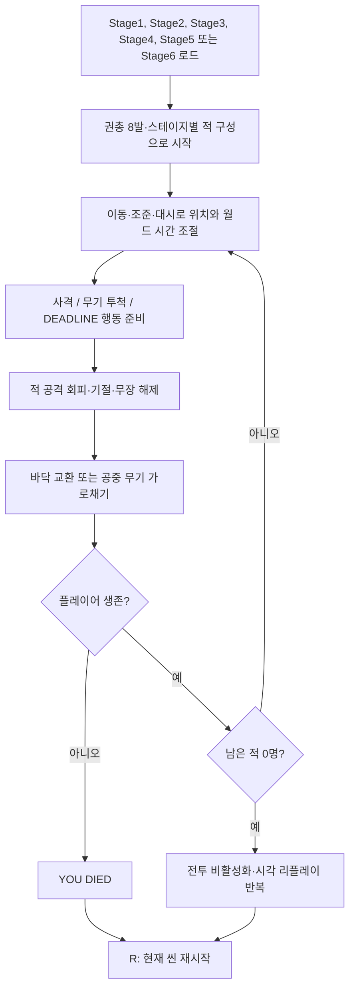
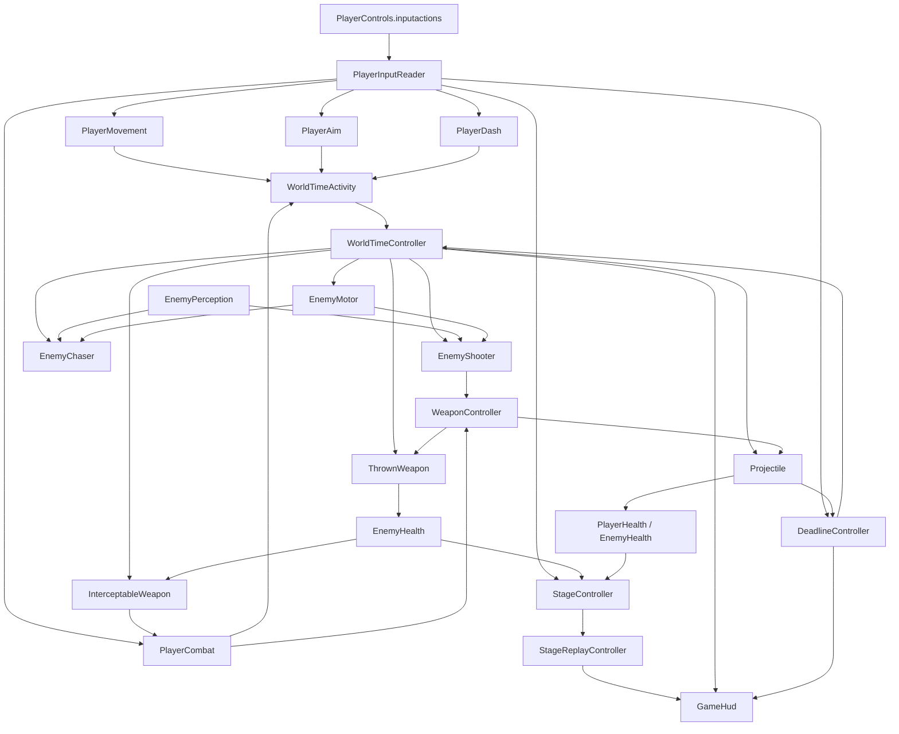

# 프로젝트 기획서

## 1. 문서 정보

| 항목 | 내용 |
|---|---|
| 프로젝트명 | Deltatime |
| 문서 작성일 | 2026-07-30 (KST) |
| 마지막 분석일 | 2026-08-08 (KST) |
| 문서 버전 | 1.5.7 |
| 현재 구현 상태 | 핵심 전투 루프와 단일 진행형 튜토리얼이 구현된 3D 프로토타입. 튜토리얼은 이동/월드 시간, 조준/대시, 근접 공격, 권총 사격, 투척 기절·무장 해제·드롭, 4인 포위 `DEADLINE` 탈출을 순서대로 가르치고 Stage1로 자동 전환한다. 본편은 플레이어 현재 높이 수평 평면 조준점과 총구 기준 수평 발사, 결정적 원형 콘 탄도 산포, 샷건 플레이어 반동·14m 최대 사거리, 권총·자동소총·샷건·근접 무기, 적 재무장, 공중 무기 가로채기, 독립 Stage1~Stage6를 포함한다. |

### 1.1 분석 기준과 범위

- 이 문서의 경로는 저장소 루트 `C:\Users\HuiYong\UnityProjects\ProjectDeltatime`를 기준으로 적는다.
- 실제 Unity 프로젝트 루트는 저장소 안의 `ProjectDeltatime/`이다. 따라서 Unity의 `Assets`, `Packages`, `ProjectSettings`는 각각 `ProjectDeltatime/Assets`, `ProjectDeltatime/Packages`, `ProjectDeltatime/ProjectSettings`에 있다.
- 확정된 내용은 현재 파일, 직렬화된 씬/프리팹/데이터, 프로젝트 설정, Git 상태에서 직접 확인한 사실만 사용했다.
- 의도나 장르처럼 파일만으로 확정할 수 없는 내용에는 **추정**을 표시했다.
- 2026-08-05 Stage3·Stage4·Stage5 구현은 각각 새 씬·전용 NavMesh·에디터 빌더·스모크 테스트·빌드 설정·문서를 함께 갱신한 작업 트리를 기준으로 기록한다. Stage5는 Stage3/Stage4 환경을 복제하지 않고 공식 `Demo_DiveBar_01`의 환경을 씬 저장 API로 복제한 뒤 Stage4의 검증된 게임플레이 루트만 Additive 이동한다.
- 2026-08-06 Stage6 `Neon Overlook`은 공식 `Demo_RooftopBar_01`을 씬 저장 API로 복제한 뒤 Stage5의 검증된 게임플레이 루트만 Additive 이동한 독립 씬이다. Stage4의 수제 7×7 단층 옥상을 재사용하지 않고 공식 데모의 `Scene`, `Roof_Layer`, `Roof_Layer_02`, 도시 배경, 바·라운지·난간·통로, URP 조명·안개·반사 프로브를 보존한다.
- 2026-08-07 Stage6 카메라는 Stage5와 같은 근접 구도로 통일했다. 실제 직렬화 값은 오프셋 `(0, 11.12, -6.10)`, 포커스 `(0, 0, 1.42)`, 조준 선행 `1.25`, FOV `48`이며, 주 연결 전투 NavMesh의 XZ 경계를 선택형 화면 경계로 사용한다. 카메라는 플레이어의 NavMesh 고도를 함께 따라가며, 경계 정적·플레이 모드 검증은 16:9에서 네 방향의 전투 NavMesh 경계와 플레이어 viewport 잔존을 검사한다.
- 2026-08-06 Stage6에는 저장된 공식 Rooftop 데모 계층을 바꾸지 않는 런타임 전용 성능 예산을 추가했다. `Stage6PerformanceController`는 실행 중에만 그림자 거리 40m, 최대 2 cascade, Medium 이하 해상도를 적용하고 종료 시 기존 `QualitySettings` 값을 복원한다. `BackgroundCity`와 그 자식 `Background_FX`/`Background_Planes`는 계속 렌더링하지만 그림자 투사·수신을 끄며, 환경 포인트 라이트는 색·강도·범위·활성 상태를 유지한 채 원래 그림자가 있던 가장 가까운 최대 2개에만 0.25초마다 그림자를 남긴다. 플레이어 시야 Spot/근거리 Point Soft Shadow 2개, 반사 프로브·Global Volume·Fog·Skybox·공식 다층 옥상 Renderer는 유지한다.
- Stage6의 `StageReplayController`만 직렬화된 `Systems`, Player, 적 5, Pickup 2의 9개 동적 루트를 20Hz에 탐색하고, 루트 밖 투사체·투척 무기·드롭 픽업은 0.25초 fallback 전수 탐색으로 등록한다. 기본값은 전체 Renderer를 매 샘플 탐색하므로 Stage1~Stage5의 동작은 바꾸지 않는다.
- 2026-08-07 Stage5 카메라는 실제 NavMesh 깊이에서 높이 `11.44`, 후방 거리 `6.29`, 전방 포커스 `1.46`, FOV `48`, 약 60도 하향각을 유도한다. 현재 화면비의 네 viewport 모서리를 지면에 투영해 정확한 NavMesh XZ AABB 안으로 포커스를 제한하며, 화면이 맵보다 넓은 축은 중앙에 고정한다. 플레이어·원거리 적·추적형 적의 바닥 표시는 Stage5 전용 `Unlit/Color` 머티리얼을 사용해 조명·그림자·라이트/반사 프로브 영향을 받지 않고 일반 깊이 판정으로 벽·가구에는 가려진다. 이 설정은 **구현 완료**이며 Stage6 재생성 시 카메라 경계와 Stage5 전용 표시 상태를 명시적으로 해제·복원한다.
- 2026-08-07 Stage5·Stage6의 플레이어와 적은 선택형 `NavMeshGroundMovement`를 통해 NavMesh의 XZ 이동 결과와 높이(Y)를 함께 적용한다. 두 스테이지 빌더는 NavMesh를 베이크한 뒤 실제 계단·스텝 콜라이더를 런타임 이동 차단에서만 제외하고, 플레이어 1명과 적 5명에 중력 Off·Y 고정 해제·보정 컴포넌트를 설정한다. Stage5 남쪽 컷어웨이는 외벽 외에 카메라와 플레이어 사이를 실제로 가리는 전경 테이블·의자·소품 Renderer만 상황에 따라 `ShadowsOnly`로 전환하며 Collider와 Layer 8 `VisionObstacle`은 보존한다. Stage6 `Background_FX`의 화면 밖 `FX_Background_Cars_01` 8개는 복제 씬에서 비활성화한다. 모두 **구현 완료**다.
- 2026-08-07 `NavMeshGroundMovement`는 처음 유효한 NavMesh 샘플에서 각 Rigidbody 루트와 바닥 표면의 Y 간격을 런타임에 저장해 일반 이동·대시·적 추격의 목표 루트 높이에 더한다. 따라서 NavMesh 표면 Y를 캡슐 중심 Y로 직접 적용해 바닥에 관통시키지 않는다. 비활성화/재활성화하면 간격을 다시 캡처한다. `TryProjectDisplacement`는 도구·검증용 바닥 표면 좌표 의미를 유지하고, `TryProjectRigidbodyDisplacement`는 보정된 Rigidbody 루트 목표를 제공한다. Stage5·Stage6 스모크는 이 목표 간격과 실제 물리 프레임 뒤 캡슐 하단의 바닥 비관통을 검사해 **구현 완료** 상태다. 근거: `ProjectDeltatime/Assets/_Project/Scripts/Level/NavMeshGroundMovement.cs`, `ProjectDeltatime/Assets/_Project/Scripts/Editor/Stage5PlayModeSmokeTest.cs`, `ProjectDeltatime/Assets/_Project/Scripts/Editor/Stage6PlayModeSmokeTest.cs`.
- 2026-08-08 Stage5·Stage6 NavMesh 베이크는 바닥·의도된 계단/스텝을 유지하되, 테이블·의자·스툴·소파·부스·바/카운터·냉장고·선반·캐비닛·책상·화분·기둥·소품처럼 보행 상면을 만들 수 있는 활성 가구 Collider 소스에는 베이크 동안만 `NavMeshModifier`의 `Not Walkable` 영역을 적용한다. Modifier는 베이크 직후 제거하므로 환경 Physics Collider와 Layer 8 `VisionObstacle` 구성은 유지된다. Stage5·Stage6 정적·PlayMode 검증은 대상 가구 Collider 상단 중심에 NavMesh가 남지 않는지 확인한다. Stage6은 가구 회피 후에도 카메라 프레임에 남는 외곽 3m 내측 후보에 플레이어를 배치하며, `TopDownCameraController`는 Y 범위가 1m 이상인 다층 NavMesh에서 현재 포커스 고도로 화면 발자국을 계산한다. 모두 **구현 완료**이며 실제 장시간 수동 조작 감각은 **확인 불가**다. 근거: `ProjectDeltatime/Assets/_Project/Scripts/Editor/Stage5SceneBuilder.cs`, `ProjectDeltatime/Assets/_Project/Scripts/Editor/Stage6SceneBuilder.cs`, `ProjectDeltatime/Assets/_Project/Scripts/Editor/Stage5PlayModeSmokeTest.cs`, `ProjectDeltatime/Assets/_Project/Scripts/Editor/Stage6PlayModeSmokeTest.cs`, `ProjectDeltatime/Assets/_Project/Scripts/Player/TopDownCameraController.cs`.
- 2026-08-08 플레이어 조준은 더 이상 카메라와 조준 평면 사이의 Physics Collider를 Raycast하지 않는다. `PlayerAim`은 카메라 포인터 광선을 플레이어 Rigidbody의 현재 Y 높이 수평 평면에 직접 투영한다. 따라서 Stage5 남쪽 컷어웨이가 시각적으로 숨긴 전경 가구·외벽의 Collider와 Layer 8 `VisionObstacle`은 충돌·적 시야용으로 유지하면서도 플레이어 회전을 꺾지 않는다. 실제 투사체의 충돌 판정은 기존 투사체 Raycast를 계속 사용한다. Stage5 PlayMode 스모크는 카메라 광선을 가로막는 임시 Collider가 있어도 조준점이 배우 높이 평면에 남는지 검사한다. **구현 완료**, 실제 마우스 조작 감각은 **확인 불가**다. 근거: `ProjectDeltatime/Assets/_Project/Scripts/Player/PlayerAim.cs`, `ProjectDeltatime/Assets/_Project/Scripts/Editor/Stage5PlayModeSmokeTest.cs`, `ProjectDeltatime/Assets/_Project/Scripts/Level/Stage5SouthExteriorCutaway.cs`.
- 2026-08-08 `Tutorial`은 Stage1의 검증된 플레이어·전투·시간 시스템을 기반으로 별도 직선형 학습 공간과 전용 `TutorialNavigation.asset`을 가진 빌드 인덱스 0 씬이다. `TutorialDirector`가 실제 행동 결과를 확인해 7단계를 순차 해제하며, 마지막에는 비활성 상태로 대기하던 적 4명을 사방에 배치하고 Q `DEADLINE`, 준비 행동 2개, 이동 해제를 성공해야 북쪽 출구를 연다. 실패 시 적·플레이어 위치와 충전을 복구하며, 탈출 후 2초 뒤 Stage1을 로드한다. 본편 전멸 리플레이가 자체 완료 조건을 가로채지 않도록 `StageController`와 레거시 `GameHud`는 제거하고 `VisionCone` 의존성용 `StageReplayController`만 보존한다. 사망 시 R로 Tutorial을 재시작하되, DEADLINE 포위전에서 사망한 경우에는 새 씬에서 체력·적 4명·권총 최대 탄약·DEADLINE 충전·닫힌 출구를 복원한 DEADLINE 체크포인트부터 시작한다. `Time.timeScale`은 변경하지 않고 월드 연출은 `WorldDeltaTime`을 사용한다. **구현 완료**, 실제 키보드/마우스의 전체 1회차 난이도와 문구 가독성은 **확인 불가**다. 근거: `ProjectDeltatime/Assets/_Project/Scenes/Tutorial.unity`, `ProjectDeltatime/Assets/_Project/Scenes/TutorialNavigation.asset`, `ProjectDeltatime/Assets/_Project/Scripts/Tutorial/TutorialDirector.cs`, `ProjectDeltatime/Assets/_Project/Scripts/Editor/TutorialSceneBuilder.cs`, `ProjectDeltatime/Assets/_Project/Scripts/Editor/TutorialPlayModeSmokeTest.cs`.
- 2026-08-08 Tutorial 대시 출구는 조준 회전 요구치를 만족한 뒤 발생한 `PlayerDash.IsDashing`을 기록하고, 이후 실제 플레이어가 출구 트리거를 통과하면 통과시킨다. 따라서 0.16초 대시가 트리거 진입 직전에 끝나는 프레임 경계가 진행을 막지 않는다. Pistol 지급기는 활성화 호출에서 즉시 Pistol 픽업을 생성하고 HUD 진행 문구에 `Pistol 생성됨`/`Pistol 장비 완료` 상태를 표시한다. **구현 완료**. PlayMode 스모크는 즉시 생성된 Pistol 픽업의 정의를 검사한다. 실제 수동 대시·지급 위치 체감은 **미실행**이다. 근거: `ProjectDeltatime/Assets/_Project/Scripts/Tutorial/TutorialDirector.cs`, `ProjectDeltatime/Assets/_Project/Scripts/Tutorial/TutorialWeaponDispenser.cs`, `ProjectDeltatime/Assets/_Project/Scripts/Editor/TutorialPlayModeSmokeTest.cs`.
- 2026-08-08 `TutorialGate`는 외부 `TutorialDirector`가 상태를 먼저 적용하더라도 최초 `SetOpen` 호출에서 원래 로컬 좌표를 보존한다. 이로써 실행 순서에 따라 여섯 게이트가 통로 중앙에 겹쳐 Pistol 경로를 막던 문제를 방지한다. `TutorialPlayModeSmokeTest`는 실행 직후 여섯 게이트의 Z 좌표(`-25`, `-13`, `-1`, `13`, `34`, `57`)와 열린 Gate 6의 Renderer 소거를 검사한다. **구현 완료**, 최신 Tutorial 빌드·PlayMode 스모크가 이 검사를 **통과**했으며 실제 수동 동선 체감은 **확인 불가**다. 근거: `ProjectDeltatime/Assets/_Project/Scripts/Tutorial/TutorialGate.cs`, `ProjectDeltatime/Assets/_Project/Scripts/Editor/TutorialPlayModeSmokeTest.cs`.
- 2026-08-08 Tutorial 게이트는 Collider를 즉시 해제하고, 상승 애니메이션이 끝나면 Renderer도 비활성화해 화면에서 사라진다. 투척 수업 적은 `TutorialDirector`가 피해를 비활성화하므로 LMB Pistol 사격으로 죽지 않으며, 기절·드롭·무장 해제를 모두 확인한 즉시 Gate 5 - Arena Entrance를 연다. 따라서 Gate 5 너머 Pistol을 가져와야 Gate 5가 열리던 순환 진행 조건이 없다. **구현 완료**, 최신 Tutorial 빌드·PlayMode 스모크가 사살 방지와 Gate 5 개방을 **통과**했으며 실제 RMB 투척 입력 체감은 **확인 불가**다. 근거: `ProjectDeltatime/Assets/_Project/Scripts/Tutorial/TutorialGate.cs`, `ProjectDeltatime/Assets/_Project/Scripts/Enemies/EnemyHealth.cs`, `ProjectDeltatime/Assets/_Project/Scripts/Tutorial/TutorialDirector.cs`, `ProjectDeltatime/Assets/_Project/Scripts/Editor/TutorialPlayModeSmokeTest.cs`.
- 2026-08-08 Tutorial의 DEADLINE 포위전에서 사망한 뒤 R을 누르면, 씬을 새로 로드한 다음 `TutorialDirector`가 DEADLINE 체크포인트를 소비해 전투 단계로 즉시 복귀한다. 새 시도는 플레이어의 기본 체력, 적 4명의 원래 위치, 최대 탄약 Pistol, 최대 `DEADLINE` 충전, 닫힌 출구 게이트를 사용한다. 일반 튜토리얼 구간 사망과 생존 중 R은 기존처럼 처음부터 다시 시작한다. HUD는 DEADLINE 사망 시 전용 재시작 문구를 표시한다. PlayMode 스모크는 권총을 비운 상태에서 체크포인트 복구를 호출해 단계·출구·위치·최대 탄약·충전을 확인했고 **통과**했다. 실제 사망→R 입력→씬 재로드 경로의 수동 체감은 **미실행**이므로 **확인 불가**다. 근거: `ProjectDeltatime/Assets/_Project/Scripts/Tutorial/TutorialDirector.cs`, `ProjectDeltatime/Assets/_Project/Scripts/Editor/TutorialPlayModeSmokeTest.cs`.
- 2026-08-08 Tutorial의 투척 수업은 적의 기절·무장 해제·공중 드롭을 확인한 뒤, 플레이어가 그 공중 무기를 E로 잡아 현재 무기를 확보하면 즉시 `DeadlineApproach`로 진행한다. 따라서 DEADLINE 앞의 별도 Pistol 지급기를 추가로 잡을 필요가 없으며, 놓쳤을 때만 기존 지급기가 보조 수단으로 남는다. Tutorial 전용 `VisionCone`은 무제한 시야 모드로 동작해 시야각·거리·장애물에 따른 적 숨김을 적용하지 않고, 시야 부채꼴 오버레이와 런타임 시야 조명도 생성하지 않는다. **구현 완료**, 최신 PlayMode 스모크가 실제 공중 무기 회수와 제한 밖 점의 가시성 판정을 **통과**했다. 실제 E 입력 가로채기와 전체 공간의 시각 체감은 **미실행**이므로 **확인 불가**다. 근거: `ProjectDeltatime/Assets/_Project/Scripts/Tutorial/TutorialDirector.cs`, `ProjectDeltatime/Assets/_Project/Scripts/Vision/VisionCone.cs`, `ProjectDeltatime/Assets/_Project/Scripts/Editor/TutorialSceneBuilder.cs`, `ProjectDeltatime/Assets/_Project/Scripts/Editor/TutorialPlayModeSmokeTest.cs`.
- 저장소 루트 `AGENTS.md`와 기존 기획서·변경 기록을 작업 기준으로 검토했다. `Assets/_Project/Tests` 폴더는 비어 있고 `.asmdef` 및 Unity Test Framework 테스트 어셈블리는 없다.
- 비생성 스크립트에서 `TODO`, `FIXME`, `HACK` 표식과 설명 주석은 확인되지 않았다.

### 1.2 테스트 근거의 한계

- `ProjectDeltatime/EnemyMovementSmoke.log`에는 2026-07-31에 `Prototype play-mode smoke test passed.`가 기록되어 있다.
- 커스텀 스모크 테스트는 `Stage2`를 열고 초기 플레이어/적/카메라/월드 시간, NavMeshData, 적 이동 누적 거리와 경로 획득, 근접형 추격 상태, 투척 무기 6 거리, 두 적 유형의 기절·무장 해제, 두 번의 `DEADLINE` 시네마틱 리플레이 시간축·카메라 고정·해제 후 복귀, 적 전멸 후 리플레이와 시야 조명 프록시를 검사한다.
- 기존 `PrototypePlayModeSmokeTest`는 키보드 `Q` 입력 자체와 플레이어의 공중 무기 가로채기를 직접 검증하지 않는다. 새 `TutorialPlayModeSmokeTest`는 `PlayerControls.inputactions`의 Q 바인딩을 확인하고 검증 입력으로 `DeadlineController` 발동·행동 2개 제한·이동 해제를 실행하지만, 물리 키보드 장치로 누르는 수동 조작 감각은 **확인 불가**다.
- 이번 적 무기 드롭·재무장·주먹 공격 및 플레이어 근접 전투 코드는 위 스모크 테스트보다 최신이다. Unity 6000.1.13f1 스크립트 컴파일과 `PrototypeSceneBuilder.BuildAndValidateFromCommandLine`의 씬·에셋 정적 검증은 통과했지만, 사용자 요청에 따라 플레이 테스트와 스모크 테스트는 **미실행**했으므로 실제 전투 동작은 최신 통합 결과로 확인하지 않았다.
- 2026-08-01 `DEADLINE` 실제 이동 판정 수정은 Unity 6000.1.13f1 스크립트 컴파일, `PrototypeSceneBuilder.BuildAndValidateFromCommandLine`의 Stage1/Stage2 재생성과 `ValidateSavedPrototypeRoom`의 두 저장 씬 정적 검증을 통과했다. 두 씬의 `PlayerMovement.minimumPhysicalDisplacement: 0.001`과 `DeadlineController.movement` 참조를 확인했지만, 사용자 요청에 따라 플레이 모드와 커스텀 스모크 테스트는 **미실행**했으므로 벽 접촉 중 발동 억제의 런타임 결과는 **확인 불가**다.
- 2026-08-01 리플레이 ViewCone 및 전체 시야 토글 변경은 Unity 6000.1.13f1 배치 스크립트 컴파일에서 `Tundra build success`와 종료 코드 0을 확인했다. 입력 에셋·생성 래퍼·Stage1/Stage2 직렬화는 정적으로 확인했지만, 사용자 요청에 따라 플레이 모드와 커스텀 스모크 테스트는 **미실행**했으므로 메시 경계, 조명 전환, 시야 밖 적 표시의 실제 시각 품질은 **확인 불가**다.
- 2026-08-02 ViewCone 리플레이 실시간 재계산 전환은 Unity 6000.1.13f1 배치 스크립트 컴파일에서 `Tundra build success`와 종료 코드 0을 확인했다. 정점 샘플·풀링 참조 제거와 재생용 Raycast API 연결은 정적으로 확인했지만, 사용자 요청에 따라 플레이 모드와 커스텀 스모크 테스트는 **미실행**했으므로 실제 시야 경계와 프레임 비용은 **확인 불가**다.
- 2026-08-02 `DEADLINE` 회전 중 최저 시간 배율 변경은 Unity 6000.1.13f1 배치 모드에서 스크립트 컴파일과 `PrototypeSceneBuilder.BuildAndValidateFromCommandLine`, `ValidateSavedPrototypeRoom`의 Stage1/Stage2 정적 검증을 종료 코드 0으로 완료했다. 두 씬의 `minimumTimeScale: 0.02`, `DeadlineController`·`WorldTimeController` 참조와 캐치의 `RequestHardFreeze` 경로를 정적으로 확인했지만, 사용자 요청에 따라 플레이 모드와 커스텀 스모크 테스트는 **미실행**했으므로 회전 중 위험 진행 체감과 동시 해방 결과는 **확인 불가**다.
- 2026-08-02 `DEADLINE` 씬당 충전 횟수 제한은 Unity 6000.1.13f1 배치 모드에서 스크립트 컴파일과 `PrototypeSceneBuilder.BuildAndValidateFromCommandLine`, `ValidateSavedPrototypeRoom`의 Stage1/Stage2 정적 검증을 종료 코드 0으로 완료했다. 두 씬의 `maximumCharges: 2`, `rearmWorldDuration: 0.35`, `maximumStagedActions: 2`와 필수 참조를 확인했지만, 사용자 요청에 따라 플레이 모드와 커스텀 스모크 테스트는 **미실행**했으므로 충전 차감·소진·씬 재시작 회복의 런타임 결과는 **확인 불가**다.
- 2026-08-02 Q 키 기반 `DEADLINE` 발동 전환은 Unity 6000.1.13f1 배치 모드의 스크립트 컴파일과 `PrototypeSceneBuilder.BuildAndValidateFromCommandLine`, `ValidateSavedPrototypeRoom`으로 Stage1/Stage2 정적 검증을 종료 코드 0으로 완료했다. `Deadline` 입력의 Q 바인딩, 기존 탄환·실제 이동 트리거 필드 제거, `maximumCharges: 2`, `rearmWorldDuration: 0.35`, `maximumStagedActions: 2`를 확인했으며, 사용자 요청에 따라 플레이 모드와 커스텀 스모크 테스트는 **미실행**이므로 실제 사용 감각은 **확인 불가**다.
- 2026-08-02 Deadline 전용 시네마틱 리플레이 시간축은 Unity 6000.1.13f1 배치 스크립트 컴파일의 `Tundra build success`, `BuildAndValidateFromCommandLine`, `ValidateSavedPrototypeRoom`의 Stage1/Stage2 정적 검증, `PrototypePlayModeSmokeTest`를 모두 통과했다. 스모크는 약 1초의 0.02배 Deadline을 최대 2초, 짧은 Deadline을 최소 0.8초, 해제 후 0.75 월드 초를 1.5초로 재생하는지와 카메라 고정·복귀를 확인한다. 실제 Q 조작 감각, 조준·행동 준비·이동 해제의 시각 연출과 R 재시작은 **확인 불가**다.
- 근접 무기 드롭·재획득, 시작 유형과 다른 무기 사용, 주먹 세 번 피격, 근거리 주먹 우선, 원거리 무기 탐색, 픽업 경쟁, 플레이어 근접 공격과 `DEADLINE` 해제 판정은 구현 코드와 직렬화 연결만 확인했으며 런타임 결과는 **확인 불가**다.
- 정식 Unity Test Framework 어셈블리는 없다. 튜토리얼 커스텀 스모크가 `DEADLINE` 발동/행동 준비와 투척 기절·무장 해제·드롭을 검증하지만, 실제 입력 기반 공중 가로채기는 여전히 직접 검증하지 않는다.
- 2026-08-02 자동소총 홀드 연사·샷건·빈손 플레이어 주먹 공격은 Unity 6000.1.13f1 배치 컴파일의 `Tundra build success`, `PrototypeSceneBuilder.BuildAndValidateFromCommandLine`, `ValidateSavedPrototypeRoom`의 Stage1/Stage2 정적 검증을 종료 코드 0으로 완료했다. 권총/자동소총/샷건 발사 모드와 산탄 수치, Stage1/Stage2의 무기별 픽업 프리팹 및 샷건 정의 GUID, 기존 LMB 바인딩과 생성 래퍼의 일치를 정적으로 확인했다. 플레이 모드와 `PrototypePlayModeSmokeTest`는 사용자 요청에 따라 **미실행**했으므로, 실제 자동 연사·산탄 명중·주먹 적중·`DEADLINE` 준비/해제 연계는 **확인 불가**다.
- 2026-08-02 무기별 결정적 좌우 탄도 산포는 `WeaponDefinition`의 `spreadJitterAngle`/`spreadSeed`와 공용 `WeaponController`의 발사 순번·펠릿 인덱스 기반 상태 없는 해시 계산을 정적으로 확인했다. 권총/자동소총은 각각 최대 ±1.5도(시드 101/211), 샷건은 기존 18도 대칭 팬의 각 펠릿에 최대 ±1도(시드 307)를 더한다. Unity 6000.1.13f1 배치 컴파일은 `Tundra build success`로 통과했고 `BuildAndValidateFromCommandLine`은 Stage1/Stage2 재생성과 저장 씬 검증을 종료 코드 0으로 완료했다. 샷건 에셋 GUID와 Stage1/Stage2의 픽업 프리팹 참조, 기존 LMB/`DEADLINE` 입력 분기 불변도 정적으로 확인했다. 플레이 모드와 `PrototypePlayModeSmokeTest`는 사용자 요청에 따라 **미실행**했으므로 실제 탄도 체감·명중·적 AI 점사·`DEADLINE` 준비 발사 결과는 **확인 불가**다.
- 2026-08-03 총구 기준 마우스 조준 보정은 당시 `PlayerAim`의 가장 가까운 비트리거 물리 표면 Raycast(플레이어 자신 제외)와 `PlayerCombat`의 총구→조준점 수평 방향 계산으로 구현했다. 이 조준점 Raycast 규칙은 Stage5 전경 컷어웨이 Collider 간섭을 막기 위해 2026-08-08에 플레이어 현재 높이 수평 평면 투영으로 대체됐다. 투사체 충돌 Raycast와 총구 기준 수평 발사 규칙은 유지된다. 당시 Unity 6000.1.13f1 배치 컴파일, 생성 씬 정적 검증, `PrototypePlayModeSmokeTest.RunFromCommandLine` 결과는 통과했다. 최신 실제 마우스 입력 체감은 **확인 불가**다.
- 2026-08-03 수평·수직 결정적 탄도 산포는 Unity 6000.1.13f1 배치 컴파일의 `Tundra build success`와 `PrototypeSceneBuilder.BuildAndValidateFromCommandLine`의 Stage1/Stage2 재생성·저장 씬 검증을 종료 코드 0으로 완료했다. 기존 권총·자동소총·샷건의 산포각과 시드, 픽업 GUID, LMB 바인딩과 `DEADLINE` Down 기반 준비 분기는 그대로이며, 공용 발사 경로가 수평·수직에 서로 다른 해시 채널 상수를 사용하고 Unity 전역 `Random`을 사용하지 않는 것을 정적으로 확인했다. 플레이 모드와 `PrototypePlayModeSmokeTest`는 사용자 요청에 따라 **미실행**했으므로 실제 상하 탄도 체감·명중 분포·적 자동소총 점사와 `DEADLINE` 준비 발사 결과는 **확인 불가**다.

- 2026-08-04 빈 탄약 총기 발사 시도 시간 활동은 `WeaponController.TryFire`의 기존 성공 bool과 별도 `fireAttempted` 결과를 통해 구현했다. 일반 플레이어 발사에서만 구성·참조가 유효하고 사용 간격이 지난 빈 탄약 시도에도 기존 `fireActivity: 0.9`, `fireActivityDuration: 0.16` 펄스를 적용하며, 투사체·탄약·발사 순번은 변경하지 않는다. 빈 자동소총 홀드는 무기 사용 간격마다 시도하도록 다음 사용 시각을 전진시킨다. `DEADLINE`은 기존 준비 발사 경로를 유지해 빈 탄약이면 행동을 준비하거나 슬롯을 소비하지 않는다. Unity 6000.1.13f1 배치 컴파일은 `Tundra build success`와 종료 코드 0으로 완료했지만, 정식 테스트와 실제 LMB 빈 탄약 입력을 대조하는 스모크가 없어 플레이 모드 결과는 **확인 불가**다.
- 2026-08-05 Stage3 `Afterimage Club`은 Unity 6000.1.13f1 배치 컴파일, `Stage3SceneBuilder.ValidateSavedStage3`, 기존 `PrototypeSceneBuilder.ValidateSavedPrototypeRoom`의 Stage1/Stage2 회귀 검증을 종료 코드 0으로 통과했다. `Stage3PlayModeSmokeTest`도 Stage3 활성화, 플레이어 생존·`DEADLINE` 2회, 적 3명과 모터 3개, 픽업 2개, 월드 시간·스테이지·리플레이 초기화, 전용 `Stage3Navigation.asset`, 리플레이 등록 시야 조명 2개, Synty 캐릭터 시각 4개, 플레이어·적 NavMesh 스폰을 검증해 **구현 완료** 상태다. 실제 키보드/마우스 전투, 적 전멸, 클리어 리플레이의 시각 품질과 정적 캐릭터 포즈 체감은 자동 검증 범위 밖이므로 **확인 불가**다.
- 2026-08-05 Stage4 `Last Call Rooftop`은 Unity 6000.1.13f1 배치 모드의 `Stage4SceneBuilder.BuildAndValidateFromCommandLine`과 `Stage4PlayModeSmokeTest.RunFromCommandLine`을 종료 코드 0으로 통과해 **구현 완료** 상태다. 스모크는 플레이어 생존·`DEADLINE` 2회, 원거리형 3명/근접형 2명과 모터 5개, 픽업 2개, 월드 시간·스테이지·리플레이 초기화, 전용 `Stage4Navigation.asset`, 리플레이 시야 조명 2개, Synty 시각 6개, 플레이어·적 NavMesh 스폰, 정적 환경의 리플레이 추적 제외를 확인한다. 실제 키보드/마우스 전투와 옥상 엄폐·경로·클리어 리플레이의 시각 품질은 자동 검증 범위 밖이므로 **확인 불가**다. 스모크 종료 뒤 기존 `WorldTimeVisualFeedback.OnValidate`의 Map Fill Light 생성 중 Unity 진단이 출력되었으나, 스모크의 모든 어설션은 통과했다.
- 2026-08-07 Stage5 `Undertow Dive`는 Unity 6000.1.13f1 배치 컴파일, 메인 홀 정리 구성의 `Stage5SceneBuilder.BuildAndValidateFromCommandLine` 반복 실행, `Stage5PlayModeSmokeTest.RunFromCommandLine`, Stage1~Stage4 및 Stage1~Stage5 저장 씬 회귀 검증을 종료 코드 0으로 통과해 **구현 완료** 상태다. 오른쪽 별관은 렌더러·조명·콜라이더·NavMesh에서 제외하고 테이블 7개·좌석 18개만 유지한다. 카메라 오프셋 `(0, 11.12, -6.10)`, 포커스 `(0, 0, 1.42)`, FOV `48`, 약 60도 하향각과 메인 홀 NavMesh 기반 화면 경계를 확인했고, 플레이 모드 스모크가 동·서·남·북 끝의 화면 지면 범위·플레이어 잔존과 남쪽 외벽 컷어웨이의 시각 숨김/복원·VisionObstacle 보존을 검증했다. 여섯 식별 원은 역할별 Stage5 전용 Unlit 머티리얼과 무그림자·무프로브 설정을 사용한다. 원거리형 3명/근접형 2명, 픽업 2개, `DEADLINE` 2회, 완전 경로 5/5, Synty 시각 6개, 시야 조명 2개, 정적 환경 리플레이 제외도 보존했다. 1280×720 미리보기는 직접 검토했지만 실제 키보드/마우스의 장시간 전투·모든 해상도 경계 체감은 **미실행**이므로 최종 체감은 **확인 불가**다.
- 2026-08-07 Stage6 `Neon Overlook`은 최종 `Stage6SceneBuilder.BuildAndValidateFromCommandLine`, `Stage6PlayModeSmokeTest.RunFromCommandLine`, Stage1~Stage5 읽기 전용 회귀 검증과 1280×720 미리보기 재생성을 통과해 **구현 완료** 상태다. 카메라는 Stage5형 근접 구도인 오프셋 `(0, 11.12, -6.10)`, 포커스 `(0, 0, 1.42)`, 조준 선행 `1.25`, FOV `48`, 주 연결 전투 NavMesh XZ 경계 제한을 사용하며, 실제 도달 가능한 동·서·남·북 가장자리에서 플레이어 viewport 잔존과 카메라 충돌을 검증한다. 높이차는 NavMesh 기반 Y 이동으로 처리하고, 배경 차량 `FX_Background_Cars_01` 8개는 비활성화했다. 원본 렌더러 2,081/2,081개와 최상위 프리팹 1,922/1,922개, 포인트 라이트 30개, 반사 프로브 4개, 필수 환경 계층과 RenderSettings를 보존했다. 전용 `Stage6Navigation.asset`은 정점 1,532개·인덱스 2,064개이며 주 연결 영역의 고도 범위가 약 2.08m이고 플레이어에서 적 5명까지 완전 경로 5/5를 확인했다. 실제 키보드/마우스 이동·조준·사격·픽업·투척·`DEADLINE`·클리어 리플레이 조작은 **미실행**이므로 체감과 최종 전투 품질은 **확인 불가**다.
- 2026-08-08 튜토리얼은 `TutorialSceneBuilder.BuildAndValidateFromCommandLine`의 씬·직접 참조·전용 NavMesh·Layer 8 장애물·빌드 순서 정적 검증과 `TutorialPlayModeSmokeTest.RunFromCommandLine`을 통과해 **구현 완료** 상태다. 스모크는 이동/정지 월드 배율과 `WorldDeltaTime` 회전 차이, 근접/총기 전용 표적 판정, 투척 기절·무장 해제·공중 드롭, Q 바인딩, `DEADLINE` 발동·준비 행동 2개 제한·이동 해제, 전역 `Time.timeScale == 1`을 확인한다. Stage1~Stage5 읽기 전용 회귀 검증도 통과했다. 실제 사람의 처음부터 끝까지 진행, 실패 재도전 난이도, 2초 뒤 Stage1 전환의 시각 체감은 **확인 불가**다.
- 2026-08-06 Stage6 성능 예산 코드와 자동 스모크는 **구현 완료**지만, RTX 3050 Laptop에서의 1080p 60 FPS 달성 여부는 **확인 불가**다. 최신 300프레임 배치 벤치마크는 워밍업 90프레임 뒤 GPU timing을 얻었으나 Game View 실제 해상도가 321×531으로 고정됐다. CPU 평균/p95는 40.87/77.86ms, GPU 평균/p95는 35.65/72.55ms로 이 비-1080p 샘플도 16.7ms를 넘었다. 따라서 1920×1080 Game View 또는 독립 플레이어에서 같은 시나리오를 재측정하기 전에는 60 FPS 안정화로 판정하지 않는다.

## 2. 프로젝트 개요

### 2.1 게임 장르

- **추정:** 3D 탑다운/쿼터뷰 액션 슈터 프로토타입.
- 근거: 원근 카메라가 플레이어를 위쪽에서 추적하고, `WASD` 이동·마우스 조준·발사·대시·무기 투척으로 이동 연사형 2명과 지속 추격 근접형 1명을 상대한다.
- 근거 파일: `ProjectDeltatime/Assets/_Project/Scripts/Player/TopDownCameraController.cs`, `ProjectDeltatime/Assets/_Project/Input/PlayerControls.inputactions`, `ProjectDeltatime/Assets/_Project/Scripts/Enemies/EnemyShooter.cs`, `ProjectDeltatime/Assets/_Project/Scripts/Enemies/EnemyChaser.cs`

### 2.2 핵심 콘셉트

현재 코드에서 확인되는 핵심 콘셉트는 다음과 같다.

- 플레이어가 이동하거나 조준 방향을 돌리거나 사격·투척·대시할 때 월드 시간이 빨라진다.
- 플레이어는 실제 시간 기준으로 조작되며, 적·투사체·투척 무기 등 월드 객체는 별도의 `WorldDeltaTime`으로 진행된다.
- 적은 베이크된 NavMesh 경로와 충돌 안전 캡슐 이동으로 엄폐물을 우회하며, 시작 유형과 무관하게 현재 장비에 따라 총기 거리 유지·근접 추격·빈손 주먹 및 무기 탐색을 선택한다.
- 플레이어의 시야 부채꼴 또는 주변 원형 반경 4 안에 있고 장애물에 가리지 않은 적만 렌더링된다. 여섯 스테이지 모두 같은 반경을 밝히는 원형 Point Light를 사용하며, 어두운 Stage2·Stage3·Stage4·Stage5·Stage6에서는 부채꼴 손전등과 함께 가시성을 보조한다.
- `Q` 키를 누르면 탄환·이동 상태와 무관하게 `DEADLINE` 하드 프리즈가 발동하며 씬당 최대 2회 사용한다. 마우스를 멈추면 월드는 완전히 정지하고, 정지 중 마우스 회전은 최저 월드 배율로만 진행된다. 최대 2개의 사격·근접 공격·투척 행동을 준비한 뒤 이동으로 동시에 해제한다.
- 무기는 종류에 따라 발사하거나 근접 공격에 사용하며, 던져 모든 적을 기절·무장 해제하거나, 플레이어와 적이 바닥 무기를 확보하고, 적에게서 날아온 무기를 플레이어가 공중에서 가로챌 수 있다.
- 모든 적을 제거하면 실시간 시뮬레이션을 멈추고 기록된 시각 상태를 하이브리드 시간축으로 반복 재생한다. 일반 구간은 1.00배 월드 시간, `DEADLINE`은 현실 시간 기반 시네마틱 구간과 해제 후 0.50배 후속 구간으로 표시한다.
- Stage3는 중앙 댄스 플로어의 개방 시야, 서쪽 바의 긴 교전선, 동쪽 라운지의 분절 엄폐를 결합해 제한 시야·월드 시간·대시·무기 투척을 서로 다른 거리에서 사용하도록 구성한다.
- Stage4는 옥상 가장자리의 차단 난간, 서쪽 서비스 카운터, 동쪽 소파 라운지, 북쪽 바와 중앙 테이블 엄폐를 조합해 다섯 적을 짧은 교전선과 긴 사격선에 나눠 배치한다.
- Stage5는 공식 `Demo_DiveBar_01`의 실제 바·테이블 좌석·서비스룸·기계식 황소 구역·좁은 통로를 보존하고, 연결된 실내 NavMesh 영역에 원거리형 3명과 근접형 2명을 배치해 바와 벽이 시야를 짧게 끊는 근접·중거리 교전을 만든다.
- Stage6는 공식 `Demo_RooftopBar_01`의 다층 옥상·도시 전망·긴 시야선·측면 통로를 보존하고, 같은 연결 NavMesh의 낮은 남쪽 진입부와 높은 북쪽/서쪽 사격선에 원거리형 3명과 추적형 2명을 배치한다. Stage4의 7×7 단층 모듈 옥상을 확대하거나 재배치한 씬이 아니다.

근거 파일: `ProjectDeltatime/Assets/_Project/Scripts/Time/WorldTimeController.cs`, `ProjectDeltatime/Assets/_Project/Scripts/Player/DeadlineController.cs`, `ProjectDeltatime/Assets/_Project/Scripts/Combat/InterceptableWeapon.cs`, `ProjectDeltatime/Assets/_Project/Scripts/Replay/StageReplayController.cs`

### 2.3 플레이어가 경험해야 하는 핵심 재미

- **추정:** 움직임과 조준 자체가 적과 투사체의 시간 진행량을 결정하는 데서 생기는 판단 재미.
- **추정:** 총알이 닿기 직전 멈춰 시간을 고정하고 여러 원인을 배치한 다음 한 번에 해제하는 전술적 연출.
- **추정:** 제한 탄약, 무기 투척, 적 무장 해제, 바닥 교환, 공중 가로채기를 연결하는 즉흥적 무기 순환.
- **추정:** 제한된 시야와 엄폐물 속에서 적 위치와 사격 경고선을 읽는 긴장감.
- **추정:** 스테이지 종료 후 제한 시야 리플레이와 필요할 때 전환하는 밝은 전체 시야로 플레이 결과를 다시 보는 연출적 보상.

### 2.4 예상 플레이 흐름

현재 구현 기준의 실제 흐름은 다음과 같다.

1. 빌드 인덱스 0의 `Tutorial`에서 무장 없이 시작해 이동/시간부터 `DEADLINE` 탈출까지 7단계를 수행한다.
2. 완료 출구 통과 후 2초 뒤 `Stage1`로 자동 전환하며, Stage1은 권총 8발을 장비한 상태로 시작한다.
3. 에디터/별도 로드로 `Stage2`, `Stage3`, `Stage4`, `Stage5`, `Stage6` 중 하나를 직접 시작할 수도 있다.
4. 이동·조준으로 월드 시간 속도를 조절하며 Stage1~Stage3의 세 적 또는 Stage4~Stage6의 다섯 적과 교전한다.
5. 사격, 대시, `DEADLINE`, 무기 투척·회수·교환·가로채기를 사용한다.
6. 현재 스테이지의 모든 적이 사망하면 스테이지 상태가 `Replaying`으로 바뀌고 리플레이가 반복된다. 어느 시점이든 `R`을 누르면 현재 씬을 다시 불러온다.
7. `Stage1 → Stage2 → Stage3 → Stage4 → Stage5 → Stage6` 자동 전환이나 리플레이에서 빠져나가는 흐름은 **미구현**이다.

### 2.5 현재 확인된 프로젝트 방향

- 3D 물리 기반 전투 프로토타입으로 전환된 상태다. 씬 검증 코드도 `Rigidbody2D`가 없어야 하고 원근 카메라여야 한다고 검사한다.
- Git 이력에는 `3D 프로토타입 제작`, `KillCam 구현`, `암흑시야와 Light 구현`이 기록되어 있다.
- 현재 미커밋 변경에는 기존 Stage5 작업과 Stage6 씬·전용 NavMesh·빌더·스모크·미리보기·빌드 설정·문서가 포함된다. 작업 시작 전부터 `Demo_DanceClub_01`, `Demo_DiveBar_01`, `Demo_NightClub_01`의 `LightingData.asset` 변경이 있었고 의도는 **확인 불가**이므로 Stage6 변경과 분리해 보존했다.
- `Stage1`과 `Stage2`의 게임 오브젝트 구성은 동일하고 조명 프로필만 다르다. `Stage3`, `Stage4`, `Stage5`, `Stage6`는 `PolygonNightclubs` 건축·가구·캐릭터를 사용하되 서로 다른 레이아웃과 전용 NavMesh로 콘텐츠 차이를 만들며, 여섯 씬의 자동 진행 순서는 **미구현**이다.

## 3. 현재 구현 현황

| 기능 | 상태 | 설명 | 근거 파일 | 비고 |
|---|---|---|---|---|
| 3D 플레이어 이동 | 구현 완료 | `WASD` 입력을 동적 Rigidbody의 평면 속도로 변환하고 마지막 물리 스텝의 입력 방향 실제 변위를 공개하며 충돌과 하드 프리즈를 반영 | `ProjectDeltatime/Assets/_Project/Scripts/Player/PlayerMovement.cs` | 이동 속도 6, 실제 이동 최소 변위 0.001m, 벽 접촉 시 위치 강제 이동 없음 |
| 마우스 조준 | 구현 완료 | 화면 포인터 광선을 플레이어 Rigidbody의 현재 Y 높이 수평 평면에 투영해 플레이어 회전과 조준선을 갱신한다. 카메라와 조준 평면 사이의 가구·벽·적 Collider는 조준점을 바꾸지 않으며, 투사체의 실제 충돌 Raycast는 별도로 유지한다 | `ProjectDeltatime/Assets/_Project/Scripts/Player/PlayerAim.cs`, `ProjectDeltatime/Assets/_Project/Scripts/Editor/Stage5PlayModeSmokeTest.cs` | Stage5 전경 컷어웨이의 숨은 Collider와 Layer 8 `VisionObstacle`은 보존. 실제 마우스 입력 체감은 확인 불가 |
| 대시 | 구현 완료 | 이동 방향으로 최대 3.5 거리, 0.03 스킨의 축소 캡슐 캐스트, 대시 중 무적, 0.8초 쿨다운 | `ProjectDeltatime/Assets/_Project/Scripts/Player/PlayerDash.cs` | 벽 0.01 겹침 시작 회귀 검사 포함 스모크 통과 |
| 행동량 기반 월드 시간 | 구현 완료 | 이동·조준 회전·행동 펄스를 합산해 월드 배율을 0.02~1.0으로 보간하며, 데드라인 전용 하드 프리즈 토큰은 조준 회전 중에만 최저 배율을 허용 | `ProjectDeltatime/Assets/_Project/Scripts/Time/WorldTimeController.cs` | 전역 `Time.timeScale`은 변경하지 않음 |
| `DEADLINE` | 구현 완료 | `Q` 키 Down 프레임에 탄환·이동 상태와 무관하게 하드 프리즈하고, 마우스 정지 시 0배·회전 시 최저 배율로 전환한다. 씬당 최대 2회 발동하며 사격·근접 공격·투척 중 최대 2개 행동을 준비해 이동 입력으로 해제한다 | `ProjectDeltatime/Assets/_Project/Input/PlayerControls.inputactions`, `ProjectDeltatime/Assets/_Project/Scripts/Player/DeadlineController.cs`, `ProjectDeltatime/Assets/_Project/Scripts/Time/WorldTimeController.cs`, `ProjectDeltatime/Assets/_Project/Scripts/Player/PlayerCombat.cs`, `ProjectDeltatime/Assets/_Project/Scripts/Editor/TutorialPlayModeSmokeTest.cs` | 성공 발동에서만 충전 차감, 씬 재로드 시 회복, 리플레이 중 회복 없음. Tutorial 스모크가 Q 바인딩·발동·2개 제한·이동 해제를 검증. 실제 사람 조작 감각은 확인 불가 |
| 핵심 규칙 Tutorial | 구현 완료 | 실제 결과 기반 7단계 게이트로 이동/시간, 조준/대시, 근접/Pistol, 투척 기절·무장 해제·드롭/회복, 4인 `DEADLINE` 포위 탈출을 진행하고 Stage1로 전환 | `ProjectDeltatime/Assets/_Project/Scenes/Tutorial.unity`, `ProjectDeltatime/Assets/_Project/Scripts/Tutorial`, `ProjectDeltatime/Assets/_Project/Scripts/Editor/TutorialSceneBuilder.cs` | 정적 빌드/PlayMode 스모크 통과. 실제 신규 사용자 난이도·문구 가독성은 확인 불가 |
| 총기 사격 | 구현 완료 | 권총·샷건은 LMB Down 1회에 1회 발사하고 자동소총만 LMB 홀드 중 발사 간격마다 연사한다. 플레이어 총기와 투척은 총구에서 조준점의 `x/z`로 수평 발사하며, 성공한 매 발사는 발사 순번·펠릿 인덱스·무기 시드로 결정한 독립 수평·수직 탄도 산포를 적용한다. 일반 플레이어 발사에서는 유효한 빈 탄약 시도도 같은 시간 활동 펄스를 발생시키지만 투사체·탄약·발사 순번은 변경하지 않는다 | `ProjectDeltatime/Assets/_Project/Scripts/Player/PlayerCombat.cs`, `ProjectDeltatime/Assets/_Project/Scripts/Combat/WeaponController.cs`, `ProjectDeltatime/Assets/_Project/Pistol.asset`, `ProjectDeltatime/Assets/_Project/AutomaticRifle.asset`, `ProjectDeltatime/Assets/_Project/Shotgun.asset` | 빈 자동소총 홀드도 무기 사용 간격마다만 시간 활동을 발생. `DEADLINE` 준비 발사·적 자동소총의 기존 4발 점사와 실제 조작 체감은 확인 불가 |
| 근접 무기 공격 | 구현 완료 | 전방 반각 35도·거리 1.45 안에서 시야가 확보된 가장 가까운 적대 대상 하나에 피해 3을 적용 | `ProjectDeltatime/Assets/_Project/Scripts/Combat/MeleeAttackResolver.cs`, `ProjectDeltatime/Assets/_Project/MeleeWeapon.asset` | 플레이어는 실제 시간 쿨다운, 적은 월드 시간 상태 머신 사용. 플레이 검증 미실행 |
| 빈손 플레이어 주먹 | 구현 완료 | 빈손일 때 LMB Down으로 기존 `MeleeAttackResolver`에 거리 1.2, 반각 35도, 피해 1, 사용 간격 0.6초의 근접 공격을 요청한다. `DEADLINE`에서는 기존 행동 준비·이동 해제 경로를 재사용한다 | `ProjectDeltatime/Assets/_Project/Scripts/Player/PlayerCombat.cs`, `ProjectDeltatime/Assets/_Project/Scripts/Combat/MeleeAttackResolver.cs` | 현재 적 체력 모델상 유효 피격 1회 처치. 실제 적중과 `DEADLINE` 연계는 플레이 테스트 **미실행**으로 확인 불가 |
| 투사체 충돌·피해 | 구현 완료 | SphereCast로 충돌을 찾고 적대 팩션 `IDamageable`에 피해 전달 | `ProjectDeltatime/Assets/_Project/Scripts/Combat/Projectile.cs` | 총기 피해 3은 플레이어 최대 체력과 같음 |
| 무기 투척 | 구현 완료 | 장비 무기를 던지고 적 명중 시 기절, 최대 6 거리 후 바닥 픽업으로 변환 | `ProjectDeltatime/Assets/_Project/Scripts/Combat/ThrownWeapon.cs` | 기존 스모크 테스트 범위에 포함 |
| 적 기절·무장 해제·재무장 | 구현 완료 | 모든 적이 기절 시 현재 장비와 남은 탄약을 드롭하고, 2 월드초 후 빈손 판단을 재개해 주먹 공격 또는 예약한 바닥 무기 획득을 시도 | `ProjectDeltatime/Assets/_Project/Scripts/Enemies/EnemyBehavior.cs`, `ProjectDeltatime/Assets/_Project/Scripts/Enemies/EnemyCombatant.cs`, `ProjectDeltatime/Assets/_Project/Scripts/Enemies/EnemyWeaponDrop.cs` | 재무장 후 다시 기절/사망하면 새 현재 장비를 다시 드롭. 플레이 검증 미실행 |
| 바닥 무기 획득·교환·예약 | 구현 완료 | 플레이어는 `E`로 근처 픽업을 획득/교환하며 적 예약을 무시한다. 빈손 적은 NavMesh 완전 경로가 있는 픽업을 예약해 획득 | `ProjectDeltatime/Assets/_Project/Scripts/Combat/WeaponPickup.cs`, `ProjectDeltatime/Assets/_Project/Scripts/Player/PlayerCombat.cs`, `ProjectDeltatime/Assets/_Project/Scripts/Enemies/EnemyCombatant.cs` | 여러 적의 동일 픽업 추적을 예약으로 방지. 런타임 경쟁 결과 확인 불가 |
| 적 무기 공중 드롭 | 구현 완료 | 이동 방향 또는 전방으로 현재 총기/근접 무기를 포물선 드롭하고 종류별 큐브 스케일과 착지 예측선을 표시 | `ProjectDeltatime/Assets/_Project/Scripts/Enemies/EnemyWeaponDrop.cs`, `ProjectDeltatime/Assets/_Project/Scripts/Combat/InterceptableWeapon.cs` | 모든 적에 드롭 컴포넌트가 직렬화됨. 최신 스모크 미실행 |
| 공중 무기 가로채기 | 부분 구현 | `E` 입력과 0.18초 버퍼로 반경 1.15 내 공중 무기를 장비하고 0.2초 하드 프리즈 | `ProjectDeltatime/Assets/_Project/Scripts/Player/PlayerCombat.cs` | 최신 플레이 테스트 없음 |
| 적 이동·경로 탐색 | 구현 완료 | 외부 `StageNavigation.asset`의 NavMesh 경로를 사용하고 Kinematic Rigidbody 캡슐을 `WorldDeltaTime`만큼 이동. 벽 충돌과 적 간 분리를 적용 | `ProjectDeltatime/Assets/_Project/Scripts/Enemies/EnemyMotor.cs`, `ProjectDeltatime/Assets/_Project/Scenes/StageNavigation.asset` | 런타임 동적 NavMesh 재베이크는 없음 |
| 장비 기반 공통 적 전투 AI | 구현 완료 | `EnemyCombatant`가 현재 장비에 따라 총기 거리 유지·후퇴 사격, 근접 무기 선딜 추격, 빈손 주먹/무기 탐색을 전환하며 `EnemyShooter`/`EnemyChaser`는 시작 유형 래퍼로 유지 | `ProjectDeltatime/Assets/_Project/Scripts/Enemies/EnemyCombatant.cs`, `ProjectDeltatime/Assets/_Project/Scripts/Enemies/EnemyShooter.cs`, `ProjectDeltatime/Assets/_Project/Scripts/Enemies/EnemyChaser.cs` | 시작 이동 속도는 유지하고 공격 방식은 현재 장비가 결정. 플레이 검증 미실행 |
| 플레이어/적 체력 | 부분 구현 | 플레이어는 최대 체력 3과 현재 체력, 변경 이벤트를 가지며 주먹 피해 1은 세 번 누적되어 사망한다. 적은 기존처럼 유효 피해 한 번에 사망 | `ProjectDeltatime/Assets/_Project/Scripts/Player/PlayerHealth.cs`, `ProjectDeltatime/Assets/_Project/Scripts/Enemies/EnemyHealth.cs` | 총기·근접 무기 피해 3은 플레이어 즉사 유지. 세 번 주먹 피격은 런타임 확인 불가 |
| 시야 부채꼴·암흑 시야 | 구현 완료 | 장애물 Raycast로 메시를 갱신하고, 부채꼴 또는 지면 반경 4 원형 시야 안에서 가리지 않은 적의 몸체·장착 무기를 렌더링. 런타임 손전등과 밝기 4의 원형 Point Light를 생성하며 원형광은 Soft Shadow로 벽·엄폐물에 차단되도록 구성 | `ProjectDeltatime/Assets/_Project/Scripts/Vision/VisionCone.cs`, `ProjectDeltatime/Assets/_Project/Scripts/Enemies/EnemyCombatant.cs`, 여섯 스테이지 씬 | 적 AI의 감지 여부와 플레이어 가시성은 별도. 실제 원형 경계·벽 차폐는 확인 불가 |
| 탑다운 카메라 | 구현 완료 | 원근 카메라가 플레이어와 조준 선행 지점을 부드럽게 추적한다. 선택형 화면 경계를 켜면 현재 종횡비·FOV·각도에서 네 모서리를 지면에 투영해 카메라 포커스를 XZ 범위 안으로 제한한다. Stage5·Stage6은 FOV 48도·약 60도 하향 구도와 각 전투 NavMesh 기반 경계를 적용하며, NavMesh Y 범위가 1m 이상인 다층 Stage6에서는 현재 포커스 고도로 화면 범위를 계산한다 | `ProjectDeltatime/Assets/_Project/Scripts/Player/TopDownCameraController.cs`, `ProjectDeltatime/Assets/_Project/Scripts/Editor/Stage5SceneBuilder.cs`, `ProjectDeltatime/Assets/_Project/Scripts/Editor/Stage6SceneBuilder.cs` | 활성 카메라 1대. Stage1~4의 경계 제한은 비활성 |
| 스테이지 적 등록·클리어 | 구현 완료 | 생존 적을 등록하고 0명이 되면 전투를 막고 리플레이 요청 | `ProjectDeltatime/Assets/_Project/Scripts/Level/StageController.cs` | Stage1~3은 적 3명, Stage4~Stage6은 적 5명 |
| 사망·재시작 | 구현 완료 | 플레이어 사망 시 전투를 막고 `R`로 현재 씬 재로드 | `ProjectDeltatime/Assets/_Project/Scripts/Level/StageController.cs` | 체크포인트 없음 |
| 스테이지 리플레이 | 부분 구현 | 카메라·렌더러·라인·등록 조명을 20Hz 현실 시간으로 기록하고, 일반 구간은 1.00배 월드 시간, `DEADLINE`은 0.8~2.0초 시네마틱과 해제 후 0.50배 후속 구간으로 매핑해 프록시 재생한다. ViewCone은 기록된 보간 포즈에서 매 렌더 프레임 재계산하며 `V`로 암흑/전체 시야를 전환 | `ProjectDeltatime/Assets/_Project/Scripts/Replay/StageReplayController.cs`, `ProjectDeltatime/Assets/_Project/Scripts/Vision/VisionCone.cs` | Deadline 중 카메라를 진입 포즈에 고정하고 해제 후 0.2초 동안 복귀. 종료/스킵/다음 씬 없음, 최신 수동 시각 품질·프레임 비용 확인 불가 |
| HUD | 부분 구현 | IMGUI로 적 수, 체력 `HEALTH 3/3`, 실시간, 월드 배율, 대시, `DEADLINE`, 무기, 리플레이 `VIEW DARK`/`VIEW FULL`과 조작법 표시 | `ProjectDeltatime/Assets/_Project/Scripts/UI/GameHud.cs` | 디버그 HUD, 로컬라이징/해상도 대응 없음 |
| Stage1/Stage2 콘텐츠 | 부분 구현 | 두 씬 모두 플레이어 1, 이동 연사형 2, 근접 추격형 1, 권총·샷건 픽업 2, Navigation 1을 같은 위치에 배치 | `ProjectDeltatime/Assets/_Project/Scenes/Stage1.unity`, `ProjectDeltatime/Assets/_Project/Scenes/Stage2.unity`, `ProjectDeltatime/Assets/_Project/Prefabs/PistolPickup.prefab`, `ProjectDeltatime/Assets/_Project/Prefabs/ShotgunPickup.prefab` | 조명만 밝음/어두움으로 다름 |
| Stage3 `Afterimage Club` 콘텐츠 | 구현 완료 | Synty 나이트클럽 바·DJ 부스·라운지·댄스 플로어와 캐릭터 4종, 플레이어 1, 이동 연사형 2, 근접 추격형 1, 픽업 2, 전용 Navigation을 배치 | `ProjectDeltatime/Assets/_Project/Scenes/Stage3.unity`, `ProjectDeltatime/Assets/_Project/Scenes/Stage3Navigation.asset`, `ProjectDeltatime/Assets/_Project/Scripts/Editor/Stage3SceneBuilder.cs` | 정적 검증·전용 플레이 모드 스모크 통과. 실조작/클리어 시각 품질은 확인 불가 |
| Stage4 `Last Call Rooftop` 콘텐츠 | 구현 완료 | Synty 옥상 바·난간·소파 라운지·야외 테이블·화분·화로와 캐릭터 6종, 플레이어 1, 이동 연사형 3, 근접 추격형 2, 픽업 2, 전용 Navigation을 배치 | `ProjectDeltatime/Assets/_Project/Scenes/Stage4.unity`, `ProjectDeltatime/Assets/_Project/Scenes/Stage4Navigation.asset`, `ProjectDeltatime/Assets/_Project/Scripts/Editor/Stage4SceneBuilder.cs` | 정적 검증·전용 플레이 모드 스모크 통과. 실조작/클리어 시각 품질은 확인 불가 |
| Stage5 `Undertow Dive` 콘텐츠 | 구현 완료 | 공식 `Demo_DiveBar_01` 환경의 메인 홀만 유지한다. 오른쪽 별관은 렌더러·조명·콜라이더·NavMesh에서 제외하고, 테이블 7개·좌석 18개, 가구 상면을 제외한 바닥·계단/단상 NavMesh 높이 이동, 카메라와 플레이어 사이의 전경 Renderer 컷어웨이, 가림 Collider에 영향받지 않는 플레이어 수평 평면 조준, Synty 캐릭터 6종, 플레이어 1, 원거리형 3, 근접형 2, 픽업 2를 배치한다 | `ProjectDeltatime/Assets/_Project/Scenes/Stage5.unity`, `ProjectDeltatime/Assets/_Project/Scenes/Stage5Navigation.asset`, `ProjectDeltatime/Assets/_Project/Scripts/Editor/Stage5SceneBuilder.cs`, `ProjectDeltatime/Assets/_Project/Scripts/Level/NavMeshGroundMovement.cs`, `ProjectDeltatime/Assets/_Project/Scripts/Level/Stage5SouthExteriorCutaway.cs`, `ProjectDeltatime/Assets/_Project/Scripts/Player/PlayerAim.cs` | 자동 빌더·정적 검증·전용 플레이 모드 스모크. 실조작/클리어 시각 품질은 확인 불가 |
| Stage6 `Neon Overlook` 콘텐츠 | 구현 완료 | 공식 `Demo_RooftopBar_01`의 다층 옥상·두 Roof Layer·도시 배경·바/라운지/난간/통로·URP 조명·안개·반사 프로브를 복제하고, 가구 상면을 제외한 연결 전용 NavMesh의 계단/플랫폼 높이 이동, Stage5형 카메라, 비활성 배경 차량 8개, Synty 캐릭터 6종, 플레이어 1, 원거리형 3, 추적형 2, 픽업 2를 배치한다 | `ProjectDeltatime/Assets/_Project/Scenes/Stage6.unity`, `ProjectDeltatime/Assets/_Project/Scenes/Stage6Navigation.asset`, `ProjectDeltatime/Assets/_Project/Scripts/Editor/Stage6SceneBuilder.cs`, `ProjectDeltatime/Assets/_Project/Scripts/Level/NavMeshGroundMovement.cs` | 자동 빌더·정적 검증·전용 플레이 모드 스모크·Stage1~5 회귀. 실조작/클리어 시각 품질은 확인 불가 |
| Stage6 런타임 성능 예산 | 부분 구현 | 저장 데모를 수정하지 않고 실행 중 그림자 거리 40m·최대 2 cascade·Medium 이하 해상도, `BackgroundCity` 계층 무그림자, 가까운 환경 포인트 라이트 최대 2개 그림자, Stage6 전용 리플레이 동적 루트 탐색을 적용 | `Stage6PerformanceController.cs`, `StageReplayController.cs`, `Stage6PerformanceBenchmark.cs`, `Stage6PlayModeSmokeTest.cs` | 자동 구성/스모크는 통과. 배치 Game View는 321×531로 실제 1080p가 아니며 비-1080p 300프레임도 16.7ms를 초과해 RTX 3050 1080p 60 FPS는 확인 불가 |
| 씬 전환 | 미구현 | 현재 씬 재시작 외에 다른 씬을 로드하는 코드가 없음 | `ProjectDeltatime/Assets/_Project/Scripts/Level/StageController.cs` | `Stage1 → Stage2 → Stage3 → Stage4 → Stage5 → Stage6` 흐름 필요 여부 확인 |
| 메인 메뉴·일시정지·설정 | 미구현 | 관련 씬, UI, 입력, 코드가 없음 | `ProjectDeltatime/Assets/_Project` | 계획 필요 |
| 일반 아이템·인벤토리 | 미구현 | 무기 1개 즉시 장비/교환 외 슬롯·목록·소모품 시스템 없음 | `ProjectDeltatime/Assets/_Project/Scripts/Combat/WeaponPickup.cs` | 계획 필요 |
| 퀘스트 | 미구현 | 관련 데이터와 코드가 없음 | `ProjectDeltatime/Assets/_Project` | 계획 필요 |
| 세이브/로드 | 미구현 | 런타임 저장 API와 저장 데이터가 없음 | `ProjectDeltatime/Assets/_Project/Scripts` | 계획 필요 |
| 사운드 | 미구현 | `AudioSource`, `AudioClip`, 오디오 에셋이 없고 `Audio` 폴더가 비어 있음 | `ProjectDeltatime/Assets/_Project/Audio` | 계획 필요 |
| 게임패드·리바인딩 | 미구현 | `Keyboard&Mouse` 제어 스킴만 정의 | `ProjectDeltatime/Assets/_Project/Input/PlayerControls.inputactions` | 목표 플랫폼 확인 필요 |
| 자동 테스트 | 부분 구현 | 기존 프로토타입 스모크와 Stage3·Stage4·Stage5·Stage6 전용 초기화·NavMesh 스모크가 있으나 정식 Unity Test Framework 어셈블리는 없음 | `ProjectDeltatime/Assets/_Project/Scripts/Editor/PrototypePlayModeSmokeTest.cs`, `ProjectDeltatime/Assets/_Project/Scripts/Editor/Stage3PlayModeSmokeTest.cs`, `ProjectDeltatime/Assets/_Project/Scripts/Editor/Stage4PlayModeSmokeTest.cs`, `ProjectDeltatime/Assets/_Project/Scripts/Editor/Stage5PlayModeSmokeTest.cs`, `ProjectDeltatime/Assets/_Project/Scripts/Editor/Stage6PlayModeSmokeTest.cs` | Stage3~Stage6 스모크 통과, 실입력 전투·클리어는 확인 불가 |

## 4. 핵심 게임 루프

### 4.1 게임 시작

- `EditorBuildSettings.asset`의 활성 씬 순서는 `Stage1`, `Stage2`, `Stage3`, `Stage4`, `Stage5`, `Stage6`다.
- 별도 부트스트랩이나 메인 메뉴는 없다.
- 각 씬은 플레이어 1명, 권총·샷건 픽업 각 1개, 엄폐물과 베이크된 NavMesh가 있는 전투 공간으로 시작한다. Stage1~3은 원거리형 2명·근접형 1명, Stage4~Stage6은 원거리형 3명·근접형 2명이다.
- 플레이어는 권총, 원거리형 적은 자동소총, 근접형 적은 획득·투척 가능한 `MeleeWeapon.asset`을 장비하고 시작한다.

### 4.2 플레이어의 주요 행동

- `WASD`: 이동
- 마우스 이동: 조준 및 플레이어 회전
- 마우스 왼쪽: 권총·샷건은 단발, 자동소총은 홀드 연사, 빈손은 주먹 공격
- 마우스 오른쪽: 현재 무기 투척
- `Space`: 이동 방향 대시
- `E`: 공중 무기 가로채기, 바닥 무기 획득 또는 교환
- 리플레이 중 `V`: 암흑 시야와 전체 시야 전환
- `R`: 현재 씬 재시작
- `Q` 키 Down: 탄환·이동 상태와 무관한 `DEADLINE` 진입 조건
- `DEADLINE` 중 공격/투척: 최대 2개 행동 준비. 근접 공격은 준비 시 방향과 무기 수치를 저장하고 해제 시 판정
- `DEADLINE` 중 마우스 회전: 월드 전체를 최저 배율로 진행, 마우스 정지 시 다시 완전 정지
- `DEADLINE` 중 이동: 하드 프리즈 해제 및 준비 행동 진행

### 4.3 적 또는 장애물과의 상호작용

- 총기를 장비한 적은 몸체 기준 시야선으로 플레이어를 감지하고 NavMesh로 접근/후퇴해 6~9 거리를 유지한다. 6 거리 미만에서는 플레이어를 바라본 채 70% 속도로 후퇴하며, 이동과 병행해 0.65 월드초 조준·무기별 점사·1.15 월드초 쿨다운을 진행한다.
- 근접 무기를 장비한 적은 1.45 거리 안에서 0.42 월드초 선딜 동안 플레이어를 바라보며 35% 속도로 따라붙은 후 피해 3을 주고, 플레이어가 1.9 밖으로 벗어나거나 장애물에 가려지면 공격을 취소한다.
- 빈손 적은 보이는 플레이어가 3 거리 안이면 무기 탐색보다 접근과 주먹 공격을 우선한다. 주먹은 거리 1.2, 선딜 0.35, 후딜 0.6 월드초, 피해 1이다. 그 밖에서는 0.25 월드초마다 반경 8 안에서 완전한 NavMesh 경로가 있는 바닥 무기를 예약한다.
- 빈손 적은 장전된 총기를 우선하되 총기 경로가 가장 가까운 근접 무기보다 2 이상 길면 근접 무기를 선택한다. 탄약이 없는 총기는 바닥에 내려놓고 다시 판단한다.
- 벽·엄폐물은 사선, 투사체, 대시, 시야 부채꼴, 공중 드롭의 경로를 막는다.
- 플레이어 투사체는 적을, 적 투사체는 플레이어를 공격한다. 같은 팩션과 발사 원본은 무시한다.
- 던진 무기는 적을 죽이지 않고 2 월드초 기절시키며 현재 장비를 공중으로 드롭한다. 회복한 적은 빈손 전투 또는 재무장 판단을 재개한다.

### 4.4 보상과 성장

- 적이 떨어뜨린 현재 총기 또는 근접 무기를 회수·교환·가로채는 전투 중 무기 순환이 즉시 보상으로 구현되어 있다.
- 바닥에 있는 권총 8발 픽업도 사용할 수 있다.
- 점수, 경험치, 레벨업, 영구 성장, 통화, 해금은 **미구현**이다.
- 따라서 현재 보상 구조는 전투 중 자원 순환에 한정된다.

### 4.5 실패와 재시작

- 플레이어 최대 체력은 3이다. 적 주먹은 피해 1이므로 세 번 누적 피격 시 사망하고, 총기와 근접 무기는 피해 3으로 기존 즉사를 유지한다.
- 사망하면 `StageController`가 `PlayerDead`로 바뀌고 플레이어 전투가 비활성화된다.
- HUD에 `YOU DIED`와 재시작 안내가 표시된다.
- `R`은 현재 활성 씬을 다시 로드한다.

### 4.6 게임 종료 조건

- 적 세 명을 모두 제거하면 현재 스테이지는 클리어되고 곧바로 리플레이 상태로 진입한다.
- 리플레이는 마지막 프레임을 0.65초 유지한 뒤 처음부터 반복한다.
- 명시적인 게임 완료 화면, 다음 스테이지, 타이틀 복귀, 리플레이 종료 조건은 **미구현**이다.

## 5. 주요 시스템

### 5.1 플레이어 시스템

- **시스템 목적:** 플레이어 생존, 입력, 이동, 조준, 대시, 전투 기능을 한 GameObject에 구성한다.
- **현재 동작 방식:** `Player` 오브젝트에 입력·체력·이동·조준·대시·전투·`DEADLINE`·무기 컨트롤러가 함께 붙고 직렬화 참조로 연결된다.
- **주요 클래스:** `PlayerInputReader`, `PlayerHealth`, `PlayerMovement`, `PlayerAim`, `PlayerDash`, `PlayerCombat`, `DeadlineController`, `WeaponController`
- **데이터 흐름:** 입력 리더 → 각 플레이어 행동 컴포넌트 → `WorldTimeActivity`, `WeaponController`, `WorldTimeController`
- **다른 시스템과의 의존성:** 카메라, 월드 시간, 무기 프리팹, 스테이지, HUD
- **근거 파일:** `ProjectDeltatime/Assets/_Project/Scenes/Stage1.unity`, `ProjectDeltatime/Assets/_Project/Scripts/Player`
- **개선이 필요한 부분:** 책임이 단일 Player GameObject의 직접 참조에 집중되어 있고, 플레이어 상태 전환을 통합 관리하는 상태 머신은 없다.

### 5.2 이동 및 조작

- **시스템 목적:** 키보드·마우스로 3D 평면 이동과 조준을 제공한다.
- **현재 동작 방식:** Input System의 `Gameplay` 액션 맵을 매 프레임 폴링한다. 일반 이동은 동적 Rigidbody의 `linearVelocity`로 평면 속도를 지정하고, 사망·하드 프리즈·비활성화 시 평면 속도를 0으로 만든다. 대시는 축소한 월드 캡슐을 이동 방향으로 캐스트해 시작점이 벽에 맞닿거나 0.03 이내로 겹쳐도 안전 거리까지만 `MovePosition`한다. 조준은 카메라 포인터 Ray를 플레이어 Rigidbody의 현재 Y 높이 수평 평면에 직접 투영하며, 카메라와 평면 사이의 적·벽·가구 Collider는 조준점을 바꾸지 않는다.
- **주요 클래스:** `PlayerControls`, `PlayerInputReader`, `PlayerMovement`, `PlayerAim`, `PlayerDash`
- **데이터 흐름:** `PlayerControls.inputactions` → 생성된 `PlayerControls.cs` → `PlayerInputReader` → 이동/조준/대시
- **다른 시스템과의 의존성:** 월드 활동량, 체력, 하드 프리즈, 카메라
- **근거 파일:** `ProjectDeltatime/Assets/_Project/Input/PlayerControls.inputactions`, `ProjectDeltatime/Assets/_Project/Scripts/Player`
- **개선이 필요한 부분:** 게임패드, 리바인딩, 입력 장치 변경, 일시정지 입력, UI 입력은 없다.

### 5.3 월드 시간 및 `DEADLINE`

- **시스템 목적:** 플레이어 행동량에 따라 월드 진행 속도를 조절하고, 임박한 피격 순간에 원인들을 준비할 수 있는 하드 프리즈를 제공한다.
- **현재 동작 방식:** **구현 완료**. 활동량을 0~1로 합산해 0.02~1.0 배율을 보간한다. `DEADLINE`은 플레이어가 살아 있고 전투가 활성화됐으며 충전·재사용 대기 조건을 만족할 때 `Q` 키 Down 프레임에 회전 허용 토큰 기반 하드 프리즈를 획득한다. 탄환 존재·충돌 예측·플레이어 이동·입력 해제는 발동 조건에 포함하지 않는다. 성공 발동 직후 씬당 최대 2회 충전 중 1회를 차감하며, 충전 0에서는 Q 안내를 만들지 않는다. 충전은 씬 `Awake`에서 초기화되고 리플레이의 비활성화/재활성화로는 회복하지 않는다. 데드라인 중 `WorldTimeActivity.AimTurn`이 0.0001보다 크면 `WorldTimeController.minimumTimeScale`로 월드 전체가 진행하고, 마우스 정지 시 `CurrentTimeScale`과 `WorldDeltaTime`은 0으로 돌아간다. 일반 하드 프리즈 또는 0.2초 공중 가로채기 프리즈가 겹치면 완전 정지가 우선한다. Tutorial은 실패 재시도 때만 비활성 상태에서 충전과 준비 상태를 복구한다.
- **주요 클래스:** `WorldTimeActivity`, `WorldTimeController`, `PlayerMovement`, `DeadlineController`
- **데이터 흐름:** 이동/조준/행동 펄스 → 목표 월드 배율 → `WorldDeltaTime` → 적·투사체·투척/드롭 무기. Q 입력 → `PlayerInputReader.DeadlinePressed` → `DeadlineController` → 회전 허용 하드 프리즈 토큰 → 조준 활동 여부에 따른 0 또는 최저 배율 → 준비 행동 해제
- **다른 시스템과의 의존성:** 입력, 플레이어 Rigidbody 이동, 체력, 플레이어 전투, 투사체 정적 레지스트리, HUD
- **근거 파일:** `ProjectDeltatime/Assets/_Project/Scripts/Time/WorldTimeController.cs`, `ProjectDeltatime/Assets/_Project/Scripts/Player/PlayerMovement.cs`, `ProjectDeltatime/Assets/_Project/Scripts/Player/DeadlineController.cs`, `ProjectDeltatime/Assets/_Project/Scripts/Combat/Projectile.cs`
- **개선이 필요한 부분:** Tutorial 전용 스모크는 정상 발동·행동 두 개 제한·이동 해제를 검증한다. 쿨다운, 충전 소진, 사망/대시·캐치 프리즈 중 중단 같은 본편 경계 조건은 별도 자동 테스트가 필요하다.

### 5.4 전투

- **시스템 목적:** 팩션 기반 총기·근접 공격, 투사체 충돌, 무기 투척과 `DEADLINE` 준비 공격을 제공한다.
- **현재 동작 방식:** `WeaponController`가 현재 `WeaponKind`, 탄약과 실제/월드 시간 사용 간격을 관리한다. 플레이어 총기 일반 발사·`DEADLINE` 준비 발사·투척은 총구 위치에서 `PlayerAim.AimPoint`의 `x/z`로 수평 방향을 계산한다. 총기는 성공한 매 발사 때 발사 순번을 증가시키고, `WeaponSpreadPattern`이 무기 시드·발사 순번·펠릿 인덱스 기반의 상태 없는 해시로 원형 콘 안의 펠릿 방향을 결정한 뒤 투사체를 만든다. 샷건 8펠릿은 반각 9도 안에서 면적 기준으로 원형 분포하고, 패턴 전체는 발사 순번마다 결정적으로 회전한다. `Projectile`은 매 프레임 사거리 안의 SphereCast 충돌을 먼저 처리하고, 샷건은 총구에서 14m를 이동하면 명중 효과 없이 제거한다. 사거리 0m인 무기는 공용 프리팹의 4 월드초 수명만 사용한다. `PlayerCombat`은 실제 샷건 발사와 `DEADLINE` 해제 후에만 발사 반대 방향의 0.35m 반동을 `PlayerMovement`에 대기시킨다. 근접 무기는 공통 부채꼴 판정으로 시야가 확보된 가장 가까운 적대 대상 하나를 친다. 투척 무기는 장비를 즉시 해제하고 충돌 또는 최대 거리에서 픽업으로 변환된다.
- **주요 클래스:** `WeaponController`, `WeaponSpreadPattern`, `PlayerCombat`, `PlayerMovement`, `MeleeAttackResolver`, `Projectile`, `ThrownWeapon`, `CombatQuery`, `DamageHit`, `StunHit`
- **데이터 흐름:** 입력/AI → 무기 컨트롤러 → 투사체·근접 판정 또는 투척 무기 → `IDamageable`/`IStunnable` → 체력/AI/스테이지
- **다른 시스템과의 의존성:** `WeaponDefinition`, 월드 시간, 프리팹, 팩션, 히트 플래시
- **근거 파일:** `ProjectDeltatime/Assets/_Project/Scripts/Combat`, `ProjectDeltatime/Assets/_Project/Scripts/Core`
- **개선이 필요한 부분:** 재장전·조준점/카메라 반동·연속 발사 누적 반동·명중 수치·효과음·피격 경직과 근접 공격 애니메이션이 없다. 샷건의 플레이어 이동 반동·14m 사거리는 구현 완료지만 실제 조작 기반의 거리 체감과 장거리 명중 분포는 확인 불가다.

### 5.5 적 AI

- **시스템 목적:** 공통 경로 탐색/이동 위에서 현재 장비와 상황에 따른 총기·근접 무기·주먹 전투와 재무장을 제공한다.
- **현재 동작 방식:** `EnemyPerception`이 몸체 기준 시야선과 최근 확인 위치를 관리하고 `EnemyMotor`가 베이크된 NavMesh 경로를 따라 Kinematic Rigidbody를 월드 시간으로 이동한다. `EnemyCombatant`는 공격 상태와 이동 모드를 분리하고 현재 장비로 공격 방식을 결정한다. 빈손일 때는 근거리 플레이어를 우선 주먹으로 상대하거나 경로 길이와 예약을 사용해 바닥 무기를 찾는다. `EnemyShooter`와 `EnemyChaser`는 시작 장비/속도 구분용 얇은 래퍼다.
- **주요 클래스:** `EnemyBehavior`, `EnemyCombatant`, `EnemyPerception`, `EnemyMotor`, `EnemyShooter`, `EnemyChaser`, `EnemyHealth`, `EnemyWeaponDrop`
- **데이터 흐름:** 플레이어 위치/생존 + 현재 장비 + 바닥 픽업 → 시야선/경로 길이/예약 → 월드 시간 이동/회전 → 장비별 공격. 피격/기절 → 공통 행동 중단·현재 무기 드롭 → 회복 후 빈손 판단/재무장 → 스테이지 통지
- **다른 시스템과의 의존성:** 플레이어, 월드 시간, AI Navigation, 3D 물리, 무기, 시야 부채꼴, 스테이지
- **근거 파일:** `ProjectDeltatime/Assets/_Project/Scripts/Enemies`
- **개선이 필요한 부분:** 전술적 엄폐 선택, 협동, 스폰, 난이도 변화가 없다. 플레이어 시야 밖에서도 AI 추적과 공격이 계속될 수 있으므로 의도 확인이 필요하다. 재무장과 픽업 경쟁은 플레이 테스트 미실행으로 체감·교착 여부가 확인되지 않았다.

### 5.6 체력 및 피해

- **시스템 목적:** 플레이어 누적 체력과 생존/변경/사망 이벤트, 대시 무적, 적 사망·기절을 제공한다.
- **현재 동작 방식:** 플레이어는 최대 체력 3에서 `DamageHit.Damage`를 차감하고 0에서 사망하며 대시 중 피해를 무시한다. 적은 별도 누적 HP 없이 유효 피해 한 번에 사망한다.
- **주요 클래스:** `PlayerHealth`, `EnemyHealth`, `IDamageable`, `IStunnable`
- **데이터 흐름:** 충돌 → `DamageHit`/`StunHit` → 체력 → 사망/기절 이벤트와 시각 변화
- **다른 시스템과의 의존성:** 스테이지, 적 AI, 무기 드롭, HUD, 대시
- **근거 파일:** `ProjectDeltatime/Assets/_Project/Scripts/Core/CombatContracts.cs`, `ProjectDeltatime/Assets/_Project/Scripts/Player/PlayerHealth.cs`, `ProjectDeltatime/Assets/_Project/Scripts/Enemies/EnemyHealth.cs`
- **개선이 필요한 부분:** 플레이어 체력 회복·피격 무적·체력 바 애니메이션은 없고, 적은 여전히 누적 체력을 사용하지 않는다.

### 5.7 아이템·무기·인벤토리

- **시스템 목적:** 무기 자원 순환과 즉시 장비 교환을 제공한다.
- **현재 동작 방식:** 바닥 픽업은 무기 정의와 탄약, 적 예약 소유자를 보유한다. 플레이어는 예약을 무시하고 획득/교환한다. 빈손 적은 장전된 총기를 우선하되 경로 차이가 2 이상이면 가까운 근접 무기를 선택하고 한 픽업을 예약한다. 공중 드롭은 적이 가로채지 않으며 플레이어가 잡으면 이전 무기를 바닥에 생성한다.
- **주요 클래스:** `WeaponDefinition`, `WeaponPickup`, `InterceptableWeapon`, `EnemyWeaponDrop`, `WeaponController`
- **데이터 흐름:** ScriptableObject 종류/수치 + 탄약 → 픽업/예약/공중 드롭 → 플레이어 또는 적 무기 컨트롤러 장비 → 사격/근접 공격/투척
- **다른 시스템과의 의존성:** 적 기절/사망, 플레이어 상호작용, 월드 시간, 프리팹
- **근거 파일:** `ProjectDeltatime/Assets/_Project/Pistol.asset`, `ProjectDeltatime/Assets/_Project/AutomaticRifle.asset`, `ProjectDeltatime/Assets/_Project/Shotgun.asset`, `ProjectDeltatime/Assets/_Project/MeleeWeapon.asset`, `ProjectDeltatime/Assets/_Project/Prefabs`, `ProjectDeltatime/Assets/_Project/Scripts/Combat`
- **개선이 필요한 부분:** 인벤토리 슬롯, 소모품, 드롭 테이블, 재장전은 없다.

### 5.8 스테이지 및 게임 진행 관리

- **시스템 목적:** 생존 적 수, 플레이 시간, 클리어/사망 상태, 재시작을 관리한다.
- **현재 동작 방식:** `EnemyHealth`가 활성화 시 자신을 등록하고 사망 시 제거한다. 생존 적 0명이 되면 전투를 비활성화하고 리플레이를 요청한다. `Stage1`, `Stage2`, `Stage3`, `Stage4`, `Stage5`, `Stage6`는 빌드 설정에 순서대로 등록되어 있지만 현재 씬 외의 다음 단계는 자동으로 로드하지 않는다.
- **주요 클래스:** `StageController`
- **데이터 흐름:** 적 등록/사망 → 생존 집합 → 스테이지 상태 → 플레이어 전투 및 리플레이 → HUD
- **다른 시스템과의 의존성:** 적 체력, 플레이어 체력/전투, 입력, 리플레이, SceneManager
- **근거 파일:** `ProjectDeltatime/Assets/_Project/Scripts/Level/StageController.cs`
- **개선이 필요한 부분:** `Stage1 → Stage2 → Stage3 → Stage4 → Stage5 → Stage6` 전환, 결과 화면, 스테이지 데이터, 체크포인트, 스폰 웨이브가 없다.

### 5.9 리플레이

- **시스템 목적:** 스테이지 클리어까지의 시각적 전투를 정상 월드 시간으로 재생하되, `DEADLINE`의 느린 조준·준비 구간은 읽을 수 있는 시네마틱 길이로 보존한다.
- **현재 동작 방식:** **부분 구현**. 20Hz 현실 시간 샘플마다 현실·월드 타임스탬프와 `DeadlineController.IsActive`를 함께 기록하며, Deadline 진입·해제 프레임은 즉시 추가 기록한다. 리플레이 시작 시 일반 구간은 월드 시간 차이, Deadline 활성 구간은 `현실 길이 / 0.50`을 0.8~2.0초로 제한한 길이, 해제 후 0.75 월드 초는 0.50배 길이로 프레젠테이션 시간축을 구성한다. 시각·조명·ViewCone은 프레젠테이션 시점에서 대응하는 현실 샘플 시점으로 보간한다. Deadline 중 카메라는 진입 샘플의 위치·회전·FOV·배경색으로 고정하고, 해제 후 첫 0.2초에는 기록 카메라로 보간 복귀한다. ViewCone은 위치·회전·스케일만 트랙에 저장하며, 삼각형 토폴로지는 프록시 생성 때 한 번 복제한 뒤 암흑 시야 리플레이의 매 `LateUpdate`에 기록된 보간 포즈와 정적 `VisionObstacle` Raycast로 정점·Bounds·Normals를 다시 계산한다. 적 몸체와 장착 무기는 실제 Renderer 상태와 별도로 논리적 전체 시야 가시성을 기록한다. 클리어 시 대부분의 `MonoBehaviour`를 끄고 원본을 숨긴 뒤 암흑 시야로 프록시를 반복 재생한다. 리플레이 중 `V`를 누르면 ViewCone·동적 조명 프록시를 숨기고 안개 제거, Trilight 환경광과 그림자 없는 Directional Fill Light를 적용해 시야 밖의 생존 적 몸체·장착 무기를 표시하며, 전체 시야에서는 ViewCone Raycast를 수행하지 않는다. 다시 `V`를 누르면 같은 재생 시점의 암흑 시야 메시와 조명을 즉시 복원한다.
- **주요 클래스:** `StageReplayController`
- **데이터 흐름:** 라이브 렌더러·카메라·조명·ViewCone 포즈·적 논리 가시성 → 샘플 트랙 → 클리어 요청 → 라이브 시뮬레이션 비활성화 → 프록시 재생 중 ViewCone Raycast 재계산 → `V` 입력에 따른 암흑/전체 시야 적용
- **다른 시스템과의 의존성:** 스테이지, 입력, 카메라, `VisionCone` 런타임 조명과 메시, `EnemyCombatant`, HUD, 전역 `RenderSettings`
- **근거 파일:** `ProjectDeltatime/Assets/_Project/Scripts/Replay/StageReplayController.cs`
- **개선이 필요한 부분:** ViewCone 정점 기록 메모리는 제거했지만 암흑 시야 리플레이에서는 매 렌더 프레임 97회 Raycast와 메시 Bounds/Normals 갱신이 발생한다. 일반 시각 샘플의 색상·라인 배열 할당, 기록량 상한, 매 캡처의 전체 렌더러 검색, 장시간 스테이지의 메모리·CPU 성능, 리플레이 종료/스킵, 오디오 재생은 미구현이다.

### 5.10 카메라 및 시야

- **시스템 목적:** 조준 방향을 선행하는 원근 탑다운 화면과 제한 시야를 제공한다.
- **현재 동작 방식:** 카메라는 플레이어 + 조준 방향 2.25 지점을 지수 보간으로 추적한다. `VisionCone`은 96개 구간의 동적 메시와 장애물 Raycast를 사용한다. 적은 60도·거리 12.5 부채꼴 또는 지면 반경 4 원형 시야 안에 있으면서 장애물에 가리지 않았을 때 몸체와 장착 무기가 렌더링된다. 런타임 손전등 밝기는 7.5이고, 플레이어 기준 높이 1의 원형 Point Light는 지면 반경 4가 되도록 실제 `Light.range`를 계산하며 밝기 4, `ForcePixel`, Soft Shadow 강도 0.85를 사용한다. 두 조명은 매 `LateUpdate`에 플레이어를 추적하고 리플레이에 등록된다. 리플레이 암흑 시야도 저장한 포즈와 정적 `VisionObstacle`을 사용해 같은 메시 계산을 매 프레임 수행하며, `V` 전체 시야에서는 ViewCone과 두 동적 조명을 숨기고 정적 환경 조명은 유지한다.
- **주요 클래스:** `TopDownCameraController`, `VisionCone`, `WorldTimeVisualFeedback`
- **데이터 흐름:** 플레이어 위치/조준 → 카메라 초점. 플레이어 Transform/장애물 Layer → 시야 메시·조명·적 렌더러 가시성
- **다른 시스템과의 의존성:** 입력, 적 AI 렌더러, 리플레이, `VisionObstacle` Layer
- **근거 파일:** `ProjectDeltatime/Assets/_Project/Scripts/Player/TopDownCameraController.cs`, `ProjectDeltatime/Assets/_Project/Scripts/Vision/VisionCone.cs`
- **개선이 필요한 부분:** 카메라 충돌/줌/흔들림이 없고, 시야 밖 적의 공격 가능 여부를 기획적으로 확정해야 한다.

### 5.11 UI 및 피드백

- **시스템 목적:** 프로토타입 상태와 조작법, 전투 경고를 화면에 표시한다.
- **현재 동작 방식:** 런타임 IMGUI로 텍스트 패널과 진행 막대를 직접 그린다. 월드가 느릴수록 화면에 어두운 오버레이를 적용하며, 리플레이에서는 `VIEW DARK`/`VIEW FULL` 상태와 `V Toggle Full View` 안내를 표시한다.
- **주요 클래스:** `GameHud`, `WorldTimeVisualFeedback`, `HitFlash`
- **데이터 흐름:** 스테이지/시간/대시/`DEADLINE`/무기/리플레이 상태 → HUD. 충돌 이벤트 → `HitFlash`
- **다른 시스템과의 의존성:** 거의 모든 런타임 상태 시스템
- **근거 파일:** `ProjectDeltatime/Assets/_Project/Scripts/UI/GameHud.cs`, `ProjectDeltatime/Assets/_Project/Scripts/Time/WorldTimeVisualFeedback.cs`
- **개선이 필요한 부분:** Canvas/UI Toolkit 기반 제품 UI, 해상도 대응, 색약/접근성, 로컬라이징, 입력 아이콘 전환이 없다. HUD 문자열의 `STAGE CLEAR ?? REPLAY`는 표시 문자 검토가 필요하다.

### 5.12 이벤트

- **시스템 목적:** 핵심 상태 변경을 직접 호출과 C# 이벤트로 전달한다.
- **현재 동작 방식:** 플레이어 체력 변경/사망은 `PlayerHealth.HealthChanged`/`Died`, 장비 변경은 `WeaponController.EquipmentChanged`, `DEADLINE` 해제는 `DeadlineController.Released` 이벤트를 사용한다. 적 사망과 스테이지 등록은 직접 메서드 호출이다.
- **주요 클래스:** `PlayerHealth`, `DeadlineController`, `StageController`, `PlayerCombat`
- **데이터 흐름:** 체력/`DEADLINE` → 이벤트 구독자. 적 체력 → 스테이지 직접 통지
- **다른 시스템과의 의존성:** 전투, 무기 쿨다운, 스테이지
- **근거 파일:** `ProjectDeltatime/Assets/_Project/Scripts/Player/PlayerHealth.cs`, `ProjectDeltatime/Assets/_Project/Scripts/Player/DeadlineController.cs`
- **개선이 필요한 부분:** 공통 이벤트 버스는 없으며, 직접 참조와 호출 방식이 혼재한다. 현재 규모에서는 동작하지만 시스템 확장 시 결합도 관리가 필요하다.

### 5.13 데이터 관리

- **시스템 목적:** 무기 수치와 씬/프리팹 구성을 에셋으로 직렬화한다.
- **현재 동작 방식:** 권총·자동소총·샷건·근접 무기 수치는 `WeaponDefinition` ScriptableObject에 종류별로 저장된다. 총기는 원형 콘 각도, 펠릿 반경 지터 최대각, 결정적 시드, 플레이어 반동 거리, 최대 투사체 이동 거리를 함께 저장한다. `WeaponSpreadPattern`은 다중 펠릿을 원형 콘 단면에 면적 기준으로 분포시키고, 시드·발사 순번으로 패턴 전체를 회전한다. 자동소총만 자동 발사 모드이며, 샷건은 8펠릿·총 퍼짐 18도(반각 9도)·플레이어 후방 반동 0.35m·최대 사거리 14m의 반자동 모드다. 사거리 0m는 공용 투사체 프리팹의 수명 제한만 사용한다. 적 행동 수치는 각 씬의 공통 `EnemyCombatant` 필드에 직렬화된다.
- **주요 클래스:** `WeaponDefinition`, `PrototypeSceneBuilder`
- **데이터 흐름:** `Pistol.asset`/`AutomaticRifle.asset`/`Shotgun.asset`/`MeleeWeapon.asset` → 플레이어·적 무기 컨트롤러/픽업/드롭. 에디터 빌더 상수 → 씬·프리팹·머티리얼 직렬화
- **다른 시스템과의 의존성:** 전투 전반, 콘텐츠 생성 도구
- **근거 파일:** `ProjectDeltatime/Assets/_Project/Pistol.asset`, `ProjectDeltatime/Assets/_Project/AutomaticRifle.asset`, `ProjectDeltatime/Assets/_Project/Shotgun.asset`, `ProjectDeltatime/Assets/_Project/MeleeWeapon.asset`, `ProjectDeltatime/Assets/_Project/Scripts/Combat/WeaponSpreadPattern.cs`, `ProjectDeltatime/Assets/_Project/Scripts/Editor/PrototypeSceneBuilder.cs`
- **개선이 필요한 부분:** 적/스테이지/시간/플레이어 수치용 데이터 에셋은 없고, 빌더 재실행 시 수동 씬 수정이 덮어써질 수 있다.

### 5.14 세이브/로드

- **시스템 목적:** **계획 필요**
- **현재 동작 방식:** **미구현**
- **주요 클래스:** 없음
- **데이터 흐름:** 없음
- **다른 시스템과의 의존성:** 스테이지 진행, 설정, 성장 시스템이 추가될 경우 필요
- **근거 파일:** `ProjectDeltatime/Assets/_Project/Scripts`에서 `PlayerPrefs`, 파일 저장, JSON 저장 로직 없음
- **개선이 필요한 부분:** 저장 대상, 슬롯, 버전 호환, 실패 복구 정책부터 결정해야 한다.

### 5.15 퀘스트

- **시스템 목적:** **계획 필요**
- **현재 동작 방식:** **미구현**
- **주요 클래스:** 없음
- **데이터 흐름:** 없음
- **다른 시스템과의 의존성:** 목표/진행/보상 시스템이 정해질 경우 스테이지와 UI에 의존
- **근거 파일:** `ProjectDeltatime/Assets/_Project`에 퀘스트 관련 코드·데이터 없음
- **개선이 필요한 부분:** 이 프로젝트에 퀘스트가 필요한 장르인지 먼저 확인해야 한다.

### 5.16 사운드

- **시스템 목적:** **계획 필요**
- **현재 동작 방식:** **미구현**
- **주요 클래스:** 없음
- **데이터 흐름:** 없음
- **다른 시스템과의 의존성:** 사격, 투척, 피격, 대시, `DEADLINE`, 클리어, 리플레이
- **근거 파일:** `ProjectDeltatime/Assets/_Project/Audio`가 비어 있고 코드/씬에 `AudioSource`가 없음
- **개선이 필요한 부분:** 오디오 이벤트, 믹서, 월드 시간에 따른 피치 정책, 리플레이 오디오 정책을 결정해야 한다.

## 6. 씬 및 콘텐츠 구조

### 6.1 씬 목록

| 빌드 순서 | 씬 | 역할 | 확인된 차이 | 상태 |
|---:|---|---|---|---|
| 0 | `Tutorial` | 핵심 조작과 전투 규칙의 순차 학습 공간 | 7단계 직선형 코스, 문/표적/무기 지급기, 투척 적 1명, 4인 `DEADLINE` 포위전, 전용 NavMesh | 구현 완료 |
| 1 | `Stage1` | 밝은 조명 프로필의 전투 방 | Ambient 1.0, Directional 0.9, Map Fill 1.5, 안개 35~70 | 부분 구현 |
| 2 | `Stage2` | 어두운 조명/암흑 시야 프로필의 동일 전투 방 | Ambient 0.35, Directional 0.06, Map Fill 0, 안개 19~42 | 부분 구현 |
| 3 | `Stage3` | `Afterimage Club` 나이트클럽 전투 공간 | Synty 모듈형 클럽, 마젠타·시안·바이올렛·블루 정적 포인트 조명 4개, 전용 NavMesh | 구현 완료 |
| 4 | `Stage4` | `Last Call Rooftop` 옥상 라운지 전투 공간 | Synty 옥상 바·난간·라운지·야외 테이블, 앰버·시안·마젠타·문라이트 정적 조명 4개, 전용 NavMesh | 구현 완료 |
| 5 | `Stage5` | `Undertow Dive` 다이브 바 전투 공간 | 공식 Synty 데모의 바·좌석·서비스룸·기계식 황소 구역과 URP 국소 조명·Exp2 안개, 전용 NavMesh | 구현 완료 |
| 6 | `Stage6` | `Neon Overlook` 다층 옥상 전투 공간 | 공식 Synty `Demo_RooftopBar_01`의 두 Roof Layer·도시 배경·바/라운지/난간/통로·URP 조명·안개·반사 프로브, 전용 NavMesh | 구현 완료 |

근거 파일: `ProjectDeltatime/ProjectSettings/EditorBuildSettings.asset`, `ProjectDeltatime/Assets/_Project/Scenes/Tutorial.unity`, `ProjectDeltatime/Assets/_Project/Scenes/TutorialNavigation.asset`, `ProjectDeltatime/Assets/_Project/Scenes/Stage1.unity`, `ProjectDeltatime/Assets/_Project/Scenes/Stage2.unity`, `ProjectDeltatime/Assets/_Project/Scenes/Stage3.unity`, `ProjectDeltatime/Assets/_Project/Scenes/Stage3Navigation.asset`, `ProjectDeltatime/Assets/_Project/Scenes/Stage4.unity`, `ProjectDeltatime/Assets/_Project/Scenes/Stage4Navigation.asset`, `ProjectDeltatime/Assets/_Project/Scenes/Stage5.unity`, `ProjectDeltatime/Assets/_Project/Scenes/Stage5Navigation.asset`, `ProjectDeltatime/Assets/_Project/Scenes/Stage6.unity`, `ProjectDeltatime/Assets/_Project/Scenes/Stage6Navigation.asset`

### 6.2 씬 전환 흐름

```mermaid
flowchart LR
    TU["빌드 시작: Tutorial"] --> TL["7단계 학습과 탈출"]
    TL -->|"완료 후 2초"| A["Stage1"]
    A --> B["Stage1 전투"]
    B --> C["적 전멸"]
    C --> D["Stage1 리플레이 반복"]
    B --> E["R: Stage1 재로드"]
    F["Stage2"] --> G["에디터 직접 실행 또는 별도 로드 필요"]
    G --> H["Stage2 전투"]
    H --> I["Stage2 리플레이 반복"]
    H --> J["R: Stage2 재로드"]
    D -. "자동 전환 미구현" .-> F
    K["Stage3"] --> L["에디터 직접 실행 또는 별도 로드 필요"]
    L --> M["Afterimage Club 전투"]
    M --> N["Stage3 리플레이 반복"]
    M --> O["R: Stage3 재로드"]
    I -. "자동 전환 미구현" .-> K
    P["Stage4"] --> Q["에디터 직접 실행 또는 별도 로드 필요"]
    Q --> R["Last Call Rooftop 전투"]
    R --> S["Stage4 리플레이 반복"]
    R --> T["R: Stage4 재로드"]
    N -. "자동 전환 미구현" .-> P
    U["Stage5"] --> V["에디터 직접 실행 또는 별도 로드 필요"]
    V --> W["Undertow Dive 전투"]
    W --> X["Stage5 리플레이 반복"]
    W --> Y["R: Stage5 재로드"]
    S -. "자동 전환 미구현" .-> U
    Z["Stage6"] --> AA["에디터 직접 실행 또는 별도 로드 필요"]
    AA --> AB["Neon Overlook 전투"]
    AB --> AC["Stage6 리플레이 반복"]
    AB --> AD["R: Stage6 재로드"]
    X -. "자동 전환 미구현" .-> Z
```

### 6.3 각 씬의 주요 오브젝트

일곱 씬은 공통 전투 시스템을 공유한다. Tutorial은 Stage1 시스템을 재사용하는 독립 학습 공간, Stage1/Stage2는 같은 산업 전투 방이며 Stage3, Stage4, Stage5, Stage6는 서로 다른 `PolygonNightclubs` 레이아웃과 전용 NavMesh를 사용한다.

- `Systems`: `WorldTimeActivity`, `WorldTimeController`, `StageReplayController`, `StageController`
- `Player`: 3D Rigidbody, 입력, 체력, 이동, 조준, 대시, 전투, `DEADLINE`, 무기
- `Vision Cone`: 동적 메시, 시야 머티리얼, 런타임 조명 생성
- `Main Camera`: 원근 카메라, 탑다운 추적, 월드 시간 시각 피드백. Stage5는 FOV 48도·약 60도 하향 구도와 실제 NavMesh 기반 화면 경계를 사용하고, Stage6는 기존 전방 전투 범위와 플레이어 중심 가중치에서 카메라 구도를 유도
- `Navigation`: `NavMeshSurface`와 Tutorial의 `TutorialNavigation.asset`, Stage1/Stage2의 `StageNavigation.asset`, Stage3의 `Stage3Navigation.asset`, Stage4의 `Stage4Navigation.asset`, Stage5의 `Stage5Navigation.asset`, Stage6의 `Stage6Navigation.asset` 참조
- `Tutorial Course`: 여섯 개 진행 게이트, 대시/포위전/출구 트리거, 근접·총기 전용 표적, 근접/Pistol/회복 Pistol 지급기, 투척 학습 적 1명, 마지막 포위 적 4명, 월드 시간 회전 프로브, 한국어 `TutorialHud`
- `Enemy West`, `Enemy East`: 거리 유지·4발 점사를 수행하는 이동 연사형 2명
- `Enemy Center`: 플레이어 현재 위치를 계속 따라가는 근접 추격형 1명
- `Pistol Pickup`: 탄약 8발 권총 픽업 1개
- `Shotgun Pickup`: 탄약 6발 샷건 픽업 1개. `ShotgunPickup.prefab`이 `Shotgun.asset` GUID를 직접 참조한다.
- `Industrial Room`(Stage1/Stage2): 바닥, 외벽 4개, 중앙 엄폐물 3개, 상자 더미 2개, 바닥 가이드
- `Stage3 - Afterimage Club`: 6×6 Synty 바닥 모듈, 둘레 벽, 서쪽 바, 북쪽 DJ 부스·대형 스피커, 동쪽 소파·테이블 라운지, 중앙 댄스 플로어, Layer 8 `VisionObstacle` 엄폐 콜라이더
- `Nightclub Characters`(Stage3): Party Female 01 플레이어, Bartender Male 원거리 적, Bouncer Male 근접 적, Party Male 02 원거리 적. 기존 캡슐 게임플레이 루트에 시각 프리팹을 자식으로 연결하고 원본 콜라이더와 루트 모션을 끈다.
- `Stage4 - Last Call Rooftop`: 7×7 Synty 바닥 모듈, 옥상 난간, 서쪽 서비스 카운터, 북쪽 바, 동쪽 소파 라운지, 중앙 야외 테이블·화분·화로, Layer 8 `VisionObstacle` 엄폐 콜라이더 13개
- `Rooftop Characters`(Stage4): 기존 캡슐 게임플레이 루트에 Synty 캐릭터 시각 6개를 자식으로 연결한다. 런타임 `CharacterVisualController`가 시야 가시성·피격·기절 색을 시각 자식에 반영한다.
- `Stage 5 - Undertow Dive`: 공식 `Demo_DiveBar_01`에서 복제한 `Scene`, `Roof_Layer`, `Lighting (URP)`, 반사 프로브·볼륨 계층을 기반으로 한다. 오른쪽 별관의 렌더러·조명·콜라이더를 비활성화하고 메인 홀 동쪽 경계 벽을 유지한다. 테이블 7개·좌석 18개만 활성화하며, 실제 바·벽·바닥·계단·선별 가구 콜라이더를 이동/시야 장애물로 사용하고 정적 환경은 `ReplayExcluded`로 표시한다. 남쪽 외벽은 플레이어가 NavMesh 남쪽 경계에서 3m 안쪽으로 접근할 때만 `ShadowsOnly`로 전환한다.
- `Dive Bar Character`(Stage5): 기존 Stage4 게임플레이 캡슐 6개에 서로 다른 Synty 캐릭터 시각 프리팹을 연결하고, 프리팹 콜라이더·Animator·루트 모션을 끈다. `CharacterVisualController` 피드백은 유지한다. 플레이어·원거리형·추적형 바닥 원은 역할별 Stage5 전용 `Unlit/Color` 머티리얼로 고정 색상을 표시하며 그림자·라이트 프로브·반사 프로브를 사용하지 않고 일반 깊이 판정으로 환경에 가려진다.
- `Stage 6 - Neon Overlook`: 공식 `Demo_RooftopBar_01`에서 복제한 `Scene`, `Roof_Layer`, `Roof_Layer_02`, `BackgroundCity`와 그 자식 `Background_FX`/`Background_Planes`, URP/BIRP 조명, Global Volume, 반사 프로브 계층. 다층 공식 배치와 도시 야경을 보존하고 정적 환경은 `ReplayExcluded`로 표시한다.
- `Overlook Character`(Stage6): Stage5에서 이동한 캡슐 게임플레이 루트 6개에 지정된 Synty 캐릭터 시각 프리팹을 연결한다. 프리팹 콜라이더·Rigidbody 충돌·Animator·루트 모션은 끄고 `CharacterVisualController` 피드백은 유지한다. 이동·조준·사격·피격 애니메이션은 **부분 구현**이다.
- Stage1/Stage2의 `Directional Key Light`, `Blue Bay Light`, `Red Alert Light`; Stage3의 방향/필 조명과 마젠타·시안·바이올렛·블루 포인트 조명 4개; Stage4의 앰버·시안·마젠타·문라이트 포인트/방향 조명 4개; Stage5의 데모 URP 국소 조명·Skybox·Exp2 안개; Stage6의 데모 URP 포인트 조명 30개·Skybox·안개·반사 프로브 4개와 측정된 방향광 설정
- `Debug HUD`

### 6.4 프리팹 구조

| 프리팹 | 주요 구성 | 역할 |
|---|---|---|
| `Projectile.prefab` | `LineRenderer`, `Projectile` | 팩션별 탄환 이동·충돌·트레일 |
| `WeaponPickup.prefab` | Cube, Trigger Collider, `WeaponPickup` | 바닥 무기 보관·교환 |
| `PistolPickup.prefab` | Cube, Trigger Collider, `WeaponPickup`, `Pistol.asset` 참조 | Stage1/Stage2 시작 권총 픽업 |
| `ShotgunPickup.prefab` | Cube, Trigger Collider, `WeaponPickup`, `Shotgun.asset` 참조 | Stage1/Stage2 시작 샷건 픽업 |
| `ThrownWeapon.prefab` | Cube, `LineRenderer`, `ThrownWeapon` | 플레이어 무기 투척·기절·착지 |
| `InterceptableWeapon.prefab` | Body, Trigger Sphere, Trail, Prediction, Landing Marker, `InterceptableWeapon` | 적 드롭 무기의 포물선 비행·예측·가로채기 |

근거 파일: `ProjectDeltatime/Assets/_Project/Prefabs`

### 6.5 ScriptableObject

| 에셋 | 타입 | 확인된 데이터 |
|---|---|---|
| `Pistol.asset` | `WeaponDefinition` | 반자동 총기, 탄창 8, 발사 간격 0.24초, 탄속 17, 피해 3, 1발, 총 퍼짐 0도, 결정적 원형 지터 반경 최대 1.5도(시드 101), 플레이어 반동·최대 사거리 0m, 적 점사 1발, 투사체 반경 0.08 |
| `AutomaticRifle.asset` | `WeaponDefinition` | 자동 발사 총기, 탄창 30, 발사 간격 0.12초, 탄속 16, 피해 3, 1발, 총 퍼짐 0도, 결정적 원형 지터 반경 최대 1.5도(시드 211), 플레이어 반동·최대 사거리 0m, 적 점사 4발, 투사체 반경 0.075 |
| `Shotgun.asset` | `WeaponDefinition` | 반자동 총기, 탄창 6, 발사 간격 0.75초, 탄속 16, 펠릿 피해 1, 8펠릿, 총 퍼짐 18도(반각 9도의 원형 콘), 펠릿별 반경 지터 최대 1도(시드 307), 플레이어 후방 반동 0.35m, 최대 사거리 14m, 투사체 반경 0.075 |
| `MeleeWeapon.asset` | `WeaponDefinition` | 근접, 탄약 없음, 피해 3, 거리 1.45, 정면 반각 35도, 사용 간격 0.72초 |

### 6.6 현재 확인된 콘텐츠

- 전투 레이아웃 5종: 산업 전투 방, `Afterimage Club`, `Last Call Rooftop`, `Undertow Dive`, `Neon Overlook`
- 산업 전투 방 조명 프로필 2종과 Stage3 나이트클럽·Stage4 수제 옥상 라운지·Stage5 다이브 바·Stage6 공식 다층 옥상 조명 4종
- 적 유형 2종: 이동 연사형, 지속 추격 근접형
- 무기 데이터 4종: 권총, 자동소총, 샷건, 근접 무기
- 픽업/투척/공중 드롭 표현
- `ProjectDeltatime/Assets/Synty/PolygonNightclubs`의 모듈형 건축·바·DJ·라운지·옥상 가구 프리팹과 캐릭터를 Stage3~Stage6에서 사용
- Stage3 생성 미리보기 `ProjectDeltatime/Assets/_Project/Art/Generated/Stage3Preview.png`
- Stage4 생성 미리보기 `ProjectDeltatime/Assets/_Project/Art/Generated/Stage4Preview.png`
- Stage5 생성 미리보기 `ProjectDeltatime/Assets/_Project/Art/Generated/Stage5Preview.png`
- Stage6 생성 미리보기 `ProjectDeltatime/Assets/_Project/Art/Generated/Stage6Preview.png`
- 프로토타입 머티리얼 14개, 커스텀 시야 셰이더 3개
- `VisionAlwaysVisible`, `VisionHiddenArea`, `VisionStencilWriter` 머티리얼과 셰이더는 현재 씬/프리팹에서 직접 참조되지 않는다.
- `Circle.png`, `Square.png`, `PrototypeRoom3DPreview.png`도 현재 씬/프리팹에서 직접 참조되지 않는다.

## 7. 플레이어 경험

### 7.1 조작 방법

| 입력 | 동작 | 구현 상태 |
|---|---|---|
| `W`, `A`, `S`, `D` | 이동 | 구현 완료 |
| 마우스 이동 | 지면 조준·플레이어 회전 | 구현 완료 |
| 마우스 왼쪽 | 권총·샷건 단발, 자동소총 홀드 연사, 빈손 주먹 / `DEADLINE` 중 Down 기반 공격 준비 | 구현 완료: 컴파일·씬 연결 확인, 실제 연사·산탄·주먹·`DEADLINE` 연계는 미실행으로 확인 불가 |
| 마우스 오른쪽 | 무기 투척 / `DEADLINE` 중 투척 준비 | 구현 완료 |
| `Q` | `DEADLINE` 즉시 발동 | 구현 완료: Q 바인딩, 충전·재사용 대기·하드 프리즈, 튜토리얼 발동/2개 행동/이동 해제 스모크 통과 |
| `Space` | 이동 방향 대시 | 구현 완료 |
| `E` | 공중 가로채기 또는 바닥 획득/교환 | 부분 구현: 바닥 교환은 기존 테스트 확인, 공중 가로채기는 최신 테스트 미검증 |
| `V` | 리플레이 암흑/전체 시야 토글 | 구현 완료: 입력·씬 연결·컴파일 확인, 실제 시각 품질 확인 불가 |
| `R` | 현재 씬 재시작 | 구현 완료 |

### 7.2 목표

- Tutorial의 목표는 안내된 실제 행동을 순서대로 성공하고, 마지막 4인 포위전에서 `DEADLINE`으로 원인 2개를 준비한 뒤 이동으로 실행해 북쪽 출구로 탈출하는 것이다.
- 현재 시스템이 판정하는 목표는 생존한 적 3명을 모두 제거하는 것이다.
- 내러티브 목표, 임무 텍스트, 제한 시간, 점수 목표는 없다.

### 7.3 게임 진행 방식

- 빌드는 Tutorial에서 시작한다. 각 학습은 실제 행동 결과를 확인해야 다음 게이트가 열리며, 마지막 출구 통과 후 조작을 잠그고 2초 뒤 Stage1을 로드한다.
- Tutorial 진행 순서는 이동/정지 시간 → 조준/대시 → 근접 무기 → Pistol → 투척 기절·무장 해제·드롭/재획득 → 4인 `DEADLINE` 포위전 → 탈출이다.
- 플레이어는 항상 실제 시간 기준 이동 속도를 유지한다.
- 플레이어 행동량에 따라 적과 투사체의 월드 진행 속도가 변한다.
- 탄약은 발사로 줄며 자동 재장전은 없다.
- 무기를 던지면 즉시 비무장 상태가 되고, 플레이어는 바닥 또는 공중 무기를 다시 확보해야 한다. 적도 기절에서 회복한 뒤 주먹으로 싸우거나 바닥 무기를 찾아 재무장한다.
- 적이 모두 사망하면 조작 가능한 전투 대신 암흑 시야 리플레이가 반복되며, 선택한 `V` 전체 시야 상태는 반복 구간이 바뀌어도 유지된다.

### 7.4 피드백

- 조준 방향 라인
- 적 조준 경고 라인
- 플레이어/적 탄환의 팩션별 색상 트레일
- 저속 시간에서 길어지는 투사체·투척 트레일
- 피격/기절/가로채기 위치의 `HitFlash`
- 대시 중 무적
- `DEADLINE` Q 발동 안내, 하드 프리즈, 행동 수 초과 피드백
- Tutorial 전용 한국어 단계 제목·행동 지시·실시간 진행도, 월드 배율·무기/탄약·충전 표시, 성공/재시도 안내
- 공중 무기 비행 궤적과 착지 마커
- 어두운 화면 오버레이와 시야 스폿/근거리 조명
- 클리어 후 재생 포즈와 Raycast로 ViewCone을 재계산하는 시각 리플레이와 `V` 전체 시야 전환

### 7.5 UI 정보 구조

- Tutorial은 좌측 상단에 현재 단계/전체 단계, 한국어 지시와 판정 진행도, 월드 배율·무기/탄약·`DEADLINE` 충전을 표시하며 완료 시 중앙 완료 패널을 표시한다.
- 좌측 상단 상태 패널: 적 수, 체력, 실제 플레이 시간, 월드 배율 또는 리플레이 시간과 `VIEW DARK`/`VIEW FULL`, 대시 상태, `DEADLINE` 상태, 무기/탄약 또는 근접 표시
- 화면 중앙: 사망/클리어 메시지 또는 `DEADLINE` 행동 수·해제 안내
- 화면 상단 중앙: 사용 가능할 때 `PRESS Q TO DEADLINE` 안내
- 화면 하단: 전체 키보드·마우스 조작법
- 별도 메뉴, 설정, 일시정지, 인벤토리, 결과 화면은 없다.

### 7.6 예상되는 사용자 경험

- **추정:** 플레이어는 계속 움직이면 적탄이 정상 속도에 가까워지고, 멈추거나 조준을 덜 움직이면 거의 정지한 월드를 관찰하게 된다.
- **추정:** 탄약이 부족해질수록 무기를 던져 적을 무장 해제하고 그 무기를 가로채는 행동이 핵심 생존 수단이 된다.
- Tutorial은 안전한 개별 구간에서 규칙을 보여준 뒤 적 4명이 사방을 포위한 실전형 `DEADLINE` 탈출로 학습 내용을 결합하고 Stage1로 연결한다.

### 7.7 확인되지 않은 부분

- 난이도 곡선과 플레이 시간 목표
- `Stage1`과 `Stage2`의 공식 순서 및 역할
- `DEADLINE`의 최종 현지화 명칭과 튜토리얼 문구의 사용자 테스트 결과
- 리플레이 스킵/종료 방식
- 적이 플레이어 시야 밖에서 공격하는 것이 의도인지 여부
- 최종 UI, 아트, 사운드, 내러티브 방향

## 8. 기술 구조

### 8.1 시스템 관계

### 8.2 주요 클래스와 책임

| 클래스 | 책임 |
|---|---|
| `PlayerInputReader` | Input System 액션 폴링과 1프레임 버튼 상태 제공 |
| `WorldTimeActivity` | 이동·조준·행동 펄스 활동량 보관 |
| `WorldTimeController` | 커스텀 월드 시간 계산과 하드 프리즈 토큰 관리 |
| `DeadlineController` | 임박한 투사체 탐색, 정지 트리거, 행동 준비/해제 |
| `WeaponController` | 현재 무기 종류/탄약/사용 쿨다운, 장비 변경 이벤트, 사격·즉시/준비 근접 공격·투척 |
| `MeleeAttackResolver` | 전방 부채꼴과 시야선에서 가장 가까운 적대 대상 하나 판정 |
| `Projectile` | 월드 시간 기반 이동, SphereCast 충돌, 피해와 트레일 표시 |
| `ThrownWeapon` | 기절 투척물 이동과 바닥 픽업 변환 |
| `InterceptableWeapon` | 적 드롭 무기의 포물선, 장애물, 예측, 가로채기 |
| `EnemyBehavior` | 적 유형 공통 기절·장비 해제·재무장·사망 수명주기 |
| `EnemyCombatant` | 현재 장비에 따른 총기/근접 무기/주먹 상태, 이동 모드, 무기 경로 탐색·예약 |
| `EnemyPerception` | 플레이어 거리, 시야선, 최근 확인 위치 |
| `EnemyMotor` | NavMesh 경로 계산, 월드 시간 Rigidbody 이동, 회전, 충돌, 적 간 분리 |
| `EnemyShooter` | 자동소총 시작 적을 표시하는 `EnemyCombatant` 래퍼 |
| `EnemyChaser` | 근접 무기 시작 적을 표시하는 `EnemyCombatant` 래퍼 |
| `StageController` | 적 생존 집합과 스테이지 상태 |
| `StageReplayController` | 카메라/렌더러/라인/조명 샘플 기록과 프록시 재생. `ReplayExcluded` 부모 아래 정적 렌더러는 추적에서 제외 |
| `ReplayExcluded` | 리플레이 프록시로 복제하지 않을 정적 환경 루트를 표시 |
| `CharacterVisualController` | Synty 시각 자식의 렌더러 가시성·런타임 피격/기절 색을 게임플레이 루트와 동기화 |
| `VisionCone` | 시야 메시, 가시성 판정, 런타임 시야 조명 |
| `TopDownCameraController` | 플레이어·조준 선행 추적과 씬별 포커스 오프셋 적용. 선택형 경계 제한은 현재 카메라 종횡비·FOV·각도에서 지면 viewport 범위를 계산해 XZ 포커스를 제한 |
| `NavMeshGroundMovement` | 선택 연결 시 NavMesh 경로를 짧은 구간으로 투영해 XZ와 Y를 함께 이동하고, 계단 고도 단차에서는 완전 경로의 다음 코너만 허용한다. Stage5·Stage6의 플레이어와 적에만 연결 |
| `WorldTimeVisualFeedback` | 월드 배율 기반 화면/조명 피드백. Stage5·Stage6에서는 데모 RenderSettings 보존 옵션으로 환경 조명 재설정을 생략 |
| `TutorialDirector` | 실제 이동/정지·조준·대시·공격 타입·투척 결과·장비 회복·`DEADLINE` 성공을 판정하고 게이트·적·완료 전환과 사망 후 R 재시작을 관리 |
| `TutorialHud` / `TutorialGate` / `TutorialTrigger` | 한국어 단계 HUD, 비정지 시간 기반 게이트 애니메이션, 대시·포위전·출구 진행 이벤트 제공 |
| `TutorialTargetDummy` / `TutorialWeaponDispenser` / `TutorialTimeProbe` | 근접/총기 타입별 적중 판정, 필수 장비의 복구 가능한 지급, `WorldDeltaTime` 기반 시각적 시간 비교 제공 |
| `TutorialSceneBuilder` | Stage1 공통 시스템을 기반으로 Tutorial 코스·5적·표적·게이트·전용 NavMesh·빌드 인덱스 0을 생성하고 직접 참조와 씬 정책을 검증 |
| `TutorialPlayModeSmokeTest` | 월드 배율·시간 프로브·공격 타입·투척 기절/무장 해제/드롭·Q 바인딩·`DEADLINE` 2개 행동/이동 해제·전역 시간 배율 불변을 배치 PlayMode에서 검증 |
| `PrototypeSceneBuilder` | 두 씬, NavMeshData, 프리팹, 머티리얼, 권총/자동소총/샷건/근접 무기 데이터와 무기별 시작 픽업 재생성 및 검증 |
| `Stage3SceneBuilder` | Stage1/Stage2를 재생성하지 않고 Stage3 나이트클럽 레이아웃·Synty 시각·전용 NavMesh·미리보기·빌드 설정을 생성하고 정적으로 검증 |
| `Stage3PlayModeSmokeTest` | Stage3 공통 시스템·콘텐츠 수·리플레이 시야 조명·Synty 캐릭터·NavMesh 스폰을 배치 플레이 모드에서 검증 |
| `Stage4SceneBuilder` | Stage3를 변경하지 않고 Stage2의 공통 런타임 연결을 기반으로 Stage4 옥상 레이아웃·Synty 시각·전용 NavMesh·미리보기·빌드 설정을 생성하고 정적으로 검증 |
| `Stage4PlayModeSmokeTest` | Stage4 공통 시스템·5적 구성·리플레이 제외 정적 환경·시야 조명·Synty 캐릭터·NavMesh 스폰을 배치 플레이 모드에서 검증 |
| `Stage5SceneBuilder` | 공식 `Demo_DiveBar_01`을 Stage5 사본으로 저장하고 오른쪽 별관을 제외한 메인 홀, 테이블 7개·좌석 18개, Stage4 게임플레이 루트, 전용 NavMesh·계단/단상 이동 보정·FOV 48도/60도 카메라·남쪽 및 전경 컷어웨이·역할별 Unlit 바닥 원·미리보기·빌드 설정을 생성하고 정적으로 검증 |
| `Stage5PlayModeSmokeTest` | Stage5 공통 시스템·5적 구성·전용 NavMesh 완전 경로·계단 높이 이동·별관 제외·선별 가구·리플레이 제외·Synty 시각·여섯 Unlit 바닥 원·16:9 동서남북 경계 카메라·남쪽/전경 컷어웨이와 VisionObstacle 보존을 배치 플레이 모드에서 검증 |
| `Stage6SceneBuilder` | 공식 `Demo_RooftopBar_01`을 Stage6 사본으로 저장하고 Stage5 게임플레이 루트만 Additive 이동한다. 원본 환경 계측, 콜라이더 정책, 다층 연결 NavMesh·계단/플랫폼 이동 보정·역할 기반 스폰, Stage5형 FOV 48도 카메라·화면 밖 차량 8개 비활성·viewport 검증·미리보기·빌드 설정과 Stage1~5 회귀 진입점을 생성·검증 |
| `Stage6PlayModeSmokeTest` | Stage6 공통 시스템·5적/2픽업/Deadline 2회·전용 NavMesh 완전 경로·다층 높이 이동·16:9 동서남북 카메라 경계·차량 8개 비활성·리플레이 초기화·정적 환경 제외·Overlook 시각 6개를 배치 플레이 모드에서 검증 |

### 8.3 싱글턴 사용 여부

- 전형적인 `Instance` 싱글턴은 없다.
- `Projectile`은 현재 활성 투사체를 정적 리스트로 유지하며 서브시스템 초기화 시 비운다.
- `CombatQuery`는 상태 없는 정적 유틸리티다.
- 대부분의 시스템은 씬에 존재하는 인스턴스를 직렬화 참조 또는 `Configure`로 연결한다.

### 8.4 이벤트 구조

- C# 이벤트:
  - `PlayerHealth.HealthChanged` → 체력 UI 확장 지점
  - `PlayerHealth.Died` → `StageController`
  - `WeaponController.EquipmentChanged` → `EnemyCombatant`
  - `DeadlineController.Released` → `PlayerCombat`
- 직접 호출:
  - `EnemyHealth` → `StageController.NotifyEnemyDied`
  - `StageController` → `PlayerCombat.SetCombatEnabled`, `StageReplayController.RequestReplay`
  - 전투 객체 → `IDamageable.ReceiveHit`, `IStunnable.ReceiveStun`
- `UnityEvent`와 공통 이벤트 버스는 사용하지 않는다.

### 8.5 데이터 저장 방식

- 정적 게임 데이터: `WeaponDefinition` ScriptableObject
- 콘텐츠/설정 데이터: Unity 씬, 프리팹, 머티리얼, `ProjectSettings`
- 입력 데이터: `.inputactions`와 자동 생성된 C# 래퍼
- 런타임 진행 데이터: 메모리 내 컴포넌트 필드
- 영구 저장: 없음

### 8.6 외부 패키지

| 패키지 | 버전 | 사용 확인 |
|---|---:|---|
| `com.unity.inputsystem` | 1.14.2 | 플레이어 입력에 직접 사용 |
| `com.unity.multiplayer.center` | 1.0.0 | 코드 사용은 확인되지 않음 |
| Unity 내장 모듈 | 1.0.0 | Physics, UI/IMGUI, AI 모듈 등이 manifest에 포함 |

Unity 버전: `6000.1.13f1`

### 8.7 Tags, Layers, Scenes 설정

- 사용자 정의 Tag: 없음
- 사용자 정의 Layer: 인덱스 8 `VisionObstacle`
- 씬의 Layer 사용: Tutorial은 통로 벽·게이트 등 Layer 8 `VisionObstacle` 오브젝트를 최소 10개 검증한다. Stage1/Stage2는 각각 Default 30개와 `VisionObstacle` 13개, Stage3는 Default 32개와 `VisionObstacle` 10개, Stage4는 `VisionObstacle` 13개 GameObject, Stage5는 실제 구조물에 Layer 8을 적용하며, Stage6는 벽·높은 바 카운터·대형 구조물 등 277개 유효 콜라이더를 Layer 8로 검증한다
- Sorting Layer: `Default`만 존재
- 활성 Input Handler: 새 Input System
- 레거시 `InputManager.asset`에는 기본 축 18개가 남아 있으나 런타임 입력 코드는 새 Input System을 사용한다.
- 빌드 씬: `Tutorial`, `Stage1`, `Stage2`, `Stage3`, `Stage4`, `Stage5`, `Stage6`
- 에디터 직렬화: Force Text
- 제품명/회사명: `Deltatime` / `DefaultCompany`
- 기본 화면 크기: 1920×1080, 창 크기 조절 비활성, 백그라운드 실행 비활성
- 활성 Color Space: Gamma
- 번들 버전: 1.0

근거 파일: `ProjectDeltatime/ProjectSettings/TagManager.asset`, `ProjectDeltatime/ProjectSettings/ProjectSettings.asset`, `ProjectDeltatime/ProjectSettings/EditorSettings.asset`, `ProjectDeltatime/ProjectSettings/EditorBuildSettings.asset`

### 8.8 확장 시 주의점

- 월드 객체의 시간 진행에는 `UnityEngine.Time.deltaTime` 대신 `WorldTimeController.WorldDeltaTime`을 사용해야 현재 콘셉트가 유지된다.
- 플레이어 조작은 의도적으로 `unscaledDeltaTime`을 사용한다. 신규 플레이어 행동이 월드 시간에 종속되어야 하는지는 별도 결정이 필요하다.
- `PrototypeSceneBuilder`를 재실행하면 두 씬, `StageNavigation.asset`, 핵심 프리팹/머티리얼과 권총/자동소총/근접 무기 수치를 다시 생성 또는 갱신한다. 수동 씬·NavMesh 수정과 빌더 상수의 소유권을 분리해야 한다.
- `TutorialSceneBuilder`는 Stage1을 임시 기반으로 열어 공통 시스템을 보존한 뒤 Tutorial만 저장하고 전용 `TutorialNavigation.asset`을 베이크한다. 모든 씬 빌더는 Tutorial 에셋이 존재하면 이를 빌드 인덱스 0에 보존하도록 구성했다. Tutorial의 수동 씬/NavMesh 수정은 빌더 재실행으로 덮어써질 수 있다.
- `Stage3SceneBuilder`는 Stage2를 임시 기반으로 열어 공통 시스템을 보존한 뒤 Stage3만 저장하고, 전용 `Stage3Navigation.asset`을 베이크한다. Stage1/Stage2나 공유 `StageNavigation.asset`을 재생성하지 않으므로 Stage3 변경은 이 독립 빌더에서 관리한다.
- `Stage4SceneBuilder`는 Stage3를 열거나 수정하지 않고 Stage2의 공통 런타임 연결만 임시 기반으로 사용한 뒤 Stage4만 저장하고, 전용 `Stage4Navigation.asset`을 베이크한다. Stage1/Stage2/Stage3나 기존 NavMesh 에셋을 재생성하지 않으므로 Stage4 변경은 이 독립 빌더에서 관리한다.
- `Stage5SceneBuilder`는 공식 `Demo_DiveBar_01`을 씬 저장 API로 사본 저장한 뒤 오른쪽 별관을 비활성화하고 메인 홀 가구를 테이블 7개·좌석 18개로 선별한다. 이어서 Stage4의 검증된 게임플레이 루트만 Additive 이동해 Stage5·`Stage5Navigation.asset`·Stage5 전용 바닥 원 머티리얼 3개·미리보기·빌드 설정을 관리한다. `Stage6SceneBuilder`는 Stage5 루트 이동 뒤 카메라 경계를 끄고 기존 Stage6 역할별 링 머티리얼과 Renderer 프로브·모션 설정을 명시적으로 복원한다.
- Stage5 NavMesh 재베이크에서는 오른쪽 별관보다 서쪽인 메인 홀 볼륨만 수집한다. 바닥·계단/스텝은 보행 소스로 유지하고, 보행 상면을 만들 수 있는 선별 가구 Collider에는 베이크 중에만 `Not Walkable` Modifier를 적용해 상면을 제외한다. 환경 충돌·시야 Layer와 원본 데모 프리팹 배치는 수동으로 덮어쓰지 않는다.
- `Stage6SceneBuilder`는 공식 `Demo_RooftopBar_01`을 씬 저장 API로 사본 저장한 뒤 Stage5의 검증된 게임플레이 루트만 Additive 이동한다. 원본 데모와 Stage1~5를 저장하지 않으며, Stage6·`Stage6Navigation.asset`·Stage6 전용 Volume Profile·미리보기·빌드 설정만 관리한다.
- Stage6 NavMesh 재베이크에서는 `BackgroundCity`, `Background_Planes`, `Background_FX`와 작은 병·컵·장식 충돌을 제외하고 실제 옥상 바닥·계단·통로·벽·바·대형 가구·난간 Collider를 수집한다. 이 중 보행 상면을 만들 수 있는 가구 소스에는 베이크 중에만 `Not Walkable` Modifier를 적용해 상면을 제외하고, 플레이 가능한 바닥 경계에서 볼륨을 유도해 최대 연결 영역을 선택한다.
- 적의 실제 이동량과 상태 타이머는 `WorldDeltaTime`을 사용해야 하며, NavMesh는 경로만 제공하고 Transform을 자동 이동시키지 않는다.
- 신규 가시성 장애물은 Layer 8 `VisionObstacle`에 배치해야 시야 메시와 공중 드롭 충돌 예측에 반영된다.
- 새 런타임 조명은 리플레이에 보여야 한다면 `StageReplayController.RegisterLight`로 등록해야 한다.
- 새 렌더러 타입은 현재 리플레이가 지원하는 `MeshRenderer`, `SkinnedMeshRenderer`, `LineRenderer`인지 확인해야 한다. 정적 환경은 `ReplayExcluded`로 표시할지 검토해야 한다.
- 전체 시야에서 별도 가시성 규칙이 필요한 적 시각 요소는 `EnemyCombatant.TryGetReplayVisibility`와 녹화 정책을 함께 갱신해야 하며, 경고선·일반 이펙트는 자동으로 강제 표시되지 않는다.
- 새 무기는 `WeaponDefinition`만 추가하는 것으로 끝나지 않고 투사체/투척 프리팹과 HUD 표현 호환성을 검토해야 한다.

### 8.9 기술 부채

- 작업 시작 전부터 `Demo_DanceClub_01`, `Demo_DiveBar_01`, `Demo_NightClub_01`의 `LightingData.asset`이 수정되어 있었고 의도는 **확인 불가**다. Stage6 구현은 이 사용자 변경을 복원하거나 덮어쓰지 않고 별도로 보존했다.
- 원본 `Demo_RooftopBar_01`의 `Global Volume.sharedProfile` GUID는 저장소에 해당 에셋이 없어 Missing Object Reference 상태였다. Stage6는 원본을 수정하지 않고 공식 Synty `NightClub_Overview.asset`을 `Stage6/Stage6VolumeProfile.asset`으로 복제해 Bloom/Color Adjustments 참조를 복구했다.
- 정식 테스트 어셈블리와 단위 테스트는 없다. 커스텀 Tutorial 및 Stage3~Stage6 플레이 모드 스모크는 통과했지만, 사람의 실제 마우스 클릭별 조준점·총구 탄도, 튜토리얼 전체 진행 감각, 본편 전투·클리어 같은 입력 세부 조건은 직접 대조하지 않는다.
- `StageReplayController`는 Stage4·Stage5·Stage6 정적 환경을 `ReplayExcluded`로 제외하지만, 나머지 활성 GameObject의 렌더러를 20Hz마다 검색하고 기록 길이에 상한이 없어 긴 플레이에서 비용이 증가한다. ViewCone 정점 샘플은 제거했지만 암흑 시야 리플레이의 매 프레임 Raycast·Normals 재계산 비용은 프로파일링이 필요하며, 동적 `VisionObstacle`이 추가되면 과거 상태와 달라질 수 있다. 일반 재질 색상·라인 배열은 변경 샘플마다 할당된다.
- 리플레이가 시작되면 대부분의 `MonoBehaviour`를 끄며, 현재 반복 리플레이 구조에서는 복구 경로가 없다.
- 플레이어/적/시간/스테이지 밸런스 수치가 씬 컴포넌트와 코드 기본값에 분산되어 있다.
- 런타임 코드는 단일 기본 어셈블리에 있고 `.asmdef` 경계가 없다.
- HUD가 IMGUI 디버그 구현이며 제품 UI 구조가 없다.
- 사용되지 않는 것으로 확인된 시야 스텐실 머티리얼/셰이더와 생성 이미지가 남아 있다.
- `Assets/_Project/Tests` 폴더는 비어 있다.
- `Stage1`과 `Stage2`가 조명 외에는 동일하여 콘텐츠 중복 관리 위험이 있다.
- Stage3~Stage6 Synty 캐릭터는 게임플레이 캡슐의 시각 자식이며 원본 Animator를 비활성화한 완화 정적 포즈다. Stage4~Stage6은 가시성·피격·기절 색을 `CharacterVisualController`로 연결했지만, 이동·사격·피격 애니메이션과 무기 손 부착은 **부분 구현** 상태다.
- `DamageHit.Damage`가 현재 생명력 계산에 사용되지 않는다.
- `TopDownCameraController`의 `input` 참조는 설정 검증에 사용되지만 추적 로직에서는 직접 사용하지 않는다.

## 9. 밸런스 및 수치

| 항목 | 값 | 정의 위치 | 설명 |
|---|---:|---|---|
| 플레이어 이동 속도 | 6 | `ProjectDeltatime/Assets/_Project/Scenes/Stage1.unity` | 실제 시간 기준 거리/초 |
| 대시 최대 거리 | 3.5 | 같은 씬의 `PlayerDash` | 벽 충돌 시 단축 |
| 대시 속도 | 22 | 같은 씬의 `PlayerDash` | 실제 시간 기준 |
| 대시 지속 시간 | 0.16초 | 같은 씬의 `PlayerDash` | 실제 시간 |
| 대시 쿨다운 | 0.8초 | 같은 씬의 `PlayerDash` | 실제 시간 |
| 대시 활동 펄스 | 1.0 / 0.22초 | 같은 씬의 `PlayerDash` | 월드 시간 활동량 |
| 최소 월드 배율 | 0.02배 | 같은 씬의 `WorldTimeController` | 완전 정지가 아닌 기본 저속 |
| `DEADLINE` 회전 중 월드 배율 | 최소 월드 배율과 동일한 0.02배 | `WorldTimeController` | 데드라인 전용 토큰만 존재하고 `AimTurn > 0.0001`일 때. 일반/캐치 하드 프리즈가 겹치면 0배 우선 |
| 최대 월드 배율 | 1.0배 | 같은 씬의 `WorldTimeController` | 활동량 1 이상 |
| 시간 보간 속도 | 8 | 같은 씬의 `WorldTimeController` | 지수 보간 계수 |
| 이동/조준/펄스 가중치 | 각 1 | 같은 씬의 `WorldTimeController` | 합산 후 0~1 제한 |
| 조준 최대 활동 각속도 | 360도/초 | 같은 씬의 `PlayerAim` | 이 값에서 조준 활동량 1 |
| 권총 탄창 | 8발 | `ProjectDeltatime/Assets/_Project/Pistol.asset` | 시작/바닥 픽업 최대 탄약 |
| 권총 발사 간격 | 0.24초 | `ProjectDeltatime/Assets/_Project/Pistol.asset` | 플레이어는 실제 시간, 적은 월드 시간 시계를 전달 |
| 권총 탄속 | 17 | `ProjectDeltatime/Assets/_Project/Pistol.asset` | 월드 시간 기준 |
| 권총 피해 | 3 | `ProjectDeltatime/Assets/_Project/Pistol.asset` | 플레이어 최대 체력과 같아 적 사용 시 즉사 |
| 권총 결정적 원형 지터 | 반경 최대 1.5도, 시드 101 | 같은 에셋 | 발사 축 주변 원형으로 성공한 발사마다 새로 계산, 플레이어 이동 반동 0m |
| 투사체 반경 | 0.08 | `ProjectDeltatime/Assets/_Project/Pistol.asset` | SphereCast 반경 |
| 자동소총 탄창 | 30발 | `ProjectDeltatime/Assets/_Project/AutomaticRifle.asset` | 이동 연사형 시작 탄약 |
| 자동소총 발사 간격 | 0.12 월드초 | 같은 에셋 | 적 4발 점사 내 발사 간격 |
| 자동소총 탄속 | 16 | 같은 에셋 | 월드 시간 기준 |
| 자동소총 피해 | 3 | 같은 에셋 | 플레이어 최대 체력과 같아 즉사 |
| 자동소총 결정적 원형 지터 | 반경 최대 1.5도, 시드 211 | 같은 에셋 | 플레이어와 적 AI의 공용 발사 경로에 적용, 플레이어 이동 반동 0m |
| 자동소총 투사체 반경 | 0.075 | 같은 에셋 | SphereCast 반경 |
| 샷건 탄창 | 6발 | `ProjectDeltatime/Assets/_Project/Shotgun.asset` | Stage1/Stage2 시작 픽업 탄약도 6발 |
| 샷건 발사 간격/탄속 | 0.75초 / 16 | 같은 에셋 | 반자동, 월드 시간 기준 투사체 이동 |
| 샷건 펠릿 피해/수/총 퍼짐 | 1 / 8 / 18도 | 같은 에셋 | 발사 축 기준 반각 9도의 원형 콘 패턴 |
| 샷건 펠릿 반경 지터/플레이어 반동 | 최대 1도, 시드 307 / 후방 0.35m | 같은 에셋 | 결정적 패턴 전체 회전과 펠릿별 반경 지터; 적은 반동을 받지 않음 |
| 샷건 최대 사거리 | 14m | 같은 에셋 | 사거리 안의 벽·대상 충돌을 먼저 처리하고, 도달 시 펠릿 제거 |
| 플레이어 빈손 주먹 범위/반각/간격/피해 | 1.2 / 35도 / 0.6초 / 1 | `ProjectDeltatime/Assets/_Project/Scripts/Player/PlayerCombat.cs` | 실제 시간 쿨다운, `DEADLINE`에서는 기존 준비/해제 경로 |
| 투사체 최대 수명 | 4 월드초 | `ProjectDeltatime/Assets/_Project/Prefabs/Projectile.prefab` | 사거리 0m 무기의 미충돌 안전 제거; 샷건 14m 제한이 우선 |
| 투척 무기 속도 | 7 | `ProjectDeltatime/Assets/_Project/Prefabs/ThrownWeapon.prefab` | 월드 시간 기준 |
| 투척 무기 최대 거리 | 6 | 같은 프리팹 | 도달 시 픽업 생성 |
| 투척 무기 기절 | 2 월드초 | 같은 프리팹 | 모든 적이 현재 장비를 드롭하고 회복 후 빈손 판단 재개 |
| 바닥 픽업 반경 | 1.25 | `ProjectDeltatime/Assets/_Project/Scenes/Stage1.unity` | 플레이어 중심 |
| 공중 가로채기 반경 | 1.15 | 같은 씬의 `PlayerCombat` | 플레이어 중심 |
| 가로채기 입력 버퍼 | 0.18초 | 같은 씬의 `PlayerCombat` | 실제 시간 |
| 가로채기 프리즈 | 0.2초 | 같은 씬의 `PlayerCombat` | 실제 시간 하드 프리즈 |
| 적 드롭 탄약 | 현재 남은 탄약 | 같은 씬의 `EnemyWeaponDrop` | 현재 장비를 드롭하며 재무장 뒤 다시 드롭 가능 |
| 공중 드롭 비행 시간 | 0.85 월드초 | `ProjectDeltatime/Assets/_Project/Prefabs/InterceptableWeapon.prefab` | 포물선 진행 |
| 공중 드롭 수평 거리 | 3 | 같은 프리팹 | 장애물에 막히면 단축 |
| 공중 드롭 호 높이 | 1.25 | 같은 프리팹 | 포물선 추가 높이 |
| 궤적 예측 점 | 16개 | 같은 프리팹 | 장애물까지 표시 |
| `DEADLINE` 발동 키 | `Q` | `PlayerControls.inputactions` | 키 Down 프레임에 즉시 발동 |
| 실제 이동 최소 변위 | 0.001m/물리 스텝 | 같은 씬의 `PlayerMovement` | 일반 이동 입력 방향 성분, 관용 시간 없음 |
| `DEADLINE` 재준비 | 0.35 월드초 | 같은 씬의 `DeadlineController` | 해제 후 |
| `DEADLINE` 씬당 최대 충전 | 2회 | 같은 씬의 `DeadlineController` | 성공 발동 시 1회 차감, 씬 재로드 시 초기화, 리플레이 중 회복 없음 |
| 준비 행동 최대 수 | 2개 | 같은 씬의 `DeadlineController` | 사격/근접 공격/투척 합계 |
| 플레이어 최대 체력 | 3 | 같은 씬의 `PlayerHealth` | `CurrentHealth`가 피해량만큼 감소 |
| 사격 적 탐지 거리 | 18 | 같은 씬의 `EnemyPerception` | 시야선 필요 |
| 사격 적 이동 속도 | 3.4 | 같은 씬의 `EnemyMotor` | `WorldDeltaTime` 기준 |
| 총기 장비 적 선호 거리 | 6~9 | 같은 씬의 `EnemyCombatant` | 시작 유형과 무관하게 미만 후퇴, 초과 추적 |
| 총기 장비 적 후퇴 속도 배율 | 70% | 같은 씬의 `EnemyCombatant` | 플레이어를 바라보며 조준·점사·쿨다운과 병행 |
| 총기 장비 적 조준 시간 | 0.65 월드초 | 같은 씬의 `EnemyCombatant` | 정면 오차 허용 후 감소 |
| 자동소총 적 점사 | 4발 | `ProjectDeltatime/Assets/_Project/AutomaticRifle.asset` | 권총은 적 사용 시 1발 |
| 총기 장비 적 쿨다운 | 1.15 월드초 | 같은 씬의 `EnemyCombatant` | 점사 후 |
| 사격 적 회전 속도 | 220도/월드초 | 같은 씬의 `EnemyMotor` | 이동과 목표 회전 |
| 총기 장비 적 정면 허용 오차 | 6도 | 같은 씬의 `EnemyCombatant` | 경고선/조준 진행 조건 |
| 근접 적 탐지 거리 | 20 | 같은 씬의 `EnemyPerception` | 시야선 또는 최근 확인 위치 추격 |
| 근접 적 이동 속도 | 4.8 | 같은 씬의 `EnemyMotor` | 플레이어 현재 위치를 계속 갱신 |
| 근접 무기 공격 거리/취소 거리 | 1.45 / 1.9 | `MeleeWeapon.asset`와 같은 씬의 `EnemyCombatant` | 범위 이탈 시 다시 추적 |
| 근접 무기 선딜/후딜 | 0.42 / 0.72 월드초 | 같은 씬의 `EnemyCombatant`, `MeleeWeapon.asset` | 선딜 중 목표 회전과 저속 추적 |
| 근접 선딜 이동 속도 배율 | 35% | 같은 씬의 `EnemyCombatant` | 충돌 안전 이동으로 플레이어를 계속 추적 |
| 근접 무기 공격 피해 | 3 | `MeleeWeapon.asset` | 플레이어 최대 체력과 같아 즉사 |
| 주먹 우선 판단 거리 | 3 | 같은 씬의 `EnemyCombatant` | 보이는 플레이어가 이 거리 안이면 무기 탐색 중단 |
| 주먹 범위/선딜/후딜 | 1.2 / 0.35 / 0.6 월드초 | 같은 씬의 `EnemyCombatant` | 빈손 공격 |
| 주먹 피해 | 1 | 같은 씬의 `EnemyCombatant` | 세 번 피격 시 플레이어 사망 |
| 적 무기 탐색 반경/주기 | 8 / 0.25 월드초 | 같은 씬의 `EnemyCombatant` | 완전한 NavMesh 경로 후보만 선택 |
| 총기 경로 허용 차이 | 2 | 같은 씬의 `EnemyCombatant` | 총기 경로가 근접 무기보다 2 이상 길면 근접 무기 선택 |
| 근접 적 회전 속도 | 260도/월드초 | 같은 씬의 `EnemyMotor` | 추격과 목표 회전 |
| 시야각 | 60도 | 같은 씬의 `VisionCone` | 전체 각도 |
| 시야 거리 | 12.5 | 같은 씬의 `VisionCone` | 장애물 전 최대 |
| 시야 메시 세그먼트 | 96 | 같은 씬의 `VisionCone` | 매 LateUpdate 재구성 |
| 부채꼴 손전등 밝기 | 7.5 | 같은 씬의 `VisionCone` | 거리 12.5, Soft Shadow 사용 |
| 원형 근거리 조명 지면 반경 | 4 | 같은 씬의 `VisionCone` | 높이를 포함해 실제 Point Light 범위를 계산 |
| 원형 근거리 조명 밝기/높이 | 4 / 플레이어 기준 1 | 같은 씬의 `VisionCone` | `ForcePixel`, Soft Shadow 강도 0.85 |
| 리플레이 캡처 | 20Hz | 같은 씬의 `StageReplayController` | 현실·월드 시간과 Deadline 활성 상태를 함께 기록 |
| Deadline 시네마틱 | 0.50배, 최소 0.8초 / 최대 2초 | 같은 씬의 `StageReplayController` | 현실 기록 길이를 이 범위로 리타이밍하고 카메라 고정 |
| Deadline 해제 후 | 0.75 월드 초, 0.50배 | 같은 씬의 `StageReplayController` | 카메라는 첫 0.2초 동안 복귀 |
| 리플레이 끝 유지 | 0.65초 | 같은 씬의 `StageReplayController` | 이후 반복 |
| 전체 시야 환경광 | Sky 0.30/0.34/0.40, Equator 0.22/0.25/0.30, Ground 0.12/0.14/0.17 | 같은 씬의 `StageReplayController` | Ambient 1, Reflection 0.35, Fog 비활성화 |
| 전체 시야 Fill Light | RGB 0.78/0.86/1, 강도 0.65, 회전 50/-30/0 | 같은 씬의 `StageReplayController` | 그림자 없는 Directional, 정적 환경 조명 유지 |
| 전체 시야 카메라 배경 | RGB 0.025/0.04/0.065 | 같은 씬의 `StageReplayController` | 전체 시야 중 기록 배경색 대신 고정 |
| 적 수 | 3명 | `ProjectDeltatime/Assets/_Project/Scenes/Stage1.unity` | 이동 연사형 2명, 근접 추격형 1명 |
| 방 크기 | 20 × 18 | `ProjectDeltatime/Assets/_Project/Scripts/Editor/PrototypeSceneBuilder.cs` | 바닥 스케일 |
| 카메라 FOV | 49도 | 같은 빌더/씬 | 원근 카메라 |
| Stage3 적/픽업/`DEADLINE` | 3명 / 2개 / 2회 | `ProjectDeltatime/Assets/_Project/Scenes/Stage3.unity` | 이동 연사형 2명, 근접 추격형 1명, 권총·샷건 픽업 |
| Stage3 플레이어/적 스폰 | `(0, -7.1)` / `(-6.5, 3.3)`, `(0, 5.2)`, `(6.2, 2.6)` | `ProjectDeltatime/Assets/_Project/Scenes/Stage3.unity` | 표기는 직렬화된 월드 X/Z, 네 지점 모두 전용 NavMesh 샘플 통과 |
| Stage3 카메라 FOV | 52도 | 같은 씬 | 넓어진 클럽 전투 폭을 표시 |
| Stage3 정적 테마 조명 | 4개 | 같은 씬 | 서쪽 바 마젠타, 동쪽 라운지 시안, 중앙 바이올렛, 남쪽 입구 블루 |
| Stage4 적/픽업/`DEADLINE` | 5명 / 2개 / 2회 | `ProjectDeltatime/Assets/_Project/Scenes/Stage4.unity` | 이동 연사형 3명, 근접 추격형 2명, 권총·샷건 픽업 |
| Stage4 플레이어/적 스폰 | `(0, -7.6)` / `(-8, 3.7)`, `(0.4, 5.5)`, `(8, 3.4)`, `(-1.8, 7.3)`, `(4.6, -2.8)` | 같은 씬 | 표기는 직렬화된 월드 X/Z, 여섯 지점 모두 전용 NavMesh 샘플 통과 |
| Stage4 카메라 FOV | 56도 | 같은 씬 | 넓은 옥상 테라스와 양측 엄폐를 표시 |
| Stage4 정적 테마 조명 | 4개 | 같은 씬 | 북쪽 바 앰버, 동쪽 라운지 시안, 서쪽 카운터 마젠타, 테라스 문라이트 |
| Stage4 정적 환경 리플레이 추적 | 제외 | 같은 씬의 `ReplayExcluded` | 정적 환경의 프록시 중복 생성을 막고, 플레이어·적·픽업은 계속 기록 |
| Stage5 적/픽업/`DEADLINE` | 5명 / 2개 / 2회 | `ProjectDeltatime/Assets/_Project/Scenes/Stage5.unity` | 원거리형 3명, 근접형 2명, 권총·샷건 픽업 |
| Stage5 플레이어/적 스폰 | `(0, -7)` / `(-2, -4.5)`, `(-3.2, 0.5)`, `(3.5, -6.5)`, `(-1, 6.5)`, `(0, -9)` | 같은 씬 | 표기는 빌더 목표 월드 X/Z. 실제 데모 바닥의 가장 낮은 NavMesh 샘플로 높이를 정하며 모든 적 경로가 Complete |
| Stage5 NavMesh 경계 | 중심 `(-2.42, 0.63, 0.00)`, 크기 `(13.83, 1.08, 23.67)` | `ProjectDeltatime/Assets/_Project/Scenes/Stage5Navigation.asset` | 오른쪽 별관을 제외한 메인 홀 Physics Collider로 베이크. 플레이어→적 완전 경로 5/5 검증 통과 |
| Stage5 카메라 구도·경계 | FOV `48도`, 하향각 `60도`, 오프셋 `(0, 11.12, -6.10)`, 포커스 `(0, 0, 1.42)`, 조준 선행 `1.25` | `ProjectDeltatime/Assets/_Project/Scenes/Stage5.unity`, `ProjectDeltatime/Assets/_Project/Scripts/Editor/Stage5SceneBuilder.cs` | 높이는 NavMesh 깊이×0.47, 후방 거리는 `(높이-0.55)/tan(60도)`. 카메라 XZ 경계는 메인 홀 NavMesh AABB와 같은 중심 `(-2.42, 0.00)`, 크기 `(13.83, 23.67)`이며 16:9 네 모서리 지면 투영과 동서남북 플레이어 잔존 검증 통과 |
| Stage5 메인 홀 정리·외벽 컷어웨이 | 테이블 `7`, 좌석 `18`, 오른쪽 별관 비활성, 남쪽 외벽 숨김/복원 Z `NavMesh 최소값+3.00` / `+3.75` | `Stage5SceneBuilder.cs`, `Stage5SouthExteriorCutaway.cs`, `Stage5.unity` | 남쪽 외벽과 카메라→플레이어 사이의 전경 가구·소품 Renderer만 `ShadowsOnly`로 전환하며 콜라이더와 Layer 8 `VisionObstacle`은 유지 |
| Stage5 전투 식별 바닥 원 | 플레이어 청록 / 원거리 적 적색 / 추적형 적 주황 | `ProjectDeltatime/Assets/_Project/Materials/Stage5PlayerMarker.mat`, `ProjectDeltatime/Assets/_Project/Materials/Stage5RangedEnemyMarker.mat`, `ProjectDeltatime/Assets/_Project/Materials/Stage5ChaserEnemyMarker.mat` | 여섯 원 모두 `Unlit/Color`, 그림자 투사·수신 및 라이트/반사 프로브 비활성. 깊이 판정은 유지해 벽·가구에 정상적으로 가려짐 |
| Stage5 환경 조명 | 데모 설정 보존 | 같은 씬의 `WorldTimeVisualFeedback`, `Lighting (URP)`, RenderSettings | Skybox·Exp2 안개·국소 조명을 Stage4 시간 피드백 프로필로 덮어쓰지 않음 |
| Stage5 정적 환경 리플레이 추적 | 제외 | 같은 씬의 `ReplayExcluded` | 메인 홀 정적 환경 렌더러의 프록시 중복 생성을 막고 동적 전투 루트만 기록 |
| Stage6 적/픽업/`DEADLINE` | 5명 / 2개 / 2회 | `ProjectDeltatime/Assets/_Project/Scenes/Stage6.unity` | 원거리형 3명, 추적형 2명, 권총·샷건 픽업 |
| Stage6 플레이어/적 스폰 | `(-13, -18.56)` / `(-18.33, 11.67)`, `(-0.61, -4.72)`, `(18.44, -0.17)`, `(-9.33, 3.28)`, `(-6.83, -12)` | 같은 씬 | 표기는 최신 빌드가 공식 데모 NavMesh의 최대 연결 영역에서 역할별로 선택한 월드 X/Z. 모든 지점은 SamplePosition 보정과 플레이어 경로 Complete 검증 통과 |
| Stage6 NavMesh 경계 | 전체 중심 `(-0.08, 1.82, 0.17)`, 크기 `(38.84, 5.50, 39.34)` | `ProjectDeltatime/Assets/_Project/Scenes/Stage6Navigation.asset` | 공식 옥상 Physics Collider로 베이크, 정점 1,532·인덱스 2,064. 주 전투 연결 영역은 393개 삼각형과 약 2.08m 고도 범위 |
| Stage5·Stage6 높이차 이동 | 이동 보정 최대 샘플 거리 `1.25`, 최대 구간 `0.12` | `NavMeshGroundMovement.cs`, 양 스테이지 빌더·이동 스크립트·씬 | 계단/스텝 콜라이더는 NavMesh 베이크 뒤 런타임 이동 차단에서만 해제한다. Stage5 `6`, Stage6 `16`개이며 플레이어·적 6명씩 Y 고정 해제·중력 Off |
| Stage6 카메라 구도·경계 | FOV `48도`, 오프셋 `(0, 11.12, -6.10)`, 포커스 `(0, 0, 1.42)`, 조준 선행 `1.25` | `ProjectDeltatime/Assets/_Project/Scenes/Stage6.unity`, `Stage6SceneBuilder.cs` | Stage5와 같은 근접 구도. 주 연결 전투 NavMesh XZ 경계를 선택형 카메라 제한에 사용하고 고도 변화도 반영 |
| Stage6 배경 차량 | `FX_Background_Cars_01` `8`개 비활성 | `Stage6SceneBuilder.cs`, `Stage6.unity` | `BackgroundCity`와 원본 데모 계층은 유지하고 화면 밖 차량 파티클의 렌더링·시뮬레이션·업데이트만 중단 |
| Stage6 환경 보존 | 렌더러 2,081 / 최상위 프리팹 1,922 / 포인트 라이트 30 / 반사 프로브 4 | `Stage6SceneBuilder.cs`, 같은 씬 | 복제 직전 소스 실측과 복제 후 수량이 일치. URP 활성/BIRP 비활성 계층·Skybox·안개·Ambient·Reflection 유지 |
| Stage6 정적 환경 리플레이 추적 | 제외 | 같은 씬의 `ReplayExcluded` | 공식 데모 환경 프록시 중복 생성을 막고 동적 전투 루트만 기록 |
| 카메라 조준 선행 | Stage1~4 `2.25`, Stage5·Stage6 `1.25` | 같은 씬의 `TopDownCameraController` | 직렬화된 조준 방향 거리. Stage5·Stage6은 근접 구도에 맞춘 같은 값을 사용 |

본편 여섯 씬의 공통 전투 시스템 수치는 동일하다. `Stage2`는 Stage1과 조명/안개만 다르고, Stage3~Stage6은 레이아웃·시각 프리팹·전용 NavMesh·카메라 FOV와 환경 조명이 다르다. Tutorial은 진행 제어를 위해 일부 기능을 단계별로 잠그고 무기·적을 별도 배치한다.

## 10. 미구현 및 개선 과제

| 과제 | 현재 상태 | 필요한 작업 | 관련 파일 | 우선순위 | 완료 조건 |
|---|---|---|---|---|---|
| 최신 작업 트리 통합 검증 | 2026-08-03 Unity 컴파일·Stage1/Stage2 생성 검증·커스텀 플레이 모드 스모크 통과. 직접 클릭 기반 조준 탄도는 확인 불가 | 바닥·벽·적·플레이어 자신 클릭, 벽 뒤 적 가림, `DEADLINE` 준비 발사의 총구 탄도를 직접 입력으로 검증 | `ProjectDeltatime/Assets/_Project/Scripts/Editor/PrototypePlayModeSmokeTest.cs`, `ProjectDeltatime/Assets/_Project/Scripts/Player/PlayerAim.cs`, `ProjectDeltatime/Assets/_Project/Scripts/Player/PlayerCombat.cs` | P0 | 현재 파일 기준 핵심 런타임 시나리오가 재현 가능하게 통과하고 변경 이력에 결과 기록 |
| 미추적 핵심 에셋 정리 | 공통 전투/근접 판정 스크립트와 근접 무기 에셋·메타가 미추적 상태 | 변경 확정 시 코드/에셋과 메타를 함께 추적하고 GUID 참조 재확인 | `ProjectDeltatime/Assets/_Project/Scripts/Enemies/EnemyCombatant.cs`, `ProjectDeltatime/Assets/_Project/Scripts/Combat/MeleeAttackResolver.cs`, `ProjectDeltatime/Assets/_Project/MeleeWeapon.asset` | P0 | `git status`에서 의도치 않은 누락이 없고 씬/에셋 참조 GUID가 정상 |
| `DEADLINE` 자동 테스트 | **부분 구현**. Tutorial 스모크가 Q 바인딩, 발동, 행동 2개 제한, 이동 해제를 검증 | 쿨다운, 충전 소진, 사망/대시·캐치 프리즈 중 중단 테스트 추가 | `DeadlineController.cs`, `PlayerCombat.cs`, `PlayerInputReader.cs`, `TutorialPlayModeSmokeTest.cs` | P1 | 정상/경계/실패 경로가 자동화되고 최신 테스트 통과 |
| 공중 가로채기 자동 테스트 | 코드·프리팹·씬은 존재, 최신 플레이 결과 없음 | 입력 버퍼, 가장 가까운 무기, 교환 드롭, 장애물 착지, 프리즈 검증 | `InterceptableWeapon.cs`, `EnemyWeaponDrop.cs`, `PlayerCombat.cs` | P1 | 가로채기와 착지 흐름이 반복 가능한 테스트로 통과 |
| 스테이지 전환/종료 흐름 | 현재 리플레이 무한 반복과 현재 씬 재시작만 가능 | `Stage1 → Stage2 → Stage3 → Stage4 → Stage5 → Stage6`, 결과 화면, 리플레이 스킵/다음 단계 정책 결정 및 구현 | `StageController.cs`, `StageReplayController.cs`, `EditorBuildSettings.asset` | P1 | 클리어 후 사용자가 정의된 다음 상태로 이동 가능 |
| Stage1/Stage2 역할 차별화 | 조명 외 동일 콘텐츠 | 학습/도전 역할 확정, 적·배치·규칙·목표 차별화 또는 단일 씬+프로필화 | 두 씬, `PrototypeSceneBuilder.cs` | P1 | 두 씬의 존재 이유가 기획과 데이터에서 명확하거나 중복이 제거됨 |
| Stage3~Stage6 캐릭터 애니메이션 | Synty 캐릭터는 정적 완화 포즈로 표시되는 **부분 구현**이며 Stage4~Stage6은 가시성·피격·기절 색 연동이 있음 | 이동·조준·사격·근접·피격·사망 애니메이터와 손 무기 부착 정책 구현 | `Stage3.unity`, `Stage4.unity`, `Stage5.unity`, `Stage6.unity`, `CharacterVisualController.cs`, `Assets/Synty/PolygonNightclubs/Prefabs/Characters` | P2 | 게임플레이 상태와 캐릭터/무기 포즈가 일치하고 리플레이에서도 재현 |
| 핵심 규칙 온보딩 | **구현 완료**. Tutorial이 시간 규칙, 조준/대시, 근접/Pistol, 투척 기절·무장 해제·드롭/재획득, `DEADLINE` 포위전을 단계적으로 진행 | 실제 신규 사용자 테스트로 문구·동선·재도전 난이도 조정, 공중 가로채기 전용 행동 판정 추가 검토 | `TutorialDirector.cs`, `TutorialHud.cs`, `TutorialSceneBuilder.cs`, `Tutorial.unity` | P1 | 신규 플레이어가 외부 설명 없이 핵심 루프를 수행 가능 |
| 체력 피드백 확장 | 플레이어 HP 3과 숫자 HUD, 적은 원힛 사망 | 피격 무적·체력 회복·시각/음향 피드백 및 적 HP 정책 설계 | `CombatContracts.cs`, `PlayerHealth.cs`, `EnemyHealth.cs`, `GameHud.cs` | P1 | 피해 종류와 누적 체력이 플레이·HUD·테스트에서 일관되게 확인 |
| 제품용 UI | IMGUI 디버그 HUD | Canvas/UI Toolkit 전환, 반응형 배치, 상태 우선순위, 접근성 | `GameHud.cs` | P2 | 목표 해상도에서 겹침 없이 모든 상태와 입력 장치가 표시 |
| 사운드 | 전면 미구현 | 사격·피격·대시·프리즈·클리어 이벤트와 믹서/피치 정책 구현 | `Assets/_Project/Audio`, 전투/시간/리플레이 코드 | P2 | 핵심 행동에 오디오 피드백이 있고 시간/리플레이 정책 검증 |
| 리플레이 성능·수명 관리 | 전체 렌더러 검색, 무제한 기록 | 프로파일링, 기록 상한/링 버퍼, 명시 등록, 복구/종료 경로 설계 | `StageReplayController.cs` | P2 | 목표 플레이 시간과 기기에서 메모리/프레임 예산 충족 |
| 테스트 구조화 | 여러 커스텀 배치 스모크가 있으나 Tests 폴더와 정식 테스트 어셈블리는 비어 있음 | 런타임/에디터 asmdef와 Unity Test Framework 도입 검토 | `Assets/_Project/Tests`, `Scripts/Editor` | P2 | CI에서 단위·플레이 모드 테스트를 독립 실행 가능 |
| 게임패드·리바인딩 | 키보드/마우스만 지원 | 목표 플랫폼 확정 후 액션 바인딩, 포인터 대체, UI 아이콘 추가 | `PlayerControls.inputactions`, `GameHud.cs` | P2 | 지원 장치로 전체 루프와 메뉴 조작 가능 |
| 미사용 에셋 정리 | 스텐실 시야 에셋과 생성 이미지가 직접 참조되지 않음 | 보존 목적 확인 후 문서화/재사용/삭제 결정 | `Assets/_Project/Materials/Vision*`, `Assets/_Project/Shaders/Vision*`, `Assets/_Project/Art/Generated` | P2 | 각 에셋의 사용처가 있거나 승인된 정리 완료 |
| 데이터 중심 밸런스 | 수치가 씬과 코드에 분산 | 플레이어/적/스테이지/시간 설정 데이터화 | `PrototypeSceneBuilder.cs`, 각 런타임 컴포넌트 | P3 | 빌더 재생성 없이 데이터 에셋으로 밸런스 조정 가능 |
| 세이브/로드 | 미구현 | 게임 구조 확정 후 저장 대상과 포맷 설계 | 신규 저장 시스템 | P3 | 요구되는 진행/설정이 버전 호환 형태로 저장·복구 |
| 인벤토리/퀘스트/성장 | 관련 시스템 없음 | 제품 범위에 필요한지 결정 후 별도 기획 | 신규 시스템 | P3 | 포함 여부가 결정되고, 포함 시 데이터·UI·테스트 완료 |

## 11. 의사결정 기록

| 결정 | 확인된 내용 | 근거 |
|---|---|---|
| 3D 물리 사용 | 플레이어·적은 `Rigidbody`, 충돌은 3D Physics, 씬 검증은 `Rigidbody2D` 0개를 요구 | `PrototypeSceneBuilder.cs`, `PrototypePlayModeSmokeTest.cs` |
| 전역 시간 배율 미사용 | `Time.timeScale`은 1로 유지하고 별도 `WorldDeltaTime`을 계산 | `WorldTimeController.cs`, 스모크 테스트 |
| 플레이어와 월드 시간 분리 | 플레이어 이동은 동적 Rigidbody 속도, 대시는 `fixedUnscaledDeltaTime`, 적·투사체는 world time 사용. 전역 `Time.timeScale`은 1 유지 | 플레이어/적/전투 코드 |
| NavMesh는 경로만 담당 | AI Navigation의 베이크된 경로를 사용하되 적 Transform 자동 이동은 사용하지 않고 `EnemyMotor`가 Kinematic Rigidbody를 `WorldDeltaTime`으로 이동 | `EnemyMotor.cs`, `StageNavigation.asset` |
| 적 행동 수명주기 공통화 | 사격형과 근접형이 `EnemyBehavior`의 기절·무장 해제·사망 상태를 공유하고 `EnemyHealth`는 구체 적 유형에 의존하지 않음 | `EnemyBehavior.cs`, `EnemyHealth.cs` |
| 직접 참조 기반 조립 | 싱글턴 없이 씬 직렬화 참조와 `Configure`로 시스템 연결 | 씬과 빌더 |
| Tutorial은 결과 기반 순차 코스 | 단순 키 입력 여부가 아니라 실제 이동/정지 월드 배율, 조준 회전, 대시 트리거, 무기 종류별 적중, 투척 기절·무장 해제·드롭, `DEADLINE` 2개 행동과 이동 해제를 확인한 뒤 게이트를 연다 | `TutorialDirector.cs`, `TutorialTargetDummy.cs`, `TutorialTrigger.cs`, `Tutorial.unity` |
| 빌드는 Tutorial부터 시작 | 빌드 인덱스 0은 Tutorial이며 완료 출구 통과 2초 뒤 Stage1로 이동한다. 모든 씬 빌더가 Tutorial 에셋 존재 시 이 순서를 보존한다 | `TutorialSceneBuilder.cs`, `PrototypeSceneBuilder.cs`, `Stage3SceneBuilder.cs`~`Stage6SceneBuilder.cs`, `EditorBuildSettings.asset` |
| 무기 데이터 ScriptableObject화 | 권총·자동소총·샷건·근접 무기의 종류와 공격 수치, 발사 모드·펠릿 수·원형 콘 각도·반경 지터 최대각·시드·플레이어 반동 거리는 `WeaponDefinition` 에셋에 저장 | `WeaponDefinition.cs`, `WeaponSpreadPattern.cs`, `Pistol.asset`, `AutomaticRifle.asset`, `Shotgun.asset`, `MeleeWeapon.asset` |
| 팩션·인터페이스 기반 피해 | `CombatFaction`, `IDamageable`, `IStunnable`로 전투 대상 분리 | `CombatContracts.cs` |
| 적 기절은 현재 장비 드롭 | 모든 적이 기절하면 현재 무기와 남은 탄약을 공중 드롭하고, 회복 뒤 빈손 전투/재무장 판단을 재개 | `EnemyHealth.cs`, `EnemyBehavior.cs`, `EnemyCombatant.cs`, `EnemyWeaponDrop.cs` |
| 적 공격 방식은 현재 장비가 결정 | 시작 유형은 이동 속도와 시작 장비만 정하며 총기/근접 무기/빈손 공격은 공통 전투 컴포넌트가 선택 | `EnemyCombatant.cs`, `EnemyShooter.cs`, `EnemyChaser.cs` |
| 플레이어 체력 3·무기 즉사 유지 | 주먹 피해는 1, 총기와 근접 무기 피해는 3으로 설정해 주먹 세 번과 무기 한 번의 사망 규칙을 사용 | `PlayerHealth.cs`, `Pistol.asset`, `AutomaticRifle.asset`, `MeleeWeapon.asset` |
| `DEADLINE`은 Q 키 기반 토큰 하드 프리즈 | Q 키 Down으로 즉시 발동하며 탄환 존재·충돌 예측·실제 이동·입력 해제는 사용하지 않는다. 충전·재사용 대기·캐치 프리즈·사망·리플레이 제한은 유지하고, 발동 후에는 기존처럼 이동 입력으로 해제한다 | `PlayerControls.inputactions`, `PlayerInputReader.cs`, `DeadlineController.cs` |
| `DEADLINE` 회전은 최저 배율 위험을 수반 | 데드라인 전용 토큰만 활성인 상태에서 조준이 회전하면 월드 전체가 `minimumTimeScale`로 진행하고, 조준을 멈추면 0배로 완전 정지한다. 일반 하드 프리즈와 공중 가로채기 프리즈는 회전 중에도 0배를 우선한다 | `WorldTimeController.cs`, `DeadlineController.cs`, `PlayerAim.cs`, `PlayerCombat.cs` |
| `DEADLINE`은 씬당 2회 충전 스킬 | 성공 발동 시에만 1회를 차감하며, 실패·행동 준비·해제는 차감하지 않는다. 씬 재로드는 2회로 초기화하지만 리플레이는 충전을 회복하지 않고 0회일 때 Q 안내·발동을 막는다 | `DeadlineController.cs`, `GameHud.cs`, `PrototypeSceneBuilder.cs` |
| 클리어 보상은 리플레이 | 적 0명 시 전투를 끄고 시각 리플레이를 반복 | `StageController.cs`, `StageReplayController.cs` |
| 리플레이 전체 시야는 선택형 토글 | 리플레이는 기록된 암흑 시야로 시작하고 `V`로 ViewCone·동적 조명을 제거한 밝은 전체 시야를 전환한다. 반복 중 선택을 유지하고 씬 재시작 시 기본 암흑 시야로 초기화 | `PlayerControls.inputactions`, `StageController.cs`, `StageReplayController.cs`, `GameHud.cs` |
| ViewCone은 리플레이 중 재계산 | 정점 배열을 20Hz로 저장하지 않고, 기록된 보간 포즈와 현재 정적 `VisionObstacle` Raycast로 프록시 메시를 매 렌더 프레임 계산한다. 전체 시야에서는 메시를 숨기고 계산하지 않는다 | `VisionCone.cs`, `StageReplayController.cs` |
| 제한 시야와 조명 결합 | 동적 시야 메시와 60도 손전등, 여섯 스테이지 공통 지면 반경 4 원형광을 사용. 적 렌더러는 부채꼴·원형 시야의 합집합과 공통 장애물 Raycast로 토글하며, 원형광은 Point Light 거리 감쇠와 실시간 Soft Shadow로 부드러운 경계·장애물 차폐를 구성 | `VisionCone.cs`, `EnemyCombatant.cs`, 여섯 씬 |
| 에디터 빌더가 프로토타입 콘텐츠 생성 | 메뉴/배치 메서드로 씬·프리팹·머티리얼·데이터·빌드 설정을 생성 | `PrototypeSceneBuilder.cs` |
| 두 스테이지는 조명 프로필로 분리 | 동일 오브젝트/수치에 밝은 Stage1과 어두운 Stage2 프로필 적용 | 두 씬과 빌더 |
| Stage3는 독립 나이트클럽 콘텐츠로 제작 | Stage1/Stage2의 산업 전투 방은 보존하고, 별도 빌더가 `PolygonNightclubs` 모듈·캐릭터로 바/댄스 플로어/라운지 레이아웃과 전용 NavMesh를 생성 | `Stage3SceneBuilder.cs`, `Stage3.unity`, `Stage3Navigation.asset` |
| Stage3 Synty 시각과 게임플레이 충돌 분리 | 기존 검증된 플레이어/적 캡슐·Rigidbody·AI 루트를 유지하고 Synty 캐릭터를 렌더링 자식으로 연결한다. 프리팹 콜라이더·Animator 루트 모션은 끄고 완화 정적 포즈를 사용 | `Stage3SceneBuilder.cs`, `Stage3.unity` |
| Stage3 환경 조명은 정적 테마 조명 | 나이트클럽 포인트 조명 4개는 환경 연출로 유지하고, 리플레이 등록은 기존 플레이어 시야 Spot/Point Light 2개만 사용 | `Stage3SceneBuilder.cs`, `VisionCone.cs`, `StageReplayController.cs` |
| Stage4는 Stage3 비참조 옥상 콘텐츠로 제작 | Stage3 씬·NavMesh·빌더를 수정하지 않고, Stage2의 공통 런타임 연결만 임시 기반으로 사용해 `PolygonNightclubs` 옥상 바/난간/라운지/테라스와 전용 NavMesh를 생성 | `Stage4SceneBuilder.cs`, `Stage4.unity`, `Stage4Navigation.asset` |
| Stage4 Synty 시각은 런타임 피드백을 연결 | 기존 캡슐 게임플레이·물리 충돌을 보존하고 Synty 렌더러에 시야 가시성, 피격/기절 색을 적용한다. 원본 Animator와 루트 모션은 끄고 정적 포즈를 유지한다 | `CharacterVisualController.cs`, `EnemyCombatant.cs`, `EnemyHealth.cs`, `PlayerHealth.cs`, `Stage4.unity` |
| 정적 Stage4 환경은 리플레이 추적에서 제외 | 환경 루트에 `ReplayExcluded`를 두어 리플레이 프록시 중복 생성을 막는다. 동적 플레이어·적·픽업과 시야 조명 기록은 유지한다 | `ReplayExcluded.cs`, `StageReplayController.cs`, `Stage4.unity` |
| Stage5는 공식 다이브 바 사본과 Stage4 게임플레이를 결합 | `Demo_DiveBar_01`의 환경 계층을 씬 저장 API로 복제하고 Stage4의 검증된 게임플레이 루트만 Additive 이동한다. 원본 데모와 Stage1~4는 저장하거나 재생성하지 않는다 | `Stage5SceneBuilder.cs`, `Stage5.unity`, `Demo_DiveBar_01.unity` |
| Stage5는 메인 홀 실제 구조물 콜라이더로 전용 NavMesh 생성 | 오른쪽 별관을 제외한 데모 바닥·벽·계단·바·선별 가구의 Physics Collider를 사용하고 작은 장식 콜라이더는 제외해 연결된 메인 홀 전투 영역을 베이크한다. 베이크 후 계단·스텝 콜라이더는 런타임 이동을 막지 않게 하고 NavMesh 기반 Y 이동으로 상·하행을 연결한다 | `Stage5SceneBuilder.cs`, `NavMeshGroundMovement.cs`, `Stage5Navigation.asset`, `Stage5.unity` |
| Stage5 환경 연출·전투 가독성 보존 | 데모의 Skybox·Exp2 안개·URP 국소 조명을 유지하고 메인 홀 가구를 테이블 7개·좌석 18개로 정리한다. 카메라는 FOV 48도·60도 하향각으로 확대하고 메인 홀 NavMesh 기반 XZ 경계 안에 제한한다. 남쪽 외벽과 카메라·플레이어 사이를 실제로 가리는 전경 가구·소품만 시각적으로 숨기되 충돌·시야 차단을 유지한다. 여섯 전투 식별 원은 역할별 Unlit 고정색을 사용하되 일반 깊이 판정으로 환경에 가려진다 | `WorldTimeVisualFeedback.cs`, `TopDownCameraController.cs`, `Stage5SceneBuilder.cs`, `NavMeshGroundMovement.cs`, `Stage5SouthExteriorCutaway.cs`, `Stage5.unity`, `Stage5PlayerMarker.mat`, `Stage5RangedEnemyMarker.mat`, `Stage5ChaserEnemyMarker.mat` |
| 정적 Stage5 환경은 리플레이 추적에서 제외 | `Stage 5 - Undertow Dive` 환경 루트에 `ReplayExcluded`를 두고 플레이어·적·픽업·시야 조명만 기록한다 | `ReplayExcluded.cs`, `StageReplayController.cs`, `Stage5.unity` |
| Stage6는 공식 옥상 데모 사본과 Stage5 게임플레이를 결합 | `Demo_RooftopBar_01`의 전체 환경 계층을 씬 저장 API로 복제하고 Stage5의 검증된 게임플레이 루트만 Additive 이동한다. 원본 데모와 Stage1~5는 저장하거나 재생성하지 않는다 | `Stage6SceneBuilder.cs`, `Stage6.unity`, `Demo_RooftopBar_01.unity` |
| Stage6는 공식 다층 옥상 NavMesh의 역할 기반 배치를 사용 | 플레이 가능한 바닥 경계 안의 Physics Collider로 베이크하고 최대 연결 영역에서 남쪽/낮은 플레이어, 서·동·북 원거리 적, 중앙/남쪽 추적형 적과 픽업을 선택한다. 베이크 후 계단·스텝 콜라이더는 런타임 이동을 막지 않게 하고 NavMesh 기반 Y 이동으로 다층 경로를 연결한다 | `Stage6SceneBuilder.cs`, `NavMeshGroundMovement.cs`, `Stage6Navigation.asset`, `Stage6.unity` |
| Stage6 환경 연출과 렌더 계층 보존 | 렌더러 2,081개·최상위 프리팹 1,922개·포인트 라이트 30개·반사 프로브 4개와 URP/BIRP 활성 상태를 소스 실측과 비교한다. `WorldTimeVisualFeedback`는 씬 RenderSettings를 덮어쓰지 않는다 | `WorldTimeVisualFeedback.cs`, `Stage6SceneBuilder.cs`, `Stage6.unity` |
| Stage6만 런타임 그림자·리플레이 탐색 예산을 적용 | `Stage6PerformanceController`가 실행 중에만 전역 그림자 품질을 40m/최대 2 cascade/Medium 이하로 제한하고 종료 시 복원한다. 도시 배경은 렌더링을 유지하면서 무그림자로, 원래 그림자가 있던 가까운 환경 Point Light 최대 2개만 그림자를 유지한다. Stage6의 9개 동적 루트는 20Hz, 비루트 동적 Renderer는 0.25초 fallback으로 기록한다 | `Stage6PerformanceController.cs`, `StageReplayController.cs`, `Stage6SceneBuilder.cs`, `Stage6PerformanceBenchmark.cs` |
| Stage6 카메라는 Stage5형 근접 전투 가독성을 우선 | FOV 48도, 오프셋 `(0, 11.12, -6.10)`, 포커스 `(0, 0, 1.42)`, 조준 선행 1.25와 전투 NavMesh XZ 경계 제한을 사용한다. 빌더와 스모크가 카메라 충돌·네 방향 플레이어 viewport 잔존을 검증한다 | `Stage6SceneBuilder.cs`, `TopDownCameraController.cs`, `Stage6.unity`, `Stage6Preview.png` |
| 정적 Stage6 환경은 리플레이 추적에서 제외 | `Stage 6 - Neon Overlook` 환경 루트에 `ReplayExcluded`를 두고 플레이어·적·픽업·시야 조명만 기록한다 | `ReplayExcluded.cs`, `StageReplayController.cs`, `Stage6.unity` |

## 12. 확인이 필요한 질문

1. 공식 장르, 한 줄 소개, 세계관, 프로젝트의 최종 제품 범위는 무엇인가?
2. `Deltatime`의 핵심은 “움직일 때 시간이 흐름”, `DEADLINE`, 무기 순환 중 무엇이 최우선 기둥인가?
3. 별도 Tutorial 이후 `Stage1`과 `Stage2`의 본편 역할 차이, `Stage3`~`Stage6`으로 이어지는 공식 진행 순서는 무엇인가?
4. `Stage1 → Stage2 → Stage3 → Stage4 → Stage5 → Stage6`으로 자동 전환해야 하는가, 아니면 일부 스테이지를 독립 선택하는가?
5. 리플레이는 자동 종료, 반복, 스킵, 속도 조절 중 어떤 정책이 필요한가?
6. `DEADLINE`의 최대 준비 행동 2개와 재준비 0.35 월드초는 확정 수치인가?
7. 플레이어 시야 밖의 적이 탐지·조준·발사할 수 있는 현재 동작이 의도인가?
8. 플레이어 HP 3과 “주먹 3회/무기 1회” 규칙에 피격 무적이나 회복 수단이 필요한가?
9. 빈손 적의 3 거리 주먹 우선과 총기 경로 차이 2의 무기 선택 가중치는 확정 수치인가?
10. 공중 가로채기 시 기존 무기를 플레이어 위치에 즉시 떨어뜨리는 교환 규칙이 확정인가?
11. 무기 종류, 재장전, 탄약 공급, 드롭 확률은 어떻게 확장할 예정인가?
12. 점수, 등급, 성장, 보상, 저장, 퀘스트가 제품 범위에 포함되는가?
13. 목표 플랫폼과 지원 입력 장치는 무엇인가?
14. 사운드가 월드 시간에 맞춰 느려져야 하는지, 플레이어 행동음은 실제 시간으로 유지할지 정책이 필요한가?
15. `PrototypeSceneBuilder` 재생성을 콘텐츠 제작의 공식 워크플로로 유지할 것인가?
16. 현재 `feature/EnemyAI`의 공통 적 전투·근접 무기 미커밋/미추적 변경을 어떤 단위로 확정할 것인가?
17. CI와 자동 테스트의 필수 통과 기준은 무엇인가?

## 13. 변경 이력

| 날짜 | 문서 버전 | 변경 내용 | 관련 기능 |
|---|---:|---|---|
| 2026-08-08 | 1.5.7 | 투사체에 무기별 최대 이동 거리를 추가하고, 샷건 펠릿이 총구에서 14m에 도달하면 제거되도록 변경했다. 사거리 안의 벽·대상 충돌을 우선 처리하고, 0m 설정의 권총·자동소총은 공용 4 월드초 수명 규칙을 유지한다 | 샷건 사거리, 투사체 충돌·제거, 무기 데이터, Stage1/Stage2 빌더·PlayMode 스모크 |
| 2026-08-08 | 1.5.6 | 샷건 8펠릿의 좌우 팬 산포를 반각 9도 원형 콘으로 교체하고, 면적 기준 분포·결정적 패턴 회전·반경 지터 검증을 추가했다. 실제 플레이어 샷건 발사는 후방 0.35m 반동을 대기시키며 `DEADLINE` 준비 발사는 해제 후 반동을 적용한다 | 전투 탄도, 샷건 밸런스, 플레이어 이동, `DEADLINE`, Stage1/Stage2 빌더·PlayMode 스모크 |
| 2026-08-08 | 1.5.5 | 투척 수업에서 무장 해제된 적의 공중 무기를 회수하면 별도 Pistol 지급기 없이 DEADLINE 준비로 진행하도록 바꾸고, Tutorial의 `VisionCone`을 무제한 시야·오버레이/시야 조명 비활성 모드로 설정했다 | Tutorial 투척 회수, DEADLINE 진입, 시야 제한 |
| 2026-08-08 | 1.5.4 | DEADLINE 포위전 사망 뒤 R로 씬을 새로 로드하고 최대 체력·원래 적 배치·최대 탄약 Pistol·최대 충전·닫힌 출구를 복원한 DEADLINE 체크포인트부터 재시작하도록 변경했다. PlayMode 스모크가 체크포인트 복구 상태를 통과했다 | Tutorial DEADLINE 사망 재시작, HUD, PlayMode 스모크 |
| 2026-08-08 | 1.5.3 | 열린 Tutorial 게이트의 렌더러를 상승 완료 뒤 숨기고, 투척 수업 적의 사살을 막으며, 기절·드롭·무장 해제 성공 즉시 Arena Entrance를 열어 Pistol 회수 경로의 순환 막힘을 제거했다 | Tutorial 게이트 시각, 투척 수업 적, Pistol 회수 경로, PlayMode 스모크 |
| 2026-08-08 | 1.5.2 | TutorialDirector가 Gate Awake보다 먼저 상태를 적용해 게이트가 원점에 겹치던 초기화 순서 버그를 보정했다. 최초 상태 적용 시 원래 로컬 좌표를 보존하고 여섯 게이트 위치 PlayMode 검증을 추가했다 | Tutorial 게이트, 진행 경로, PlayMode 스모크 |
| 2026-08-08 | 1.5.1 | 대시 출구 판정을 트리거 진입 순간의 대시 상태 대신 조준 후 성공 대시의 기록과 실제 출구 통과로 보완하고, Pistol 지급기를 활성화 즉시 생성·HUD 상태 표시로 보강했다. Pistol 즉시 생성 PlayMode 검증을 추가했다 | Tutorial 대시, 무기 지급, HUD, PlayMode 스모크 |
| 2026-08-08 | 1.5.0 | 이동/월드 시간, 조준/대시, 근접, Pistol, 투척 기절·무장 해제·드롭/재획득, 4인 `DEADLINE` 포위 탈출을 실제 결과로 판정하는 단일 Tutorial 씬과 전용 NavMesh·빌더·HUD·PlayMode 스모크를 추가하고 빌드 순서를 Tutorial→Stage1~6으로 변경 | Tutorial, 월드 시간, 전투, 무기 투척, `DEADLINE`, NavMesh, 빌드 설정, 자동 검증 |
| 2026-08-07 | 1.4.5 | Stage5의 남쪽 컷어웨이를 실제 전경 가구·소품까지 확장하고, Stage5·Stage6의 계단·단상·플랫폼을 NavMesh 기반 Y 이동으로 연결했다. Stage6 카메라는 Stage5형 FOV 48도 근접 구도와 NavMesh 경계 제한으로 통일했고, 화면 밖 배경 차량 8개를 비활성화했다 | Stage5·Stage6 시야 방해, 높이차 이동, 카메라, 배경 최적화, 빌더·스모크·문서 |
| 2026-08-07 | 1.4.4 | Stage5를 메인 홀 전투 구역으로 정리해 테이블 7개·좌석 18개만 남기고 오른쪽 별관의 렌더러·조명·콜라이더·NavMesh를 제외했다. 플레이어가 남쪽 경계에 접근하면 외벽 렌더러만 숨기고 충돌·시야 차단은 유지한다. 새 NavMesh와 카메라 경계를 재생성했으며 반복 빌드·Stage5/Stage6 스모크·Stage1~5 회귀와 1280×720 미리보기 확인을 통과했다 | Stage5 환경 큐레이션, NavMesh·카메라, 남쪽 외벽 컷어웨이, 빌더·스모크·문서 |
| 2026-08-07 | 1.4.3 | Stage5 카메라를 FOV 48도·약 60도 하향 구도로 확대하고 현재 화면 지면 투영 범위를 NavMesh 기반 XZ 경계 안에 제한했다. 플레이어·적 여섯 바닥 원은 역할별 Unlit 고정색과 무그림자·무프로브 설정으로 교체했으며, Stage6 재생성은 해당 Stage5 전용 설정을 명시적으로 해제·복원한다. 반복 빌드·Stage5 및 Stage6 스모크·Stage1~4/Stage1~5 회귀와 1280×720 미리보기 확인을 통과했다 | Stage5 카메라, 화면 경계, 전투 식별 표시, Stage5/Stage6 빌더·검증·미리보기 |
| 2026-08-06 | 1.4.2 | Stage6 전용 런타임 그림자 예산·도시 배경 무그림자·가까운 환경 Point Light 2개 그림자 선택·리플레이 동적 루트 탐색·300프레임 벤치마크를 추가했다. 자동 구성은 통과했으나 배치 Game View가 1080p가 아니므로 RTX 3050 1080p 60 FPS는 확인 불가로 기록 | Stage6 성능, 리플레이, 스모크, 벤치마크 |
| 2026-08-06 | 1.4.1 | Stage6 카메라를 전체 옥상 조감도에서 플레이어·시작–중앙 전투 가독성 우선 구도로 낮추고, NavMesh 기반 동적 프레이밍·viewport 검증·미리보기를 갱신 | Stage6 카메라, 에디터 빌더/검증, 미리보기 |
| 2026-08-06 | 1.4.0 | 공식 `Demo_RooftopBar_01`의 다층 옥상·두 Roof Layer·도시 배경·조명·안개·반사 프로브를 보존하고 Stage5 게임플레이 루트만 이동한 Stage6 `Neon Overlook`과 전용 NavMesh·빌더·미리보기·플레이 모드 스모크·Stage1~5 회귀 검증을 추가 | Stage6, Synty 환경/캐릭터, NavMesh, 조명/안개/볼륨 보존, 리플레이 제외, 카메라, 빌드 설정, 자동 검증 |
| 2026-08-05 | 1.3.7 | 공식 `Demo_DiveBar_01`의 환경·재질·URP 조명·Exp2 안개를 보존하고 Stage4 게임플레이 루트만 이동한 Stage5 `Undertow Dive`와 전용 NavMesh·빌더·미리보기·플레이 모드 스모크를 추가 | Stage5, Synty 환경/캐릭터, NavMesh, 조명/안개 보존, 카메라, 빌드 설정, 자동 검증 |
| 2026-08-05 | 1.3.6 | Stage3를 참조하지 않는 독립 옥상 라운지 Stage4 `Last Call Rooftop`과 전용 NavMesh·빌더·미리보기·플레이 모드 스모크를 추가하고, Synty 시각의 가시성/피격 피드백과 정적 환경 리플레이 제외를 반영 | Stage4, Synty 환경/캐릭터, NavMesh, 리플레이, 시각 피드백, 빌드 설정, 자동 검증 |
| 2026-08-05 | 1.3.5 | `PolygonNightclubs` 모델·캐릭터로 중앙 댄스 플로어, 서쪽 바, 북쪽 DJ 부스, 동쪽 라운지를 갖춘 Stage3 `Afterimage Club`과 전용 NavMesh·빌더·미리보기·플레이 모드 스모크를 추가 | Stage3, Synty 환경/캐릭터, NavMesh, 조명, 빌드 설정, 자동 검증 |
| 2026-08-04 | 1.3.4 | 일반 플레이어 총기 발사에서 빈 탄약 시도도 기존 발사와 같은 시간 활동을 발생시키고, 자동소총 홀드는 무기 사용 간격마다만 이를 반복하도록 보완 | 전투, 월드 시간, 입력, `DEADLINE` 분리 |
| 2026-08-03 | 1.3.3 | 권총·자동소총·샷건의 공용 발사 경로를 수평·수직 독립 결정적 산포로 확장하고 샷건 수평 팬 패턴에 펠릿별 수직 산포를 결합 | 전투, 무기 데이터, 적 AI 사격, Stage1/Stage2 정적 검증 |
| 2026-08-03 | 1.3.2 | 마우스 광선의 최근 물리 표면을 조준점으로 선택하고, 플레이어 총기·투척이 총구에서 그 조준점의 수평 좌표를 향하도록 보정 | 조준, 총기·투척 탄도, 벽 가림, `DEADLINE` 준비 발사 |
| 2026-08-02 | 1.3.1 | 권총·자동소총·샷건에 무기 시드·발사 순번·펠릿 인덱스 기반의 결정적 좌우 탄도 산포를 추가하고, 샷건 대칭 팬 패턴에 펠릿별 산포를 결합 | 전투, 무기 데이터, 적 AI 사격, Stage1/Stage2 정적 검증 |
| 2026-08-02 | 1.3.0 | 자동소총 LMB 홀드 연사, 8펠릿·18도 샷건, 빈손 플레이어 주먹, 무기별 시작 픽업과 정적 검증 범위를 반영 | 전투, 무기 데이터/픽업, 입력, HUD, Stage1/Stage2 |
| 2026-08-02 | 1.2.9 | 일반 월드 시간 재생과 Deadline 전용 현실 시간 시네마틱을 분리하고, 해제 후 슬로모션·카메라 고정·HUD 단계 표시·집중 스모크 검증을 추가 | 리플레이, DEADLINE, HUD, 스모크 테스트 |
| 2026-08-02 | 1.2.8 | 데드라인의 발동 조건을 실제 이동·임박 탄환·입력 해제에서 Q 키 Down 즉시 발동으로 전환하고, 입력·HUD·투사체 정리·Stage1/Stage2 정적 검증을 갱신 | 데드라인 입력, HUD, 투사체 |
| 2026-08-02 | 1.2.7 | 데드라인을 성공 발동 때만 차감되는 씬당 최대 2회 충전 스킬로 전환하고 HUD·Stage1/Stage2 직렬화·정적 검증에 충전 상태를 반영 | 데드라인 충전, HUD, 씬 빌더 |
| 2026-08-02 | 1.2.6 | 데드라인 전용 하드 프리즈가 조준 회전 중에만 씬의 최소 월드 배율을 허용하고, 일반·캐치 프리즈와 겹치면 완전 정지가 우선하도록 갱신 | 데드라인, 월드 시간, 동시 해방 |
| 2026-08-02 | 1.2.5 | ViewCone 정점 샘플 기록을 제거하고, 암흑 시야 리플레이 중 기록된 포즈와 정적 장애물 Raycast로 메시를 매 프레임 재계산하도록 변경 | 리플레이 메모리, ViewCone Raycast, V 전체 시야 |
| 2026-08-01 | 1.2.4 | ViewCone의 20Hz 동적 정점 녹화·보간과 `V` 리플레이 전체 시야, 시야 밖 적 몸체·장착 무기 표시 및 HUD 상태를 반영 | 리플레이 메시, 입력, 조명/안개, 적 가시성, HUD |
| 2026-08-01 | 1.2.3 | `DEADLINE` 진입을 입력 해제만으로 판단하지 않고 마지막 물리 스텝의 실제 입력 방향 변위가 0.001m 이상인 경우로 제한 | 실제 이동 판정, 벽 접촉 발동 억제, 위협 강조/HUD |
| 2026-08-01 | 1.2.2 | 적 렌더링 판정을 장애물에 가리지 않은 부채꼴 시야 또는 플레이어 주변 원형 반경 4의 합집합으로 확장 | 적 가시성, 원형 근거리 시야, 벽·엄폐물 차폐 |
| 2026-08-01 | 1.2.1 | Stage1·Stage2의 플레이어 주변 Point Light를 지면 반경 4·밝기 4·높이 1로 통일하고, 높이를 반영한 실제 범위 계산과 `ForcePixel`·Soft Shadow 강도 0.85를 반영 | 시야 조명, 벽·엄폐물 차폐, 리플레이 조명 |
| 2026-08-01 | 1.2.0 | 현재 장비 기반 공통 적 전투, 모든 적의 현재 무기 드롭·재무장, 빈손 주먹, 플레이어 HP 3·근접 무기와 `DEADLINE` 준비 공격, 새 무기 데이터와 검증 한계 반영 | 적 AI, 무기 탐색/예약, 근접 전투, 체력/HUD, 씬/밸런스 |
| 2026-07-31 | 1.1.1 | 밀착 시 근접 공격 시야 판정 수정, 선딜 중 35% 추적, 라이플 적의 공격/이동 상태 분리와 70% 후퇴 사격 반영 | 근접 공격, 후퇴 사격, 적 시야, 씬/밸런스 |
| 2026-07-31 | 1.1.0 | NavMesh 기반 적 이동, 거리 유지 자동소총 점사형 2명, 플레이어 지속 추격 근접형 1명, 공통 적 행동 수명주기와 최신 배치 스모크 결과 반영 | 적 이동, AI Navigation, 연사형, 근접 추격형, 기절/무장 해제, 씬/밸런스 |
| 2026-07-30 | 1.0.0 | 프로젝트 전체 구조, 코드, 씬, 프리팹, ScriptableObject, 입력, 설정, 패키지, 테스트 로그, Git 상태를 기준선으로 문서화 | 전체 프로젝트, 월드 시간, `DEADLINE`, 전투, 무기 가로채기, 적 AI, 시야, 리플레이, 스테이지 |

이후 기능 변경은 `Docs/FEATURE_CHANGELOG.md`에 먼저 또는 동시에 기록하고, 이 문서의 구현 현황·시스템·수치·과제·의사결정·변경 이력을 함께 갱신한다.
