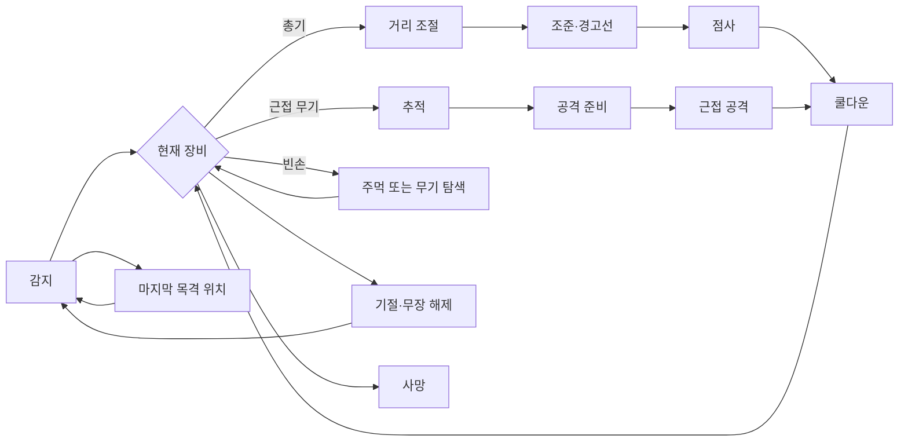

# Deltatime 기획서 — 현재 구현 기준

> 📌 이 문서는 Notion에 바로 붙여넣거나 Markdown으로 Import할 수 있도록 정리한 현재 구현 기준 기획서다.
>
> 기준일: 2026-08-13 (KST)
>
> 원칙: 코드·씬·프리팹·ScriptableObject·Input Action·ProjectSettings·기존 테스트 로그로 확인된 내용만 사실로 기록한다. 해석이나 미확인 내용은 `추정`, `계획 필요`, `확인 불가`로 구분한다.

## 플레이어 조작

---

### 기본 조작

| 행동 | 입력 | 현재 구현 상태 |
| --- | --- | --- |
| 이동 | WASD | 구현 완료 |
| 조준 | 마우스 포인터 | 구현 완료 |
| 공격 | 왼쪽 마우스 버튼 | 구현 완료 |
| 투척 | 오른쪽 마우스 버튼 | 구현 완료 |
| 대시 | Space | 구현 완료 |
| DEADLINE 시전 | Q | 구현 완료 |
| 상호작용·픽업 | E | 구현 완료 |
| 재시작 | R | 구현 완료 |
| 스테이지 이동 | N | 구현 완료 |

근거: `ProjectDeltatime/Assets/_Project/Input/PlayerControls.inputactions`

- 현재 제어 스킴은 `Keyboard&Mouse` 하나다.
- 게임패드·리바인딩은 구현되지 않았다.
- `V` 전체 시야 전환 입력은 현재 없다.

## 게임 시스템 및 스탯 설계

---

### 플레이어 설계

#### 이동 규칙

- Rigidbody 기반으로 WASD 이동을 수행한다.
- 코드 기본 이동 속도는 `6`이다.
- 대시는 별도 `PlayerDash`가 처리한다.
- Stage5·Stage6에서는 `NavMeshGroundMovement`가 NavMesh의 Y 고도 차이를 이동 결과에 반영한다.
- 현재 구현은 플레이어 이동 속도 자체에 `WorldDeltaTime`을 곱하지 않는다.
- 대시 수치: 거리 `3.5m`, 속도 `22m/s`, 지속 시간 `0.16s`, 쿨다운 `0.8s`.

#### 배속 규칙

> ⚠️ 초안의 `Time.timeScale` 설명과 현재 구현에는 차이가 있다.

- 전역 `Time.timeScale`은 변경하지 않고 항상 실시간 기준으로 둔다.
- `WorldTimeController`가 별도의 `CurrentTimeScale`과 `WorldDeltaTime`을 계산한다.
- `WorldDeltaTime = unscaledDeltaTime × CurrentTimeScale`이다.
- 월드 시간의 영향을 받는 적·투사체·일부 월드 연출은 `WorldDeltaTime`을 사용한다.
- 플레이어 입력 활동은 월드 시간 배율 계산에 영향을 준다.
- 이동·조준 회전·발사/행동 펄스가 시간 배율을 정상 속도 방향으로 올린다.
- 활동이 거의 없으면 최소 배율 `0.02`에 가까워진다.
- 최대 배율은 `1.0`이다.
- 목표 배율은 보간 속도 `8`로 부드럽게 보간한다.
- 하드 프리즈 토큰을 사용하면 월드 시간을 정지할 수 있다.

#### 플레이어 시야각

- 일반 Stage의 저장 씬 기준 시야각은 총 `60°`다.
- 전방 기준 좌우 약 `30°` 범위로 해석된다.
- 시야 거리는 `12.5m`다.
- 플레이어 주변 근거리 원형 시야 반경은 `4m`다.
- 시야 밖은 암전되고, `VisionObstacle` Layer 8의 장애물이 시야를 차단한다.
- Tutorial은 저장 씬에서 무제한 시야로 설정되어 있다.
- 시야 밖 적을 소리나 실루엣으로만 보여주는 별도 시스템은 현재 확인되지 않았다.
- 시야가 계획 재미를 해치지 않는지에 대한 실제 플레이테스트는 미실행이다.

#### 무기 교체

- 현재 무기 교체는 E 상호작용 방식이다.
- 무기 픽업의 Trigger 범위 안에서 E를 누르면 무기를 획득·교환한다.
- 단순히 무기를 밟는 자동 교체 방식은 현재 확인되지 않았다.
- 플레이어가 투척하면 현재 장비를 비우고 `ThrownWeapon`을 생성한다.
- 적은 기절·무장 해제 시 현재 무기와 남은 탄약을 드롭할 수 있다.
- 적이 이후 주변 무기를 탐색해 재무장하는 로직이 있다.
- 재장전 입력과 재장전 로직은 확인되지 않았다. **재장전: 미구현 또는 계획 필요.**

#### DEADLINE 시스템

- Q를 누르면 `DEADLINE`을 발동한다.
- 충전이 없거나 하드 프리즈 중이면 발동하지 않는다.
- 씬당 최대 충전은 `2회`다.
- 활성 중 최대 `2개`의 공격 또는 행동을 준비할 수 있다.
- 세 번째 행동 준비는 거절 피드백을 발생시킨다.
- 이동 입력 크기가 `0.05`를 초과하면 `DEADLINE`이 해제되고 준비된 행동이 실행된다.
- 재무장 시간은 `0.35 world s`다.
- 활성 중 조준 회전은 최소 시간 배율까지 허용될 수 있다.
- 이동 해제·사망·재시작 시 상태를 정리한다.
- 진입 링·플래시, 유지 중 틴트·비네트·노이즈, 행동 노드, 정상 해제 링 연출이 구현되어 있다.

근거: `ProjectDeltatime/Assets/_Project/Scripts/Player/DeadlineController.cs`, `Time/WorldTimeController.cs`, `Time/DeadlineVisualFeedback.cs`, `Time/WorldTimeVisualFeedback.cs`

### 카메라 설계

- 카메라는 플레이어를 추적하는 원근 탑다운 시점이다.
- 플레이어 조준 방향 자체가 카메라를 직접 회전시키는 구조는 아니다.
- Stage5·Stage6은 플레이어와 조준 방향을 고려한 근접 탑다운 구도를 사용한다.
- Stage5·Stage6 카메라 FOV는 약 `48°`다.
- Stage5·Stage6 카메라 위치 기준값은 오프셋 약 `(0, 11.12, -6.10)`이며 씬별 직렬화 값이 우선한다.
- 카메라는 NavMesh 경계를 이용해 플레이어와 전투 공간을 화면 밖으로 밀어내지 않도록 제한한다.
- Stage6은 다층 NavMesh의 현재 고도에 따라 화면 경계를 계산한다.
- 카메라가 목표 방향에 따라 상하로 어떻게 이동하는지에 대한 별도 설계값은 현재 확인되지 않았다.

근거: `ProjectDeltatime/Assets/_Project/Scripts/Player/TopDownCameraController.cs`, `Scenes/Stage5.unity`, `Scenes/Stage6.unity`

### 적 설계

#### 적 공통 규칙

- 적은 `EnemyPerception`으로 플레이어를 탐지하고, 시야가 끊기면 마지막으로 확인한 위치를 추적한다.
- 이동과 행동 타이머는 `WorldDeltaTime`을 사용한다. 전역 `Time.timeScale`은 변경하지 않는다.
- 이동은 NavMesh 경로를 우선 사용하고, 충돌 안전 이동과 적 간 분리 보정을 함께 적용한다.
- 적의 행동은 현재 장비로 결정된다. `EnemyShooter`와 `EnemyChaser`는 시작 장비를 표시하는 역할이며, 기절·무장 해제·재무장 후에는 실제 장비에 따라 행동이 다시 선택된다.
- 적은 `Active → Stunned → Disarmed → Active` 상태를 거치며, 기절이 끝나도 무장 전까지는 `Disarmed` 상태를 유지한다. 사망하면 행동·콜라이더·스테이지 등록을 종료한다.

#### 적 공통 스탯

| 분류 | 스탯 | 현재 값 | 단위 | 규칙 | 구현 상태 |
| --- | --- | --- | --- | --- | --- |
| 생존 | 체력 | 유효한 피해 1회 | 회 | 피해를 받으면 사망 처리 후 무기를 드롭한다 | 구현 완료 |
| 생존 | 진영 | Enemy | - | 플레이어와 적대하며 같은 진영 피해는 무시한다 | 구현 완료 |
| 이동 | 이동 방식 | NavMesh | - | 경로 코너를 따라 이동하고 경로가 없으면 충돌 안전 직접 조향을 사용한다 | 구현 완료 |
| 시간 | 행동 시간축 | 월드 시간 | - | `WorldDeltaTime` 기준으로 이동·회전·조준·공격 타이머를 처리한다 | 구현 완료 |
| 이동 | 경로 갱신 간격 | 원거리 0.15 / 추적형 0.10 | world s | 적 유형별로 플레이어·목표 위치 경로를 갱신한다 | 구현 완료 |
| 이동 | 코너 도달 거리 | 0.18 | m | NavMesh 경로 코너를 통과한 것으로 판단한다 | 구현 완료 |
| 이동 | 충돌 여유 거리 | 0.03 | m | 벽·장애물과의 안전 거리를 유지한다 | 구현 완료 |
| 이동 | 적 간 분리 반경 | 0.9 | m | 같은 진영 적이 서로 겹치지 않도록 분리한다 | 구현 완료 |
| 이동 | 적 간 분리 강도 | 0.7 | 배율 | 분리 방향을 이동 방향에 보정한다 | 구현 완료 |
| 무기 탐색 | 탐색 반경 | 8 | m | 빈손 또는 재무장 상태에서 주변 픽업을 찾는다 | 구현 완료 |
| 무기 탐색 | 탐색 간격 | 0.25 | world s | 탐색 시도 주기 | 구현 완료 |
| 무기 탐색 | 습득 거리 | 1.1 | m | 이 거리 안에 들어오면 무기를 습득한다 | 구현 완료 |
| 무기 탐색 | 근접 무기 경로 우선 여유 | 2 | m | 근접 무기 경로가 총기보다 2m 이상 짧을 때 근접 무기를 우선한다 | 구현 완료 |
| 상태 | 기절 | 적용 | - | 이동·공격·목표 탐색을 중단한다 | 구현 완료 |
| 상태 | 무장 해제 | 적용 | - | 현재 무기를 잃고 빈손 행동 또는 재무장 탐색으로 전환한다 | 구현 완료 |
| 상태 | 사망 | 적용 | - | 콜라이더를 끄고 스테이지에 사망을 통지한다 | 구현 완료 |

#### 적 유형별 스탯

| 스탯 | 원거리형 적 (`EnemyShooter`) | 추적형 적 (`EnemyChaser`) | 설명 |
| --- | --- | --- | --- |
| 시작 장비 | 총기 | 근접 무기 | 시작 장비에 따른 초기 역할 |
| 탐지 거리 | 18 | 20 | 시야선이 확보되어야 탐지 성공 |
| 이동 속도 | 3.4m/s | 4.8m/s | 월드 시간 기준 |
| 회전 속도 | 220°/초 | 260°/초 | 월드 시간 기준 |
| 선호 교전 거리 | 6~9m | 1.45m 이내 | 원거리형은 거리 유지, 추적형은 접근 |
| 경로 갱신 간격 | 0.15 world s | 0.10 world s | `EnemyMotor` 직렬화 값 |
| 장비 소진 후 | 빈손·무기 탐색 | 빈손·무기 탐색 | 총기 탄약이 0이면 무기를 드롭한다 |
| 구현 상태 | 구현 완료 | 구현 완료 | 실제 전투 밸런스 체감은 확인 불가 |

#### 공통 행동 흐름

| 행동 | 조건 및 처리 | 구현 상태 |
| --- | --- | --- |
| 감지 | 탐지 거리 안에서 시야선이 확보되면 플레이어 추적을 시작한다 | 구현 완료 |
| 마지막 위치 추적 | 플레이어가 시야에서 사라지면 마지막 확인 위치로 이동한다 | 구현 완료 |
| 기절 | 투척 무기에 맞으면 전달된 시간만큼 이동·공격·목표 탐색을 중단하고 무기를 드롭한다 | 구현 완료 |
| 사망 | 유효한 피해를 받으면 행동을 종료하고 무기를 드롭한 뒤 스테이지에 통지한다 | 구현 완료 |

#### 총기 적

- 플레이어와의 거리가 `9m`보다 멀면 접근하고, `6~9m`에서는 멈춰 조준한다.
- `6m`보다 가까워지면 `3m` 단위의 후퇴 목표를 만들고 이동 속도 `70%`로 물러난다.
- 약 `0.65 world s` 동안 조준하며, 적이 플레이어를 향한 각도 `6°` 이내일 때 경고선을 표시한다.
- 조준이 끝나면 무기 정의의 `EnemyBurstShotCount`만큼 발사한다. 권총·샷건은 1발, 자동소총은 4발이다.
- 점사 후 `1.15 world s` 쿨다운에 들어간다. 탄약이 0이 되면 무기를 바닥에 떨어뜨리고 빈손 행동으로 전환한다.

| 행동 | 조건 및 처리 | 구현 상태 |
| --- | --- | --- |
| 원거리 접근 | 플레이어와 9m보다 멀면 `9m × 0.9` 지점까지 접근 | 구현 완료 |
| 거리 유지 | 6~9m에서 정지하고 플레이어를 향해 회전 | 구현 완료 |
| 후퇴 | 6m보다 가까우면 반대 방향으로 이동 속도 70% 적용 | 구현 완료 |
| 조준 | 0.65 world s 동안 정면 조준 | 구현 완료 |
| 발사 조건 | 대상 방향과 현재 정면의 차이가 6° 이내 | 구현 완료 |
| 발사 경고 | 조준·점사 중 현재 총구에서 플레이어까지 경고선 표시 | 구현 완료 |
| 점사·쿨다운 | 무기별 점사 수를 발사한 뒤 1.15 world s 대기 | 구현 완료 |

#### 근접 무기 적

- 플레이어를 향해 추적하고 `1.45m` 이내에 들어오면 공격 준비를 시작한다.
- 공격 준비 시간은 `0.42 world s`이며, 준비 중 이동 속도는 `35%`다.
- 플레이어가 시야에서 사라지거나 `1.9m`보다 멀어지면 공격을 취소한다.
- 공격 시 무기 정의의 사거리·피해·각도를 사용한다. 현재 근접 무기는 사거리 `1.45m`, 피해 `3`, 좌우 각 `35°`다.
- 공격 후 무기 간격 `0.72 world s` 동안 다시 공격하지 않는다.

| 행동 | 조건 및 처리 | 구현 상태 |
| --- | --- | --- |
| 추적 | 시야가 없으면 마지막 목격 위치를 우선 추적 | 구현 완료 |
| 공격 준비 | 1.45m 이내에서 0.42 world s 대기 | 구현 완료 |
| 준비 중 이동 | 공격 사거리 방향으로 이동 속도 35% 적용 | 구현 완료 |
| 공격 취소 | 시야 상실 또는 1.9m 초과 시 취소 | 구현 완료 |
| 공격 | 사거리 1.45m, 피해 3, 좌우 각 35° | 구현 완료 |
| 공격 후 | 0.72 world s 쿨다운 | 구현 완료 |

#### 빈손 적

- 플레이어가 `3m` 이내에 보이면 무기 탐색보다 주먹 공격을 우선한다.
- 주먹은 사거리 `1.2m`, 피해 `1`, 좌우 각 `35°`이며, 준비 시간 `0.35 world s` 후 판정한다.
- 플레이어가 시야에서 사라지거나 `1.65m`보다 멀어지면 주먹 준비를 취소한다.
- 주먹 공격 후 `0.6 world s` 쿨다운을 가진다.
- 플레이어가 멀리 있으면 반경 `8m`의 픽업을 NavMesh 경로 길이로 비교해 재무장한다.

| 행동 | 조건 및 처리 | 구현 상태 |
| --- | --- | --- |
| 주먹 우선 전환 | 시야가 확보된 플레이어가 3m 이내에 있으면 주먹 공격 우선 | 구현 완료 |
| 무기 탐색 | 8m 안의 사용 가능한 픽업을 탐색하고 도달 가능한 경로만 후보로 삼음 | 구현 완료 |
| 무기 습득 | 픽업과 1.1m 이내에 들어오면 장비 전환 | 구현 완료 |
| 주먹 준비 | 0.35 world s 동안 준비 | 구현 완료 |
| 주먹 공격 취소 | 시야 상실 또는 1.65m 초과 시 취소 | 구현 완료 |
| 주먹 공격 후 | 0.6 world s 쿨다운 | 구현 완료 |

#### 기절·무장 해제

| 항목 | 현재 값 | 규칙 | 구현 상태 |
| --- | --- | --- | --- |
| 기절 시간 | 2 world s | 투척 무기 정의가 전달하는 기절 시간 | 구현 완료 |
| 기절 중 이동 | 중단 | `EnemyMotor` 경로와 이동을 중단 | 구현 완료 |
| 기절 중 공격 | 중단 | 준비 중 공격도 취소 | 구현 완료 |
| 기절 시 무기 | 드롭 | 현재 무기와 남은 탄약을 공중 드롭 | 구현 완료 |
| 기절 종료 후 | 빈손 | `Disarmed` 상태로 감지·재무장 로직 재개 | 구현 완료 |
| 재무장 | 픽업 획득 시 | 무기 장착 후 실제 무기 종류에 맞는 행동으로 복귀 | 구현 완료 |

#### 추가 적 유형

| 유형 | 현재 상태 | 비고 |
| --- | --- | --- |
| 강아지형 적 | 계획 필요 | 현재 씬·프리팹·코드에서 전용 타입과 공격 규칙을 확인할 수 없음 |

근거: `ProjectDeltatime/Assets/_Project/Scripts/Enemies/EnemyBehavior.cs`, `EnemyPerception.cs`, `EnemyMotor.cs`, `EnemyCombatant.cs`, `EnemyHealth.cs`, `EnemyWeaponDrop.cs`, `ProjectDeltatime/Assets/_Project/Scenes/Stage1.unity`, `Stage2.unity`, `Stage5.unity`, `Stage6.unity`

### 무기 설계

무기는 `WeaponDefinition` ScriptableObject를 기준으로 동작한다. 플레이어와 적은 한 번에 하나의 장비만 보유하며, 무기 정의와 현재 탄약을 함께 교체한다.

#### 무기 공통 규칙

- 총기 투사체는 보유 무기의 `Weapon Muzzle`에서 생성되고, 플레이어는 총구에서 현재 조준점으로 향하는 수평 방향을 사용한다.
- 투사체 이동·충돌·수명은 `WorldDeltaTime`을 사용한다. 같은 진영의 대상은 피해를 받지 않는다.
- 산포는 무기별 시드·발사 순번·펠릿 순번으로 계산하는 결정적 방식이다. Unity 전역 랜덤 상태에 의존하지 않는다.
- 플레이어는 LMB로 무기를 사용한다. 자동 총기만 LMB 홀드 연사를 지원하며, 근접 무기는 1회 입력 단위로 공격한다.
- 무기 사용 후 다음 사용 가능 시각까지 무기별 간격을 적용한다. 재장전 입력·재장전 애니메이션·재장전 데이터는 현재 확인되지 않는다.
- E 입력은 지상 픽업을 교환하고, 공중에서 날아오는 무기는 별도 가로채기 판정으로 습득한다. 기존 장비가 있으면 기존 무기와 남은 탄약을 현재 위치에 픽업으로 남긴다.
- 플레이어가 빈 총을 들고 있어도 자동으로 주먹으로 바뀌지 않는다. `Definition`은 유지되며, 사용 가능한 탄약이 없을 때 발사만 실패한다.
- 적은 탄약이 0인 총기를 바닥에 드롭하고 빈손 상태로 전환한다. 적이 획득한 무기는 실제 무기 종류에 따라 행동을 바꾼다.

| 상호작용 | 현재 값 | 규칙 | 구현 상태 |
| --- | --- | --- | --- |
| 지상 무기 습득 범위 | 1.25m | E 입력 시 가장 가까운 픽업을 습득·교환 | 구현 완료 |
| 공중 무기 가로채기 범위 | 1.15m | E 입력 시 날아오는 가로채기 가능 무기를 습득 | 구현 완료 |
| 가로채기 후 하드 프리즈 | 0.2 실제 초 | 가로채기 성공 직후 짧은 시간 월드 정지 | 구현 완료 |
| 플레이어 무기 투척 | 속도 7, 최대 4m | 현재 무기와 탄약을 비우고 투척체를 생성 | 구현 완료 |
| 투척 충돌 반경 | 0.25m | 연속 SphereCast로 충돌을 찾음 | 구현 완료 |
| 투척 기절 시간 | 2 world s | 적중한 적은 이동·공격을 중단하고 무기를 드롭 | 구현 완료 |
| 투척 종료 | 충돌 또는 4m 도달 | 남은 탄약을 보존한 지상 픽업으로 전환 | 구현 완료 |
| 재장전 | 없음 | 현재 입력·코드·데이터에서 확인되지 않음 | 미구현 |

#### 무기별 스탯

| 무기 | 종류 | 역할 | 탄창 | 공격 간격 | 피해 | 발사체 수 | 속도 | 사거리·범위 | 발사 방식 | 적 AI 점사 | 상태 |
| --- | --- | --- | ---: | ---: | ---: | ---: | ---: | --- | --- | ---: | --- |
| 권총 | 반자동 총기 | 중거리 단발 | 8발 | 0.24s | 3 | 1 | 17 | 별도 제한 없음* | 반자동 | 1발 | 구현 완료 |
| 자동소총 | 자동 총기 | 중·장거리 압박 | 30발 | 0.12s | 3 | 1 | 16 | 별도 제한 없음* | 자동 | 4발 | 구현 완료 |
| 샷건 | 반자동 총기 | 근거리 광역 | 6발 | 0.75s | 1/펠릿 | 4 | 16 | 최대 14m, 18° 산포 | 반자동 | 1발 | 구현 완료 |
| 근접 무기(야구방망이 모델) | 근접 | 근거리 부채꼴 공격 | 없음 | 0.72s | 3 | - | - | 1.45m, 좌우 각 35° | 근접 판정 | 1회 | 구현 완료 |

\* 권총·자동소총은 무기 정의에 별도 최대 사거리가 없지만, 공통 투사체 최대 생존 시간 `4 world s`의 영향을 받는다.

#### 권총

- 한 번에 한 발을 발사하는 반자동 총기다.
- 탄창 `8발`, 공격 간격 `0.24s`, 피해 `3`, 탄속 `17`, 발사체 반지름 `0.08m`다.
- 기본 산포는 `0°`, 결정적 지터는 최대 `±1.5°`, 시드는 `101`이다.
- 적 AI는 조준 후 `1발`을 발사한다.

#### 자동소총

- LMB 홀드 연사를 지원하는 자동 총기다.
- 탄창 `30발`, 공격 간격 `0.12s`, 피해 `3`, 탄속 `16`, 발사체 반지름 `0.075m`다.
- 기본 산포는 `0°`, 결정적 지터는 최대 `±1.5°`, 시드는 `211`이다.
- 적 AI는 조준 후 `4발`을 연속 발사하고 `1.15 world s` 쿨다운에 들어간다.

#### 샷건

- 한 번의 입력으로 4개 펠릿을 발사하는 반자동 총기다.
- 탄창 `6발`, 공격 간격 `0.75s`, 펠릿당 피해 `1`, 탄속 `16`, 발사체 반지름 `0.075m`다.
- 전체 산포각 `18°`, 결정적 지터 최대 `±1°`, 시드는 `307`, 최대 사거리는 `14m`다.
- 한 발의 이론상 최대 피해는 `4`지만, 실제 피해는 펠릿별 명중 여부에 따라 달라진다.
- 적 AI는 한 번 조준 후 1발을 발사한다.

#### 근접 무기

- 현재 모델은 야구방망이며, 총알이나 투사체를 생성하지 않는다.
- 공격 판정은 전방 부채꼴의 가장 가까운 적 1명을 대상으로 한다.
- 사거리 `1.45m`, 좌우 각 `35°`, 피해 `3`, 공격 간격 `0.72s`다.
- 캐릭터 Animator가 연결된 경우 타격 프레임에 판정하고, Animator가 없는 프록시는 즉시 판정 경로를 사용한다.

#### 무기 시각·데이터 규칙

- 네 무기 모두 전용 손 장착 모델과 바닥·비행 모델을 사용한다.
- 손 장착 위치·회전·스케일과 `heldMuzzleLocalPosition`은 각 ScriptableObject에 직렬화되어 있다.
- 현재 무기 데이터에는 재장전·내구도·등급·부착물·탄약 타입이 없다.
- 손 그립·총구 정렬·비행 모델의 최종 시각 품질은 자동 정적 검사만으로 확정할 수 없어 **확인 불가**다.

근거: `ProjectDeltatime/Assets/_Project/Pistol.asset`, `AutomaticRifle.asset`, `Shotgun.asset`, `MeleeWeapon.asset`, `ProjectDeltatime/Assets/_Project/Prefabs/ThrownWeapon.prefab`, `InterceptableWeapon.prefab`, `ProjectDeltatime/Assets/_Project/Scripts/Combat/WeaponDefinition.cs`, `WeaponController.cs`, `Projectile.cs`, `ThrownWeapon.cs`, `WeaponPickup.cs`, `InterceptableWeapon.cs`

## 레벨 디자인

---

### 튜토리얼 맵

- `MainScene` 다음에 진입하는 직선형 학습 공간이다.
- 총 7개 학습 단계를 사용한다.
- 학습 순서: 시간 이동 → 조준·대시 → 근접 → 권총 → 투척·회수 → DEADLINE 접근 → DEADLINE 포위전
- 근접 표적, 권총 표적, 무기 지급기, 진행 게이트가 있다.
- 마지막 DEADLINE 구역에는 적 4명이 배치된다.
- Q 발동, 행동 2개 준비, 이동 해제를 성공하면 출구가 열린다.
- 성공 후 약 2초 뒤 Stage1을 로드한다.
- Tutorial의 시야는 무제한 모드다.

근거: `ProjectDeltatime/Assets/_Project/Scenes/Tutorial.unity`, `Assets/_Project/Scripts/Tutorial/TutorialDirector.cs`, `TutorialGate.cs`, `TutorialPlayModeSmokeTest.cs`

### Stage 1 디자인

> 이미지 삽입: `Stage1_Level_Design.png`
>
> 파일 위치: `C:\Users\HuiYong\UnityProjects\ProjectDeltatime\ProjectDeltatime\Deliverables\Stage1_Level_Design.png`

#### 공간 개요

- 밝은 조명 프로필의 단일 직사각형 전투 공간이다.
- 플레이 영역 크기: 약 `20m × 18m`
- 서쪽·동쪽·북쪽·남쪽 벽으로 둘러싸인 방 구조다.
- 제한 시야를 사용한다.
- 목적은 적 전멸이며, 별도 거점 도달·퍼즐 목표는 현재 구현에서 확인되지 않는다.

#### 현재 저장 씬 기준 배치

| 오브젝트 | X | Z | 역할 |
|---|---:|---:|---|
| Player | 0.0 | -6.2 | 남쪽 중앙 시작점 |
| Enemy West | -6.3 | 4.7 | 서쪽 원거리 적 |
| Enemy Center | 2.8 | 5.8 | 중앙 상단 근접 추적 적 |
| Enemy East | 6.3 | 4.7 | 동쪽 원거리 적 |
| West Cover | -5.2 | -0.5 | 서쪽 엄폐물 |
| Center Cover | 0.0 | 1.4 | 중앙 엄폐물 |
| East Cover | 5.2 | 0.8 | 동쪽 엄폐물 |
| AutomaticRiflePickup | 8.74 | -5.44 | 남동쪽 무기 픽업 |

> ⚠️ 현재 저장된 `Stage1.unity`에서 직접 확인된 무기 픽업은 `AutomaticRiflePickup`이다. 기존 문서에 기록된 다른 Stage1 픽업 수치는 최신 저장 씬 기준으로 재검증이 필요하다.

#### 전투 의도

- 플레이어는 남쪽에서 시작해 중앙 엄폐물 방향으로 진입한다.
- 서쪽·동쪽 원거리 적은 좌우에서 교차 압박을 만든다.
- 중앙 상단 근접 적은 플레이어의 이동 경로를 압박한다.
- 서쪽·중앙·동쪽 엄폐물은 시야 차단과 사격 위치 선택을 만든다.
- 남동쪽 자동소총 픽업은 시작점에서 접근 가능한 무기 선택지다.
- DEADLINE은 적의 교차 사격과 근접 압박을 정리하는 핵심 대응 수단이다.

#### 스테이지 클리어 조건

- `StageController`가 살아 있는 적 수를 추적한다.
- 살아 있는 적이 0명이 되면 `Cleared` 상태로 전환한다.
- 전투 입력을 비활성화하고 Replay를 요청한다.
- Replay 후 `N`으로 다음 Stage로 이동한다.
- 사망 후 자동으로 처음부터 즉시 재시작하는 것이 아니라, `PlayerDead`와 Replay 흐름을 거친 뒤 `R`으로 현재 씬을 재시작한다.

#### 현재 활성 진행 기준

- Stage1 다음: Stage2
- Stage2 다음: Stage5
- Stage5 다음: EndingScene
- Stage3·Stage4·Stage6은 에셋이 보존되어 있으나 현재 진행에서 제외되어 있다.

근거: `ProjectDeltatime/Assets/_Project/Scenes/Stage1.unity`, `Assets/_Project/Scripts/Level/StageController.cs`, `StageSceneFlow.cs`, `ProjectSettings/EditorBuildSettings.asset`

### Stage3·Stage4·Stage5·Stage6 상태

| Stage | 현재 상태 |
|---|---|
| Stage3 | `Stage3_NoUse.unity`에 콘텐츠 존재. Builder/Smoke는 `Stage3.unity`를 참조해 최신 검증 경로 확인 불가 |
| Stage4 | `Stage_NoUse.unity`에 Stage 4 콘텐츠 존재. Builder/Smoke는 `Stage4.unity`를 참조해 최신 검증 경로 확인 불가 |
| Stage5 | 다이브 바·단상·계단·전용 NavMesh·고저차 이동 구현. 현재 활성 진행에 포함 |
| Stage6 | 다층 옥상·전용 NavMesh·고저차 이동·성능 예산 구현. 현재 진행과 Build Settings에서는 제외 |

## UI 구성

---

### 타이틀 화면 UI

#### 처음 화면

- `MainScene`에 사용자 제작 배경과 로고가 있다.
- 배경 없는 흰색 `PLAY` 텍스트 버튼을 사용한다.
- 버튼 Hover 시 텍스트가 `1.08`배 확대된다.
- 누르는 동안 로고에서 추출한 빨간색 계열로 표시된다.
- 클릭 또는 `N`으로 Tutorial을 시작한다.
- 시작 UI 클릭음이 구현되어 있다.

이미지 삽입 상태: 실제 MainScene 스크린샷은 별도 수동 캡처 필요.

#### 설정창 UI

- 현재 설정창은 구현되지 않았다.
- 사용자 음량 설정, 그래픽 설정, 입력 리바인딩은 계획 필요다.

### 인게임 UI

#### Stage Info UI

현재 `GameHud`는 IMGUI로 다음 정보를 표시한다.

- 좌상단 `330×178` 상태 패널
    - 살아 있는 적 수
    - 실시간·월드·Replay 시간
    - 대시 상태
    - DEADLINE 충전 수
- 좌하단 `330×76` 상태 패널
    - 플레이어 체력
    - 현재 무기
    - 탄약
- 상단 중앙 안내
    - Replay 결과·조작 안내
    - 활성 DEADLINE 행동 수·이동 해제 안내
- 하단 조작 안내
    - LMB, RMB, Q, Space, E, R, N

스테이지명 텍스트의 별도 표시 여부는 현재 GameHud 기준으로 확정할 수 없다.

#### 플레이어 HUD

현재 구현된 연출:

- 제한 시야와 시야 조명
- 적 공격 경고선
- DEADLINE 진입 링·플래시
- DEADLINE 유지 중 청록색 틴트·비네트·노이즈
- DEADLINE 행동 노드 2개
- 초과 행동 거절 피드백
- 월드 시간에 연결된 Tutorial 상태 전광판 셰이더
- BGM 덕킹과 전투 효과음

현재 확인되지 않은 항목:

- 소리를 별도 파형·아이콘으로 보여주는 UI
- 플레이어 투사체 궤적 HUD
- 남은 적 실루엣 전용 UI
- 실제 모션 블러·채도 변화의 전 해상도 품질
- Game View에서의 최종 가독성

### GameOver 씬

- 별도의 `GameOver` 씬은 Build Settings에서 확인되지 않는다.
- StageController의 `PlayerDead` 상태와 Replay 결과 안내가 사망 흐름을 담당한다.
- R로 현재 씬을 재시작한다.
- 별도 GameOver 메뉴·통계·재도전 버튼은 미구현이다.

## 연출

---

### 게임플레이 연출

#### 인게임 - 플레이어 배속 연출

- 월드 시간 배율은 플레이어의 이동·조준 활동에 반응한다.
- 전역 `Time.timeScale`은 변경하지 않는다.
- 시간 정지에 가까워질수록 적·투사체·월드 연출이 느려진다.
- 실제 플레이어 이동은 실시간 기준으로 유지된다.
- 최종 채도·모션 블러 연출은 현재 구현과 별개로 일부 확인 불가다.

#### 인게임 - DEADLINE 연출

- `DEADLINE` 진입 시 청백색 수축 링과 플래시가 발생한다.
- 유지 중 화면에 청록색 틴트, 가장자리 비네트, 미세 노이즈가 적용된다.
- 플레이어 위 행동 노드가 준비된 행동 수를 표시한다.
- 세 번째 행동을 시도하면 주황색 거절 피드백이 발생한다.
- 이동 해제 시 복원 링과 화면 복귀 효과가 발생한다.
- 사망·비활성화 시 즉시 초기화한다.
- Replay 중에는 라이브 DEADLINE 화면 효과를 재생하지 않는다.

이미지 삽입 상태: `DeadlineScreenEffect.shader` 기반 수동 캡처 필요.

#### 인게임 - 전투 연출

- 총기 발사음과 투척음이 재생된다.
- 근접 무기는 스윙음과 적중음을 분리한다.
- 적의 원거리 공격 전 경고선을 표시한다.
- 피격·기절·무장 해제·무기 드롭은 게임플레이 상태와 시각 피드백을 연결한다.
- 적 전멸·사망 후 Replay가 결과 연출을 담당한다.

#### 인게임 - Replay 연출

- 라이브 전투를 비활성화하고 기록된 동적 대상의 프록시를 재생한다.
- 암흑 시야를 고정한다.
- 플레이어·적·픽업·시야 조명·생성 투사체를 기록·재생한다.
- Animator 본 포즈 전체 대신 상태·Trigger·체크포인트를 이용한다.
- Prototype과 Stage5 시야 Replay에는 실패 로그가 있어 전체 연출은 부분 구현으로 판정한다.

## 테스트 및 검증 상태

| 항목 | 상태 | 근거 |
|---|---|---|
| Tutorial PlayMode | 기존 로그 확인 | `TutorialSmoke.log` |
| Stage5 PlayMode | 기존 로그 확인 | `Stage5FinalSmoke.log` |
| Stage6 PlayMode | 기존 로그 확인 | `Stage6Smoke.log` |
| Replay Animator | 기존 로그 확인 | `ReplayAnimatorPlayModeFinal5.log` |
| DEADLINE 화면 효과 | 기존 로그 확인 | `DeadlineVisualFeedbackSmoke.log` |
| SoundManager | 기존 로그 확인 | `SoundManagerStageBgmSmoke.log` |
| Replay Vision Prototype | 실패 이력 | `ReplayVisionPrototypeSmoke.log` |
| Replay Vision Stage5 | 실패 이력 | `ReplayVisionStage5Smoke.log` |
| Stage6 성능 | 확인 불가 | `Stage6PerformanceBenchmark.log`, Game View 321×531 |
| 이번 문서 작성 후 Unity 재실행 | 미실행 | 문서 작업만 수행 |

## 구현 상태 요약

| 영역 | 상태 |
|---|---|
| 전체 진행·입력·플레이어·전투·무기·적 | 구현 완료 |
| 월드 시간·DEADLINE·시야 | 구현 완료 |
| Replay | 부분 구현 |
| Stage1·Stage2 | 구현 완료 |
| Stage3·Stage4 | 부분 구현 |
| Stage5·Stage6 | 부분 구현 |
| HUD·오디오·카메라 | 구현 완료 |
| 애니메이션 | 부분 구현 |
| 재장전·저장·퀘스트·인벤토리 | 미구현 |
| 게임패드·리바인딩·사용자 음량 설정 | 계획 필요 |
| 실제 조작감·최종 화면 가독성·청감 | 확인 불가 |

## 기존 초안에서 수정한 핵심 사항

| 초안 표현 | 현재 구현 기준 보정 |
|---|---|
| 전역 `timeScale`을 조절한다 | 전역 `Time.timeScale`은 변경하지 않고 `WorldDeltaTime`을 별도로 계산한다 |
| 시야각 좌우 35° | 현재 저장 씬 기준 총 60° 시야다 |
| 무기를 밟거나 E로 교체 | 현재 확인된 교체 방식은 E 상호작용이다 |
| 죽으면 즉시 재시작 | 사망 후 `PlayerDead`·Replay를 거치며 R로 현재 씬을 재시작한다 |
| 한 방 5~15초 퍼즐 전투 | 현재 구현에서 방의 목표 시간은 확정되지 않았다 |
| 거점 도달 클리어 | 현재 StageController의 클리어 조건은 적 전멸이다 |
| Stage1에 여러 무기 픽업이 존재 | 현재 저장 Stage1에서 직접 확인된 픽업은 AutomaticRiflePickup이며 나머지는 재검증 필요 |
| GameOver 씬 | 별도 GameOver 씬은 없고 PlayerDead·Replay 흐름을 사용한다 |

## 후속 기획 과제

1. 재장전과 탄약 경제를 설계한다.
2. Stage3·Stage4 씬 파일명과 Builder·Smoke Test 경로를 통일한다.
3. Stage3·Stage4·Stage6의 본편 편입 여부를 결정한다.
4. 강아지형 적의 이동·공격·시야·피격 규칙을 설계한다.
5. GameOver·설정창·사용자 음량·게임패드·리바인딩을 제품 기능으로 넣을지 결정한다.
6. Stage1의 실제 무기 픽업 구성과 문서 수치를 재검증한다.
7. 실제 플레이테스트로 시야각, 시간 감속, DEADLINE 충전 수, Tutorial 동선을 조정한다.
8. Replay Prototype·Stage5 실패 로그를 최신 저장 씬 기준으로 재현한다.
9. Stage6을 독립 플레이어의 1920×1080 환경에서 재측정한다.

## 근거 파일

- `AGENTS.md`
- `ProjectDeltatime/ProjectSettings/EditorBuildSettings.asset`
- `ProjectDeltatime/Assets/_Project/Input/PlayerControls.inputactions`
- `ProjectDeltatime/Assets/_Project/Scenes/MainScene.unity`
- `ProjectDeltatime/Assets/_Project/Scenes/Tutorial.unity`
- `ProjectDeltatime/Assets/_Project/Scenes/Stage1.unity`
- `ProjectDeltatime/Assets/_Project/Scenes/Stage2.unity`
- `ProjectDeltatime/Assets/_Project/Scenes/Stage5.unity`
- `ProjectDeltatime/Assets/_Project/Scenes/Stage6.unity`
- `ProjectDeltatime/Assets/_Project/Scripts/Player/PlayerMovement.cs`
- `ProjectDeltatime/Assets/_Project/Scripts/Player/PlayerDash.cs`
- `ProjectDeltatime/Assets/_Project/Scripts/Player/DeadlineController.cs`
- `ProjectDeltatime/Assets/_Project/Scripts/Time/WorldTimeController.cs`
- `ProjectDeltatime/Assets/_Project/Scripts/Combat/WeaponController.cs`
- `ProjectDeltatime/Assets/_Project/Scripts/Enemies/EnemyCombatant.cs`
- `ProjectDeltatime/Assets/_Project/Scripts/Vision/VisionCone.cs`
- `ProjectDeltatime/Assets/_Project/Scripts/Replay/StageReplayController.cs`
- `ProjectDeltatime/Assets/_Project/Scripts/UI/GameHud.cs`
- `ProjectDeltatime/Assets/_Project/Scripts/Audio/SoundManager.cs`
